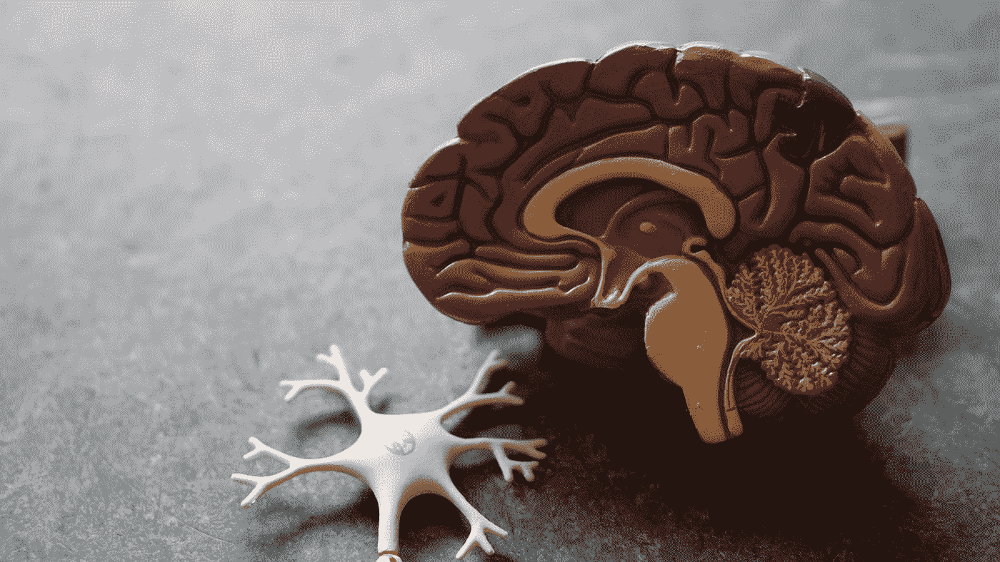

# 计算思维和人工智能

> 原文：<https://towardsdatascience.com/computational-thinking-and-artificial-intelligence-c88655652417?source=collection_archive---------41----------------------->

## 人工智能起源简史

马库斯·温克勒在 [Unsplash](https://unsplash.com?utm_source=medium&utm_medium=referral) 上的照片

[计算思维](http://research.sethi.org/ricky/book/)可以被认为是批判性思维或证据推理的延伸。在某种程度上，它将批判性思维和循证推理系统化。这通常涉及逻辑思维和论证，我们指的是经典的、正式的论证，而不是争吵。我们可以说，这种逻辑思维建立在处理问题的三种基本方法之上:特别思维、演绎思维或归纳思维。

因此，思考似乎是人类的核心，也是足够聪明来解决世界问题的核心。因此，人们开始怀疑我们是否能模拟思维和智力。在 17 世纪，莱布尼茨提出了一种新的语言,*characteria universal is*,这是一种代表人类思想的语言，其中每个字母代表一些概念，然后这些概念可以通过*微积分推理器*根据一套逻辑规则进行组合和操作，以计算所有的数学和科学知识。最近，艾伦·图灵开始思考机器，后来被称为图灵机的假设机器，可以解决任何可计算的函数，这似乎为最终的各种*演算推理器*奠定了一些基础。

# 生物联系

Robina Weermeijer 在 [Unsplash](https://unsplash.com?utm_source=medium&utm_medium=referral) 上拍摄的照片

就在这时，神经生理学家沃伦·s·麦卡洛克和逻辑学家沃尔特·h·皮茨出现了。麦卡洛克[以每天喝威士忌和吃冰淇淋到凌晨 4 点而闻名](http://nautil.us/issue/21/information/the-man-who-tried-to-redeem-the-world-with-logic)，他对以莱布尼茨逻辑演算的方式为人类大脑建立理论基础感兴趣，并使用这个简单的逻辑基础来构建复杂的神经活动，就像罗素和怀特海的*数学原理*表明所有的数学都可以从一个简单的逻辑基础建立起来一样。

因此，当他读到图灵 1936 年的论文《论可计算的数字及其在 Entscheidungsproblem 中的应用》时，麦卡洛克认为大脑可以像图灵机一样工作。他进一步推断，神经元链可以通过逻辑规则连接在一起，从而产生思想，就像罗素和怀特海通过将简单的命题连接在一起而建立了所有的数学一样。麦卡洛克和皮茨在他们 1943 年的开创性论文《神经活动中固有思想的逻辑演算》中，利用图灵对计算的数学定义结合逻辑，建立了大脑的计算理论

当时，神经元被认为是大脑中人类思维和智力的组成部分，人们已经研究了一段时间。神经元本身被认为是相对简单的细胞，对多个输入进行一些处理，并产生单个输出尖峰，即动作电位。麦卡洛克和皮茨已经证明了这些尖峰信号可以组合起来进行逻辑和算术运算。

与此同时，几位生物学家在 20 世纪初一直在研究鱿鱼的巨大神经元，生物物理学家艾伦·霍奇金和安德鲁·赫胥黎很快创建了一个神经元的电路模型，作为一组非线性微分方程，以计算细胞膜的电导如何随时间和电压变化。像数学家诺伯特·维纳这样的人开始看到神经元、神经网络和控制系统等生物系统之间的联系。维纳当时在麻省理工学院，他曾保护过皮茨。不久，皮茨还会见了冯·诺依曼，他分别与香农和图灵就智能和机器进行了对话，这些机器也可以模拟编码在神经网络中的那种思维。

<https://en.wikipedia.org/wiki/Alan_Turing>  

事实上，图灵在 1947 年给伦敦数学协会做了一次演讲，他很有先见之明地说:“我们想要的是一台能够从经验中学习的机器。”他接着说:

> 这就像一个学生从他的老师那里学到了很多，但通过自己的工作又增加了更多。当这种情况发生时，我觉得一个人不得不认为机器显示了智能。”

图灵甚至提出了一个测试，现在称为图灵测试，来衡量一台机器是否可以被认为和人类一样聪明。这项测试基于一种叫做模仿游戏的维多利亚时代的室内游戏[，并假设当客观观察者无法区分人类和机器参与者时，机器应该被视为与人类一样聪明。](https://hsm.stackexchange.com/questions/5890/did-turing-invent-the-imitation-game-did-he-name-it)

# 人工智能

[附身摄影](https://unsplash.com/@possessedphotography?utm_source=medium&utm_medium=referral)在 [Unsplash](https://unsplash.com?utm_source=medium&utm_medium=referral) 上拍照

智能机器的想法很快引起了相当多的兴趣。1955 年，计算机科学家约翰·麦卡锡为其创造了“人工智能”一词，并于 1956 年组织了著名的达特茅斯会议，克劳德·香农、马文·明斯基、艾伦·纽厄尔和司马贺等名人出席了会议，标志着**人工智能(AI)** 领域的诞生。

在计算意义上，人工智能经常在 Russell & Norvig 等教科书中被描述为理性代理或智能代理，这是任何虚拟或物理的实体，可以从其环境中获取感官输入并对其进行解释，将其放入现有知识的上下文中，然后采取行动以最大化其实现目标的机会。

真正的问题是，就像生命本身一样，没有一个好的概括的智力定义。尽管我们在神经生物学方面取得了相当多的进展，但我们仍然不知道人类在做我们认为智能的事情时会做什么。我们所知道的是，人类做一些我们还不能用计算系统自动化的事情。

这些年来，人工智能的受欢迎程度时高时低，随之而来的是智能的定义。最初模仿人类智能的目标很快被称为**通用人工智能**(也被称为人工通用智能、强人工智能或硬人工智能)。正如图灵本人最初建议的那样，在专业环境或利基应用中简单地拥有“学习机器”这一更温和、更可实现的目标随后被赋予了相应的术语**狭义人工智能**(也称为人工狭义智能、弱人工智能或软人工智能)。随着时间的推移，这种狭义的人工智能，也就是你简单地拥有一台“学习机器”，也被称为**机器学习**。

在 Ch 阅读更多关于机器学习的内容。我的[书](http://research.sethi.org/ricky/book/)的第 10 页，也可以在 [ResearchGate](https://bit.ly/research-gate-ect) 上公开查看。

[1]作为一个有趣的旁注，当冯·诺依曼在 1945 年发表他的历史性论文“关于 EDVAC 的报告初稿”时，它把第一台提出的现代计算机描述为一台存储程序二进制计算机器。在论文中，他模仿了麦卡洛克和皮茨的神经网络，但用真空管代替了神经元作为逻辑门。发表的论文只有一处引用:麦卡洛克和皮茨 1943 年的论文。