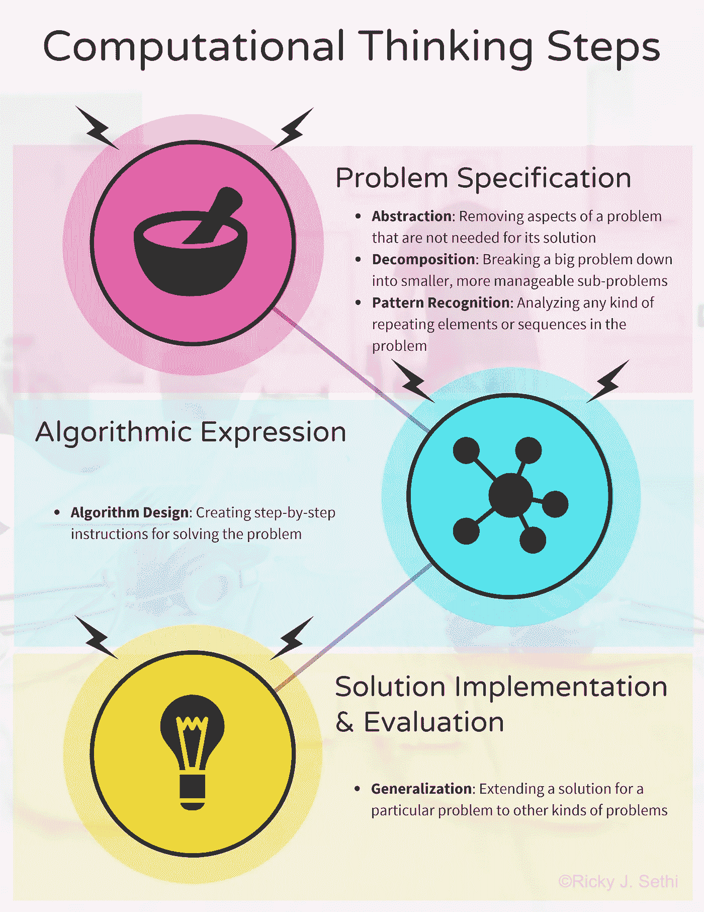
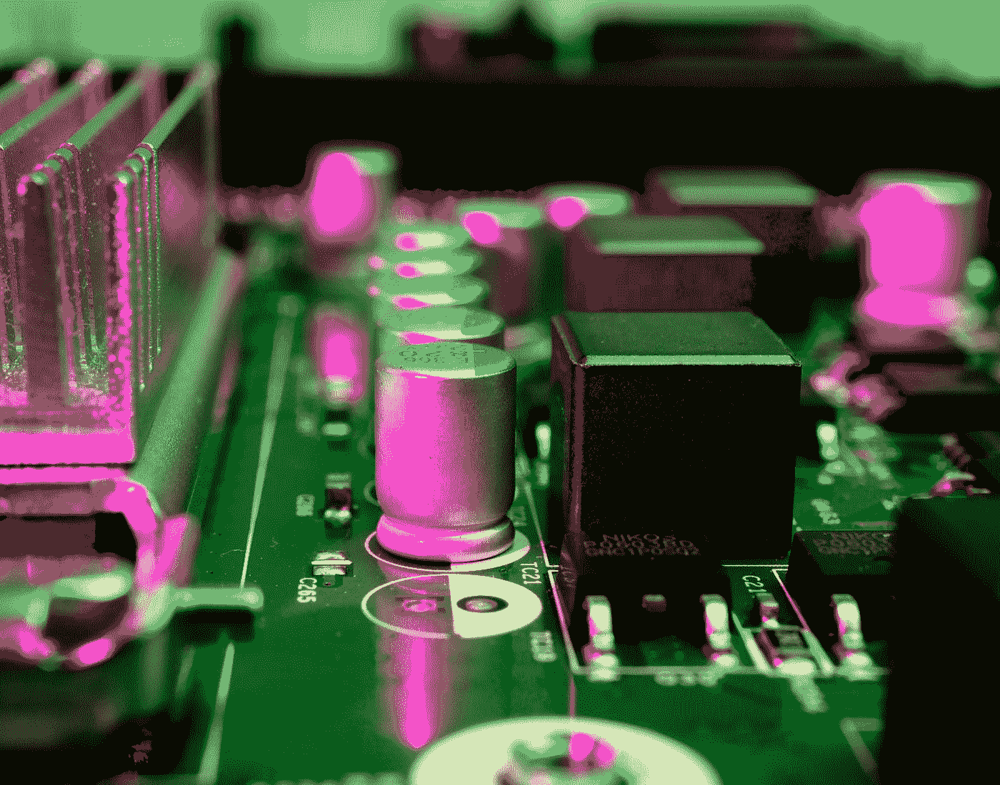

# 计算思维定义

> 原文：<https://towardsdatascience.com/computational-thinking-defined-7806ffc70f5e?source=collection_archive---------8----------------------->

## 什么是计算思维和计算问题解决？

**计算思维是一套解决复杂问题的技术**，可分为三步:*问题规格说明*、*算法表达式*、*解决方案实现&评估*。上面列出了计算思维方法每一步涉及的原则，下面将详细讨论。[版权所有里基·j·塞西](http://research.sethi.org/ricky/book/)

计算机科学是对计算过程和信息过程的研究。**信息**是通过将**数据**置于特定的**上下文**中以揭示其*含义*的处理结果。数据是原始的*事实*或对自然的观察**计算**是由某个*计算代理*执行的某个系统**程序**对*数据*的操纵。

一般来说，计算问题需要某种方法或思维方式。这种方法通常被称为**计算思维**，在许多方面类似于我们关注预测的科学方法。

**计算思维步骤**:为了使用*计算思维*进行预测，我们需要定义与问题及其解决方案相关的三个步骤:

1.  问题说明:我们从分析问题开始，精确地陈述问题，并建立解决方案的标准。解决方案的计算思维方法通常从将复杂的问题分解成更熟悉或更易处理的子问题开始，有时称为问题分解，经常使用演绎或概率推理。这也可以涉及到**抽象**和**模式识别**的思路。更正式地说，我们将在创建**模型**和模拟中使用这些技术。
2.  算法表达式:然后我们需要找到一个算法，一个精确的步骤序列，使用适当的数据表示来解决问题。这个过程使用归纳思维，需要将一个特定的问题转化为一大类类似的问题。这一步有时也被称为**算法思维**。我们可以进一步将其分为*命令式*，如过程式或模块化，以及声明式，如*功能式*，算法解决方案的方法。
3.  解决方案实施和评估:最后，我们创建实际的解决方案，并对其进行系统评估，以确定其*正确性*和*效率*。这一步还包括查看解决方案是否可以通过自动化或扩展到其他类型的问题而被**推广**。

我应该在这里补充一点警告:这些计算思维的规则都很好，但它们本身并不是真正的规则；相反，把它们想成是善意的启发，或者经验法则。

这些计算思维的启发法与小学教授的 5 步科学方法的启发法非常相似，后者通常被写成:

1.  观察宇宙的某些方面
2.  用那些观察来告知一些关于它的*假设*
3.  使用这个假设做一些预测
4.  通过*实验*测试预测，并相应修改假设
5.  *重复*步骤 3 和 4，直到假设不再需要修改

这些是很好的指导方针，但不是强制性的。它们是你可能需要或要求大部分努力的想法的建议，但它不是将你的想法或解决方法归类的过程。

在其核心，所有基础物理科学的中心方面是**预测**，通常通过实验。如果你能够做出重复的、精确的、定量的预测，这意味着无论你使用过什么样的模型或思维模式，它都是有效的，应该被重新使用。如果是形式方法，很好；如果它不那么正式，但仍然是结构化的和可重复的，并导致正确的计算解决方案，这也很好。

任何让你达到这种状态的结构化思维过程或方法都会被认为是计算思维。你甚至可以把它看作是**批判性思维**或*基于证据的推理*的另一种定义，在这种情况下，你的解决方案来自于数据以及你对数据的看法:

数据+如何思考数据=计算思维

从这个意义上说，能够表示数据，然后操纵它，这本身就是一个可计算问题的计算解决方案！

然后，我们可以将**程序**视为计算解决方案，即*可计算功能*的解决方案，我们用某种特定的编程语言来表达。我们还知道一个**算法**是一个*有效过程*，一系列使用特定**数据结构**解决特定类型问题的逐步指令，这些数据结构指定了特定的*数据表示*。

# 计算思维定义

照片由 [Matteo Di Iorio](https://unsplash.com/@shootbyteo?utm_source=medium&utm_medium=referral) 在 [Unsplash](https://unsplash.com?utm_source=medium&utm_medium=referral) 上拍摄

但是在我们用特定的编程语言实现我们的解决方案之前，我们必须为我们正在检查的问题定义一个算法解决方案。让我们看看如何实际找到这样一个计算解决方案，但要注意的是，由于不同的问题需要不同的详细方法，因此每个步骤都需要定制。

## 计算思维步骤

如上所述，计算思维是一个由三个阶段组成的迭代过程:

1.  **问题说明**:使用*抽象*、*分解*、*模式识别*分析问题并精确陈述，同时建立解决方案的标准
2.  **算法表达式**:使用适当的数据表示和*算法设计*找到计算解决方案
3.  **解决方案实施&评估**:在*推广*到其他问题之前，实施解决方案并进行系统测试

## 计算思维方法的细节

让我们列出五个计算思维**原则**和伴随的计算机科学**思想**和软件工程**技术**的细节，它们可以为这三个**步骤**中的每一个发挥作用。请注意，这不是一个全面的列表，但具有代表性。

在这种方法中，我们也可以把原则看作是*策略*，寻找计算解决方案所需的高级概念；这些想法可以被视为特殊的*策略*，也就是众所周知在许多不同环境下都有效的模式或方法；最后，像*工具*这样的技术可以在特定的情况下使用。所有这些都是提出问题的最终计算解决方案所需要的。

1.  **问题说明**

*   计算思维*原理*:模型开发与**抽象**、**分解**、**模式识别**
*   计算机科学*思想*:问题分析和说明
*   软件工程*技术*:问题需求文档、问题规范文档、UML 图等。

2.**算法表达式**

*   计算思维*原理*:使用数据表示和**算法设计的计算问题解决**
*   计算机科学*理念*:通过一些符号系统的数据表示和算法开发，使用模块化、流程控制(包括顺序、选择和迭代)、递归、封装和并行计算来系统地处理信息
*   软件工程*技术*:流程图、伪代码、数据流图、状态图、类图的类-责任-协作(CRC)卡、序列图的用例等。

3.**方案实施&评估**

*   计算思维*原则*:系统测试和**概括**
*   计算机科学*理念*:分析效率和性能约束的算法实现、调试、错误检测测试、测量解决方案正确性的评估指标，以及将计算解决方案扩展到其他类型的问题
*   软件工程*技术*:用编程语言实现、代码审查、重构、使用 JUnit 等工具进行单元和系统测试的测试套件、质量保证(QA)等。

## 计算思维原则

凯利·西克玛在 [Unsplash](https://unsplash.com?utm_source=medium&utm_medium=referral) 拍摄的照片

计算解决方案的第一步，**问题规范**，依赖于一些基本的计算思维*原则*。尽管计算思维不是一种正式的推理方法，但它确实包含了一些在所有领域和学科中都有用的基本原则。

它们构成了一种逻辑地、有条理地解决任何领域的任何问题的推理或思考方式！这些**基本** **原则**也是你可以放在简历上的流行语，所以让我们先来深入了解一下更重要的原则，尤其是*分解*、*模式识别*和*抽象*，以及它的表亲*概括*。

分解简单来说就是将一个复杂的问题分解成更容易处理的部分。如果问题是一些复杂的任务，你可以把它分解成一系列简单的子任务。如果问题涉及一个复杂的系统，你可以把系统分解成一堆更小的子组件。例如，如果你面临着写一篇大而复杂的论文，你可能会选择通过将论文分解成更小的子部分并分别处理每一部分来解决它。

**模式识别**是在一个问题或一些数据集中发现相似性、趋势或某种规律性的想法。我们可能识别的这些模式帮助我们做出预测或者直接找到解决方案。例如，如果你在高速公路上开车，你注意到左边车道上的车挤在一起，你可能会决定换到右边车道。或者，如果你看到一只股票几个月来持续上涨，你可能会决定买入这只股票。*免责声明*:相关性不等于因果关系；即使你发现了一个模式，在你真正把钱投入到你的模式之前，你可能想用其他分析来确认或验证这个预测。

如前所述，抽象是忽略你认为不重要的细节的想法。这样，我们就可以*优先考虑*关于被检查系统的信息。我们可以使用这种抽象的想法来做一些事情，比如制作模型，比如之前提到的代表校园的地图。抽象的另一个例子可能是创建一本书或一部电影的摘要。我们也可以*概括*形成一个“大图”,忽略一些无关紧要的细节。

**像这样的概括**允许我们识别看似完全不同的模型的共同特征，从而允许我们将一个解决方案从一个领域调整到一个可能不相关的领域。概括可以帮助我们组织想法或成分，就像我们将一些动物归类为脊椎动物，将另一些归类为无脊椎动物一样。此外，能够识别我们已经识别的模式下的一般原则允许我们将模式和趋势归纳为*规则*。反过来，这些规则可以直接通知最终的*算法*，我们将在构建计算解决方案的第二步中使用。

## 算法表达式:计算问题解决

迈克尔·泽兹奇在 [Unsplash](https://unsplash.com?utm_source=medium&utm_medium=referral) 上拍摄的照片

计算求解的第二个**步骤**，**算法表达式**，是计算问题求解的核心。数据到信息再到知识的转换可以通过**计算问题解决**来完成。精确定义问题后，它包括以下三个步骤:

*   **数据**:结构*原始* ***事实*** 用于循证推理
*   **表示**:创建一个*问题* ***抽象*** 来捕捉系统的相关方面
*   **算法**:描绘一个在有限时间内解决问题的*系统化的* ***程序***

因此，计算问题的解决包括找到数据的适当的**表示**或上下文，并在**算法**中使用该表示，一旦问题被清楚地定义，逐步的过程就解决了问题。

数据的上下文化可以被认为是信息的第一近似值，解决方案将数据转换为信息，然后转换为可操作的知识。这个可以在[这里](http://research.sethi.org/ricky/book/)进一步看到。

思考信息的一种方式是在某种**上下文**中的数据。如果上下文是发生的概率，我们就可以用香农的信息测度来结束。如果我们把数据放在一些基于逻辑的推理结构中，我们可以根据证据得出一些结论；这个结论成为我们有用的信息，可以形成可操作知识的基础。我们还可以在一些基于知识的系统中整理这些信息，这些系统是使用知识管理技术管理的。

在我的新书[中阅读更多关于香农的信息理论和计算思维，这本书也可以在](http://research.sethi.org/ricky/book/) [ResearchGate](https://bit.ly/research-gate-ect) 上公开查阅。