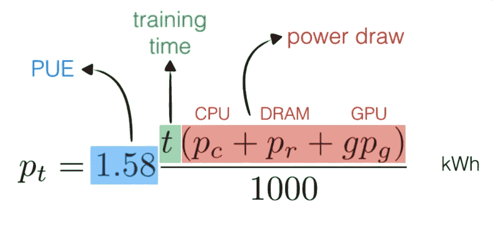
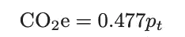
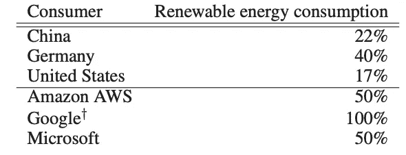
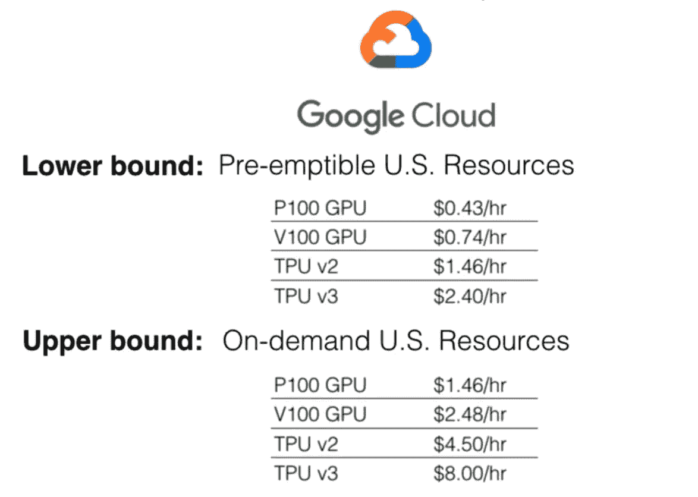
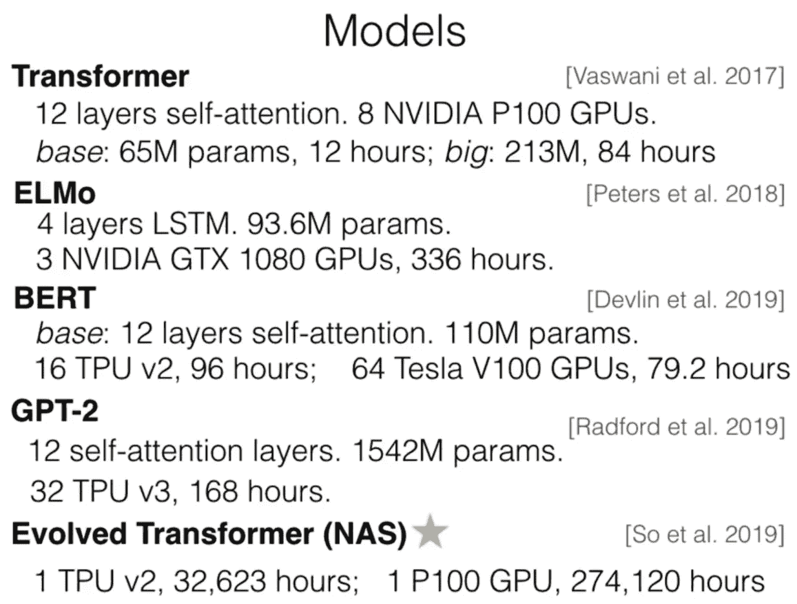
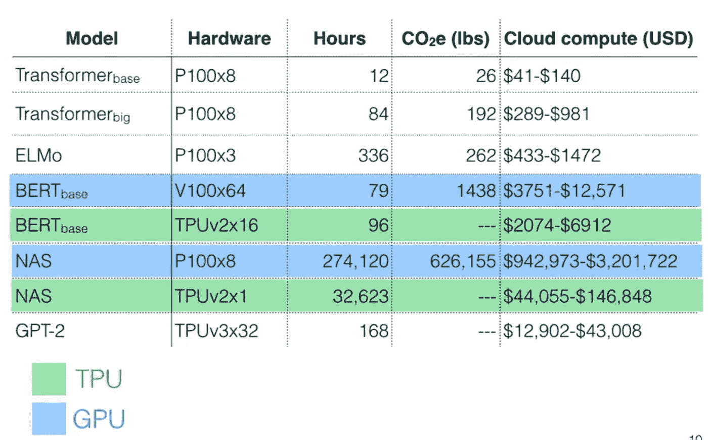

# 深度学习的计算成本和环境影响

> 原文：<https://towardsdatascience.com/compute-and-environmental-costs-of-deep-learning-83255fcabe3c?source=collection_archive---------13----------------------->

## 一个衡量成本(美元)和二氧化碳排放量(磅)的框架

Holyoke 大坝为马萨诸塞州绿色高性能计算中心提供水力发电。美国公共电力协会在 [Unsplash](https://unsplash.com/?utm_source=unsplash&utm_medium=referral&utm_content=creditCopyText) 上拍摄的照片

用于训练最先进的深度学习模型的计算继续呈指数增长，远远超过了摩尔定律的速度。但是它的成本是多少，对环境有什么影响？我将在这篇文章中描述一种近似的方法，这篇文章是文献[1]和[2]的总结。

# 目标

*   估算**培训**众所周知的 NLP 模型的云计算成本和碳排放。
*   估计新的最先进的 DL 模型所需的云计算成本和碳排放。
*   将碳排放与普通基准进行比较，如人类平均寿命 1 年或汽车寿命。

# 非目标

*   我们不包括向用户提供 DL 型号的服务成本。除了交通之外，它们还取决于所服务的地理区域。此外，我们不包括网络和数据存储成本，以及研究人员的工资。
*   功率和计算效率取决于 GPU 的类型。更高效的硬件开发(如 Google Cloud 上提供的 TPU)是一个活跃的研究领域。

# **能源使用估算**

总功耗可以估计为 CPU、内存和 GPU 功耗之和。[1]的作者通过使用他们的开源代码训练每个模型，使用 nvidia-smi 和英特尔电源管理接口等常用工具对 CPU、内存和 GPU 功耗进行采样和平均来测量。g 是使用的 GPU 数量。

训练模型所需的时间取自原始论文。

1.58 是电力使用效率系数(1.58 是 2018 年全球数据中心报告的平均值)。这个乘数因子包括运行模型所需的所有其他能量，主要是冷却。这是可以优化的，例如，谷歌报告其数据中心的 PUE 1.1。

我们将瓦特小时除以 1000 得到千瓦时。

等式计算训练期间的功耗。图片来自[2]

# 二氧化碳估算

美国环境保护署(EPA)报告称，美国电力消耗产生的平均二氧化碳(单位:磅/千瓦时)(EPA 2018)为:0.954。由于主要的云提供商在可再生能源领域拥有更高的份额，我们将把这个数字减半。在谷歌的案例中，它将接近 0，因为它是一个大量使用可再生能源的用户，并且通过购买绿色能源来抵消碳排放。

各国的可再生能源消耗与云提供商

# 估价

先发制人和按需成本的 GPU 和 TPU 使用她从谷歌小时。TPU 每小时的成本更高，但对于适合该硬件的工作负载来说，其成本和能效更高。

# 结果

[1]的作者选择了众所周知的深度学习模型:Transformer、ELMo、BERT 和 GPT-2，以及使用神经架构搜索思想训练多个模型以找到最佳配置的 Evolved Transformer。NAS 可以估算整个研发周期的计算成本，以找到一种新的先进模式。

本研究中使用的 5 种模型。提供的是高级架构、使用的硬件、模型方面和培训时间。图片来自[2]

二氧化碳排放和一些众所周知的深度学习模型的训练的货币成本。TPU 的成本效率要高得多(就 NAS 而言，从 4.4 万美元到 14.6 万美元，而不是几百万美元)，而且可能更节能。

模拟训练二氧化碳消耗量与通用基准。图片来自[2]

# 离别的思绪

现代 ML 训练(和推论，不在本文讨论范围内)导致大量的碳排放和金钱成本。ARK Invest 等金融分析师预测，深度学习的市值将从 2020 年的 2 万亿美元增长到 2037 年的 30 万亿美元[3]。

在这篇文章中，我想提供一些量化排放和成本的框架。当特雷弗·诺亚问格里塔·图恩伯格人们可以做些什么来应对气候变化时，她建议最重要的事情是通知自己，了解情况，并最终推动一场政治运动。

就个人而言，我致力于将模型做得更小以适应移动设备(这对于减少延迟有额外的好处！)、训练多任务模型、多语言模型、报告记忆模型大小和失败(这可以很容易地在 Tensorflow [7]中进行分析)以及密切关注在训练的早期阶段没有显示出有希望的结果的工作。

# 参考

[1]斯特鲁贝尔，e .，甘内什，a .，&麦卡勒姆，A. (2020)。现代深度学习研究的能源和政策考虑。AAAI 人工智能会议论文集， *34* (09)，13693–13696。【https://doi.org/10.1609/aaai.v34i09.7123 

[2]斯特鲁贝尔，e .，加内什，a .，&麦卡勒姆，A. (2019)。自然语言处理中深度学习的能源和政策考虑。[https://arxiv.org/abs/1906.02243](https://arxiv.org/abs/1906.02243)

[3][https://research . ARK-Invest . com/hub fs/1 _ Download _ Files _ ARK-Invest/White _ Papers/ARK % E2 % 80% 93 Invest _ big ideas _ 2021 . pdf](https://research.ark-invest.com/hubfs/1_Download_Files_ARK-Invest/White_Papers/ARK%E2%80%93Invest_BigIdeas_2021.pdf)

[4][https://youtu.be/rhQVustYV24?t=303](https://youtu.be/rhQVustYV24?t=303)

[5][http://www . cis . upenn . edu/~ BC pierce/papers/carbon-offsets . pdf](http://www.cis.upenn.edu/~bcpierce/papers/carbon-offsets.pdf)

[6][https://cloud . Google . com/blog/topics/sustainability/sharing-carbon-free-energy-percentage-for-Google-cloud-regions](https://cloud.google.com/blog/topics/sustainability/sharing-carbon-free-energy-percentage-for-google-cloud-regions)

[7][https://www . tensor flow . org/API _ docs/python/TF/compat/v1/profiler/profile option builder](https://www.tensorflow.org/api_docs/python/tf/compat/v1/profiler/ProfileOptionBuilder)