# 计算机视觉:图像形成和表示

> 原文：<https://towardsdatascience.com/computer-vision-image-formation-and-representation-a63e348e16b4?source=collection_archive---------9----------------------->

## 计算机视觉入门

诺德伍德主题公司在 [Unsplash](https://unsplash.com?utm_source=medium&utm_medium=referral) 上拍摄的照片

# 1.介绍

作为人类，我们能够如此轻松地感知我们周围的三维世界。想象一下看着一个花瓶。我们可以毫不费力地感知每一片花瓣的形状和半透明性，并可以将花朵从背景中分离出来。

计算机视觉旨在赋予计算机像我们一样理解环境的能力。它专注于通过多幅图像或视频观察世界，并重建物体的形状、强度、颜色分布等属性。

深度学习领域的最新进展使计算机视觉方法能够理解和自动化人类视觉系统可以完成的任务。本文讨论了计算机视觉的介绍性主题，即图像的形成和表示。图像形成将简要介绍图像是如何形成的以及它所依赖的因素。它还将涵盖数码相机中的图像传感管道。文章的后半部分将介绍图像表示，它将解释表示图像的各种方法，并将重点放在可以对图像进行的某些操作上。

# 2.图像形成

在建模任何图像形成过程中，几何图元和变换对于将三维几何特征投影到二维特征是至关重要的。然而，除了几何特征之外，图像形成还取决于离散的颜色和强度值。它需要知道环境的照明、相机光学、传感器属性等。因此，在讨论计算机视觉中的成像时，本文将集中讨论**光度成像。**

## 2.1 光度成像

图 1 给出了图像形成的简单解释。来自光源的光在特定的表面上反射。该反射光的一部分穿过图像平面，经由光学器件到达传感器平面。

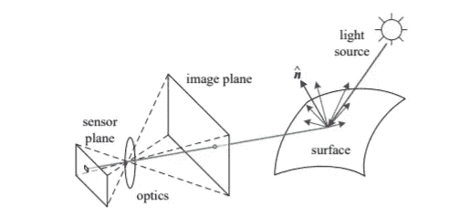

图:1。光度成像(Image cr *编辑:Szeliski，计算机视觉:算法与应用 2010)*

影响图像形成的一些因素是:

*   光源发出的光的强度和方向。
*   材料和曲面几何以及附近的其他曲面。
*   传感器捕获属性

**2.1.1 反射和散射**

没有光，图像就不能存在。光源可以是点光源或面光源。当光线照射到表面时，可能会发生三种主要反应-

1.  一些光被吸收了。这取决于称为ρ(反照率)的因素。表面的低ρ意味着更多的光将被吸收。
2.  一些光被漫反射，这与观察方向无关。遵循**朗伯余弦定律**反射光的量与 cos(θ)成正比。例如布、砖。
3.  一些光被镜面反射，这取决于观察方向。例如镜子。

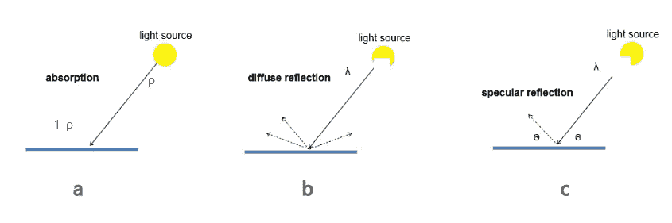

图 2:反射模型(图片来源:伊利诺伊大学德里克·霍伊姆)

除了上述反射模型，最常见的光散射模型是**双向反射分布函数(BRDF)。**它给出了光被介质从一个方向散射到另一个方向的量度。光的散射可以决定表面的形貌——光滑表面几乎完全在镜面反射方向反射，而随着粗糙度的增加，光往往会衍射到所有可能的方向。最终，如果一个物体的表面是完全漫射的(即朗伯)，那么它在整个出射半球看起来都是一样亮的。因此，BRDF 可以提供关于目标样品性质的有价值的信息。

有多种其他着色模型和光线跟踪方法，它们可以通过评估场景的外观来正确理解环境。

**2.1.2 颜色**

从颜色的角度来看，我们知道可见光只是大电磁光谱的一小部分。

当彩色光到达传感器时，会注意到两个因素:

*   光的颜色
*   表面颜色

**Bayer Grid/Filter** 是捕捉光线颜色的重要进展。在相机中，不是每个传感器都能捕捉到光的所有三种成分(RGB)。受人类视觉感受器的启发，Bayers 提出了一个网格，其中有 50%的绿色，25 %的红色和 25%的蓝色传感器。

**然后使用去马赛克**算法获得全色图像，其中周围像素用于估计特定像素的值。

除了 Bayer 滤色器之外，还有许多这样的滤色器被开发来感测颜色。

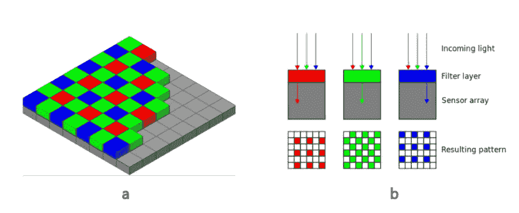

图 3: (a)图像传感器上的滤波器的拜耳排列。(b)传感器的横截面。(图片来源:[https://en.wikipedia.org/wiki/Bayer_filter](https://en.wikipedia.org/wiki/Bayer_filter))

## 2.2 图像传感管道(数码相机)

光线来自多个光源，在多个表面上反射，最终进入相机，在相机中光子被转换为我们在观看数字图像时看到的(R，G，B)值。

相机中的图像感测流水线遵循图 4 中给出的流程图。

在相机中，光线首先落在镜头上(光学)。接下来是可以指定或调整的光圈和快门。然后光线落在传感器上，传感器可以是 CCD 或 CMOS(下面讨论)，然后图像以模拟或数字形式获得，我们得到原始图像。

通常摄像机不会停在这里。他们使用上述主题中提到的去马赛克算法。如果需要或者应用任何其他重要的处理算法，图像被锐化。之后，白平衡和其他数字信号处理任务完成，图像最终被压缩成合适的格式并存储。

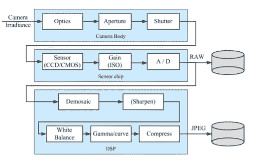

图 4:相机中的图像传感管道(图片来源: *Szeliski，计算机视觉:算法与应用 2010)*

**2.2.1 CCD 与 CMOS**

相机传感器可以是 CCD 或 CMOS。电荷耦合器件(CCD)中。在每个感测元件处产生电荷，并且该光生电荷从一个像素移动到另一个像素，并且在输出节点处被转换成电压。然后，模数转换器(ADC)将每个像素的值转换成数字值。

互补金属氧化物半导体(CMOS)传感器通过在每个元件**内将电荷转换成电压来工作，而不是像 CCD 那样积累电荷。CMOS 信号是数字信号，因此不需要 ADC。CMOS 在当今时代广泛应用于相机中。**

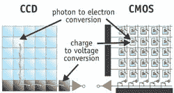

图 5: CCD 与 CMOS(图片来源:D. Litwiller，CMOS 与 CCD:成熟的技术，成熟的市场)

**2.2.2 数字图像传感器的特性**

让我们来看看当你点击相机上的图片时可能会看到的一些属性。

**快门速度:**控制到达传感器的光量

**采样间距**:定义成像芯片上相邻传感器单元之间的物理间距。

**填充因子**:有效感应面积大小与理论可用感应面积的比值(水平和垂直采样间距的乘积)

**芯片尺寸**:芯片的整体尺寸

**传感器噪音**:传感过程中各种来源的噪音

**分辨率**:告诉你每个像素指定多少位。

**后处理**:压缩和存储前使用的数字图像增强方法。

# 3.0 图像表示

得到一幅图像后，设计出表现图像的方法是很重要的。有各种各样的方式来表现一幅图像。让我们看看最常见的表示图像的方式。

## 3.1 作为矩阵的图像

表示图像的最简单的方式是矩阵的形式。

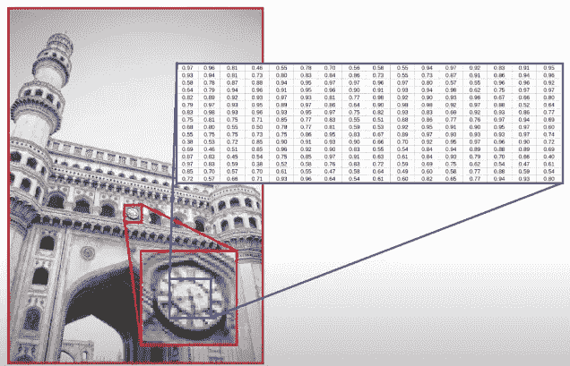

图 6:将图像的一部分表示为矩阵(图像鸣谢:IIT、马德拉斯、 [NPTEL 计算机视觉深度学习](https://nptel.ac.in/courses/106/106/106106224/))

在图 6 中，我们可以看到图像的一部分，即时钟，被表示为矩阵。一个相似的矩阵也将表示图像的其余部分。

常见的是，人们用多达一个字节来表示图像的每个像素。这意味着 0 到 255 之间的值表示图像中每个像素的强度，其中 0 表示黑色，255 表示白色。对于图像中的每个颜色通道，生成一个这样的矩阵。在实践中，将 0 和 1 之间的值标准化也很常见(如上图示例所示)。

## 3.2 图像作为一种功能

图像也可以表示为函数。图像(灰度)可以被认为是一个函数，它接受一个像素坐标并给出该像素的亮度。

可以写成函数*f:***ℝ***→***ℝ**输出任意输入点(x，y)的强度。强度值可以在 0 到 255 之间，如果值是标准化的，也可以在 0 到 1 之间。

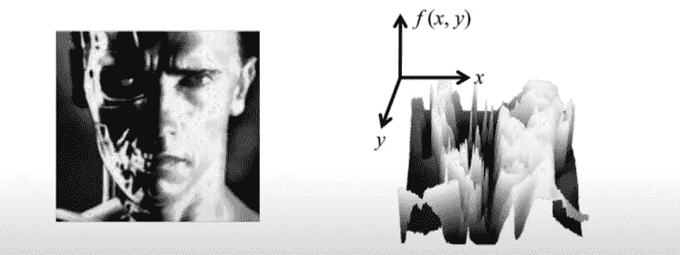

图 7:用函数表示的图像(图像来源:诺亚·斯内夫利，康奈尔大学)

**3.2.1 图像变换**

当图像被视为功能时，它们可以被转换。函数的变化会导致图像像素值的变化。下面是一些相同的例子。

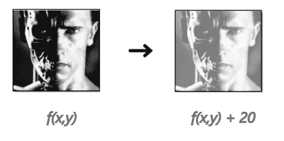

图 8 图像转换——使图像变亮(来源:诺亚·斯内夫利，康奈尔大学)

在图 8 中，我们希望使图像更亮。因此，对于图像中的每个像素，我们增加相应的强度值。这里我们假设值在 0 到 255 之间。

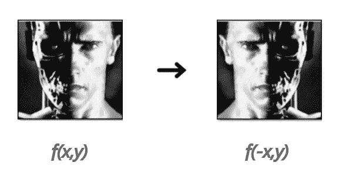

图 9:图像转换——翻转图像(来源:诺亚·斯内夫利，康奈尔大学)

类似地，图 9 示出了围绕垂直轴翻转图像的函数的变化。

在上面的例子中，变换发生在像素级。我们还可以用其他方法来进行图像转换。

**3.2.2 图像处理操作**

本质上，有三种主要操作可以在图像上执行。

*   点操作
*   本地操作
*   全球运营

下面是对这些操作的解释。

***3.2.2.1 点穴操作***

上面显示的图像变换示例是点操作。在这种情况下，输出值仅取决于特定坐标处的输入值。

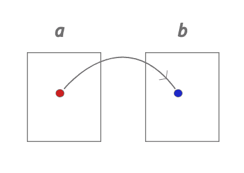

图 10:点操作。“b”中的输出坐标仅取决于“a”中相应的输入坐标(图片来源:作者)

编辑图像时经常使用的一个非常著名的点操作示例是反转对比度。最简单地说，它将暗像素转换为亮像素，反之亦然。

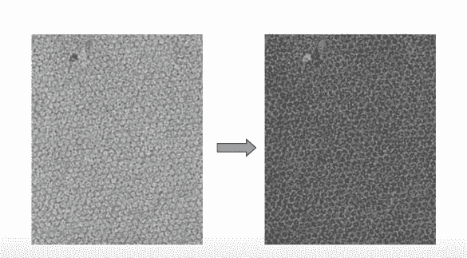

图 11:反转对比度(图片来源:IIT、马德拉斯、 [NPTEL 计算机视觉深度学习](https://nptel.ac.in/courses/106/106/106106224/))

图 11 显示了反转对比度的应用。帮助我们实现这一目标的点操作如下所述。

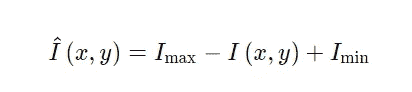

图 12:反转对比度的点操作(图片来源:作者)

这里， **I(x，y)** 代表图像 **I** 在坐标(x，y)处的亮度值。 **Iₘₐₓ** 和 **Iₘᵢₙ** 是指图像 **I** 的最大和最小亮度值。例如，假设图像 **I** 的强度在 0 和 255 之间。因此， **Iₘₐₓ** 和 **Iₘᵢₙ** 分别变为 255 和 0。您希望翻转某个坐标处的亮度值，比如说(x，y ),其中当前亮度值为 5。通过使用上面的操作，您得到的输出为:(255) — 5 + 0 = 250，这将是坐标(x，y)处亮度的新值。

假设您使用相机点击了一个静态场景。但是由于许多原因，如镜头上的灰尘颗粒、传感器的损坏等等，图像中可能会有噪声。**降噪**使用点运算可能非常繁琐。一种方法是拍摄多个静态场景，对每个像素的值进行平均，并希望噪声被去除。但是有时，不可能获得一个场景的多个图像，并且不能每次都保证场景的静止。要做到这一点，我们需要从点操作转向局部操作。

**【3.2.2.2 本地操作**

在本地操作中，如图 13 所示，输出值取决于输入值及其邻居。

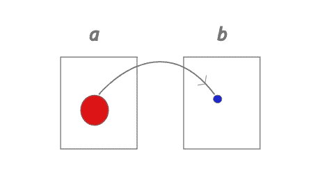

图 13:本地操作(图片鸣谢:作者)

理解局部操作的一个简单例子是**移动平均线**。假设如图 14 所示的图像 I。通过查看图像可以清楚地看到，这是一个放置在黑暗背景中的白色盒子。然而，我们看到图片中的噪声，因为几个像素似乎放错了位置(在图中圈出)。

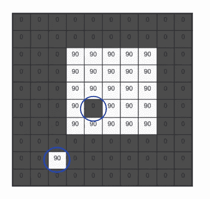

图 14:图像的相应像素的强度值(使用的来源:Steve Seitz，华盛顿大学)

如何从图像中去除这种噪声？假设图像中有一个 3 X 3 的窗口(可以选择任何大小的窗口)。在图像上移动窗口，取窗口内所有像素的平均值。下面可以看到这方面的演示。操作的最终输出可以在图 15 中看到。

2D 移动平均线(来源:Steve Seitz，华盛顿大学)

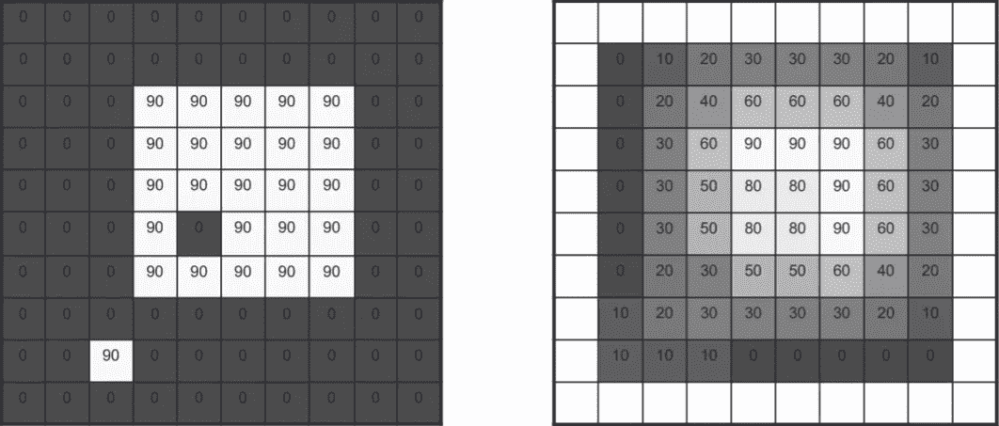

图 15:移动平均线的最终输出(图片来源:史蒂夫·塞茨，华盛顿大学)

上述操作是局部操作，因为输出取决于输入像素及其邻居。由于该操作，图像中的噪声像素在输出中被平滑掉。

***3.2.2.3 全球运营***

顾名思义，在全局操作中，输出像素的值取决于整个输入图像。全局运算的一个例子是傅立叶变换，如图 17 所示

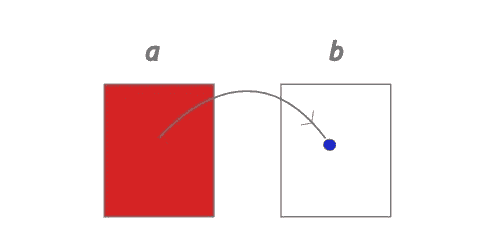

图 16:全球运营(图片鸣谢:作者)

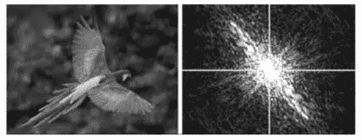

图 17:傅立叶变换的例子(图片来源:Mathworks MATLAB 工具箱)

感谢您的阅读。本文介绍了图像形成及其表示的基础知识。接下来的文章将深入讨论计算机视觉的更多主题。

# 资源

[计算机视觉的深度学习，梵持·N·巴拉苏布拉曼尼安，IIT·海德拉巴](https://nptel.ac.in/courses/106/106/106106224/)

计算机视觉:算法与应用理查德·塞利斯基

[CS 4495 计算机视觉，亚伦·博比克，佐治亚理工学院计算系](https://www.cc.gatech.edu/~afb/classes/CS4495-Fall2014/slides/CS4495-FilterConv1.pdf)

[描述第一表面散射的双向反射分布函数——c . e . Mungan，1998 年夏季](https://www.usna.edu/Users/physics/mungan/_files/documents/Publications/BRDFreview.pdf)

[采样和重建，CSC320:视觉计算简介
迈克尔·盖尔卓伊](http://www.cs.toronto.edu/~guerzhoy/320/lec/aliasing_filters.pdf)

如果你想阅读更多关于计算机视觉的故事，请随时关注并保持更新。

我也写机器学习/人工智能相关的核心话题！

 [## 想知道为什么在梯度下降算法中要减去梯度？

### 易于理解的向量微积分洞察力具有偏导数，梯度和方向导数

towardsdatascience.com](/wondering-why-do-you-subtract-gradient-in-a-gradient-descent-algorithm-9b5aabdf8150)