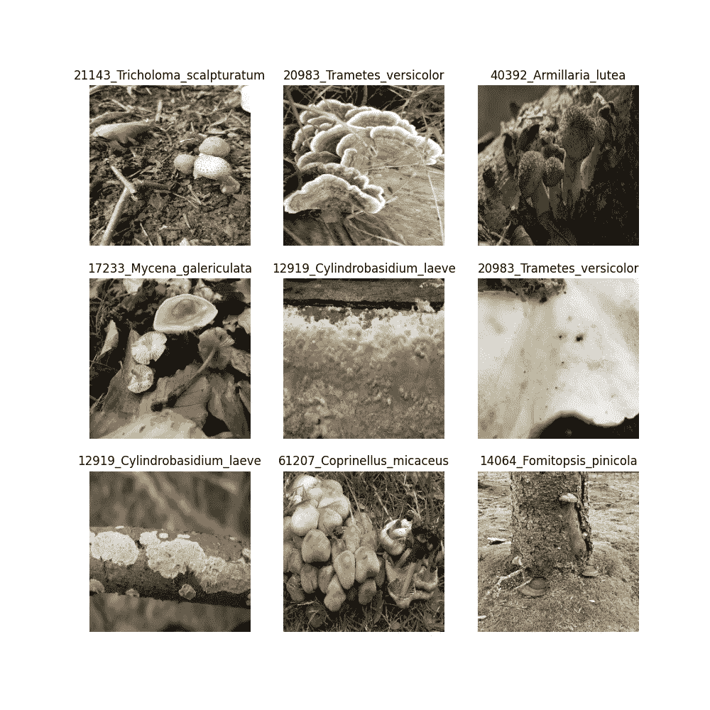
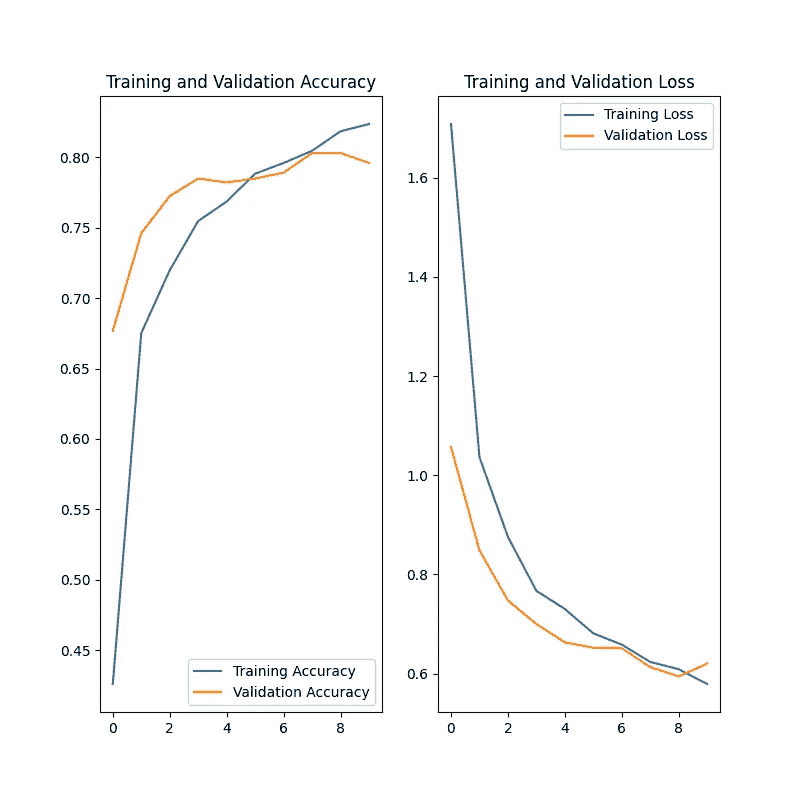

# 计算机视觉:让我们给蘑菇分类

> 原文：<https://towardsdatascience.com/computer-vision-lets-classify-mushrooms-6b3abe1561eb?source=collection_archive---------18----------------------->

## [实践教程](https://towardsdatascience.com/tagged/hands-on-tutorials)

## **用**张量流进行图像分类

你有没有问过自己，在大自然中行走时，你会遇到哪种真菌？孩子们接触它安全吗？所以我想训练一个模型来识别蘑菇/真菌。这个想法就是用手机拍一张照片，问模特这是什么。很棒，不是吗？
所以，这就是我玩图像分类的心路历程。

照片由 [Kalineri](https://unsplash.com/@kalineri?utm_source=unsplash&utm_medium=referral&utm_content=creditCopyText) 在 [Unsplash](https://unsplash.com/s/photos/mushrooms?utm_source=unsplash&utm_medium=referral&utm_content=creditCopyText) 上拍摄

**定义问题:图像检测/图像分类**

在我们开始之前，让我们澄清一些概念。计算机视觉是人工智能的一个有趣分支，它是一种教会模型在图像中寻找信息，从而理解视觉内容的艺术。当图像分类对人类来说相当简单时(猫、狗、汽车……)，机器总是努力保持竞争力。这是我们人类小时候就学会的东西。父母/幼儿的一个常见游戏是重复物体和人的名字。所以对日常课来说很容易。计算机视觉走过了漫长的道路，现在通过深度学习，它已经和人类一样好，甚至在特定领域更好。例如，在医学放射学中，人工智能可以被训练来检测和分类肿瘤，并且通常比人类有更好的结果。

计算机视觉的第一步是图像检测。

*图像检测*是在给定的图像中找到图像中的特定对象，并返回其坐标/边界框。

*图像分类*是当你给出一个物体的图像，你的模型返回一个带有概率和置信度的类。因此，我们的模型应该首先检测对象，然后根据它所训练的类的类型对它们进行分类。为此，我们通常使用 CNN-卷积神经网络。什么是 CNN？

图像是像素的矩阵。要仅检测图像中的边缘，您需要乘以一个滤波器矩阵。这将使大多数像素为零/黑色，它将只显示你的边缘。更多详情请查看本页。CNN 是一系列的节点，每个节点都对图像进行过滤。这有助于模型从图像中学习特征，数学上称为向量。网络越深——层数和节点数最多——消耗的内存就越多。

*图像识别*就是你给模特一个有多个物体的图像。对于图像中的每个对象，该模型给出其边界框(对象检测)和具有置信度的类别预测。

我们这里的问题是多类分类/图像分类。

**收集数据**

为了训练一个模型，你需要好的标记数据，当我说好的标记数据时，它就像是你项目的第一块石头。如果你错了，那么所有进一步的努力都将是徒劳的。这对任何机器学习项目来说都是至关重要的一步。正如我们所说:“垃圾进来，垃圾出去”。想想看，就像你试图教一个孩子什么是蘑菇。如果你给他看不同的物体，每次都说“那是一个蘑菇”，你可以相当肯定，孩子会认为蘑菇是物体的通称。所以我们需要准确。对于这一步，您可以废弃 web 或找到可用的开放数据。

我尝试了 [Kaggle 真菌数据集](https://www.kaggle.com/c/fungi-challenge-fgvc-2018)。这是一个非常好的数据集，有 1394 个可用的类[在这里](https://github.com/visipedia/fgvcx_fungi_comp#data)。我玩了一会儿，心想，这是图像识别的经典问题。应该不比人脸识别难。事实上，我不久前了解到，在中国最大的办公楼里，人脸识别被用来检查没有徽章的员工的身份。我印象非常深刻，我以为蘑菇也会如此，我可以从这些模型中转移学习，让我的新模型在 TensorFlow 库中施展魔法。你猜怎么着？

一点效果都没有。一张脸的共同特征对蘑菇来说几乎没有用处。我的第一批模特什么都没学到。我投入了如此多的时间，甚至一些眼泪，最终得知 1394 班的不平衡数据，并不容易。在这个数据集中，对于某些类，我们只有三幅图像。有时，我的模型在训练集上学习，并且做得很好，比如 86%的准确率，而当到达验证集时，我们下降到 20%。为什么？这是由于不平衡的数据集。该模型学习猜测具有最大数量图像的类。如果你给一个孩子看 300 次蘑菇，一次土豆，他肯定会比土豆更容易猜出蘑菇。对于这篇文章，我想重点讨论用 TensorFlow 进行图像分类。所以，我选择只处理 10 个类。我们拥有的类越多，模型就越难以区分它们。所以你必须收集更多的图像来学习更多的特征。对于这第一次尝试，我想保持简单，我希望它将是有效的。

让我们探讨如何使用 TensorFlow 构建一个端到端的图像分类项目。

让我们开始吧！

## 数据处理

Tensorflow 为我们提供了这个很棒的 API tf.data.dataset，您可以使用一行代码创建一个高效的数据集，其中包含多个经过优化的本地函数面板。我用下面的代码从本地下载的 images 目录中创建了我的数据集。
通常当我在玩一个新项目时，我更喜欢快速制作笔记本，但在这里我不能使用 image_dataset_from_directory 来创建我的 TensorFlow 数据集，所以我切换到 Pycharm。Jupyter 笔记本上还没有。那就 Pycharm 吧！

以下是我们将要学习的 10 个课程:

> [' 11082 _ Xerocomellus _ chrysenteron '，' 12919_Cylindrobasidium_laeve '，' 14064_Fomitopsis_pinicola '，' 14160 _ 灵芝 _pfeifferi '，' 17233 _ 菌丝体 _galericulata '，' 20983_Trametes_versicolor '，' 21143 _ 口蘑 _ 头皮菌'，' 40392 _ 蜜环菌 _ 藤黄'，' 40985 _ Byssomerulius _ 真皮层'，' 6185

由我的代码生成的情节的图像

让我们设置数据集性能

# 迁移学习模式

我从创建自己的 CNN 开始，但它做得不是很好。我没有耐心去改善它，我选择了迁移学习。
迁移学习是指重新使用在更大数据集上训练的模型的能力，这些模型已经学习了多个特征。为此，我们冻结了顶层，并用新的课程进行再培训。许多已知的模型赢得了 imagenet 竞赛。砝码可以重复使用。所以让我们用这些预先训练好的模型来帮助自己。我使用 MobileNetV2 模型是因为它非常轻，它可以在几秒钟内在我的 GPU 上运行。

我增加的提高准确性的独特步骤是数据扩充。
数据扩充是:对于一个输入标签的图像，你对它进行缩放或翻转，将其作为输入添加到模型中。这有助于模型继续识别对象，即使它不总是在相同的位置。

这是结果

作者 MobileNetV2 的图片结果

它只对 10 个时期有效，并且只增加了数据。

现在让我们来预测—下面是我的代码。我在 Xerocomellus_chrysenteron 类的 mycodb web 数据集上拍摄了[一张图片](https://www.mycodb.fr/photos/Xerocomellus_chrysenteron_2014_rp_1.jpg)。

这个模型说:

很好，不是吗？

结果上方的矩阵是预测的向量。端到端项目现已完成。下一步应该是提高准确性，并扩展到其余的类。这是我训练一个能够识别 1394 种真菌的模型的第一步。令人印象深刻的是，它在不太长的时间内就做得这么好。请继续关注我的更新！
快乐编码！