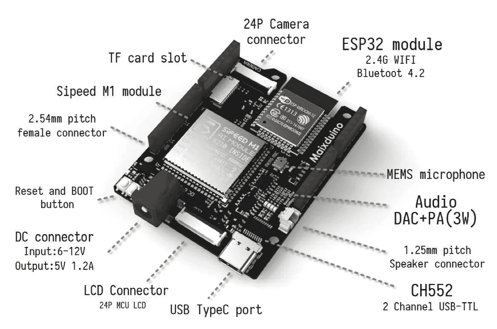
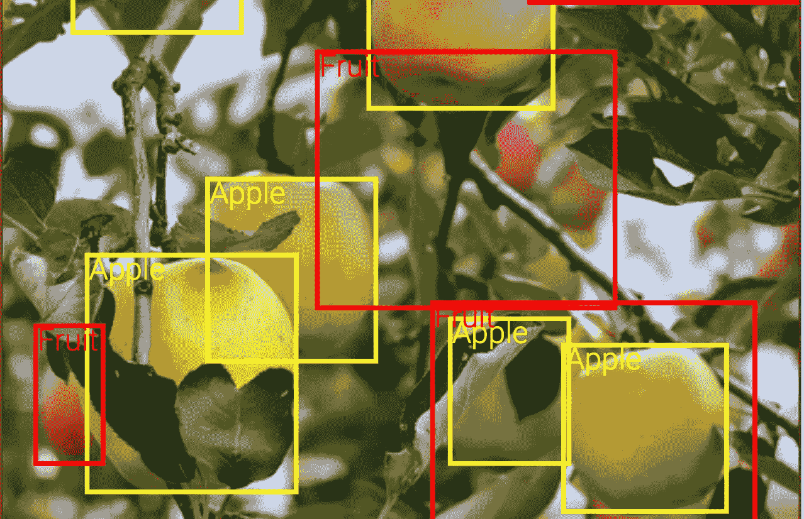
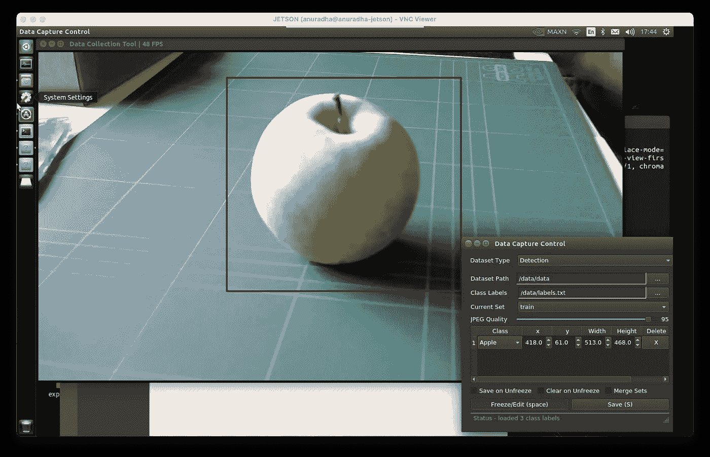
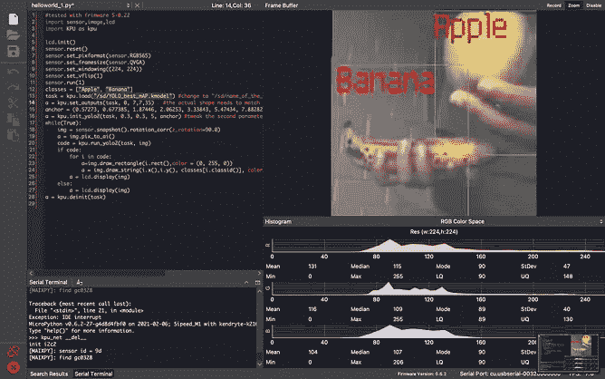
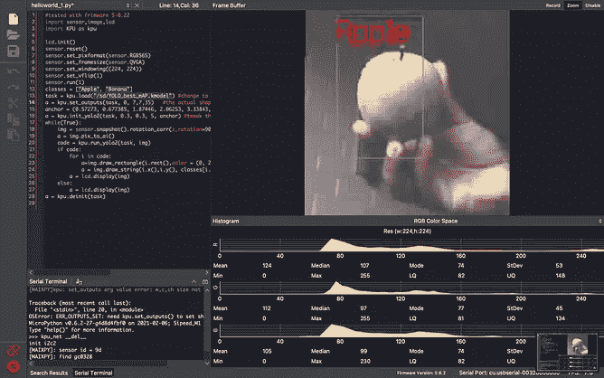
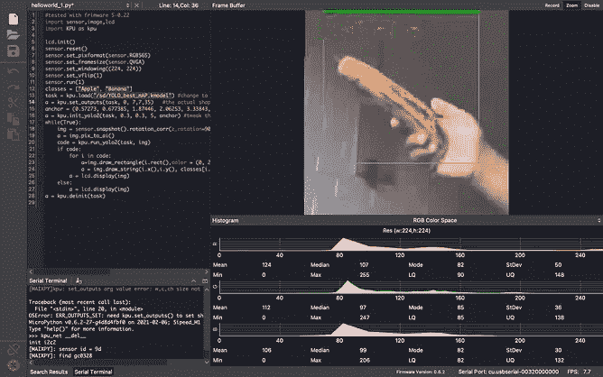

# 边缘的计算机视觉

> 原文：<https://towardsdatascience.com/computer-vision-on-edge-b5adb5c6ccde?source=collection_archive---------16----------------------->

## AIoT 的目标检测:边缘计算实例

几周前，当我在全球速卖通逛街时，我偶然发现了这个奇妙的装置。据称它将携带 RISC V 架构以及一个 **KPU** (KPU 是一个通用神经网络处理器)。电路板的对比规格如下:

*   CPU: RISC-V 双核 64 位，带 FPU
*   图像识别:QVGA@60fps/VGA@30fps
*   芯片功耗< 300mW



MaixDuino (Image from [Sipeed](https://www.seeedstudio.com/Sipeed-Maixduino-Kit-for-RISC-V-AI-IoT-p-4047.html)

说实话，该单位是旧的，只是最近才注意到。鉴于我对边缘计算的兴趣，我想为一个对象检测示例提供一个完整的端到端指南。这个例子基于 Dimitry 的这篇文章中的知识。然而，我将全面介绍如何收集图像并对它们进行注释。如果你想知道什么是边缘计算，请阅读下面的文章。

<https://medium.com/swlh/what-is-edge-computing-d27d15f843e>  

> 让我们尝试建立一个图像检测程序，将能够边界出苹果和香蕉。你可以创造性地使用你的探测器。我们将继续讨论所需的工具和库。



打开图像数据库([链接](https://storage.googleapis.com/openimages/web/visualizer/index.html?set=valtest&type=detection&c=%2Fm%2F014j1m))

# 关于迁移学习的注记

迁移学习是指我们使用预先训练好的模型来进一步专业化。简而言之，您用自己的分类层(或更多层)替换训练模型的最后一个预测层。然后冻结除你之外的层(或者一些预先训练的层)。然后训练网络，以便使用预训练模型的功能来微调图层，从而预测所需的类。

*不幸的是，目前我们将要训练的网络没有任何预先训练的模型。因此，我们将大部分时间在地面上训练。但这将是一个有趣的实验！*

# 准备数据

我们需要准备以下格式的数据。首先，我们需要苹果和香蕉的图像。同时，我们需要对它们进行注释，说明每个水果在图像中的位置。这就是物体分类和检测的区别所在。我们需要说出物体的位置。为此，您需要以下工具。

<https://github.com/tzutalin/labelImg>  

> 或者你可以使用我的工具，用你的背景和物体图像生成带注释的图像(例如:来自卡格尔的 [Fruit 360 的图像)。在这里阅读更多；](https://www.kaggle.com/moltean/fruits)

<https://anuradhawick.medium.com/annotator-for-object-detection-950fd799b651>  

在我的例子中，我使用下面的程序从网络摄像头捕捉。选择简单的方法。下面的程序是用 [Nvidia jetson nano 入门](https://github.com/dusty-nv/jetson-inference)容器编译的。

<https://github.com/dusty-nv/camera-capture>  

捕捉图像(作者提供的图像)

# 数据集上的训练

我们想训练我们的模型，以便它们可以在 MaixDuino 设备上运行。为此，我们可以使用下面的存储库。它对模型层进行了所有必要的修改，以适应 K210 处理器的架构。克隆并安装所需的依赖项。以下链接提供了所有说明；

<https://github.com/AIWintermuteAI/aXeleRate>  

我们需要如下组织我们的训练数据:

```
path-to/data
---anns      # store the training annotations
---imgs      # relevant images for the training
---anns_val  # validation annotations
---imgs_val  # validation images
```

现在我们需要创建一个 config.json 来设置训练选项。对于我们的例子，它应该如下所示；

```
{
    "model" : {
        "type":                 "Detector",
        "architecture":         "MobileNet7_5",
        "input_size":           [224,224],
        "anchors":              [0.57273, 0.677385, 1.87446, 2.06253, 3.33843, 5.47434, 7.88282, 3.52778, 9.77052, 9.16828],
        "labels":               ["Apple", "Banana"],
        "coord_scale" :  1.0,
        "class_scale" :  1.0,
        "object_scale" :  5.0,
        "no_object_scale" :  1.0
    },
    "weights" : {
        "full":     "",
        "backend":              "imagenet"
    },
    "train" : {
        "actual_epoch":         50,
        "train_image_folder":   "data/imgs",
        "train_annot_folder":   "data/anns",
        "train_times":          2,
        "valid_image_folder":   "data/imgs_val",
        "valid_annot_folder":   "data/anns_val",
        "valid_times":          2,
        "valid_metric":         "mAP",
        "batch_size":           4,
        "learning_rate":        1e-4,
        "saved_folder":     "obj_detector",
        "first_trainable_layer": "",
        "augumentation":  true,
        "is_only_detect" :   false
    },
    "converter" : {
        "type":       ["k210"]
    }
}
```

注意:使用绝对路径来避免不必要的错误。

接下来，我们可以使用以下命令进行训练；

```
python3 aXelerate/axelerate/traing.py -c config.json
```

现在训练完成了。我们对在**项目**文件夹中生成的 **kmodel** 文件感兴趣。我们可以将它移动到一个 microSD 卡上，并将其连接到 MaixDuino 设备上。

## 预言；预测；预告

以下是我将在 **maixPy IDE** 中使用的草图。

```
import sensor,image,lcd
import KPU as kpulcd.init()
sensor.reset()
sensor.set_pixformat(sensor.RGB565)
sensor.set_framesize(sensor.QVGA)
sensor.set_windowing((224, 224))
sensor.set_vflip(1)
sensor.run(1)classes = ["Apple", "Banana"]
task = kpu.load("/sd/name_of_the_model_file.kmodel")
a = kpu.set_outputs(task, 0, 7, 7, 35)anchor = (0.57273, 0.677385, 1.87446, 2.06253, 3.33843, 5.47434, 7.88282, 3.52778, 9.77052, 9.16828)
a = kpu.init_yolo2(task, 0.3, 0.3, 5, anchor) while(True):
    img = sensor.snapshot().rotation_corr(z_rotation=90.0)
    a = img.pix_to_ai()
    code = kpu.run_yolo2(task, img)

    if code:
        for i in code:
            a = img.draw_rectangle(i.rect(),color = (0, 255, 0))
            a = img.draw_string(i.x(),i.y(), classes[i.classid()],
                color=(255,0,0), scale=3)
            a = lcd.display(img)
    else:
        a = lcd.display(img)a = kpu.deinit(task)
```

确保改变输出参数，以适应`kpu.set_outputs(task, 0, 7, 7, 35)`中训练好的神经网络。现在你已经准备好运行程序了。这很容易。看看下面的截图。



作者提供的图片

注意质量很低。这是因为 **maixPy IDE** 允许我们将 LCD 显示流式传输到计算机。所以质量比较少。

该图像检测程序可以在 300 毫安的电流下运行。此外，它有类似于 Arduino nano 板的 GPIO 引脚。所以可能性是很多的。然而，用 python 编程也是一大解脱。

我希望这篇文章能让您对数据科学有一个新的认识。快乐阅读！

干杯。