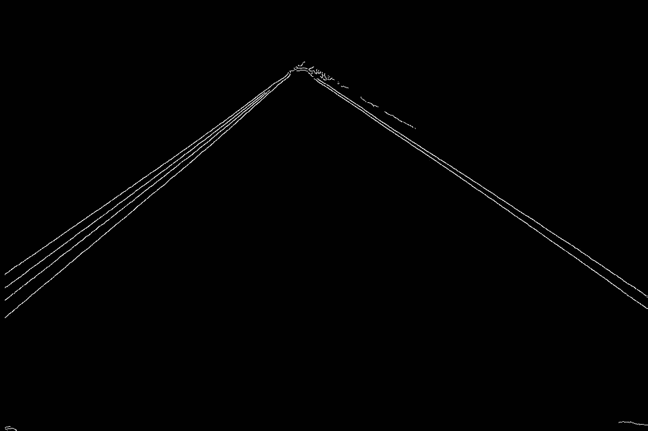

# 计算机视觉传感器和系统

> 原文：<https://towardsdatascience.com/computer-vision-sensors-systems-bdc079847316?source=collection_archive---------30----------------------->

## 捕捉和诠释光的旅程。

布鲁诺·伊曼纽尔在 [Unsplash](https://unsplash.com/s/photos/camera?utm_source=unsplash&utm_medium=referral&utm_content=creditCopyText) 上拍摄的照片

从硬件到支持计算机视觉的系统，这篇文章是一个广度优先于深度的综述。为了平衡这种方法，本文将读者引向指导性的参考资料，并提供了现成的源代码。我们从图像形成的机制开始。我们涵盖针孔，镜头，传感器(CCD 和 CMOS)，拜耳过滤器，和颜色重建。

然后，我们转向应用计算机视觉来检测图像和图片中的道路车道。第一种方法基于一组常用的计算机视觉算法。我们涵盖了 Canny 边缘检测，高斯模糊，感兴趣的区域，和霍夫变换。第二种方法在空间卷积神经网络上运行推理，以检测图像和视频输入上的道路车道。

# 成像简史

> 暗箱图像的美是无法用语言表达的。绘画艺术已经死亡，因为这就是生活本身:或者更高级的东西，如果我们能找到一个词来形容它的话。
> ——康斯坦丁·惠更斯私人信件，1622 年 4 月 13 日

拍照是将 3D 场景投影到 2D 平面上。暗箱通过针孔实现了这种投影。墙上的一个小针孔可以让光线穿透照相机的暗室。这种简单的机制产生了清晰的投影，让艺术家们可以在场景上勾画出精细的细节。但是这种方法在亮度方面有所欠缺，针孔本身不能收集足够的光。

在阿塔纳斯·珂雪的*Ars Magna Lucis Et Umbrae*(1645)中雕刻一个“便携式”暗箱

针孔摄像机甚至在今天也吸引了广泛的兴趣。他们能够捕捉到令人惊叹的图像，这些图像的特点是在任何地方都具有同等聚焦的视觉效果。缺点还是一样，图像暗淡，需要长时间曝光。

伊万·麦格雷戈，邓卢斯城堡的日落，用针孔相机拍摄，曝光时间为 20 分钟。

为了解决昏暗的问题，引入了透镜。通过在光圈前放置一个透镜，可以聚集更多的光。镜头也可以改变投影图像的放大倍数。在过去，放大需要艺术家移动整个相机。如今，在不改变场景和图像平面之间的距离的情况下，可以移动镜头的位置来调整放大效果。变焦是移动镜头来改变放大率的过程。

即使有了镜头，捕捉图像也要持续很长一段时间，依靠艺术家在投影图像上画图。十九世纪三十年代路易·达盖尔发明的胶卷是摄影史上最重要的发明之一。这是第一次有可能在物理层上记录光线，无需依靠艺术家，只需按下按钮就能记住某个时刻。

胶片上涂有卤化银。一旦暴露在光线下，卤化银就转化为金属银。转换的数量取决于胶片上任何特定点的曝光。为了产生图像，胶片随后通过照相显影的化学过程进行处理。

玛丽安娜·卡塞塔的黑白底片处理

硅图像探测器的发明甚至比胶片更有影响力。同一块芯片可以用来拍摄无限数量的照片，不再需要化学照相显影。这是数码相机使用的技术，也是今天我们大多数人在手机上使用的技术。

# 图像传感器

概括地说，拍照就是将 3D 场景投影到 2D 平面上。投影是由镜头辅助的光圈实现的，以收集更多的光并调整放大倍数。2D 平面首先是一个简单的表面，艺术家可以在上面绘画。它后来成为卤化银胶片的表面。最后，它现在是硅片的表面:一个图像传感器。

为了将接收到的光转换成数字图像，大多数图像传感器依赖于硅原子的特性。当具有足够能量的光子撞击硅原子时，它会释放电子。在硅晶格(像素)上，光子通量曝光产生电子通量。电子通量然后被转换成电压。

## 电荷耦合器件

在这种类型的图像传感器中，光子到电子的转换发生在每个像素中。在每个像素下面有一个电容器储存释放的电子。称为垂直 CCD 移位寄存器的电路连接在每列像素的电容器之间。该电路使得电子能够从一个像素垂直转移到其正下方的像素，直到它们到达最后一行。这最后一行由水平 CCD 移位寄存器连接，该移位寄存器将电子传送到模数转换器。

电荷耦合器件。作者 Gif。

电荷耦合器件中电子的垂直转移是用桶旅法完成的。这意味着每一行在获取前一行的电子之前，先将它的电子传递给下一行。水平转移保持了行的顺序，因为它们向 ADC 水平移动，在 ADC 中它们被转换成与其电子电荷成比例的电压。

## 互补金属氧化物半导体 CMOS

CMOS 以不同的方式实现图像传感器。它不是将电子从像素转移到 ADC，而是在像素级集成电压转换。

互补金属氧化物半导体。图片作者。

使用 CMOS，可以单独寻址每个像素以读取其电压。这提供了更大的灵活性，因为它能够更快地读取感兴趣的特定区域。由于在像素级集成了更多组件，灵活性是以更小的光敏区域为代价的。为了补偿光敏区域的减少，微透镜被放置在每个像素的正上方。这些微透镜将光线聚焦在光敏探测器上。

像素结构。图片作者。

## 捕捉颜色

像素本身能够捕捉光的强度，但不能捕捉光的波长。为了捕捉颜色(波长)，最流行的方法是叠加一个拜耳滤光片阵列。在这种方法中，每个像素都覆盖有红色、绿色或蓝色的滤镜。

[图像传感器像素阵列上滤色器的拜耳排列。每个 2×2 单元包含两个绿色、一个蓝色和一个红色过滤器。图片由科林 M.L 伯内特提供。](https://commons.wikimedia.org/wiki/File:Bayer_pattern_on_sensor.svg#/media/File:Bayer_pattern_on_sensor.svg)

几乎所有颜色的人类感觉都可以用三种波长产生。捕捉红色、绿色和蓝色波长足以再现被拍摄场景的真实颜色。但是仅仅覆盖拜耳模式是不够的。它会产生看起来像左边的图像:

(左)拜耳模式。(右)插值重建的图片。作者图片。

(左)放大的拜耳模式。(右)通过插值放大的重建图片。作者图片。

左侧图像的像素全部是红色、绿色或蓝色。请注意，图像看起来大部分是绿色的。拜耳模式模拟了人类视网膜在白天对绿光最敏感的事实。因此，过滤器是一半绿色，四分之一红色，四分之一蓝色。

为了将左边的图像转换为右边的图像，我们获取每个像素的值，并将其与其相邻像素的值相结合。这个过程叫做插值。假设我们从左边的图片中取一个蓝色像素。插值是将蓝色值与相邻像素的红色和绿色值混合。

为了实验光混合是如何工作的，这里有一个很好的模拟。要了解它与油漆颜色混合的不同，[这里有另一个好链接](http://www.webexhibits.org/causesofcolor/1BA.html)。

# 计算机视觉

图像传感器的应用已经成为我们生活中的基础。它们塑造了我们表达自己和交流的方式，它们开辟了科学和艺术的跨学科领域。也许这些领域中最先进的是计算机视觉。

研究计算机视觉必须从对支持它的硬件的理解开始。我们简要介绍了硬件的历史、进步和主要组件。让我们看一个令人兴奋的实际应用程序，它利用了这一点。

## 自动驾驶汽车中的车道检测

自 2021 年 5 月以来，特斯拉开始交付不再配备雷达的 Model 3 和 Model Y 车辆。这些车型依靠基于摄像头的自动驾驶系统在相同的安全评级下提供相同的功能( [*过渡到特斯拉视觉*](https://www.tesla.com/support/transitioning-tesla-vision) ，2021)。

特斯拉 Vision 的主动安全功能包括车道偏离警告/避免。能够探测道路车道对驾驶至关重要。我们将着眼于车道检测，并以两种不同的方式实现它。首先使用计算机视觉算法，其次使用空间卷积神经网络。

([左)弗林克瑞](https://www.reddit.com/r/roadtrip/comments/b71hux/gotta_love_a_fresh_paved_road_arizona_is_a_beaut/)的亚利桑那州，([右)维克 _ 醋](https://www.reddit.com/r/roadtrip/comments/lcxdqr/zion_national_park_time_lapse_from_a_road_trip_in/)的锡安国家公园。经所有者许可使用的图像。

第一步是检测图像中最突出的边缘。相邻像素与其亮度水平形成对比的区域被标记为边缘。以下代码将图像转换为灰度，使用高斯滤波器模糊以减少噪声，并应用算法 [Canny 边缘检测](https://docs.opencv.org/3.4.15/d7/de1/tutorial_js_canny.html)。

精明的边缘检测。

Canny 边缘检测后得到的图像。由作者处理的图像。由 [Flinchcr](https://www.reddit.com/r/roadtrip/comments/b71hux/gotta_love_a_fresh_paved_road_arizona_is_a_beaut/) 拍摄的原始(左)图像。原(右)图由[Vic _ 醋](https://www.reddit.com/r/roadtrip/comments/lcxdqr/zion_national_park_time_lapse_from_a_road_trip_in/)拍摄。经所有者许可使用的图像。

这些图像充满了我们不需要的信息。我们希望专注于前方的道路，因此我们将定义一个感兴趣的多边形区域来裁剪每个图像。对于两幅图像，定义多边形的点会有所不同。为了找到它们，我们可以绘制图像并显示宽度和高度轴。

感兴趣的区域。

用于裁剪图像的多边形遮罩。作者图片。

由此产生的感兴趣区域。由作者处理的图像。由 [Flinchcr](https://www.reddit.com/r/roadtrip/comments/b71hux/gotta_love_a_fresh_paved_road_arizona_is_a_beaut/) 制作的原始(左)图像。原(右)图由[Vic _ 醋](https://www.reddit.com/r/roadtrip/comments/lcxdqr/zion_national_park_time_lapse_from_a_road_trip_in/)提供。经所有者许可使用的图像。

观察由此产生的感兴趣区域，人眼可以容易地感知线条。那些线实际上是一系列像素，它们只是计算机的点。我们需要描绘两条最能描述这些点的排列的主线。这是使用[霍夫变换](https://learnopencv.com/hough-transform-with-opencv-c-python/)算法完成的。

霍夫变换。

将蓝线添加到原始图片后的结果。由作者生成的图像。由 [Flinchcr](https://www.reddit.com/r/roadtrip/comments/b71hux/gotta_love_a_fresh_paved_road_arizona_is_a_beaut/) 拍摄的原始(左)图像。原(右)图由[Vic _ 醋](https://www.reddit.com/r/roadtrip/comments/lcxdqr/zion_national_park_time_lapse_from_a_road_trip_in/)拍摄。经所有者许可使用的图像。

完整的实现包括我的 Colab 笔记本车道检测 OpenCV 的进一步改进和优化。

<https://colab.research.google.com/drive/1sX5J1FDec9AUqxELuXfhBq6WLZ-FFssY?usp=sharing>  

这种方法可能看起来会产生很好的结果，但是这种实现远不是最佳的，因为:

*   我们必须为每种情况明确定义感兴趣的区域。由于视角的变化，应用相同的多边形遮罩来裁剪 ROI 是不可能的。
*   计算时间太慢，驾驶需要高处理速度。
*   转弯涉及曲线车道，这种方法仅适用于直线车道。

让我们来看一个使用[空间 CNN 进行车道检测的替代方案](http://Spatial CNN for Traffic Lane Detection) ( [潘新刚](https://arxiv.org/search/cs?searchtype=author&query=Pan%2C+X) et all，2018)。在 Colab 笔记本上，我们首先创建一个到 Drive 帐户的链接。然后我们克隆项目存储库。

我们在项目的根目录下上传了三个文件:[*ERF net _ encoder _ pretrained . PTH . tar*](https://drive.google.com/file/d/1XRpwbMBRNHhghUukH5F2r4OePmzNUmfk/view?usp=sharing)*，*[*ERF net _ baseline _ culane _ 2021 02 04 . pt*](https://drive.google.com/file/d/1yKHl3nNRbH1WuQB-Xzt5eVmteM-rDfql/view?usp=sharing)*，*[*ERF net _ baseline _ tu simple _ 2021 04 24 . pt*](https://drive.google.com/file/d/1Skyr9MU3r2-OUPTdXWtNhJOIrUpsjIw9/view?usp=sharing)*。*然后我们安装以下依赖项:

我们可以通过以下命令使用图像运行推理:

我们可以通过以下命令使用视频运行推理，在这种情况下，图像路径对应于视频路径:

结果显示检测到的车道带有黑色虚线。Gif 与作者的车道检测。 [Flinchcr](https://www.reddit.com/r/roadtrip/comments/b71hux/gotta_love_a_fresh_paved_road_arizona_is_a_beaut/) 原创视频。经所有者许可使用的图像。

完整的实现包括 Git 存储库的克隆、依赖项的安装和推理代码都可以在我的 Colab 笔记本车道检测 SCNN 中找到。

<https://colab.research.google.com/drive/1uBv9KQilCvEuAmTvpzQfhSNjN8gJHfY5#scrollTo=h8YWDFqFK6cH>  

# 承认

本文第一部分站在一个巨人的肩膀上， [Shree K. Nayar](https://en.wikipedia.org/wiki/Shree_K._Nayar) 。这是计算机视觉基本原理课程第一课的总结。我计划发布更多的文章来传达我对这门课程的理解。我怀着深深的感激之情，感谢 Nayar 为让这样一个高质量的课程变得免费和容易获得所做的努力。

<https://www.youtube.com/channel/UCf0WB91t8Ky6AuYcQV0CcLw/about>  

第二部分从[获取完整的自动驾驶汽车路线](https://www.udemy.com/course/applied-deep-learningtm-the-complete-self-driving-car-course/)以实现基于 OpenCV 的车道检测。这部分还依赖于 [Pytorch 自动驾驶](https://github.com/voldemortX/pytorch-auto-drive)项目运行视频推理进行车道检测。

<https://github.com/XingangPan/SCNN> 