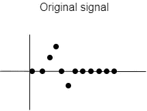
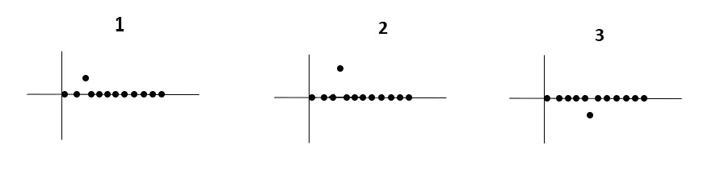
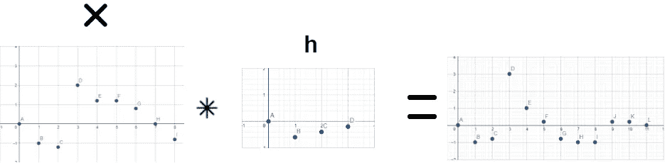
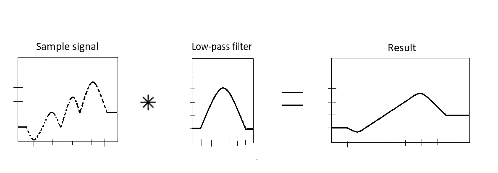
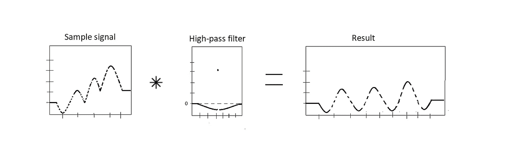
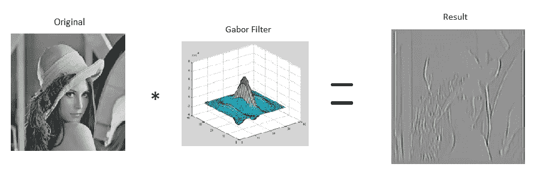
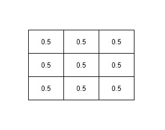
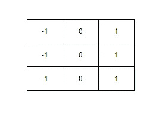

# 计算机视觉——过滤的重要性

> 原文：<https://towardsdatascience.com/computer-vision-the-importance-of-filtering-c0d9640c6e72?source=collection_archive---------33----------------------->

## 理解计算机视觉中过滤的基础知识

计算机视觉的核心是从图像或视频中提取最有意义的特征。这就是为什么理解“特征提取”过程的基础对于使用或创新最先进的计算机视觉解决方案极其有用。

要深入理解任何一个概念，首先要了解它的基础。在这种情况下，为了理解滤波在图像中的工作原理，我们首先需要回过头来分析它是如何应用于 1D 信号的。

# 信号过滤

考虑以下信号:

作者图片

信号处理中的一个基本概念是信号的**叠加，**将信号分解成更简单的成分。请记住，这个概念的全部目的是理解**信号和系统** **如何工作**。

通过将先前的信号分解成更简单的信号，我们获得以下分量:

作者图片

获得这些之后，我们可以分析它们是如何被系统单独影响的。此外，我们正在获取关于**系统如何响应脉冲的信息，也称为卷积。**你是如果你看过这篇文章，可能对这个术语很熟悉；然而，知道你在执行卷积时实际在做什么，可能会在将来解决更复杂的问题时对你有所帮助。另一个你可能非常熟悉的术语是**滤波器内核，**它只不过是系统的 i **脉冲响应。**这非常重要，因为如果我们知道系统如何响应脉冲，就可以根据任何给定的输入信号计算出其输出。

信号中的卷积运算遵循与图像中的卷积相同的过程:滤波器必须以给定的大小和步幅通过信号的总长度。下图说明了信号 **x** 与内核 **h** 的卷积。

作者图片

# 低通滤波与高通滤波

既然您已经了解了滤波的过程及其实际意义，那么能够区分低通和高通滤波也很重要。

*   **低通滤波**—它可以被视为一种平滑滤波器，用于衰减高频并保留低频。您可以很容易地将它与其他过滤器区分开来，因为它只有正值(1 个方向)。

作者图片

*   **高通滤波** —与低通滤波相反，高通滤波用于衰减低频，保留高频。这个想法是突出信号中变化最大的部分。您可以很容易地将它们识别为高通，因为它们同时具有正值和负值(2 个方向)。

作者图片

当应用于信号时，分析这些类型的滤波器是极其重要的，因为这将为你深入理解它们对图像处理的多重影响奠定基础(2D)。

话虽如此，在这一点上，即使你不知道这两种类型的过滤器之间的差异，你已经可以开始理解它们在应用于图像时会产生的不同效果。

# 滤像

在提出 CNN(卷积神经网络)模型之前，需要手动提取图像的特征，然后将它们输入神经网络或任何其他类型的分类器。这些特征可能很简单，比如黑白像素的数量，也可能有点复杂，比如亮度、强度和能量。这尤其困难，因为除了尝试不同的特征组合和分析模型的性能表现之外，没有办法知道哪些特征对分类器最有意义；然而，这可能是一个非常耗时的过程。从个人经验来看，提取新的有意义的特征并不是一件容易的事情，有时会导致添加可能对模型性能产生负面影响的特征。为了从图像中获得更多独特的特征，通常对其应用**过滤器**，然后从结果图像中提取特征。 **Gabor** 滤波器(高通)通常用于检测图像的边缘，如下图所示。

作者图片

这就是 CNN 介入并完全改变特征提取过程的地方。如今，**如果你有大量的数据**，你不需要手动执行任何特征提取，因为模型会自己找到最有意义的特征。

当用老方法执行这个过程时，您必须尝试不同的特征组合来评估模型的性能。现在，CNN 模式也在做同样的事情，但更加严格、自动、规模更大。

话虽如此，任何神经网络模型的主要缺点之一是**可解释性**。如果一个卷积模型中有 4096 个过滤器，你根本不知道它们是什么意思，也不知道它们在提取哪些特征。你所知道的是，它们提取了非常好的特征，并且它们对于特定的问题是最有意义的。虽然这种方法可以完美地解决大量现实世界的问题，但是如果你想让你的解决方案有机会被政府、健康实体和许多更敏感的领域所接受，你的模型必须**能够解释它的决定。**人们宁愿拥有一个 70%准确并能解释其做出的每一个决定的模型，也不愿拥有一个 99%准确但不能给出任何解释的模型。

此外，本文中提到的两种类型的过滤器可以提取什么样的特征，应该给出更多的例子。

如果您考虑“信号”部分中每种滤镜类型的定义，同样的效果也适用于图像。一方面，低通滤波器具有所有正值，并且通常用于平滑图像或执行模糊。

平滑过滤器。作者图片

但是另一方面，高通滤波器通常用于执行边缘检测。如果你记得它的定义，高通滤波器保留高频。在图像中，它们会突出显示像素值差异较大的区域。

边缘检测滤波器。作者图片

# 结论

这篇文章的主要重点是阐明卷积运算的根源，解释它的意义，并提供一个关于什么是滤波器的更好的观点。在实际上没有信号处理基础的情况下学习 CNN 会对设计智能系统产生影响。如今，大多数模型都有大量的超参数，可以通过调整来为我们的问题构建“完美”的系统，因此，理解它们的作用和意义非常重要。

就我个人而言，正如本文之前所述，这些智能系统的一个非常重要的部分是它们的可解释性。而且，为了让我们开始构建能够对他们的行为进行某种解释的模型，我们首先需要理解这些操作的意义。

最后一点，看到这个领域之外的人将这些系统的学习过程视为某种“魔法”是非常令人兴奋的。然而，对于开发人员来说，关键是不要把它当成魔术，并深刻理解它背后的基本原理，以不断创新和构建更好的系统。