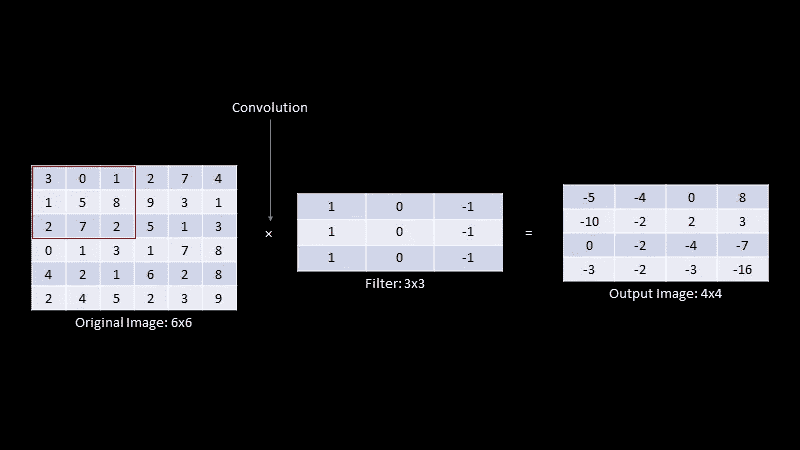
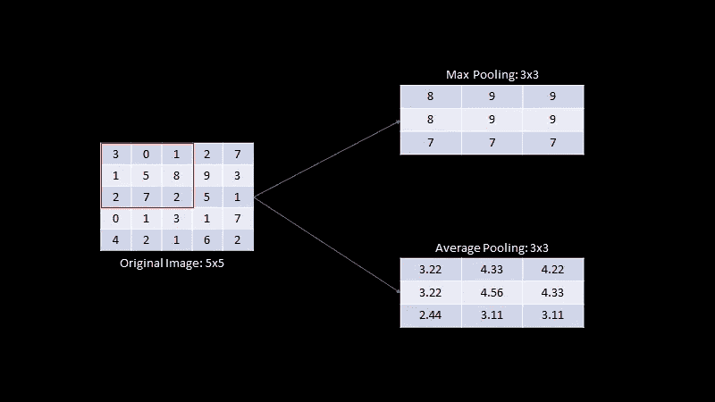
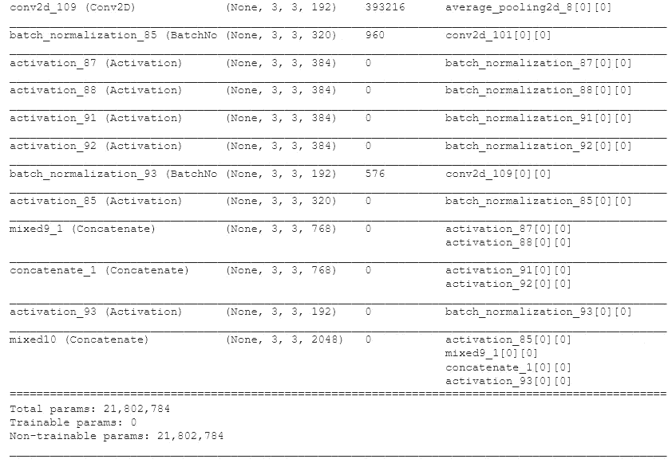

# 张量流计算机视觉

> 原文：<https://towardsdatascience.com/computer-vision-with-tensorflow-9f183636c4cc?source=collection_archive---------38----------------------->

## 关于我们如何编程机器从图像中学习的全面指南

精神岛之旅。作者图片

这将是《人工智能导论》、机器学习和深度学习 Tensorflow story 的延续，在那里我讨论了标准的神经网络。如果这对你来说是全新的，我建议你先从这里开始。

</introduction-to-artificial-intelligence-machine-learning-and-deep-learning-with-tensorflow-b5fa20477e89>  

# 目录:

1.  构建数字识别器
2.  发展数字识别器
3.  这是怎么回事？
4.  构建猫和狗的分类器

# 构建数字识别器

## MNIST 数据集

计算机视觉是使用神经网络学习图像结构的实践。当我们看一张图片，比如一件衬衫，我们怎么知道这是一件衬衫？我们可以通过识别衬衫的具体特征来识别它，比如衣领、形状或背景(这件衣服穿在哪里？)如图所示。这类似于我们希望机器也能够学习图像的方式——我们希望模型能够理解图像的空间上下文。

和以前一样，我们先从一个例子开始。我们可以从 Tensorflow 加载 MNIST 数据集，这是一个手写数字的大集合。

来自 MNIST 数据集的样本，[维基百科](https://en.wikipedia.org/wiki/MNIST_database)

作者图片

MNIST 数据库包含 60，000 幅训练图像和 10，000 幅测试图像，黑白图像被归一化以适合 28×28 的边界框。这意味着当您加载数据时，它会在一个列表中产生 60，000 个 28x28x1 项目，但模型中的第一层(卷积层)将需要一个 60，000x28x28x1 的单个 4D 列表，因此这就是我们重塑训练和测试图像的原因。

但是我们为什么要用 255.0 来划分图像呢？这样做是为了将图像的像素值归一化到 0 和 1 之间，这使得网络更容易学习最佳最小值。

现在来构建卷积神经网络。

## 我们的第一个卷积神经网络

作者图片

标准神经网络只有密集层，因此我们现在发现卷积神经网络有 3 个新层:Conv2D、MaxPooling2D 和 Flatten。这些层代表了这种类型的神经网络如何学习图像的空间特征。

我们将简要介绍各层的功能，但目前该模型能够通过移动过滤器扫描图像的像素，然后将其展平为一维阵列，使其类似于标准神经网络，最后通过密集层发送，就像非卷积网络一样——密集层有 128 个节点，输出层有 10 个节点。

最终输出层包含一个 softmax 激活，它生成十个目标类的概率(0-9 位数值),并预测概率最高的值。

作者图片

作者图片

由于这是一个分类任务，特别是多分类，我们将使用的损失函数是稀疏分类交叉熵。如果是二元分类，我们就用二元交叉熵。这与我们使用均方误差的回归任务相反。

当我们在训练集上达到可接受的精度时，我们可以像以前一样使用回调来停止训练。对看不见的数据进行评估的时间。

作者图片

作者图片

作者图片

作者图片

总的来说，模型表现很好，但是在验证集上稍差一些，所以可能出现了轻微的过度拟合。Dropout 是一种常用的技术，因此模型不会过于依赖给定的节点，这有助于避免过度拟合。简而言之，Dropout 是一种在给定层中随机删除一定比例的节点的方法，以迫使模型不要过于依赖任何给定的节点。

说到图像，还有另一种技术:图像增强。这包括旋转、宽度/高度移动、剪切、缩放、裁剪和翻转。在将数据拟合到您的模型之前，您可以轻松地添加这一步骤，它允许模型更有效地推广到新的示例。这背后的原因也很简单——如果你有一只狗的图像，但它们都是用腿站立的，那么一个模型可能会在狗仰卧的照片上表现得更差。图像增强有助于这一点，因为它提供了更多独特的图像方向供它学习。

让我们试着重建和发展我们最初的模型，看看我们能做些什么！

# 发展数字识别器

## 加载和预处理设置

作者图片

代码看起来与我们最初的模型一样，只是我们为训练和验证集添加了一个数据生成器，以在一定程度上增加图像(包括归一化像素值)。这里需要注意的一点是，我们不想增加测试数据，只增加训练数据。为什么会这样？我们希望模型能够推广到新的图片，这些图片通常不会像我们的增强图像那样扭曲；我们的扩充主要是为了让模型考虑到像素空间位置的变化。这也为我们的模型创建了一个更大的训练集来学习。

## 轻松提升复杂性

作者图片

使用层增加复杂性与使用标准神经网络一样容易，但这里的关键变化包括:

*   添加一个丢弃层，在输出前从隐藏层中随机丢弃 20%的节点
*   通过数据生成器收集训练/测试图像，这允许我们在训练模型时添加简单的预处理步骤，如图像增强
*   将批量大小设置为 64，这是在每个时期更新模型之前要处理的样本数。所以一次可以通过 64 幅图像。

该模型可以通过数据生成器轻松拟合，如下所示:

作者图片

作者图片

我降低了准确性阈值以节省计算和时间成本，但看看每个时期的训练/测试损失和准确性——该模型始终能够很好地推广到新数据。

# 这是怎么回事？

卷积神经网络由在图像的一部分上迭代以提取图像的全局和局部空间特征的滤波器组成。

作者图片

这表示在 6x6 图像上卷积 1 个大小为 3x3 的滤波器。我们经常使用 64 个大小为 5×5 的滤波器来卷积 28×28×1 的图像。实际上，每个单元格都乘以其对应的单元格，然后求和以获得新值(3*1+1*1+2*1+0*0…=-5)，然后过滤器移动 1，直到扫描完所有值。对于这些层中的每一层，模型都试图学习图像中类似于信号的有区别的全局和局部特征。通常，随着层数的增加，模型可以学习图像的更多具体特征。一个很好的例子是，扫描面部图像的模型的第一层可以学习面部的整体轮廓边缘，第二层可以学习面部内将眼睛从鼻子和嘴中区分出来的线条，第三层可以学习眼睛的更有区别的特征(形状、颜色、大小等)。)，等等。

这里需要注意的一点是，滤波器的值在很大程度上决定了输出图像中检测到的内容。如果滤波器中全是 0，输出图像也将全是 0，不会发生边缘检测。这些过滤器是 CNN 所学习的，因为它能够在每幅图像中提取有意义的、有区别的特征，这使得它能够尽可能地最小化关于目标标签的损失。

## 过滤器之外

您可能会注意到，在将滤镜通过原始图像后，输出图像会缩小。这种情况可能会逐步升级，因此如果您希望输出图像保持相同的大小，一种常见的技术是在原始图像周围填充一层 0。

此外，您可能不想让过滤器一次一列地通过图像。您可以跨越卷积来跳过原始图像中的两列或更多列。

然后我们也有池层。这些通常是最大或平均池层，它们通过获取图像某一部分的最大值或平均值来运行。

作者图片

通常情况下，最大池是这样做的，但这是一种保留可能在图像的一部分中的特征信号的方法。有趣的是，MaxPooling 并没有梯度下降的超参数可以学习。滤波器大小和跨距的固定值相应地应用于每个卷积层。在功能上，它是一种在图像的较小维度的图像区域中保留特征信息(通过高像素值指示的信号)的方式。

更复杂的是，我们经常处理彩色图像，而不是灰度图像。这通常意味着图像驻留在三维(RGB)中，因此我们不只是通过 2D 卷积，而是通过 RGB 像素值矩阵的三维卷积(例如，5x5x3)。

## 为什么是回旋？

当对图像进行操作时，在密集层上使用卷积层有两个主要好处:

1.  参数共享:在图像的一部分有用的特征检测器可能在图像的另一部分也有用(例如垂直或水平边缘检测器)
2.  连接的稀疏性:在每一层中，每个输出值只依赖于少量的输入

因此，我们有过滤器的大小，填充，步幅，池过滤器的大小，层数等。(甚至不包括训练大规模模型的计算和时间成本)-这是一个很大的跟踪量，更不用说编辑来测试什么工作得好，什么工作得不好！这就是一种叫做迁移学习的技术非常有用的地方。

迁移学习是站在巨人肩膀上的概念；您可以下载流行和成功的模型架构，以及它们的学习参数，冻结除输出层之外的所有层，并通过它运行您的数据以获得结果。这已被证明在各种领域产生了真正成功的结果，并且在使用深度神经网络架构时通常是首选。

我们可以将这一知识应用于猫和狗的分类器。

# 构建猫和狗的分类器

## 创建数据目录

Tensorflow 有很多方便的功能，可以很好地处理结构化目录。这首先要求我们在构建模型之前将图像加载到一个文件夹路径结构中。从技术上讲，如果您只关心建模部分，可以跳过这一小节，但是学习建模和非有效数据设计模式有点不切实际。

在加载到适当的目录之前，我们将加载谷歌的猫和狗的数据集。

作者图片

作者图片

这段代码将 Google 的猫狗数据集读入适当的目录。我们现在可以构建我们的预处理和数据流生成器。

## 预处理工作流

作者图片

以前，我们通过训练和测试分割来传输数据，这一次，我们可以简单地将它设置为从每个目录中传输。对于上下文，这仅在训练集中产生 2000 个图像，在测试集中产生 1000 个图像。现在是模型！

我们可以通过 InceptionV3 函数轻松地加载它，并限定我们也需要权重。通过层的循环，我们可以将它们的可训练标志设置为假。

## 摘樱桃盗梦空间网络

初始模型最后一层的快照。作者图片

这个模型相当庞大，如果你想了解更多关于盗梦空间网络的内容，我推荐你去看看这个网站:[盗梦空间-v3 网络解释](https://paperswithcode.com/method/inception-v3#:~:text=Inception%2Dv3%20is%20a%20convolutional,use%20of%20batch%20normalization%20for)

作者图片

我们可以采用初始网络的输出层，然后像以前一样添加 Flatten()、Dense()和 Dropout 输出层的最后几个标准层。由于这是一个二元分类(猫或狗)，我们在输出中只需要一个具有 sigmoid 激活函数的节点，以及用于损失函数的二元交叉熵。

作者图片

作者图片

由于数据集很小，我显著降低了历元数和每个历元的步数，但模型仍然表现得非常好。在一个时期内，我们看到大约 96%的准确性。

# 包裹

今天讨论了很多内容，但我试图在这里提供一个全面的入门指南，介绍计算机视觉的迷人世界。许多概念都建立在这里提到的主题上，包括创造人工智能艺术，使自动驾驶汽车能够“看见”，从 X 射线或 fMRI 扫描中提取模式等等。

我将有后续文章，将在此学到的知识应用于我感兴趣的数据集，但现在感谢您的阅读！请关注更多关于数据科学、机器学习和人工智能的内容。

**参考文献**

[1]深度学习。人工智能，[卷积神经网络](https://www.coursera.org/learn/convolutional-neural-networks/home/welcome)

【2】深度学习。AI，[tensor flow 中的卷积神经网络](https://www.coursera.org/learn/convolutional-neural-networks-tensorflow/home/welcome)