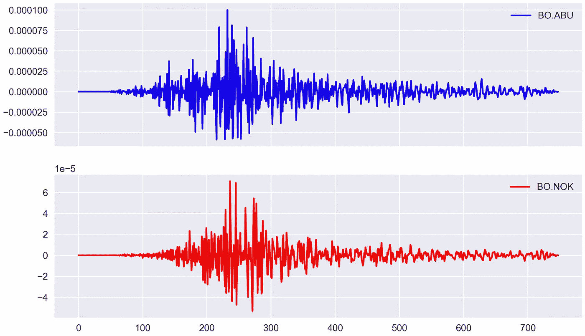
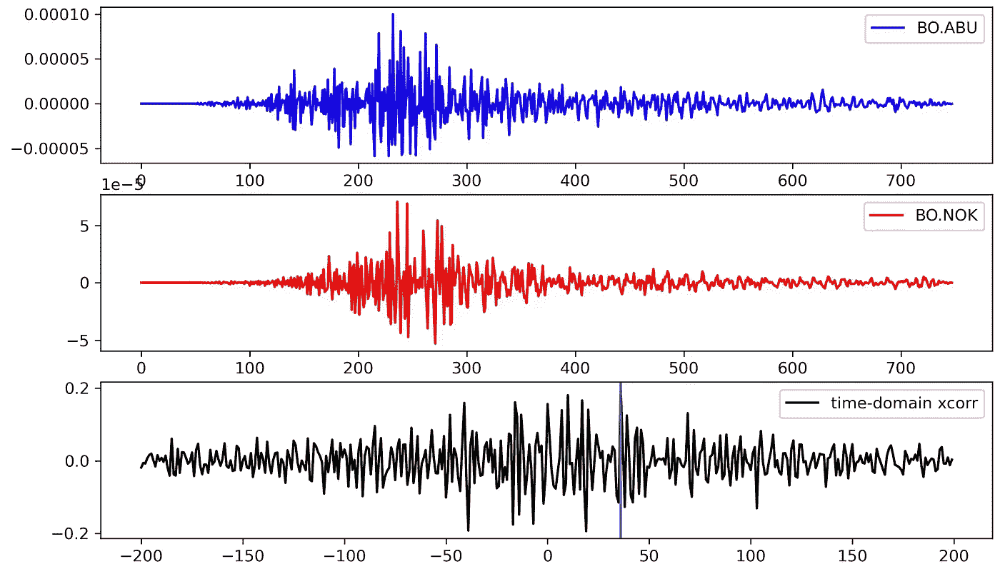
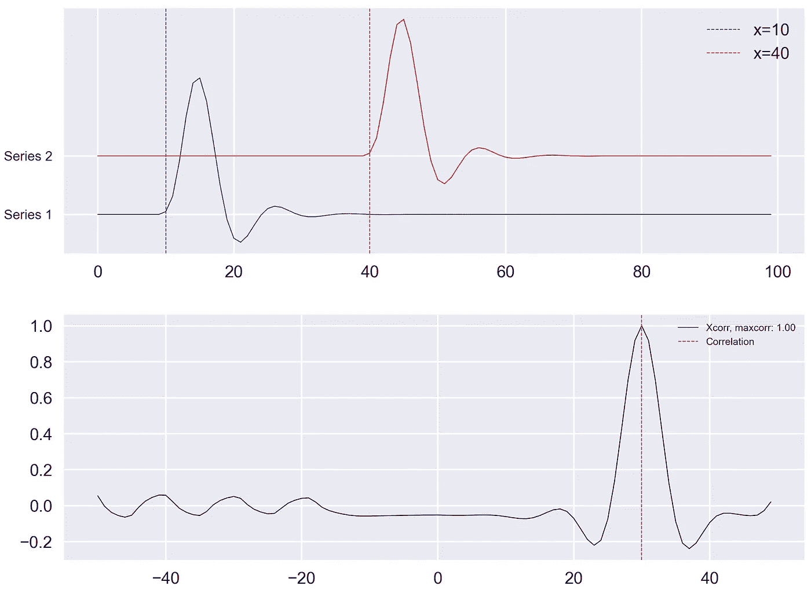

# 计算和可视化时间和频率相关性的简单方法

> 原文：<https://towardsdatascience.com/computing-cross-correlation-between-geophysical-time-series-488642be7bf0?source=collection_archive---------1----------------------->

互相关是计算两个地震时间序列相互依赖程度的一个公认的可靠工具。一些研究依赖于互相关方法来获得对地震数据的推断。关于互相关方法的细节，我们让读者参考以前的工作(见参考文献)。


来自 [Pexels](https://www.pexels.com/photo/black-blue-and-red-graph-illustration-186461/?utm_content=attributionCopyText&utm_medium=referral&utm_source=pexels) 的照片

为了从我们的数据中获得有意义的推断，理解和识别两个时间序列之间的复杂和未知的关系是至关重要的。在本帖中，我们将采用地球物理数据进行理解。对于一般读者，我建议忽略特定领域的示例，继续阅读，因为相关性的概念是数学上的，可以应用于与任何领域相关的数据。

相关性不是因果关系[来源:GIPHY]

在地球物理学(具体来说是地震学)中，一些应用是基于寻找一个时间序列相对于另一个时间序列的时移，例如环境噪声互相关(寻找两个记录站之间的经验格林函数)、震源反演(例如 gCAP)和结构研究(例如全波形反演)、模板匹配等。

在本文中，我们将了解如何计算地震时间序列之间的互相关，以及如何在时域和频域中提取两个地震信号之间关系的时移信息。请注意，除非数据的自由度很高，否则相关值并不显著。详情请参考下面的帖子。

[](https://www.earthinversion.com/geophysics/estimation-degrees-of-freedom/) [## 时间序列自由度的估计

### 两个(真实)随机过程 A 和 B 之间的相关性，这两个过程被采样为两个(真实)时间序列，A(t)和…

www.earthinversion.com](https://www.earthinversion.com/geophysics/estimation-degrees-of-freedom/) 

此外，人们可以使用蒙特卡罗模拟等数值测试来估计相关性的显著性。参考下面的帖子:

[](https://www.earthinversion.com/techniques/monte-carlo-simulations-correlations/) [## 蒙特卡罗模拟来测试两个数据集之间的相关性[MATLAB]

### 蒙特卡罗模拟(MCS)可用于从数据集中提取重要信息，而这是不可能的…

www.earthinversion.com](https://www.earthinversion.com/techniques/monte-carlo-simulations-correlations/) 

# 计算互相关

现在让我们看看如何计算两个时间序列之间的时域互相关。为了这个任务，我任意选取了两个地震速度时间序列:

# 任意选择的数据

```
import numpy as np
import matplotlib.pyplot as plt
import pandas as pd
from synthetic_tests_lib import crosscorr

time_series = ['BO.ABU', 'BO.NOK']
dirName = "data/"
fs = 748  # take 748 samples only
MR = len(time_series)
Y = np.zeros((MR, fs))
dictVals = {}
for ind, series in enumerate(time_series):
    filename = dirName + series + ".txt"
    df = pd.read_csv(filename, names=[
                     'time', 'U'], skiprows=1, delimiter='\s+')  # reading file as pandas dataframe to work easily

    # this code block is required as the different time series has not even sampling, so dealing with each data point separately comes handy
    # can be replaced by simply `yvalues = df['U]`
    yvalues = []
    for i in range(1, fs+1):
        val = df.loc[df['time'] == i]['U'].values[0]
        yvalues.append(val)

    dictVals[time_series[ind]] = yvalues

timeSeriesDf = pd.DataFrame(dictVals)
```

上述代码读取包含位于目录(`dirName`)中的垂直分量的 txt 文件，并为任意获取的`fs`样本修剪数据。我们可以交互地读取每个`txt`文件，并将数据列保存到字典中。该字典接下来被转换成“熊猫”数据框架，以利用“熊猫”库中的所有工具。

请注意，有几种不同的方式来读取数据，这种方式的偏好取决于用户和数据格式。

为了绘制时间序列，我使用了`matplotlib`。

```
# plot time series
# simple `timeSeriesDf.plot()` is a quick way to plot
fig, ax = plt.subplots(2, 1, figsize=(10, 6), sharex=True)
ax[0].plot(timeSeriesDf[time_series[0]], color='b', label=time_series[0])
ax[0].legend()
ax[1].plot(timeSeriesDf[time_series[1]], color='r', label=time_series[1])
ax[1].legend()
plt.savefig('data_viz.jpg', dpi=300, bbox_inches='tight')
plt.close('all')
```



数据可视化(图片由作者提供)

# 计算时域中的互相关

```
d1, d2 = timeSeriesDf[time_series[ind1]], timeSeriesDf[time_series[ind2]]
window = 10
# lags = np.arange(-(fs), (fs), 1)  # uncontrained
lags = np.arange(-(200), (200), 1)  # contrained
rs = np.nan_to_num([crosscorr(d1, d2, lag) for lag in lags])

print(
    "xcorr {}-{}".format(time_series[ind1], time_series[ind2]), lags[np.argmax(rs)], np.max(rs))
```

在上面的代码中，我使用了`crosscorr`函数来计算一系列滞后值的时间序列对之间的相关性。滞后值被限制在-200 到 200 之间，以避免伪影。

```
# Time lagged cross correlation
def crosscorr(datax, datay, lag=0):
    """ Lag-N cross correlation. 
    Shifted data filled with NaNs 

    Parameters
    ----------
    lag : int, default 0
    datax, datay : pandas.Series objects of equal length
    Returns
    ----------
    crosscorr : float
    """
    return datax.corr(datay.shift(lag))
```

这里，正如你所注意到的，crosscorr 使用了 [pandas corr 方法](https://pandas.pydata.org/pandas-docs/stable/reference/api/pandas.DataFrame.corr.html)；因此，d1 和 d2 需要是“熊猫”系列对象。

我得到了上述时间序列对之间的相关性为`0.19`，滞后为`36`。

```
xcorr BO.ABU-BO.NOK 36 0.19727959397327688 
```



任意取真实时间序列的时域互相关(图片由作者提供)

# 获取时移的互相关频域方法

```
shift = compute_shift(
    timeSeriesDf[time_series[ind1]], timeSeriesDf[time_series[ind2]])

print(shift)
```

这给出了`-36`

其中函数`compute_shift`简单来说就是:

```
def cross_correlation_using_fft(x, y):
    f1 = fft(x)
    f2 = fft(np.flipud(y))
    cc = np.real(ifft(f1 * f2))
    return fftshift(cc)

def compute_shift(x, y):
    assert len(x) == len(y)
    c = cross_correlation_using_fft(x, y)
    assert len(c) == len(x)
    zero_index = int(len(x) / 2) - 1
    shift = zero_index - np.argmax(c)
    return shift
```

这里，`shift`的移动意味着`y`在`x`之前的`shift`时间步开始。

# 生成时间序列的合成对

虽然所获得的结果看似合理，但由于我们使用了任意一对实时序列，我们不知道我们是否获得了正确的结果。因此，我们将上述方法应用于具有已知时移的时间序列的合成对。

让我们使用`scipy.signal`函数生成一个双单位脉冲函数。然后，我们应用一个中心频率为 0.2 的 4 阶低通滤波器来平滑边缘(注意，即使没有滤波器，结果也是一样的)。

```
# Delta Function
length = 100
amp1, amp2 = 1, 1
x = np.arange(0, length)
to = 10
timeshift = 30
t1 = to+timeshift
series1 = signal.unit_impulse(length, idx=to)
series2 = signal.unit_impulse(length, idx=t1)

# low pass filter to smoothen the edges (just to make the signal look pretty)
b, a = signal.butter(4, 0.2)
series1 = signal.lfilter(b, a, series1)
series2 = signal.lfilter(b, a, series2)

fig, ax = plt.subplots(2, 1, figsize=(8, 6), sharex=False)

ax[0].plot(x, series1, c='b', lw=0.5)
ax[0].axvline(x=to, c='b', lw=0.5,
              ls='--', label=f'x={to}')
ax[0].plot(x, series2+0.1, c='r', lw=0.5)
ax[0].axvline(x=to+timeshift, c='r', lw=0.5,
              ls='--', label=f'x={to+timeshift}')
ax[0].set_yticks([0, 0.1])
ax[0].legend()
ax[0].set_yticklabels(['Series 1', 'Series 2'], fontsize=8)

d1, d2 = pd.Series(series2), pd.Series(series1)
lags = np.arange(-(50), (50), 1)

rs = np.nan_to_num([crosscorr(d1, d2, lag) for lag in lags])
maxrs, minrs = np.max(rs), np.min(rs)
if np.abs(maxrs) >= np.abs(minrs):
    corrval = maxrs
else:
    corrval = minrs

ax[1].plot(lags, rs, 'k', label='Xcorr (s1 vs s2), maxcorr: {:.2f}'.format(
    corrval), lw=0.5)
# ax[1].axvline(x=timeshift, c='r', lw=0.5, ls='--')
ax[1].axvline(x=lags[np.argmax(rs)], c='r', lw=0.5,
              ls='--', label='max time correlation')
ax[1].legend(fontsize=6)
plt.subplots_adjust(hspace=0.25, wspace=0.1)
plt.savefig('xcorr_fn_delta.png', bbox_inches='tight', dpi=300)
plt.close('all')
```



低通滤波单位冲激函数的时域互相关(图片由作者提供)

# 参考

1.  晁，B.F .，钟，C.H，2019。估计一个数据集与另一个数据集的互相关和最小二乘拟合。地球物种。Sci。6, 1409–1415.https://doi.org/10.1029/2018EA000548
2.  罗宾逊和特雷特尔(1980 年)。*地球物理信号分析*。新泽西州恩格尔伍德克利夫斯:普伦蒂斯-霍尔。
3.  [使用快速归一化互相关的模板匹配](https://www.spiedigitallibrary.org/conference-proceedings-of-spie/4387/1/Template-matching-using-fast-normalized-cross-correlation/10.1117/12.421129.short?SSO=1)
4.  [庆开博客:“信号处理:频域互相关”](http://qingkaikong.blogspot.com/2016/10/signal-processing-cross-correlation-in.html)
5.  [如何计算 Python 中变量之间的相关性](https://machinelearningmastery.com/how-to-use-correlation-to-understand-the-relationship-between-variables/)

# 下载代码

以上所有代码可从我的 [Github repo](https://github.com/earthinversion/geophysical-cross-correlation.git) 下载。

*原为 2021 年 2 月 16 日在*[*https://www.earthinversion.com*](https://www.earthinversion.com/geophysics/computing-cross-correlation-between-seismograms/)*发表。*