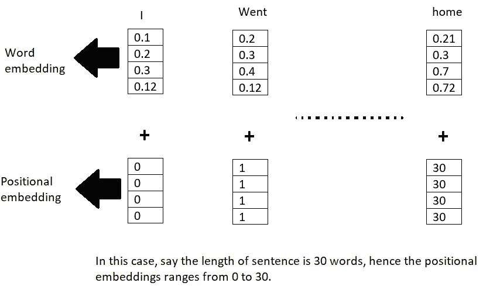
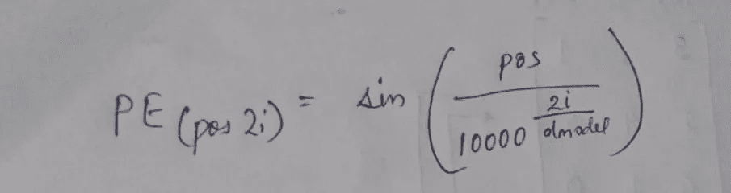
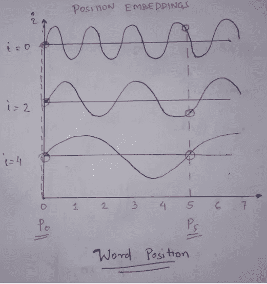
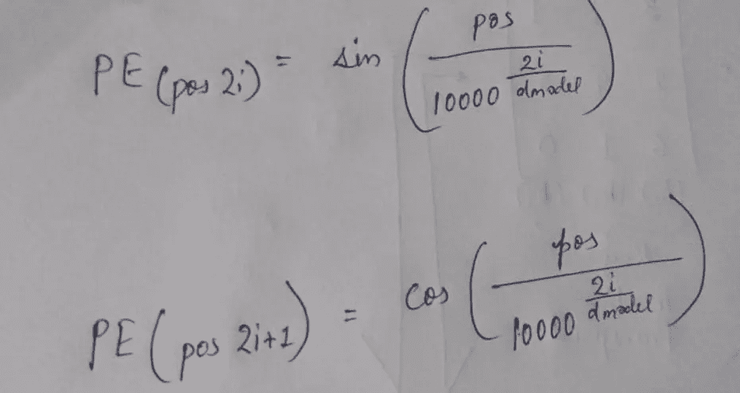
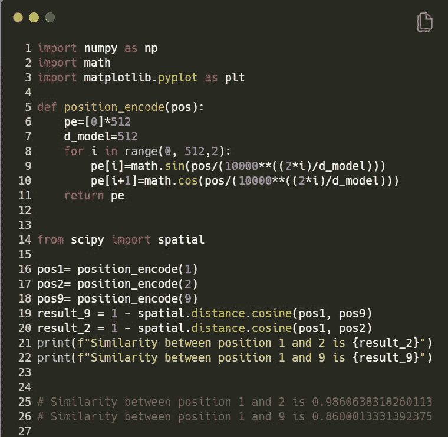
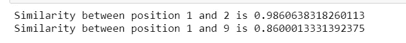

# 您可能不知道的位置编码概念

> 原文：<https://towardsdatascience.com/concepts-about-positional-encoding-you-might-not-know-about-1f247f4e4e23?source=collection_archive---------9----------------------->

## 关于 Transformer 中的位置编码，您只需要知道

在 [Unsplash](https://unsplash.com/s/visual/738f86ea-52ed-4701-9cca-9f8198fa1674?utm_source=unsplash&utm_medium=referral&utm_content=creditCopyText) 上由 [corina ardeleanu](https://unsplash.com/@corina?utm_source=unsplash&utm_medium=referral&utm_content=creditCopyText) 拍摄的照片

在 LSTM RNN，单词是按顺序输入的，因此它能理解单词的顺序。随着刑期的增加，在 LSTM 复发将需要大量手术。但是在 transformer 中，我们并行处理所有的单词。这有助于减少培训时间。为了记住单词的顺序，引入了位置编码的概念。这是一种表示单词位置的编码。简而言之，我们将位置编码添加到现有的单词嵌入中，这将为我们提供最终的预处理嵌入，它将用于编码器部分。

**注意:-** 在开始这篇博文之前，我强烈推荐访问我之前关于变形金刚 概述的 [**博文。**](/transformers-you-just-need-attention-f3775734c0da)

## 位置嵌入的不同技术:-

1.  **位置嵌入=单词索引**

在这种情况下，如果句子的长度是 30。那么对应于每个单词，索引号可以是它的位置嵌入，如下图所示:-

在这种情况下，如果句子的长度是 30。那么对应于每个单词，索引号可以是它的位置嵌入，如下图所示:-

位置嵌入和单词嵌入相加得到最终嵌入**(作者的**图片)

我们可以使用这种编码方式，但问题是随着句子长度的增加，位置嵌入的大值支配了原始单词嵌入，因此扭曲了单词嵌入的值。因此，我们在自然语言处理任务中放弃了这种方法。

**2。位置=句子长度的分数。**

如果我们将嵌入值转换为长度的一部分，即 1/N，其中 N=字数，它应该可以工作，因为值将被限制在 0 和 1 之间。这里唯一的漏洞是，当我们比较两个不同长度的不同句子时，对于一个特定的索引，位置嵌入值是不同的。一般来说，对于不同长度的句子，位置词嵌入对于特定的索引应该具有相同的值，否则会扭曲对模型的理解。因此，对于我们的自然语言处理任务，我们放弃了这种方法，而采用基于频率的位置编码方法，正如在原始论文“注意力是你所需要的全部”中提到的。

**3。基于频率的位置嵌入**

该论文的作者提出了一个独特的想法，即使用波频率来捕捉位置信息。

正弦函数(图片由作者提供)

对于第一位置嵌入，

位置=0

d=嵌入的大小，应等于现有嵌入的尺寸。

i=每个位置嵌入维度的索引，也表示频率(i=0 是最高频率)

位置嵌入(作者图片)

在第一个正弦曲线图中(其中 i=4)，我们绘制了具有不同位置值的正弦曲线，其中位置表示单词的位置。由于正弦曲线的高度取决于 x 轴上的位置，我们可以使用高度来绘制单词位置。由于曲线高度以固定长度变化，且不依赖于文本长度，这种方法有助于克服前面讨论的限制。请查看这个令人敬畏的[视频](https://www.youtube.com/watch?v=dichIcUZfOw&t=606s)了解更多。

值介于-1 和 1 之间。并且随着长度的增加，位置编码值保持不变。但是在从下面看的平滑正弦曲线中(其中 i=4)，我们看到 y 轴上的**字位置 0** 和**字位置 5** 的距离非常小。为了克服这一点，我们提高了频率(freq =秒内完成的周期数)。如果我们这样做，那么在上面的第一条正弦曲线(i=0)中，我们看到**位置 0** 和**位置 5** 之间的距离清晰可见。

作者使用了正弦和余弦函数的组合来获得这些嵌入。

波频(图片由作者提供)

让我们编码这个

用于生成位置嵌入的代码(图片由作者提供)

输出预览为:-

以上代码输出(图片由作者提供)

这里我们可以看到第一个和第二个单词的接近度/紧密度很高，因此余弦相似度很高，而第一个和第九个单词之间的距离很远，因此余弦相似度很低。

这就是位置编码，如果你喜欢，可以和你的朋友分享。在那之前，