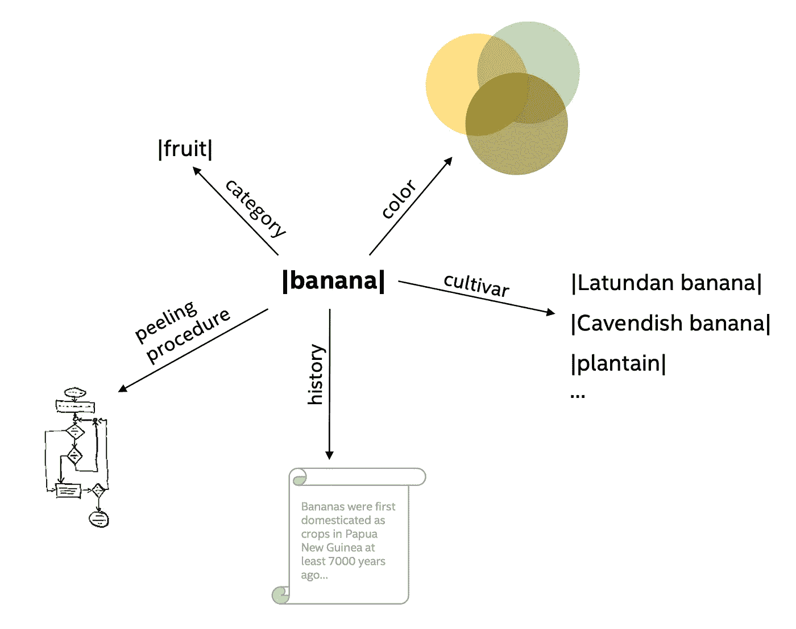
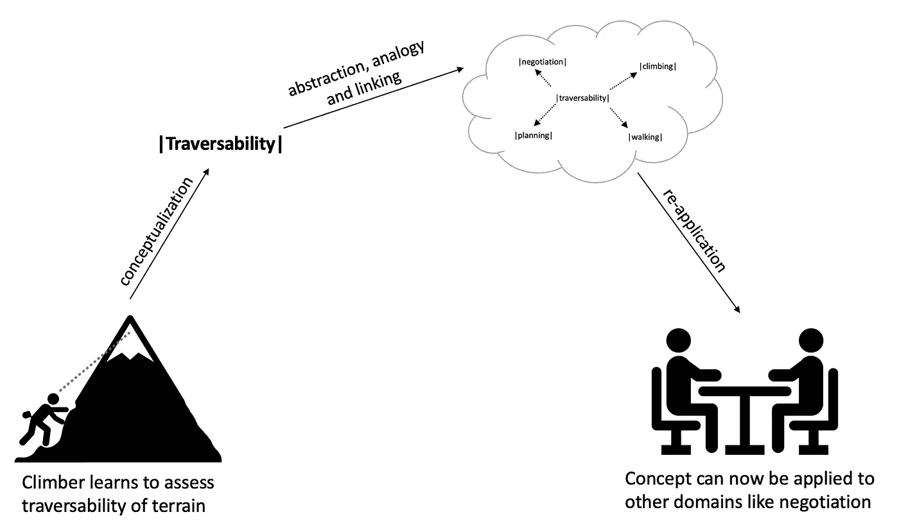
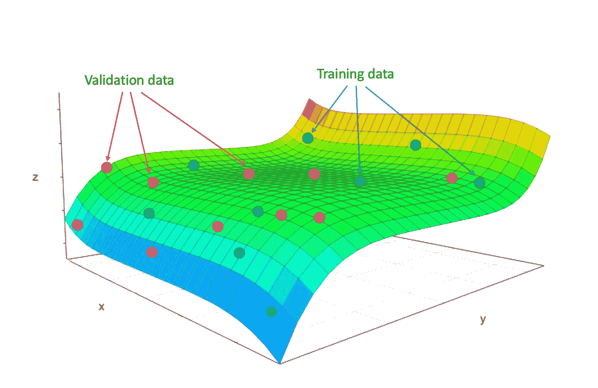
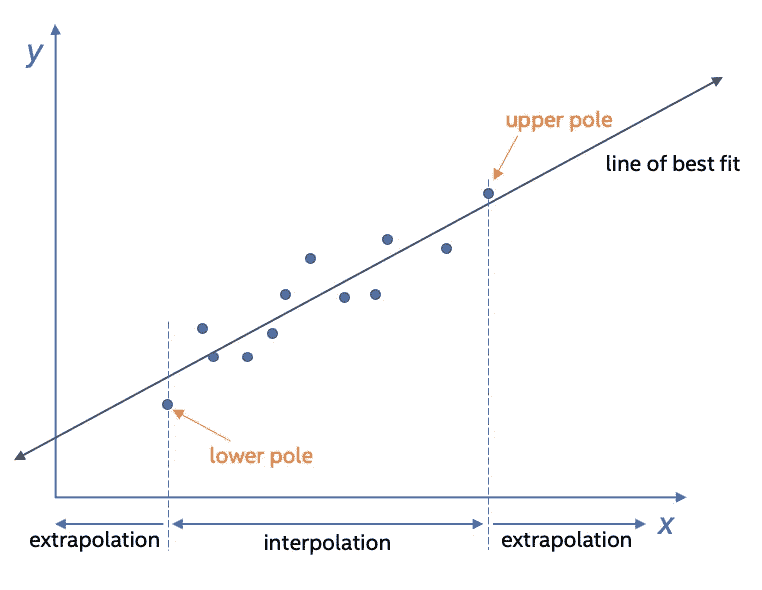

# 概念化是认知的基础——人类和机器

> 原文：<https://towardsdatascience.com/conceptualization-as-a-basis-for-cognition-human-and-machine-345d9e687e3c?source=collection_archive---------14----------------------->

## 机器理解和认知人工智能的缺失环节

图片由[杰基·尼亚姆](https://stock.adobe.com/contributor/205704611/jackie-niam?load_type=author&prev_url=detail)在[土坯股票](https://stock.adobe.com/)上提供

虽然大多数当代对人工智能能力的讨论和分类都围绕着一个系统能够*做什么*，但我相信通向更高智能和机器认知的[道路依赖于一个系统能够*知道和理解什么*](/the-rise-of-cognitive-ai-a29d2b724ccc?gi=eb01b15e836) 。使用丰富的人工智能知识表示框架和全面的世界模型可以增加人工智能系统将信息转化为深层知识、理解和功能的能力。为了追求更好的人工智能，理解“理解”对人脑的真正意义是必不可少的。这样做可以实现框架，通过将建模和概念化与数据和任务概括相结合，使机器学习能够平行于人类理解。

**概念化:人类思维的基础**

[概念](https://www.dictionary.com/browse/concept)是人类思维中最基本的积木。概念是我们思考的对象的本体论根源。概念代表一个对象类的一组持久的基本属性，这些属性可以随着经验而改变和扩展。现有的概念可以被抽象或通过类比链接到附加的域和对象类。概念的例子包括|狗|、|民主|、|白|和|大叔|。物理或精神对象可以存储为一个概念，并随着时间的推移积累更多的数据和属性(例如|我的幸运狗|和|白雪公主|对|灰白色|)。即使所指对象是不可见的或抽象的，如|love|，它仍然可以作为一个概念存储。我们对世界的理解依赖于概念、概念的属性以及概念之间的关系。我们用概念和由概念组成的事实以及它们之间的关系来构建我们的世界模型。

概念是独特的，因为它们可以包含代理可用的任何类型的信息，并且可以在没有先验知识的情况下形成。想象一下，走进教室，老师说，“今天，我们将学习格查尔。”一个新概念的占位符已经在学生的头脑中形成，除了名称之外没有任何信息。“这是一只小小的热带鸟，”老师继续说道。大量可能的信息现在被添加到这个概念中——它可能非常丰富多彩，可能生活在森林中，并发出有趣的声音。概念具有弹性和持久性，弹性是有界限的，不允许概念变得面目全非。

概念的存在与描述它们的语言相关，但又独立于它们。例如，单词“dog”是概念|dog|的属性(有时称为标记)。即使你用一个不同的词来形容邻居院子里让你睡不着觉的毛茸茸的东西，它仍然是一只|狗。

作为另一个例子，概念|banana|可以从代表香蕉的各种图像的抽象特征开始——绿色的或成熟的、整个的或切片的、单独的或与其他物体相互作用的。概念|香蕉|还可以包括历史和故事(香蕉叶裙、香蕉船)、价值观(营养)、在餐桌上坐几天后的成熟程度，或者它的内涵(香蕉)。在地球上的大多数语言中，香蕉这个概念都是由一个名称来表示的，但它并不是这些名称中的任何一个。

在提出的 6 个知识维度的[模型中，一个概念被捕获为一个抽象的概念引用(第 6 个维度),它链接了该概念的所有实例化和引用。它指的是多模式方面，如视觉表现、成熟水果的气味、剥皮时的感觉(对于具有触觉功能的系统)、咬一口时的声音和味道等等。它将有多方面的知识:描述性的，包括分类法和事实；程序性的，包括怎么剥，怎么吃；关于其遗产的故事；与拥有或失去它相关的价值；等等。](/understanding-of-and-by-deep-knowledge-aac5ede75169)

1.香蕉的概念。

创造概念的过程——[概念化](https://en.wikipedia.org/wiki/Conceptualization_(information_science))——以三种方式之一发生:

**教官指导。对人类来说，这包括向老师学习——例如，钢琴教师、生物学教授或足球教练。用机器学习的术语来说，这将是利用标记信息或来自系统设计者的直接输入的监督学习。**

**自导自演。**人类通过观察结构良好的概念并将其内化来练习被动概念化。例子包括阅读一本介绍和描述新术语的书，观看两个人打排球，通过观察推断规则和目标。对于机器学习系统来说，这将是获取广泛可用的文本或观看描述和命名概念的视频，以便填充概念数据结构。

**内部。**这些都是通过分析你的现状而形成的概念，或隐或显。例如，攀岩者评估哪些路径是可航行的，哪些是太难的。从这个评估中，形成了|可通过性|的概念(参见图 2 中的例子)。同样，科学家仔细观察，将经验提炼到理论和概念框架中。对于机器学习系统来说，这将是自我发现(识别一个可以有效地模拟人工智能系统所看到的世界的抽象)。

*2。抽象和类比允许概念在新的领域中重新应用。*

关于如何概念化有许多，通常是相互矛盾的定义和理论。对于未来的人工智能系统，可以提供以下概念化的**定义:*在世界观知识框架内抽象和发展丰富概念结构的能力，以促进广泛的推理并产生新的知识和技能。***

**概括是认知人工智能的必要但不充分的属性**

可以说 t *oday 的深度学习忽略了概念，将泛化作为 AI 的终极目标。这种方法可能会导致认知机器学习的能力范围有限。机器学习系统必须学会概念化，以达到创造具有更高智能的机器的目标。*

为了证实这一说法，让我们首先检查人工智能中的泛化在人工智能/机器学习的上下文中具体意味着什么(相对于外行人对该术语的使用)，然后探索它与概念化有何不同。

**泛化概述:**在机器学习中，[泛化](https://deepai.space/what-is-generalization-in-machine-learning/)是指经过训练的模型对未知数据进行分类或预测的能力。一般化的模型通常适用于所有看不见的数据子集。

古德费勒、本吉奥和库维尔[讨论过拟合和欠拟合的概念](https://www.deeplearningbook.org/)。他们指出，对于机器学习算法来说，在新的、以前看不到的输入上表现良好是多么具有挑战性，这是泛化问题的核心。增加新的维度或抽象超出了这种概括观点的范围。例如，机器学习模型可以学习正确分类质数和非质数。然而，要得出一个类似于人类数学家对素数的抽象定义是不太可能的。

*3。一个通用的算法学习一个既适合训练数据又适合验证数据的流形。*

概括的两个重要方面是**插值**和**外推**。[插值](https://en.wikipedia.org/wiki/Interpolation)在数学上定义为一种估计，一种在一组离散的已知数据点范围内构造新数据点的方法。[外推](https://en.wikipedia.org/wiki/Extrapolation)定义为基于一个变量与另一个变量的关系，对该变量的值进行超出原始观察范围(训练集)的一种估计。[在机器学习](/real-artificial-intelligence-understanding-extrapolation-vs-generalization-b8e8dcf5fd4b)中，外推是一个在特定数据范围内训练的系统，可以预测不同范围的数据。

*4。外推和内插是概括的重要方面。*

Francois Chollet [将泛化的概念从数据扩展到任务](https://arxiv.org/pdf/1911.01547.pdf)。在他看来，一个系统的智能是通过其获得基于概括难度的任务技能的能力来衡量的:

*系统的智能是对其在任务范围内技能获取效率的度量，与先验、经验和概括难度有关。*

在他的模型中，Chollet 代表了执行任务能力方面的所有概括水平。

与概括不同，概念不一定与任务直接相关。一个人可以形成一个概念，而不用把它和一个任务联系起来。因此，智力的潜在方面可以用适用于目前未知任务的内在概念来表示。概念不一定只能通过任务中表现出来的行为来理解。

**现在的 AI 还不能说是执行概念化:**首先需要注意的是，概念化并不等同于分类。在机器学习中，[分类指的是预测建模问题](https://machinelearningmastery.com/types-of-classification-in-machine-learning/)，其中为输入数据的给定示例预测类别标签。相比之下，概念是一组丰富的、多方面的相关知识，可以不断扩展。

以下标准定义了概念形成的范例，根据该范例，当前的机器学习算法不概念化:

**容量和多样性**。一个概念首先由它的本质来定义，然后由它的细节来进一步修饰。一个概念并不固有地局限于一组特定的描述符或值，而是可以累积几乎无限的维度——可以把它想象成一块海绵，随着时间和经验吸收相关的知识。例如，报名参加表观遗传学第一堂课的生物学学生可能对该领域一无所知，除了模糊地认识到它听起来类似于“遗传学”。随着时间的推移，随着学生了解朊病毒、核小体定位、糖尿病对巨噬细胞行为的影响、抗生素改变谷氨酸受体活性等，这个曾经非常稀疏的概念将变得更加多面化。这个例子与深度学习形成对比，在深度学习中，令牌或对象具有固定数量的维度。

**坚持**。一个概念保持不变，即使它的部分或大部分属性可以改变。相比之下，机器学习中令牌或对象的嵌入是由对象的维度(属性)来定义的。假设属性通过附加训练改变，潜在空间嵌入改变，并且潜在地，到其他嵌入向量的距离改变。在不改变固有概念的情况下，概念驱动的知识表示中的属性可能会有实质性变化，因为它反映在知识库中(例如，它在本体中的位置或与其历史的关联)。例如，一名律师可以[卖掉他的法拉利，成为一名僧侣](https://www.amazon.com/Monk-Who-Sold-His-Ferrari/dp/0062515675/ref=sr_1_2?dchild=1&keywords=lawyer+who+sold+his+ferrari&qid=1630712947&sr=8-2)，改变他的大部分外在属性，但仍然是同一个人。当映射到基于特征的嵌入空间时，由于人工智能系统观察到的维度特征的变化，概念可能会移动。然而，使它成为一个特定概念的本质很可能不会改变。

**抽象。**这包括提供抽象的信息组织及其含义的能力，这种能力可以应用于完全不同的领域，与它所来自的数据领域无关。在处理|可通过性|的概念时，我们在博客前面介绍过，它可能是在攀岩经历中学到的。尽管如此，这一概念的抽象和属性允许它应用于一个完全不同的领域/空间，例如玩一个风险游戏或考虑联系其中最终能修好你的笔记本电脑的人。这种比深度学习的拟合功能高得多的抽象层次——以及跨不同空间识别类比和概念相似性的能力——是深度学习泛化实践所无法实现的“概念”的主要区分因素。

**结论**

一个系统吸收数据、抽象数据、扩展概念、增强内部建模能力和推理能力的能力是衡量智能的主要标准。与此同时，对学习任务的衡量表现是一种滞后的措施。一种将底层建模和知识表示(包括概念化)与数据和任务概括相集成的方法，将有可能为总体上更高的机器智能提供更好的途径。

## **参考文献**

歌手 g(2021 a，4 月 6 日)。*认知人工智能的崛起——走向数据科学*。中等。[https://towards data science . com/the-rise-of-cognitive-ai-a 29 D2 b 724 CCC](/the-rise-of-cognitive-ai-a29d2b724ccc)

歌手 g(2021 年 5 月 6 日)。*对深度知识的理解和运用——走向数据科学*。中等。[https://towards data science . com/understanding-of-and-by-deep-knowledge-aac5 ede 75169](/understanding-of-and-by-deep-knowledge-aac5ede75169)

维基百科贡献者。(2020 年 12 月 9 日)。*概念化(信息科学)*。维基百科。[https://en . Wikipedia . org/wiki/概念化 _(信息 _ 科学)](https://en.wikipedia.org/wiki/Conceptualization_(information_science))

墨菲(2004 年)。*概念的大书*。布拉德福德的书。

*什么是机器学习中的泛化？* (2021 年 2 月 25 日)。deepai . space .[https://deepai . space/什么是机器学习中的泛化/](https://deepai.space/what-is-generalization-in-machine-learning/)

印第安纳州古德费勒、纽约州本吉奥和库维尔(2016 年)。*深度学习*。阿姆斯特丹大学出版社。

f . chollet(2019)。论智力的衡量。 *ArXiv，abs/1911.01547* 。

维基百科贡献者。(2021 年 8 月 31 日)。*插补*。维基百科。https://en.wikipedia.org/wiki/Interpolation

维基百科贡献者。(2019 年 8 月 21 日 a)。*外推*。维基百科。[https://en.wikipedia.org/wiki/Extrapolation](https://en.wikipedia.org/wiki/Extrapolation)

布朗利，J. (2020 年 8 月 19 日)。*机器学习中的 4 类分类任务*。机器学习精通。[https://machine learning mastery . com/types-of-class ification-in-machine-learning/](https://machinelearningmastery.com/types-of-classification-in-machine-learning/)

叶，A. (2020 年 6 月 26 日)。*真正的人工智能:理解外推 vs 概括*。中等。[https://towards data science . com/real-artificial-intelligence-understanding-extrapolation-vs-generalization-b 8e 8 DC F5 FD 4b](/real-artificial-intelligence-understanding-extrapolation-vs-generalization-b8e8dcf5fd4b)

Sharma，R. (1999 年)。*卖掉自己法拉利的和尚*。哈珀柯林斯。

*Gadi Singer 是英特尔实验室副总裁，认知计算研究总监。*