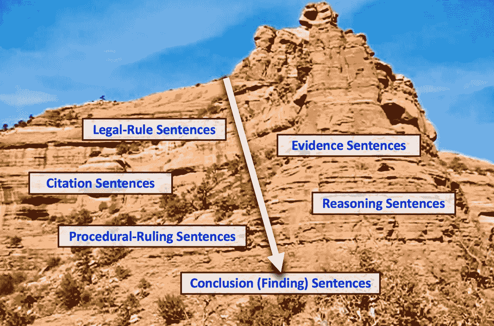
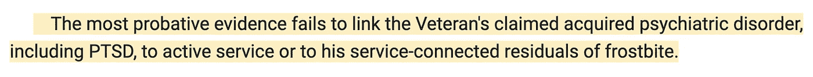
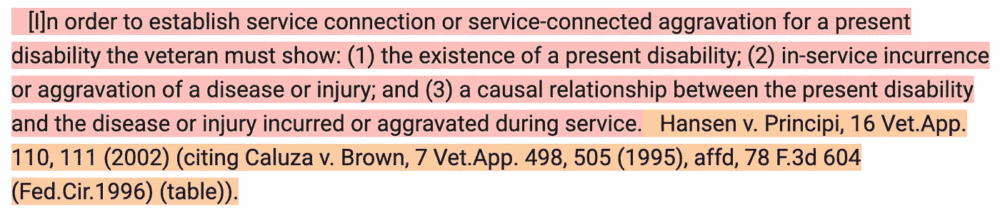
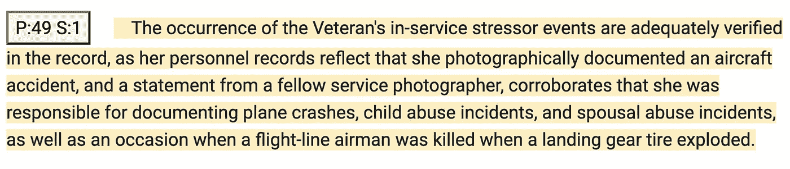
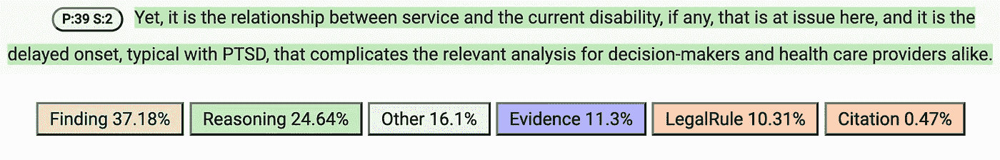
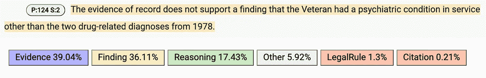

# 结论作为挖掘法律推理的锚

> 原文：<https://towardsdatascience.com/conclusions-as-anchors-for-mining-legal-reasoning-6f837fb8da3c?source=collection_archive---------28----------------------->

## [思想和理论](https://towardsdatascience.com/tagged/thoughts-and-theory)

## 通过检测结论来定位推理

图像由弗恩 r .沃克， [CC 由 4.0](https://creativecommons.org/licenses/by/4.0/) 。

数据科学中的一个挑战性问题是[从法律判决文件](/7-challenges-for-argument-mining-in-law-fb98a6df7b0c)中挖掘推理。为了在整个文件中找到这种推理，我们可以利用判决对问题的结论来引导我们找到相关的证据、具体的推理和法律规则。研究表明，机器学习(ML)算法可以自动对陈述法庭事实结论的句子进行分类，精确度足以满足许多用例。因此，训练分类器来自动识别法律结论是重要的第一步。

一般来说，从文档中挖掘任何推理或论证的第一阶段是检测哪些句子起推理链的组成部分的作用(通常称为“论证句子”)以及哪些句子不起作用(“非论证句子”)。然后，一个议论文句子被归类为一个推理单元的“结论”或“前提”(支持结论的句子)。在斯蒂芬·图尔敏的《有影响力的模型》中([斯蒂芬·图尔敏，*《论证的用途:更新版*)；剑桥大学出版社，2003](https://doi.org/10.1017/CBO9780511840005) )，前提可以分为“数据”或“授权”。“数据”是推理所依据的事实，而“保证”是授权从事实到结论进行推理的条件或概括。为了对推理模式进行分类，我们最终需要确定哪些句子是同一推理单元的一部分，推理单元中推理关系的性质，该单元是哪种推理类型，等等。为了在所有这些任务上取得进展，我们可以从识别推理的结论开始，并且我们可以使用该结论来锚定我们的进一步搜索和分析。

同样的一般工作流程也适用于从法律文档中挖掘论点和推理。结论的类型、前提的类型和论证的类型因法律文件的类型而异。例如，在管理裁决中发现的推理类型经常不同于在上诉法院裁决中发现的类型，在初审法院裁决中发现的类型也不同。但是这些例子的共同点是，决策者需要使用语言来表明哪个句子陈述了法律结论。当事人、律师和审查法院需要能够确定是否所有的法律问题都得到了解决。在本文中，我引用了初审法院或机构的事实调查裁决的例子，但同样的分析也适用于其他类型的政府决定。我的例子来自退伍军人上诉委员会(BVA)的决定，该决定宣布了美国退伍军人因服役相关残疾而索赔的结论。

## 定义和识别特征

一个“**法律认定**”(也称为“事实认定”，或简称为“认定”)是由事实审判者根据案件中提出的证据对一个事实问题做出的正式裁定。事实的审理者可能是司法程序中的陪审团或法官，也可能是行政程序中的行政机构或官员。因此，“**认定句**”是主要陈述一个或多个事实认定的句子。因为[实体法规则规定了需要裁决的事实问题](/legal-rules-structure-the-reasoning-in-legal-documents-fbd59c67a17b)，案件的裁决就是法庭对这些问题的裁决。换句话说，调查结果表明，在手头的法律案件中，实体法律规则的一个或多个条件是否得到满足。

以下是一个发现句子的示例(显示在由 [Apprentice Systems，Inc.](https://apprenticesystems.azurewebsites.net/index.html) 开发的 web 应用程序中，黄色背景色用于编码发现句子):

图像由 Vern R. Walker， [CC BY 4.0](https://creativecommons.org/licenses/by/4.0/) 。

我们律师如何知道哪些句子陈述了事实的发现？有一些典型的语言特征有助于提示一个发现的句子。例如:

适当的语言提示，用于将一个命题归因于事实的审理者(例如，“*委员会发现*，”或“*法院确信*”)；或者

表示满足或未满足证明义务的词语或短语(例如，“*未满足*、“*成功证明*、“*未能证明*”)；或者

表明法庭的法律任务已经完成的措辞(例如，在审查了所有证据之后的“*”)；或者*

指代案件中涉及的特定人、地点、事物或事件的定名词短语，而不仅仅是用于陈述规则本身的不定类型(例如“*老兵*”而不是“*老兵*”)。

虽然法官可能不会使用特定的格式来书写判决，但通常有足够的语言特征使律师能够在判决中识别这样的句子。

此外，由于认定判决必然会宣布对有争议的法律问题的裁决，法官通常使用用于定义法律问题的关键术语来撰写认定判决。例如，考虑这个来自 *Shedden 诉 Principi，381 F.3d 1163，1166–67(美联储。Cir。2004)* (如学徒系统 web 应用程序所示，带有适当的背景颜色):

图片由 Vern R. Walker 拍摄， [CC BY 4.0](https://creativecommons.org/licenses/by/4.0/) 。

第一句话(用浅红色突出显示)陈述了一个法律规则，第二句话(用浅橙色突出显示)提供了对法律权威的适当引用。在宣布对这三个编号条件的判决时，法官可以使用:

在陈述条件(1)的调查结果时，短语“目前无行为能力”或类似措辞；

条件(2)调查结果中的短语“运行中发生”或“运行中恶化”；和

条件(3)中的“因果关系”一词。

撰写判决的法官有强烈的动机清楚地表明哪些判决陈述了对哪些法律问题的调查结果。

此外，逻辑帮助我们识别寻找句子的集合。例如，对于要赢得决策的索赔老兵，在所有要求的规则条件上必须有积极的发现(对于老兵)。另一方面，如果老兵失去了决定，那么必须至少有一个负面的发现(针对老兵)。在这种情况下，因为一个否定的裁决就解决了索赔，法官甚至可能不会对其他条件做出明确的裁决。因此，逻辑帮助我们决定寻找多少发现。

## **机器学习(ML)数据集**

但是，是否有足够的语言特征允许 ML 模型正确地识别和标记查找句子？为了回答这个问题， [Hofstra Law's Law，Logic &技术研究实验室(LLT 实验室)](https://www.lltlab.org/)人工标注了退伍军人事务委员会 50 个决定中的发现句([标注的数据在 GitHub](https://github.com/LLTLab/VetClaims-JSON) 上公开)。LLT 实验室将任何包含事实认定的句子归类为认定句。这些决策包含了 5797 个经过预处理的人工标记的句子，其中只有 490 个是找到的句子。一个例子是这个复杂的发现句子(用黄色突出显示):

图像由弗恩 r .沃克， [CC 由 4.0](https://creativecommons.org/licenses/by/4.0/) 。

如句子前面的图标所示，这句话来自一项决定的第 49 段，第一句。LLT 实验室将此标记为发现句，因为实验室优先考虑不忽略任何发现。但是这个复杂的句子也陈述了一些与该发现相关的证据和推理。如果需要更细粒度的分类，我们可以将复杂的查找句子至少分解到子句级别，然后对子句角色而不是句子角色进行分类。

## 机器学习结果

机器学习模型可以很好地对这些 BVA 发现句子进行分类。我们在 LLT 实验室的 50 个 BVA 决策数据集上训练了一个逻辑回归模型。[模型对发现句进行分类，准确率= 0.81，召回率= 0.78](http://ceur-ws.org/Vol-2385/paper1.pdf) 。我们后来在同一个 BVA 数据集上训练了一个神经网络(NN)模型。神经网络模型查找句子的精度为 0.75，召回率为 0.79。

## 误差分析

在由 NN 模型预测为发现句子的 173 个句子中，44 个是错误分类(精度= 0.75)。可以理解的是，最常见的混淆是推理句子，这占了几乎一半的错误(21)。推理句子通常包含与发现句子相似的推理措辞，但结论本质上是中介的。被训练的 NN 模型错误分类为发现句子的推理句子(以绿色突出显示)的示例是:

图片由 Vern R. Walker， [CC BY 4.0](https://creativecommons.org/licenses/by/4.0/) 。

上图是来自法律学徒网络应用程序的一个屏幕截图(这个例子是一个判决的第 39 段的第二句话)。NN 模型的预测分数排列在句子文本的下面。如你所见，该模型预测这是一个发现句(得分= 37.18%)，尽管它是一个推理句的预测得分为第二(24.64%)。

这个句子主要陈述推理而不是发现。理由是，延迟发病使现役退伍军人的遭遇和退伍军人当前残疾之间的因果关系的任何决定变得复杂。这句话没有说明调查结果，因为它没有告诉我们法庭对这个问题的最终裁决。然而，在解释这一复杂情况时，法庭使用了相关法律规则中的术语(见上文 *Shedden* 引文)。因此，预测分类为发现句并不令人惊讶。诸如此类的句子有助于解释 0.75 的低精度。

因为我们律师不想忽略任何实际的判决，回忆也是非常重要的。在神经网络模型的测试集中，有 163 个人工标记的发现句子。虽然其中的 129 个被正确识别(回忆= 0.79)，但该模型未能识别其中的 34 个。毫不奇怪，该模型错误地预测了 34 个实际发现句子中的 15 个是推理句子。该模型预测另外 13 个实际发现的句子是证据句。以下句子(摘自一项决定的第 124 段，第二句)是模型将一个结论句(以黄色突出显示)错误归类为证据句的一个例子:

图像由弗恩 r .沃克， [CC 由 4.0](https://creativecommons.org/licenses/by/4.0/) 。

尽管明确陈述了一个否定的发现(“*不支持一个发现*”)，其余的措辞与陈述的证据非常一致。注意，作为证据句(39.04%)和发现句(36.11%)的预测分数在值上非常接近，这反映了混淆的接近程度。

## **用例的重要性**

分类错误的实际成本取决于用例以及错误的类型。如果用例是提取和呈现法律推理的例子，那么上面提到的精确度和召回率对用户来说可能是可接受的。如果许多错误是由推理句子和发现句子的混淆组成的，这可能是特别真实的。如果用户有兴趣查看论证或推理的不同例子，被分类为推理或发现的句子可能仍然是说明性论证的一部分。

与这样的用例相比，如果目标是生成关于争论成功或不成功频率的统计数据，那么只有 0.75 的精度和 0.79 的召回率可能是不可接受的。确定一个问题的辩论是否成功的唯一方法是确定相关的事实发现，将其映射到适当的法律问题，并确定该发现是积极的还是消极的(其“极性”)。(可以看[我们关于自动检测找句子极性的论文](http://ceur-ws.org/Vol-2764/paper6.pdf)。)为了生成准确的统计数据，我们需要高度确信我们已经自动且准确地执行了这三项任务。

## 摘要

总之，判决是法律判决的重要组成部分。他们陈述法庭对法律问题的结论，并告知当事方其个别辩论的成败。寻找句子在法律规则和判决中适当的法律论据和推理之间架起了桥梁。这样的句子也为从判决中提取相关的证据、推理和法律规则提供了一个定位。换句话说，寻找句子可以引导我们找到证据和推理句子，这些句子作为一个单一的论证或推理单元结合在一起。