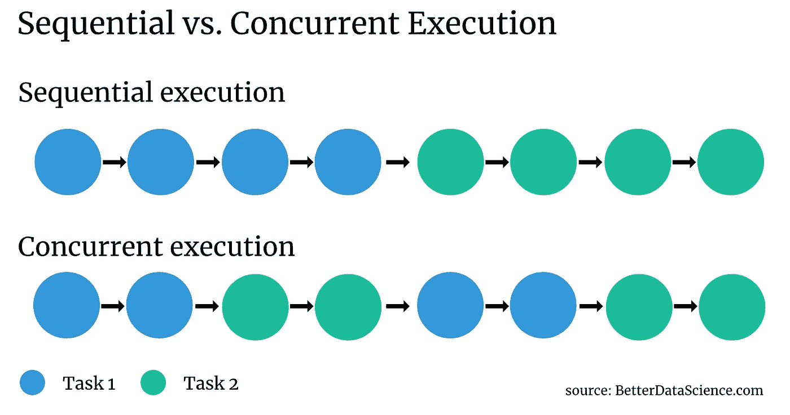
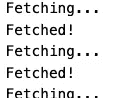
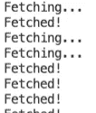
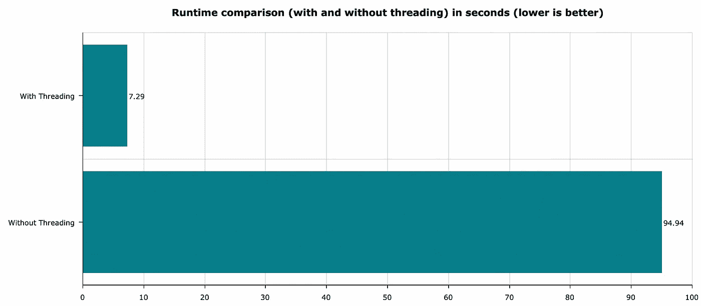

# Python 中的并发性:如何用线程加速代码

> 原文：<https://towardsdatascience.com/concurrency-in-python-how-to-speed-up-your-code-with-threads-bb89d67c1bc9?source=collection_archive---------28----------------------->

## 用 Python 实现并发执行的理论+实践指南

照片由[雷纳·辛普森](https://unsplash.com/@rayner?utm_source=unsplash&utm_medium=referral&utm_content=creditCopyText)在 [Unsplash](https://unsplash.com/?utm_source=unsplash&utm_medium=referral&utm_content=creditCopyText) 拍摄

顺序执行并不总是有意义的。例如，如果输出不相互依赖，让程序闲置是没有意义的。这就是**并发**背后的基本思想——今天你会学到很多关于这个话题的知识。

本文将教您如何通过并发运行任务来加速 Python 代码。请记住，并发执行并不意味着同时。有关同时(并行)执行的更多信息，请查看本文。

这篇文章的结构如下:

*   线程简介
*   实现线程—发送 1000 个请求
*   结果呢
*   结论

你可以在这里下载这篇文章的源代码。

# 线程简介

那么，什么是线程化呢？简而言之，这是一个允许并发运行代码的编程概念。并发意味着应用程序运行多个任务，第一个任务不必在第二个任务开始之前完成。

假设您正在向某个 web API 发出一堆请求。发送一个请求，等待响应，一遍又一遍地重复同样的过程是没有意义的。

并发使您能够在第一个请求等待响应时发送第二个请求。下图应该比文字更好地解释了顺序和并发执行背后的思想:

图 1 —顺序执行与并发执行(作者提供的图片)

请注意，单个点代表任务的一小部分。如果任务闲置一段时间，并发可以帮助加快运行时间(想想请求-响应类型的通信)。

现在，您已经从理论上了解了线程的基础知识。下一节将向您展示如何用 Python 实现它。

# 实现线程—发送 1000 个请求

用 Python 实现线程非常简单。但首先，让我们描述一下任务。

我们希望声明一个向端点发出 GET 请求并获取一些 JSON 数据的函数。JSONPlaceholder 网站非常适合这个任务，因为它是一个虚拟 API。我们将重复这个过程 1000 次，并检查我们的程序在多长时间内基本上什么都不做—等待响应。

先不穿线程做测试吧。剧本是这样的:

我认为在上面的脚本中应该没有什么是不熟悉的。我们重复请求 1000 次，并记录开始和结束时间。`fetch_single()`函数中的打印语句在这里只有一个原因——查看程序在执行时的行为。

以下是运行该脚本后您将看到的输出:

图 2 —顺序执行的输出(作者提供的图片)

如您所见，一个任务必须完成，另一个任务才能开始。对我们这种类型的问题来说不是最佳行为。

接下来让我们实现线程化。该脚本看起来或多或少是相同的，但有几处不同:

*   我们需要额外的进口— `concurrent.futures`
*   我们不打印最后一条语句，而是返回它
*   `ThreadPoolExecutor()`用于并发提交和运行任务

以下是完整的片段:

一旦执行，您将看到类似于下面的输出:

图 3 —并发执行的输出(作者提供的图片)

这些都很好，但是速度真的有提高吗？接下来让我们检查一下。

# 结果呢

到目前为止，您已经了解了顺序执行和并发执行之间的区别，以及如何将代码转换为并发执行函数调用。

现在让我们比较一下运行时性能。下图以秒为单位总结了上述任务的运行时间，即进行 1000 次 API 调用:

图 4 —使用和不使用线程的运行时比较(图片由作者提供)

如您所见，执行时间减少了约 13 倍——至少可以说相当不错。

# 结论

今天，您已经学到了很多——从线程和并发执行背后的基本理论，到如何将非并发代码“转换”为并发代码。

请记住，并发并不是提高 Python 速度的万能答案。在您的应用中实现线程之前，请考虑应用是如何设计的。一个功能的输出是否直接作为另一个功能的输入？如果是这样的话，并发性可能不是您想要的。

另一方面，如果您的应用程序大部分时间处于空闲状态，“并发执行”可能就是您一直在等待的术语。

感谢阅读。

喜欢这篇文章吗？成为 [*中等会员*](https://medium.com/@radecicdario/membership) *继续无限制学习。如果你使用下面的链接，我会收到你的一部分会员费，不需要你额外付费。*

 [## 通过我的推荐链接加入 Medium-Dario rade ci

### 作为一个媒体会员，你的会员费的一部分会给你阅读的作家，你可以完全接触到每一个故事…

medium.com](https://medium.com/@radecicdario/membership) 

# 了解更多信息

*   [Python 并行性:几分钟内加速 Python 代码的基本指南](/python-parallelism-essential-guide-to-speeding-up-your-python-code-in-minutes-5ec71cbd88e1)
*   [新的 M1 macbook 对数据科学有好处吗？让我们来看看](/are-the-new-m1-macbooks-any-good-for-data-science-lets-find-out-e61a01e8cad1)
*   [如何使用 Python 创建 PDF 报告—基本指南](/how-to-create-pdf-reports-with-python-the-essential-guide-c08dd3ebf2ee)
*   [如何用 FastAPI 构建和部署机器学习模型](/how-to-build-and-deploy-a-machine-learning-model-with-fastapi-64c505213857)
*   [PyTorch + SHAP =可解释的卷积神经网络](/pytorch-shap-explainable-convolutional-neural-networks-ece5f04c374f)

# 保持联系

*   关注我的 [Medium](https://medium.com/@radecicdario) 了解更多类似的故事
*   注册我的[简讯](https://mailchi.mp/46a3d2989d9b/bdssubscribe)
*   在 [LinkedIn](https://www.linkedin.com/in/darioradecic/) 上连接
*   查看我的[网站](https://www.betterdatascience.com/)

*原载于 2021 年 2 月 8 日 https://betterdatascience.com**[*。*](https://betterdatascience.com/concurrency-in-python/)*