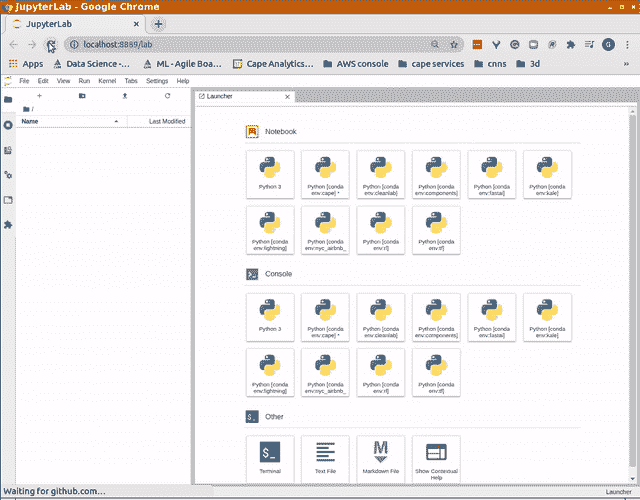

# Conda:基本概念和技巧

> 原文：<https://towardsdatascience.com/conda-essential-concepts-and-tricks-e478ed53b5b?source=collection_archive---------15----------------------->

## 对于初学者和有经验的用户

在这篇博文中，我将描述 conda 是什么，以及如何有效地使用它，无论你是第一次看它还是经验丰富的用户。虽然在后一种情况下，你会知道很多事情，但你仍然会发现一些技巧，可以用来改善你的体验。


在 [Unsplash](/s/photos/swiss-knife?utm_source=unsplash&utm_medium=referral&utm_content=creditCopyText) 上由 [Patrick](https://unsplash.com/@pf91_photography?utm_source=unsplash&utm_medium=referral&utm_content=creditCopyText) 拍摄的照片

# 目录

[为什么康达](#7d21)
[入门级举例](#09d7)
[什么是康达](#7695)
∘ [康达和 pip](#e1ab)
∘ [康达 vs anaconda vs miniconda](#50e5)
[如何安装康达](#a86d)
∘ [获取 Miniconda](#a601)
[安装包、 和环境](#824c)
∘ [基地环境](#073c)
∘ [其他环境](#4b8f)
∘ [使用 Jupyter 和 conda 的最佳方式](#202a)
∘ [移除环境](#ef43)
∘ [共享一个环境](#75a8)
[通道](#3149)
∘[conda-forge 通道](#6304)
[Conda 和 pip](#42cb)

# 为什么是康达

如果符合以下一项或多项条件，Conda 适合您:

*   你花了太多的时间安装和配置软件，而不是专注于你需要工作的项目
*   你总是以一个巨大的混乱结束，你必须清理，然后从头开始
*   您希望能够在机器之间移动您的环境
*   您需要在同一台机器上为不同的项目安装冲突的需求
*   您希望有一个可重复、可跟踪的安装过程，可以跨平台和发行版共享，其中也可以包括非 python 包
*   您刚刚得到一台新机器(可能配有 GPU ),并且希望快速上手
*   你总是想尝试所有东西的最新版本，但不想处理不兼容的问题，也不想弄清楚哪个版本适合哪个版本
*   您有多台机器安装了不同的 Linux 发行版，甚至混合了 Linux/macOS/Windows，并且您希望在它们之间使用相同的环境

如果这些都是真的，康达将会对你非常有用。

# 入门级示例

比方说，你刚刚得到一个新的闪亮的 GPU 机器，你想安装 NVIDIA CUDA 工具包。你是想做[这个](https://docs.nvidia.com/cuda/cuda-installation-guide-linux/index.html#download-nvidia-driver-and-cuda-software)然后花接下来的 5-10 个小时来完成这个任务，还是宁愿做了这个然后走自己的路？

```
> conda install -c conda-forge cudatoolkit=10.2
```

你想安装`pytorch`并加入深度学习的行列吗？

```
> conda install pytorch cudatoolkit=10.2 -c pytorch
```

是否要在同一环境下安装 Tensorflow 和 Pytorch？这不是疯狂，只是:

```
> conda install -c conda-forge -c pytorch python=3.8 cudatoolkit=10.2 pytorch pytorch tensorflow tensorboard
```

还有更多。一般来说，大多数事情都是一个`conda install`之遥。最重要的是，如果您搞砸了，您只需删除环境并重试，不会在您的系统中留下任何痕迹。

我希望这能给你一点提示，为什么 conda 是一个如此神奇的工具。让我们投入其中，了解更多相关信息。

# 什么是*康达*

[Conda](https://docs.conda.io/en/latest/) 是跨平台的，[开源](https://github.com/conda/conda)包管理器。

您可能已经在系统上使用了软件包管理器。在 Linux 中，你可能有一个或多个`apt`、`yum`或`snap`。在 macOS 中你有`homebrew`或其他。Conda 类似，但它是平台无关的。它确实适用于 Linux、Mac 和 Windows，并且在所有 3 个平台上都以相同的方式工作。

## 康达和皮普

一个常见的错误是将`conda`与`pip`相比较。它们相似，但在某种程度上也有很大不同:`pip`是一个以 Python 为中心的包管理器(毕竟`pip`包的存储库被称为 Python 包索引)，而`conda`是语言不可知的。虽然`pip`包确实包含有时编译的库(例如，`numpy`、`scipy`、`pandas`……)，但一般来说，这些只是支持 Python 接口。相反，使用`conda`你可以安装 C/C++库、编译器、图形库、与 Python 无关的成熟应用程序。你甚至可以使用`conda`来安装 GPU 软件，比如 NVIDIA CUDA toolkit，或者`go`语言，或者`npm`、`julia`等等。换句话说，`conda`生态系统远远超越了 Python。因此`conda`与`yum`或`homebrew`比`pip`更相似，正如我们所说的。事实上，一个典型的`conda`安装*包含* `pip`作为另一个包，你可以使用 pip 在你的 conda 环境中安装包(但是在你这样做之前要看下面的警告)。

## 康达 Vs 水蟒 Vs 迷你康达

如上所述，`conda`是包经理。

[Anaconda](https://www.anaconda.com/products/individual) 是一个`conda` 包的集合，包含了您在日常工作中将要用到的大部分东西(当然也包括`conda` 包管理器)。有些人更喜欢它，因为它提供了一个很好的图形用户界面来处理环境和包，而不是命令行工具(CLI)。我个人从不使用 Anaconda，因为我觉得它很臃肿，而且我不介意 CLI。我用 Miniconda 代替。

Miniconda 是一个准系统的包集合:它包含 python、`conda`包管理器以及一些其他的包(包括`pip`)。它没有任何图形用户界面，只有 CLI。这是您构建环境的起点，该环境包含您需要的内容，仅此而已。它对于构建 Docker 容器也非常有用(见下文)。我个人只用 Miniconda。

# 如何安装康达

在这篇博文中，我们将重点放在 Miniconda 和 CLI 上。这是迄今为止最常见的用例，但是如果您想使用 Anaconda 及其 GUI，这里讨论的大部分内容也适用。

## 获取 Miniconda

转到[这里](https://docs.conda.io/en/latest/miniconda.html)并下载适合您的系统(Linux、Windows 或 Mac)的自安装包。把它保存在某个地方。

或者，运行以下命令:

> 注意:这里所有的命令行示例都假设使用 Linux 和`bash` shell。如果你在 Mac 和 bash 上，事情将是相同的。如果您使用的是另一个 shell，那么改动可能很小。例如，在下面的命令中，如果您在 Mac 上，请用 MacOSX 替换 Linux。我不会介绍 Windows，但是在 Windows 中将命令翻译成 shell 应该很容易(或者您可以使用 [WSL](https://docs.microsoft.com/en-us/windows/wsl/install-win10)

```
# Download Miniconda. You can also use wget or any other command 
# line download tool for this purpose> curl [https://repo.anaconda.com/miniconda/Miniconda3-latest-Linux-x86_64.sh](https://repo.anaconda.com/miniconda/Miniconda3-latest-Linux-x86_64.sh) > Miniconda3-installer.sh
```

现在转到下载文件的地方，通过运行以下命令安装 Miniconda:

```
# Add run permissions for current user
> chmod u+x Miniconda3-installer.sh
> ./Miniconda3-installer.sh -b -p ~/miniconda3
```

您可以用任何其他前缀替换`-p ~/miniconda3`，但是，通常最好保留那个前缀。为了简单起见，这篇博文的其余部分将假设 Miniconda 的路径。

恭喜你，你已经安装了迷你康达！现在让我们将它添加到 [PATH](https://en.wikipedia.org/wiki/PATH_(variable)) 环境变量中，然后激活它:

> 如果您发现`conda`很有用，您可能希望将这些行添加到您的`.bashrc`文件(或者您的 shell 用作 init 脚本的任何文件)中，这样您就不必为每个新的终端都这样做了。

```
> export PATH=${PATH}:~/miniconda3/bin# While you could use `conda activate` instead,
# this way of activating is more portable
> source ~/miniconda3/bin/activate
```

注意，我们将 miniconda3 路径*放在 PATH env 变量的末尾*。这是我使用的一个技巧，以便 Miniconda 的存在是微创的。例如，如果现在我在没有激活 conda 的情况下运行 python，我仍然会进入安装在我的系统中的 python 解释器，而不是 Miniconda 自带的解释器。如果我把 path 放在 PATH env 变量的开头，我会进入 Miniconda python，不管我是否激活 conda。

我们现在已经准备好了，您应该会看到这样的内容:

```
(base) giacomo@fd4af0669a8:/#
```

`(base)`部分告诉你，你处于“基础”环境，conda 已经可以使用了。

> 等等！不要在基础环境中安装任何东西。首先阅读下一部分

# 安装软件包和环境

软件包有两种安装方式。一种是显而易见的，即使用命令:

```
> conda install [name of the package]
```

在某些情况下，您需要添加一个通道规范(参见关于通道的部分)。

另一种方法是创建环境并在创建过程中指定包。让我们看看那个。

环境是`conda`中最有用的概念之一。它们是独立的装置:一个环境中的一切都依赖于该环境中的事物。

> 嗯，不是 100%，而是 99.9%。你仍然依赖于你的系统的一些核心库，比如 Linux 上的`*libc*`，但是这些都是高级细节(在底部描述)。对于所有意图和目的以及 99.9%的用户来说，我刚才说的近似值是考虑环境的一个好方法。

是的，它们在概念上类似于 python 的虚拟环境，但是它们可以包含比 python 包更多的东西。

如果你对这是如何实现的感兴趣，看看这篇文章的底部。

关于环境的文档[包含了所有的细节。在这里，我总结了要点，并提供了一些提示和经验教训。](https://docs.conda.io/projects/conda/en/latest/user-guide/tasks/manage-environments.html#sharing-an-environment)

## 基础环境

基本环境是在安装 Miniconda 或 Anaconda 时创建的。它包含基本操作所需的`conda`和包。

> 一个典型的初学者错误是将软件包安装到基础环境中。不要那样做。这样做会与您将要创建的其他环境产生冲突。

基础环境应该只包含`conda`，它的依赖项，以及与 conda 相关的东西，比如`conda-build`或`mamba`(参见下面的`mamba`是什么)。相反，对于任何其他软件，您应该总是依赖于其他环境。

## 其他环境

因为我们不想在基础环境中安装任何东西，所以首先要为日常操作创建您的首选环境。例如，标准的数据科学家环境可能是这样的:

```
> conda create --name ds -c conda-forge python=3.8 matplotlib numpy scipy pandas jupyter jupyterlab seaborn
```

康达将打印一份长长的包清单，这些包是让一切正常运转所必需的。您可以查看列表，然后输入`y`进行确认。如果您想避免该提示，只需在命令行中添加`-y`。

这将创建一个`ds`环境，同时安装软件包。

> 提示:如果你已经知道你将需要更多的包，那么用这种方式安装它们，而不是以后依赖于`conda install`,这样 conda 将会找出满足你的需求的最佳依赖组合

正如你可能已经猜到的，你可以在那里添加任何你需要的软件包，而且很有可能你会在`conda-forge` 频道找到它。我们一会儿会谈到这意味着什么。

您现在需要激活此环境:

```
> conda activate ds
```

由于这是我们的首选环境，您可能希望将上面的行添加到您的`.bashrc`或您的 shell 运行的任何 init 脚本中，这样每次您打开 shell 时，您都会发现自己处于`ds`环境中。

从现在开始，如果您运行`conda install [package]`，新的包将被安装在活动环境中。

你不需要在这里停下来。假设您今天想尝试一下最前沿的 python 3.9，但是您不想中断您的日常操作。很简单，只要创造一个不同的环境:

```
> conda deactivate
> conda create --name py39 python=3.9 numpy scipy matplotlib
> conda activate py39
```

在创建和激活下一个环境之前,`conda deactivate`部分会停用当前环境，并使您返回到`base`环境。这里我们也看到了如何指定包的显式版本，就像在`python=3.9`中一样。

> 提示:在激活一个新的环境之前，一定要运行`conda deactivate`。这避免了奇怪的问题，例如环境变量没有被设置

现在，您在`py39`环境中安装的任何东西都完全独立于`ds`环境中的东西。

> 注意:激活一个环境后，如果您查看$PATH 环境变量(`echo ${PATH}`)，您会看到`conda activate`将路径添加到环境的`bin`目录中。这意味着您在那里安装的任何东西都优先于您系统中其他地方安装的东西。

类似地，您可以使用安装环境，比如说一个较旧的 PyTorch 版本，您需要复制一篇旧论文或者从您的 python 环境中单独安装`go`语言，这里仅举几个例子。

在任何时候，您都可以看到具有以下特征的环境列表:

```
> conda env list
```

## 使用 Jupyter 和 conda 的最佳方式

如果你在日常工作中使用 Jupyter(谁没有呢？)有一个你不能错过的扩展: [nb_conda_kernel](https://github.com/Anaconda-Platform/nb_conda_kernels) s .这个简单的扩展允许你从 Jupyter(笔记本或实验室)界面控制哪个环境用于哪个笔记本。你只需要把它安装在你的默认环境中(我们上面称之为`ds`)，然后从你的默认环境中启动 Jupyter

```
> conda activate ds
> conda install -c conda-forge jupyterlab nb_conda_kernels
> jupyter lab
```

**这是你将得到的:**

****

**使用 nb_conda_kernels，您无需离开 Jupyter 就可以为每台笔记本电脑选择使用的环境**

> **注意:您**不需要**在每个环境中安装 Jupyter，但是您**必须**在每个环境中安装至少一个内核(例如，Python 的 ipykernel)。没有内核的环境不会出现在 Jupyter 的可用环境列表中。**

## **移除环境**

**如果您想删除一个环境以释放一些磁盘空间，或者因为您想从头开始，您只需执行以下操作:**

```
> conda deactivate
> conda uninstall --name py39 --all
```

**这将完全删除`py39`环境及其所有包。**

## **共享一个环境**

**环境可以通过多种方式复制。了解它们之间的差异是很重要的。**

**首先，你需要激活你的环境。**

**然后，如果您要导出到相同的平台(比如 Linux 到 Linux)，只需:**

```
> conda env export > environment.yml
```

**`environment.yml`文件类似于`pip`的`requirements.txt`文件，如果你知道我在说什么的话。它包含您的环境中包含的每一个包，当然包括 C/C++库之类的。它可用于在同一平台上重建环境，如下所示:**

```
> conda env create -f environment.yml
```

**一个典型的用例是在 Linux 上“开发”一个环境，然后以这种方式导出它，以便在 Linux Docker 容器中重新创建。这为您提供了一个精确副本的保证，不仅包括您手动安装的东西，还包括它们所有的依赖项。其中一些是依赖于平台的，这使得在不同的平台上(比如从 Linux 到 macOS)复制这个环境变得困难或者不可能。**

**相反，如果您希望您的环境可以跨平台复制，请以这种方式导出:**

```
> conda env export --from-history > environment.yml
```

**这个版本的`environment.yml`文件将只包含你在`conda create`或`conda install`中明确安装的包。当在一个不同的平台上重新创建环境时(比如从 Linux 到 Mac)，conda 将使用目标平台上可用的东西来解决环境文件中列出的包的依赖关系。当然，您可以像以前一样在目标平台上使用这个环境文件:**

```
> conda env create -f environment.yml
```

**第三个选项是核心选项:有一种方法可以将您的整个环境打包到一个二进制文件中，并在目的地解包(这当然只能在相同的平台上工作)。这在某些情况下非常有用，尤其是在使用 conda 和 PySpark 时。这是通过 conda-pack 实现的，详情[见此处](https://conda.github.io/conda-pack/)。**

# **频道**

**Conda 包被远程托管在通道中，例如，通道相当于`yum`或`apt`的存储库。如果在`conda install`或`conda create`期间未指定任何`-c`参数，则使用默认通道。否则，将使用您指定的通道。这意味着 conda 不仅会在默认频道中查找某个包，还会在您指定的频道中查找。例如，像这样的命令:**

```
> conda install -c pytorch torch
```

**将在`pytorch`通道和默认通道中寻找`torch`包。然后，可用版本将与此处说明的[规则进行比较。](https://docs.conda.io/projects/conda/en/latest/user-guide/tasks/manage-channels.html)**

> **提示:始终打开`strict`频道策略。它使 conda 更快，并有助于避免冲突。你可以用`conda config --set channel_priority strict`来做**

## **`conda-forge`频道**

**conda-forge 组织在`conda-forge`渠道中维护着一个庞大的包列表。你可以在他们的[网站](https://conda-forge.org/feedstock-outputs/index.html)上找到构建这些包的方法，上面有 GitHub 的链接。您也可以轻松地将自己的软件包贡献给康达锻造。**

**如果你看看周围的网络，有康达锻造的爱好者和憎恨者。我属于前一类。然而，你需要知道一些重要的事情来使用它。**

**`conda-forge`包和默认 conda 通道中包含的包之间存在兼容性问题。因此，在安装东西或创建环境时，你应该总是按照上一节所解释的那样设置`channel_priority: strict`，并且优先使用`conda-forge`通道而不是默认通道。有两种方法可以做到这一点。您可以始终使用 conda-forge 指定`conda install -c conda-forge`或`conda create -c conda-forge`作为第一个列出的频道，或者在您的家中创建一个包含以下内容的`.condarc`文件:**

```
channels:
  - conda-forge
  - defaults
channel_priority: strict
```

**一个环境，从创造到毁灭，要么用康达-福吉，要么不用。不要混搭。如果你没有使用 conda-forge 频道就创建了它，那么就不要中途把它添加到组合中。在实践中，我总是用 conda-forge 创建一个环境，除非在非常特殊的情况下，我发现不兼容。**

**第三种选择是在您的`.bashrc`中定义一个 bash 函数，如下所示:**

```
condaforge() {

    # $1 is the command, ${@:2} is every other parameter # Print the command before executing it
    echo "==>" conda "$1" -c conda-forge "${@:2}" conda "$1" -c conda-forge "${@:2}"
}
```

**然后用它来创建环境和安装包:**

```
> condaforge create --name test python=3.8
```

**或者**

```
condaforge install numpy
```

**该功能会将`-c conda-forge`通道添加到您的 conda 安装命令中。**

> **提示:有时很难记住一个给定的环境是否是用 conda-forge 创建的。一个简单的技巧是总是在环境名前面加上`cf`，比如`conda create --name cf_py39 -c conda-forge python=3.9`。或者，使用`conda list | grep python`查看 python 是否是从 conda-forge 通道安装的。在前一种情况下，您会看到类似以下内容:**

```
python       3.8.5     h1103e12_7_cpython    conda-forge
```

# **康达和皮普**

**康达和皮普在历史上很难结合。现在情况好多了，在很多情况下，事情都很顺利。**

**但是，一般来说，您应该优先考虑这两者之一。例如，通常你会优先考虑 conda，也就是说，你会先尝试用 conda 安装包。如果这不可用，那么使用画中画。**

**在某些情况下，您可能想做相反的事情，优先考虑 pip。在这种情况下，创建一个只有 python+pip 的环境，然后从那时起使用 pip。**

**一个折中的办法是使用 conda 来安装基本组件(numpy、scipy、matplotlib、jupyter……)以及对 PyTorch、TensorFlow、Cuda toolkit、OpenCV 等重编译库的依赖，或者安装 GDAL 和 rasterio 等复杂而晦涩的包。用 pip 安装所有 python 专用的包。这不太可能给你带来问题。**

**注意，如果你用 pip 安装一个依赖于比如 numpy 的包，并且你已经用 conda 安装了 numpy，pip 会识别它，它不会再安装它(除非有版本冲突)。这就是为什么大部分时间事情都是正常的。**

**最后，请注意，当您如上所述导出环境时，环境文件确实包含所有安装了 pip 的包以及安装了 conda 的包，因此在 conda 环境中使用 pip 不会妨碍它的共享。**

# **康达很慢**

**对 conda 最常见的抱怨之一是包求解器很慢。不幸的是，这是真的，尽管随着时间的推移，情况会越来越好。一个很酷的替代品刚出来，它叫`mamba`(见[此处](https://github.com/mamba-org/mamba))。**

**Mamba 是 conda 安装程序的直接替代，所以你可以用`mamba install`代替`conda install`，用`mamba create`代替`conda create`。你会以快得多的方式得到同样的结果。相当酷！**

**您需要在您的基础环境中安装`mamba`:**

```
> conda deactivate
# Make sure your prompt says (base)
> conda install mamba
```

# **释放一些磁盘空间**

**过一会儿，你会发现你的 miniconda 目录开始变得很大。主要原因是 conda 保存了你曾经下载过的所有软件包的档案。您可以使用以下工具轻松安全地清理这些垃圾:**

```
conda clean --all
```

**释放一些空间。**

# **康达和多克**

**在构建 Docker 容器时(即在 Docker 文件中)，可以使用 Miniconda 来安装环境。有几个很好的理由说明为什么大腿在某些情况下可能是个好主意:**

1.  **您可以使用一个环境文件并完全复制您的开发环境。这是一种快速而简单的方法，可以确保您开发的内容能够找到您在开发过程中使用的相同依赖项**
2.  **例如，你可以安装康达-福吉的产品。这允许您安装东西，即使您在容器中使用的发行版(基本映像)没有您需要的包**
3.  **Docker Hub 上有现成的图片，包含已经预装的 conda:[https://hub.docker.com/r/continuumio/miniconda3](https://hub.docker.com/r/continuumio/miniconda3)，所以使用 conda 非常方便，不会增加太多复杂性**
4.  **您可以安装和运行软件包，而不必成为`root`，从安全的角度来看，这有时更好，特别是当这些软件包启动 web 服务时，例如**

**请注意，在 docker 文件中，您应该在安装命令的末尾运行`conda clean --all -y`,删除那些会浪费图像空间的无用归档文件。**

# **深入:RPATH 和 conda**

**你完全不需要知道这些，但是如果你想知道即使在编译库的情况下，conda 是如何实现独立环境的，这里就有。**

**当你编译一个 C/C++或 FORTRAN 包或一些其他编译的库/可执行文件时，你可以静态地或动态地链接你所依赖的库。大多数现代应用程序都是用动态链接编译的。这意味着在运行时，系统需要查看你的可执行文件或库，了解它所依赖的其他库，并在你的系统中找到它们(动态链接)。**

**系统有一些预定义的地方来寻找这些库，并维护这些路径的缓存。例如，在 Linux 上，这些地方类似于`/lib`或`/usr/lib`等等。您可以使用以下命令查看 Linux 系统已知的所有库的列表:**

```
> ldconfig --verbose
```

**macOS 也有类似的系统。现在，如果我们拿一个可执行文件或一个库，我们可以看到它依赖于其他哪些库。例如，它打印了我的系统`vim`所依赖的库:**

```
> ldd /usr/bin/vim
 linux-vdso.so.1
 libm.so.6 => /lib/x86_64-linux-gnu/libm.so.6
 libtinfo.so.6 => /lib/x86_64-linux-gnu/libtinfo.so.6 
 libdl.so.2 => /lib/x86_64-linux-gnu/libdl.so.2 
 libpython3.8.so.1.0 => /lib/x86_64-linux-gnu/libpython3.8.so.1.0 
 libpthread.so.0 => /lib/x86_64-linux-gnu/libpthread.so.0 
 libc.so.6 => /lib/x86_64-linux-gnu/libc.so.6
 /lib64/ld-linux-x86-64.so.2
 libutil.so.1 => /lib/x86_64-linux-gnu/libutil.so.1 
```

**正如所料，这些都是系统库。如果我在`conda` vim 上做同样的事情:**

```
> conda install -c conda-forge -y vim
> ldd ${CONDA_PREFIX}/bin/vim
 linux-vdso.so.1
 libm.so.6 => /lib/x86_64-linux-gnu/libm.so.6
 libtinfo.so.6 => /root/miniconda3/envs/py39/bin/../lib/libtinfo.so.6 
 libdl.so.2 => /lib/x86_64-linux-gnu/libdl.so.2
 libpython3.9.so.1.0 => /root/miniconda3/envs/py39/bin/../lib/libpython3.9.so.1.0 
 libpthread.so.0 => /lib/x86_64-linux-gnu/libpthread.so.0 
 libc.so.6 => /lib/x86_64-linux-gnu/libc.so.6
 /lib64/ld-linux-x86-64.so.2
 libutil.so.1 => /lib/x86_64-linux-gnu/libutil.so.1 
```

**我们可以看到，现在链接器在 conda 环境中找到了`libtinfo`和`libpython`，尽管它们在系统`/lib`中是可用的。为什么？因为 conda 中的`vim`是使用 [RPATH](https://en.wikipedia.org/wiki/Rpath#:~:text=In%20computing%2C%20rpath%20designates%20the,(or%20another%20shared%20library).) 编译的，也就是说，路径是硬编码在可执行文件中的，它指向 conda 环境。**

**这意味着我安装在这个特定环境中的`vim`只链接到同一个环境中的库，所以我可以在不同的环境中或者在我的系统中有不同的`vim`，有不兼容的版本，一切都很好，没有任何冲突。**

**但是你也可以注意到我们仍然依赖于一些基本的系统库，比如`linux-vdso`(一些[内核](https://en.wikipedia.org/wiki/VDSO)功能的接口)、`libc`等等。这些不能与 conda 一起运输。这也是为什么 conda 环境不像 Docker 容器那样独立于系统。然而，这些系统库保证是向后兼容的，并且它们在任何 Linux 发行版上都提供相同的接口，所以它们不太可能导致任何问题。**

**macOS 也是如此，尽管系统库不同。**

**您甚至可以看到 conda 在您的环境中使用的 RPATH 设置。每次执行`conda activate`并激活环境时，conda 都会设置一些环境变量:**

1.  **CONDA_PREFIX:活动 CONDA 环境的根路径**
2.  **LDFLAGS:这是一个标准的 env 变量，由链接器在编译时读取。如果仔细查看，您会看到 RPATH 设置。例如，在我的笔记本电脑上，我看到:**

```
(ds) giacomov@gr723gad9:~$ echo $LDFLAGS
-Wl,-O2 -Wl,--sort-common -Wl,--as-needed -Wl,-z,relro -Wl,-z,now -Wl,--disable-new-dtags -Wl,--gc-sections -Wl,-rpath,/home/user/miniconda3/envs/ds/lib -Wl,-rpath-link,/home/user/miniconda3/envs/ds/lib -L/home/user/miniconda3/envs/ds/lib
```

**`-rpath`标志指示链接器将该路径硬编码为任何可执行文件中的 RPATH。这意味着当环境处于活动状态时编译可执行文件或库，它将包含 RPATH 设置。这是`conda-build`运作的基础，但那是以后的事了。**

**3.CXXFLAGS，CFLAGS:C 编译器的特定标志，包括 conda 环境中头文件的路径**

# **结论**

**当然还有更多要说的，这篇文章已经够长了。我希望你能从中获得有用的信息，不管你是不是初学者。请随意发表评论和提出问题。**