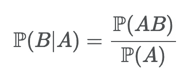
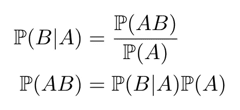
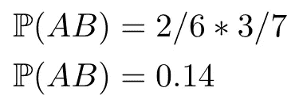

# 条件概率和三强争霸赛

> 原文：<https://towardsdatascience.com/conditional-probability-and-the-triwizard-tournament-9c2ab6fe0af0?source=collection_archive---------56----------------------->

## 概率可以帮你避开匈牙利犀鸟！

[李中清](https://unsplash.com/@picsbyjameslee?utm_source=medium&utm_medium=referral)在 [Unsplash](https://unsplash.com?utm_source=medium&utm_medium=referral) 上拍照

概率通常用骰子和硬币来教授。在这篇文章中，我们将做一些不同的事情。我们将用《哈利·波特》中的例子来代替。今天我们将关注发生在《哈利·波特与火焰杯》三强争霸赛中的相关随机事件。

从属事件依赖于之前发生的事件。例如，纸牌游戏中的许多动作可以被认为是相关事件，因为从这副牌中抽取牌的概率取决于已经打出的牌。如果我要在 21 点游戏中算牌，我需要记住所有在洗牌前打出的牌，以便分析我赢一手牌的概率。

把条件概率看作是分析**相关**事件的一种方式。我们将条件概率表示为ℙ(A|B，这意味着在事件 b 已经发生的情况下，事件 a 发生的概率。

## 先决条件和符号

*   ω:样本空间；被认为是一个[集](https://en.wikipedia.org/wiki/Set_(mathematics))。
*   ω:样本结果。
*   *A* :事件；ω的子集。
*   | *A* |:集合 *A.* 中元素的个数
*   a ∈ *S* :值 a 是集合 *S* 的“一个成员”或简单的“在”集合*S*中。

回想一下，上一篇[帖子](/the-building-blocks-of-probability-made-simple-de936d3c1548)中的三强争霸赛示例，其中我们的样本空间是ω= { SSS，CWG，CF，HH}。为了说明相关事件的影响，让我们将样本空间改为如下:
ω= { SSS，SSS，CWG，CWG，CWG，CF，HH}其中

1.  瑞典短吻
2.  CWG =普通威尔士绿色
3.  CF =中国火球
4.  HH =匈牙利犀鸟

选择瑞典短吻猪的几率是七分之二。如果芙蓉·德拉库尔选择了瑞典短吻鳄，那么选择瑞典短吻鳄的可能性有多大？自从我们从袋子里拿走了一条龙，机会就变了，因为现在少了一条。

这里的想法是，如果我们在巫师每次选择龙的时候都替换龙，那么概率不会改变，事件被认为是独立的。然而，在这个例子中，龙是**而不是**被替换，因此事件被认为是相关的。

**定义:**如果ℙ(A) > 0 那么 b 给定 a 的**条件概率**为

让我们再多讨论一下这个符号。

在我们的例子中，假设事件 A 是“首先选择一只瑞典短吻鳄”，概率为 2/7，事件 B 是“其次选择一只瑞典短吻鳄”。

现在是棘手的部分，对于事件 B，我们有四个选择:

1.  如果我们首先选择瑞典短吻龙，现在的概率是 1/6。
2.  如果我们选择一个普通的威尔士绿色，现在的概率是 3/6。
3.  如果我们选择一个中国火球，现在的概率是 1/6。
4.  如果我们选择匈牙利犀鸟，现在的概率是 1/6。

**我们必须规定哪个事件先发生。为了做到这一点，我们使用数学符号“|”来表示“给定”。因此，ℙ(A|B)的意思是“给定事件 b 的事件 a ”,也被称为给定事件 b 的条件概率。让我们使用我们的新符号来做一个例子。先选一条普通威尔士绿龙(事件 A)，再选一条普通威尔士绿龙第二(事件 B)的几率有多大？所以我们可以从条件概率公式开始，稍微重新排列一下:**

我们知道选择普通威尔士绿的概率是 3/7 (ℙ(A)，但是在我们从袋子里取出那条龙之后，从袋子里选出的第二条龙不太可能是普通威尔士绿:ℙ(B|A) = 2/6。

所以我们输入数字:

这看起来很简单，但有时却很棘手。例如，ℙ(a|b = ℙ(b|a).通常不是这种情况事实上，它们可以是极其不同的！让我们在回答这个问题时想一想:假设我们首先选择了一个中国火球，选择瑞典短吻的概率是多少，ℙ(A|B？

第二，这种可能性是否等同于选择中国火球，而首先选择瑞典短吻海豚(ℙ(B|A)？

好吧，第一个问题的答案是 2/6，因为一旦我们去掉了中国的火球，袋子里就有两个瑞典的短吻海豚了。现在，如果我们先选择瑞典短吻猪，然后选择中国火球，这一事件的概率将是 3/6。看吧！不一样！ℙ(A|B)不等于ℙ(B|A)！

在下一场三强争霸赛中，你将会确切地知道你选择每条龙的概率。希望这个新技能能帮助你通过任务一。