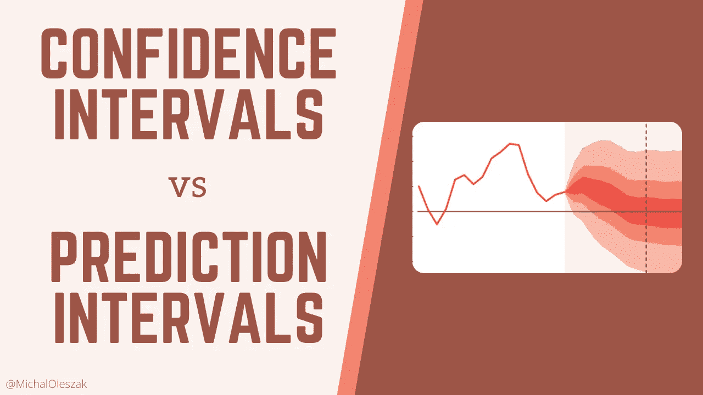
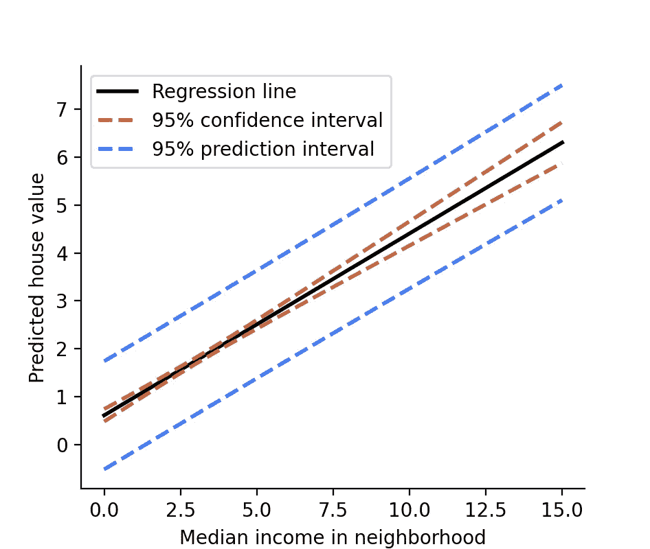
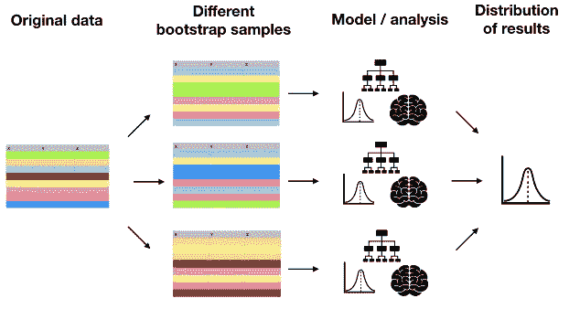

# 置信区间与预测区间

> 原文：<https://towardsdatascience.com/confidence-intervals-vs-prediction-intervals-7b296ae58745?source=collection_archive---------3----------------------->

## 混淆这两者可能代价高昂。了解它们的不同之处以及何时使用它们！



置信区间和预测区间都表示统计估计的不确定性。然而，每一个都与来自不同来源的不确定性有关。有时，人们可以用相同的数量来计算这两者，这导致了在解释统计模型时的混乱和潜在的严重错误。让我们看看它们有什么不同，它们表达了什么样的不确定性，以及何时使用它们。


## 回归模型中的不确定区间

让我们从实际出发，用一个简单的线性回归模型来拟合[加州住房数据](https://scikit-learn.org/stable/datasets/real_world.html#california-housing-dataset)。我们将只使用前 200 条记录，并跳过第一条作为测试用例。该模型基于一个单一的预测值，即邻居的中值收入来预测房价。我们只使用了一个预测值，以便能够很容易地看到 2D 的回归线。

在模型总结中，我们看到了下表。

```
===========================================================
          coef  std err       t   P>|t   [0.025    0.975]
-----------------------------------------------------------
const   0.7548    0.078   9.633   0.000   0.600   0.909
MedInc  0.3813    0.021  18.160   0.000   0.340   0.423
```

邻里收入中位数的系数 MedInc 为 0.3813，其 95%的区间为 0.340 — 0.423。这是一个**置信区间**。置信区间与从多个值估计的统计量有关，在这种情况下是回归系数。它表达了**采样不确定性，**这是因为我们的数据只是我们试图建模的人口的随机样本。它可以解释如下:如果我们收集了许多其他关于加州房屋的数据集，并为每个数据集拟合了这样一个模型，在 95%的情况下，*真实人口系数*(如果我们有加州所有*房屋的数据，我们就会知道这个系数)将落在置信区间内。*

> 置信区间属于从多个值估计的统计量。它表示抽样不确定性。

现在，让我们使用该模型对我们在培训中忽略的第一个观察结果进行预测。代替`predict()`方法，我们将使用`get_predict()`结合`summary_frame()`来提取更多关于预测的信息。

我们得到以下数据帧:

```
 mean mean_se mean_ci_lower mean_ci_upper obs_ci_lower obs_ci_upper
3.9295  0.1174      3.697902      4.161218     2.711407     5.147713
```

这个房子的预测值是 3.9295。现在，`mean_ci`列包含本次预测的置信区间的下限和上限，而`obs_ci`列包含本次预测的**预测区间**的下限和上限。

您可以立即看到预测区间比置信区间宽得多。我们可以通过使用该模型来预测一系列不同邻里收入的房价，从而很好地可视化它，这样我们就可以看到回归线和预测值周围的区间。

现在，`pred`就像以前一样，只有 500 行，包含 0 到 15 之间 500 个不同收入值的预测和区间界限。我们现在可以用它来绘制回归线及其周围的区间。



周围有间隔的回归线。图片由作者提供。

这里有两个主要的东西要看。首先，收入中值在 2 到 5 之间时，置信区间较窄，在更极端的值时，置信区间较宽。这是因为，对于数据中的大多数记录，收入在 2 到 5 之间。在这种情况下，模型有更多的数据，因此抽样不确定性较小。

第二，预测区间比置信区间宽得多。这是因为表达了更多的不确定性。除了采样不确定性之外，预测区间还表示特定数据点的固有不确定性。

> 预测区间表达了采样不确定性之上的特定数据点的固有不确定性。因此它比置信区间更宽。

这种数据点级别的不确定性来自于这样一个事实，即在同一个邻域中可能有多个价值不同的房屋，因此在模型中具有相同的预测值。这在这个例子中很明显，但在其他情况下也是如此。非常相似或者甚至完全相同的多个特征向量与不同的目标值相关联。

让我们回顾一下:

*   置信区间表示从许多数据点估计的数量的抽样不确定性。数据越多，采样不确定性越小，因此间隔越小。
*   除了采样不确定性之外，预测区间也表示单个值周围的不确定性，这使得它们比置信区间更宽。

但是这些区间从何而来，它们又是如何包含这些不同的不确定性来源的呢？接下来我们就来看看吧！


## 音程从何而来

在传统的统计学中，人们会将预测 y-hat 周围的区间计算为


其中 t-crit 是 t 分布的临界值，SE 是预测的标准误差。对于置信区间和预测区间，右侧的两个数字将是不同的，并且是基于各种假设计算的。

然而，统计学中参数假设的时代幸运地即将结束。最近计算能力的提高允许使用[简单的、一刀切的重采样方法](/statistics-is-dead-long-live-statistics-df6c71262187)来进行统计。因此，与其用推导和公式来烦你，不如让我向你展示如何通过重采样来构造这两种类型的区间。这种方法不仅适用于线性回归，而且基本上适用于你能想到的任何机器学习模型。此外，它将使人们瞬间清楚哪种不确定性被哪个区间所覆盖。


## 拔靴带

我们将使用的重采样技术是**自举**。归结起来就是从原始数据中抽取许多样本，比如说 10 000 个样本，然后替换掉。这些被称为引导样本，因为我们是用替换来绘制的，相同的观察结果可能在一个引导样本中出现多次。这样做的目的是从一个假设的总体中获得许多样本，以便我们可以观察抽样的不确定性。接下来，我们对每个 bootstrap 样本分别执行我们想要的任何分析或建模，并计算感兴趣的量，例如模型参数或单个预测。一旦我们有了这个量的 10 000 个自举值，我们就可以查看百分位数来得到区间。整个过程如下图所示。



改编自作者在 DataCamp 教授的 R 课程中的[用插补处理缺失数据。](http://datacamp.com/courses/handling-missing-data-with-imputations-in-r)


## 自举置信区间

让我们用 bootstrap 置信区间来预测一所房子的价值，该房子位于中值收入为 3 英镑的社区。我们采用 10 000 个 bootstrap 样本，对每个样本拟合一个回归模型，并预测 MedInc 等于 3。这样，我们得到了 10 000 个预测。我们可以打印它们的平均值，以及表示置信区间下限和上限的百分位数。

```
Mean pred: 1.9019164610645232
95% CI: [1.83355697 1.97350956]
```

这个 bootstrap 样本考虑了抽样的不确定性，所以我们得到的区间是一个置信区间。现在让我们看看如何引导一个预测区间。


## 引导预测区间

除了采样不确定性之外，预测间隔还应该考虑特定预测数据点的不确定性。为此，我们需要对代码做一个小小的改动。一旦我们从模型中获得预测，我们也从模型中提取随机残差，并将其添加到该预测中。通过这种方式，我们可以将个体预测的不确定性包含在 bootstrap 输出中。

```
Mean pred: 1.9014631013163406
95% PI: [1.07444778 2.72920388]
```

正如所料，预测区间明显比置信区间宽，即使平均预测是相同的。


感谢阅读！

如果你喜欢这篇文章，为什么不在我的新文章上 [**订阅电子邮件更新**](https://michaloleszak.medium.com/subscribe) ？通过 [**成为媒介会员**](https://michaloleszak.medium.com/membership) ，你可以支持我的写作，并无限制地访问其他作者和我自己的所有故事。

需要咨询？你可以问我任何事情，也可以在这里 预定我 1:1 [**。**](http://hiretheauthor.com/michal)

你也可以试试我的其他文章。不能选择？从这些中选择一个:

</establishing-causality-part-1-49cb9230884c>  </8-tips-for-object-oriented-programming-in-python-3e98b767ae79>  </6-useful-probability-distributions-with-applications-to-data-science-problems-2c0bee7cef28> 