# Python 中的置信区间

> 原文：<https://towardsdatascience.com/confidence-intervals-with-python-bfa28ebb81c?source=collection_archive---------6----------------------->

## 用 Python 实现大学统计

# 介绍

在一系列的每周文章中，我将会涉及一些重要的统计学主题。

目标是使用 Python 来帮助我们获得对复杂概念的直觉，从经验上测试理论证明，或者从零开始构建算法。在本系列中，您将会看到涵盖随机变量、抽样分布、置信区间、显著性检验等主题的文章。

在每篇文章的最后，你可以找到练习来测试你的知识。解决方案将在下周的文章中分享。

迄今发表的文章:

*   [伯努利和二项随机变量与 Python](/bernoulli-and-binomial-random-variables-d0698288dd36)
*   [用 Python 从二项式到几何和泊松随机变量](/geometric-and-poisson-random-variables-with-python-e5dcb63d6b55)
*   [用 Python 实现样本比例的抽样分布](/sampling-distributions-with-python-f5a5f268f636)
*   [Python 的置信区间](/confidence-intervals-with-python-bfa28ebb81c)
*   [使用 Python 进行显著性测试](/significance-or-hypothesis-tests-with-python-7ed35e9ac9b6)
*   [用 Python 进行组间差异的双样本推断](/two-sample-inference-for-the-difference-between-groups-with-python-de91fbee32f9)
*   [分类数据的推断](/inference-for-categorical-data-9f3c6034aa57)
*   [高级回归](/advanced-regression-f74090014f3)
*   [方差分析— ANOVA](/analysis-of-variance-anova-8dc889d2fc3a)

像往常一样，代码可以在我的 [GitHub](https://github.com/luisroque/College_Statistics_with_Python) 上找到。

# 置信区间和误差幅度

一群学生试图理解《老友记》中哪个角色最有趣，结果是钱德勒·宾和罗斯·盖勒。


图 1: *《老友记》*是一部美国电视情景喜剧，围绕住在纽约曼哈顿的六个二三十岁的朋友展开。

他们对罗斯实际获胜的可能性感兴趣，因为与钱德勒讽刺和诙谐的幽默感相比，他有一种非常笨拙的幽默感。他们决定在学校里发起一次投票。理想情况下，他们会询问全体学生，但很快他们就明白询问 5000 名学生的偏好是不可行的。相反，他们决定随机抽取 40 名学生，计算支持罗斯的样本比例。他们得出的第一个值是 p̂=0.61.

请注意，为了继续他们的研究，这组学生需要确保满足计算某个比例的有效置信区间的条件。有三种情况:

*   样本必须是随机的。
*   正态分布可以近似样本比例的抽样分布。经验法则是，你至少需要有 10 次成功和 10 次失败。
*   要求样本是独立的。经验法则是，如果你是在没有替换的情况下抽样，你的样本量应该少于总体量的 10%。

```
import numpy as np
import seaborn as sns
import math
from scipy.stats import bernoulli, norm, t, skewnorm
import matplotlib.pyplot as pltp_hat = 0.61
n = 40print('Normal conditions:')
print('successes >= 10: ' + str(n*p_hat >= 10))
print('failures >= 10 : ' + str(n*(1-p_hat) >= 10))
print('--')
print('Independence condition:')
print(40/5000 < 0.1)Normal conditions:
successes >= 10: True
failures >= 10 : True
--
Independence condition:
True
```

所有条件都满足后，这组学生现在可以专注于构建样本比例的抽样分布；根据这一分布，他们计算了可能得到的样本比例及其可能性。

我们已经看到，抽样分布的平均值是实际总体比例 *p* 和样本比例的标准偏差:

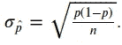

让我们开始把这些概念和置信区间的概念联系起来。p̂ = 0.61 在范围内的概率是多少

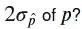

对于正态分布，这大约是 95%。这相当于说有 95%的概率 *p* 在内

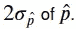

这是置信区间的基本概念。

现在，我们有一个问题。我们不知道 *p* ，所以我们需要使用一个估计值。我们最好的估计自然是 p̂.因此，不使用

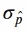

我们使用标准误差:

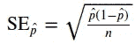

计算我们的置信区间。

```
SE_hat_p = np.sqrt(p_hat*(1-p_hat)/n)
print(f'With 95% confidence between {np.round(p_hat - 2*SE_hat_p, 2)} and {np.round(p_hat + 2*SE_hat_p, 2)} of students prefer the awkward humor of Ross.')With 95% confidence between 0.46 and 0.76 of students prefer the awkward humor of Ross.
```

请注意，我们上面计算的置信区间可以根据我们实际选择的样本比例而变化。如果该组学生再次抽样 40 名新学生，则新的样本比例现在可以是 0.55。

```
p_hat = 0.55
n = 40
SE_hat_p = np.sqrt(p_hat*(1-p_hat)/n)
print(f'With 95% confidence between {np.round(p_hat - 2*SE_hat_p, 2)} and {np.round(p_hat + 2*SE_hat_p, 2)} of students prefer the awkward humor of Ross.')With 95% confidence between 0.39 and 0.71 of students prefer the awkward humor of Ross.
```

我们可以把这个概念和误差范围联系起来。我们第一次试验的误差幅度(知道我们有兴趣获得 95%的置信度)是我们 SE 的 2 倍。

一个经常出现的有趣问题是“你能做些什么来减少误差幅度”？请注意，误差幅度取决于 SE，SE 与样本大小成反比。因此，减少误差的一个可能方法是增加样本量。

```
print(f'Margin of error = {2*SE_hat_p}')Margin of error = 0.15732132722552272
```

同样的推理也适用。根据我们的样本比例，我们的误差幅度可能会有不同的值。

其思想是，如果我们重复使用这种计算置信区间的方法，每次都会产生不同的区间(取决于样本比例),其中 95%的时间包含真实比例。

```
confidence_interval=0.95
p = 0.61
n = 50
number_trials = 25

p_hat_list = []
SE_hat_p_list = []

for i in range(number_trials):
    s_ = bernoulli.rvs(p=p, size=n)
    p_hat = s_[s_==1].shape[0] / s_.shape[0]
    p_hat_list.append(p_hat)
    SE_hat_p_list.append(2*np.sqrt(p_hat*(1-p_hat)/n))j=0
_, ax = plt.subplots(1, 1, figsize=(6, 8))
for i in range(len(p_hat_list)):
    if (p>p_hat_list[i]-SE_hat_p_list[i]) & (p<p_hat_list[i]+SE_hat_p_list[i]):
        # interval contains p
        ax.errorbar(p_hat_list[i], np.arange(len(p_hat_list))[i],lolims=True, xerr=SE_hat_p_list[i], yerr=0.0, linestyle='', c='black')
        j +=1
    else:
        # interval does not contain p
        ax.errorbar(p_hat_list[i], np.arange(len(p_hat_list))[i],lolims=True, xerr=SE_hat_p_list[i], yerr=0.0, linestyle='', c='red')
ax.axvline(0.61, color='darkorange')
plt.xlim(0,1)
plt.show()
print(f'{j}/{number_trials}={np.round(j/number_trials,2)}')
```


图 2:样本比例的置信区间。

```
24/25=0.96
```

我们正在绘制样本比例 p̂和区间:


注意，大约 96%的样本区间包含真实比例 *p* 。随着样本数量的增加，这个数字将收敛到 95%。

```
number_trials = 2000

j=0
for i in range(number_trials):
    p_hat = bernoulli.rvs(p=p, size=n)
    p_hat = p_hat[p_hat==1].shape[0] / p_hat.shape[0]
    SE_hat_p = 2*np.sqrt(p_hat*(1-p_hat)/n)
    if (p>p_hat-SE_hat_p) & (p<p_hat+SE_hat_p):
        # interval contains p
        j +=1

print(f'{j}/{number_trials}={np.round(j/number_trials,2)}')1877/2000=0.94
```

如果我们对 99%的置信区间感兴趣呢？我们需要计算特定置信水平的临界值，也称为 z*。临界值只不过是低于和高于平均值的标准偏差的数量，我们需要得到这个值来获得期望的置信水平(99%)。请注意，使用 z 表或使用来自`scipy`的`norm.ppf`时，请记住您获得的值是针对单尾置信区间的。这不是我们想要的，所以我们需要得到 99.5%的值(在分布的每个尾部留下 0.5%给出 99%的置信度)。

```
CI = 0.99
critical_value = norm.ppf(CI+(1-CI)/2) # we want the critical value for a two-tail distribution
critical_value2.5758293035489004
```

有 99%的可能性 *p* 在:

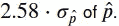

```
number_trials = 1000

j=0
for i in range(number_trials):
    p_hat = bernoulli.rvs(p=p, size=n)
    p_hat = p_hat[p_hat==1].shape[0] / p_hat.shape[0]
    SE_hat_p = critical_value*np.sqrt(p_hat*(1-p_hat)/n)
    if (p>p_hat-SE_hat_p) & (p<p_hat+SE_hat_p):
        # interval contains p
        j +=1

print(f'{j}/{number_trials}={np.round(j/number_trials,2)}')994/1000=0.99
```

# 比例的有效置信区间的条件

让我们首先回忆一下比例有效区间的条件:

*   样本必须是随机的。
*   正态分布可以近似样本比例的抽样分布。经验法则是，你至少需要有 10 次成功和 10 次失败。
*   要求样本是独立的。经验法则是，如果你是在没有替换的情况下抽样，你的样本量应该少于总体量的 10%。

为了帮助我们理解其中的含义，我们将举例说明当其中一个条件不满足时会发生什么。首先，让我们创建一个函数来计算置信区间，并绘制最后 50 个样本。

```
def confidence_interval(p, n, number_trials, N, ci=0.95, sample='random'):
    p_ = bernoulli.rvs(p=p, size=N)
    p_hat_list = []
    SE_hat_p_list = []

    if sample!='random':
        # Inducing bias on the sampling
        p_.sort()
        p_ = p_[:-int(0.2*N)]
        np.random.shuffle(p_)

    for i in range(number_trials):
        s_ = np.random.choice(p_, n, replace=False)
        p_hat = s_[s_==1].shape[0] / s_.shape[0]
        p_hat_list.append(p_hat)
        SE_hat_p_list.append(2*np.sqrt(p_hat*(1-p_hat)/n))

    j=0
    _, ax = plt.subplots(1, 1, figsize=(6, 8))
    for i in range(len(p_hat_list)):
        if (p>p_hat_list[i]-SE_hat_p_list[i]) & (p<p_hat_list[i]+SE_hat_p_list[i]):
            # interval contains p
            if i > len(p_hat_list)-50:
                ax.errorbar(p_hat_list[i], np.arange(len(p_hat_list))[i],lolims=True, xerr=SE_hat_p_list[i], yerr=0.0, linestyle='', c='black')
            j +=1
        else:
            # interval does not contain p
            if i > len(p_hat_list)-50:    
                ax.errorbar(p_hat_list[i], np.arange(len(p_hat_list))[i],lolims=True, xerr=SE_hat_p_list[i], yerr=0.0, linestyle='', c='red')
    ax.axvline(0.61, color='darkorange')
    plt.xlim(0,1)
    plt.show()
    print(f'{j}/{number_trials}={np.round(j/number_trials,2)}')
```

第一个例子是我们的样本不是随机的，也就是说，我们从总体中取样的方式会引入一些偏差。参考我们的上下文，这可能意味着我们的学生小组正在调查学校喜剧俱乐部之外的人，钱德勒的笑话更有效地与他们联系在一起。我们的信心突然下降到 90%以下。

```
confidence_interval(p=0.61, n=35, number_trials=1000, N=500, sample='not_random')
```

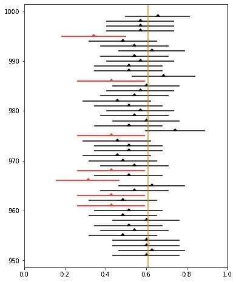

图 3:非随机抽样的样本比例的置信区间。

```
884/1000=0.88
```

第二种情况是，我们不能假设我们的抽样分布是正态的。请注意，我们的抽样规模是 10，这并不保证成功和失败超过 10 次。同样，即使我们计算出 95%的置信区间，真实比例 *p* 在计算区间内的次数百分比大约是 90%。

```
n = 10
print('Normal conditions:')
print('successes >= 10: ' + str(n*p_hat >= 10))
print('failures >= 10 : ' + str(n*(1-p_hat) >= 10))Normal conditions:
successes >= 10: False
failures >= 10 : Falseconfidence_interval(p=0.61, n=10, number_trials=1000, N=500)
```

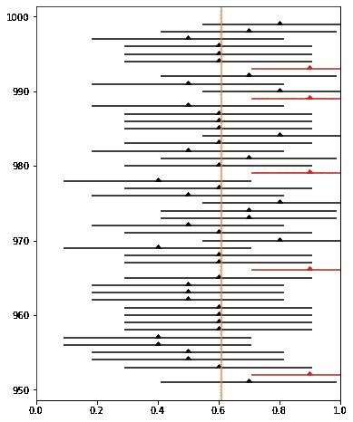

图 4:非正态分布样本比例的置信区间。

```
897/1000=0.9
```

最后，最后一个条件是样本之间的独立性。如果不满足 10%的经验法则，我们就不能假设独立。我们的信心再次下降到接近 90%。

```
n = 150
N=600
print('Independence condition:')
print(n/N < 0.1)Independence condition:
Falseconfidence_interval(p=0.61, n=n, number_trials=1000, N=N)
```


图 5:不满足独立性标准的样本比例的置信区间。

```
904/1000=0.9
```

现在我们已经看到了所有不满足条件的情况，让我们创建一个通过所有 3 个测试的情况。

```
confidence_interval(p=0.61, n=35, number_trials=1000, N=500)
```

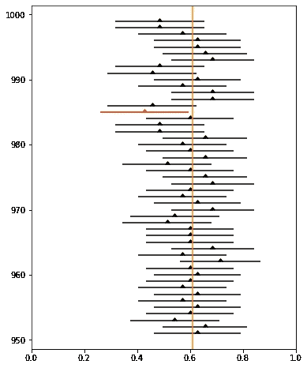

图 6:满足所有 3 个标准的样本比例的置信区间。

```
947/1000=0.95
```

我们的信心有效地收敛到 95%。我们可以对自己的自信充满信心。

# 估计总体均值

我们一直在解决估计人口比例的问题，人口中有百分之几的人更喜欢罗斯的幽默而不是钱德勒的幽默。一个不同的问题是估计人口的平均数。让我们来看看主要的区别。当我们估计人口比例的置信区间时，我们定义:

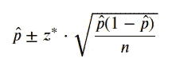

根据同样的原则，我们将总体平均值定义为:

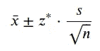

请注意，我们不知道我们的总体标准差，所以我们使用我们的最佳估计，样本标准差。不幸的是，如果我们使用这种方法来计算我们的置信区间，我们将会低估实际的区间。为了达到 95%的置信度，我们需要使用基于 t 分布的不同临界值。

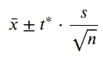

让我们做几个实验来证明我们的观点。首先，我们基于样本标准偏差定义均值的置信区间，但从正态分布计算临界值。

```
def confidence_interval_mean(μ, σ, n, number_trials, N, ci=0.95, sample='random'):
    x_ = norm.rvs(loc=μ, scale=σ, size=N)
    x_hat_list = []
    SE_hat_x_list = []

    if sample!='random':
        # Inducing bias on the sampling
        x_.sort()
        x_ = x_[:-int(0.2*N)]
        np.random.shuffle(x_)

    for i in range(number_trials):
        s_ = np.random.choice(x_, n, replace=False)
        x_hat = np.mean(s_)
        x_hat_list.append(x_hat)
        SE_hat_x_list.append(norm.ppf(ci+(1-ci)/2)*np.std(s_)/np.sqrt(n))

    j=0
    _, ax = plt.subplots(1, 1, figsize=(6, 8))
    for i in range(len(x_hat_list)):
        if (μ>x_hat_list[i]-SE_hat_x_list[i]) & (μ<x_hat_list[i]+SE_hat_x_list[i]):
            # interval contains p
            if i > len(x_hat_list)-50:
                ax.errorbar(x_hat_list[i], np.arange(len(x_hat_list))[i],lolims=True, xerr=SE_hat_x_list[i], yerr=0.0, linestyle='', c='black')
            j +=1
        else:
            # interval does not contain p
            if i > len(x_hat_list)-50:    
                ax.errorbar(x_hat_list[i], np.arange(len(x_hat_list))[i],lolims=True, xerr=SE_hat_x_list[i], yerr=0.0, linestyle='', c='red')
    ax.axvline(μ, color='darkorange')
    #plt.xlim(0,1)
    plt.show()
    print(f'{j}/{number_trials}={np.round(j/number_trials,2)}')confidence_interval_mean(2, 0.5, 12, 2000, 1000)
```

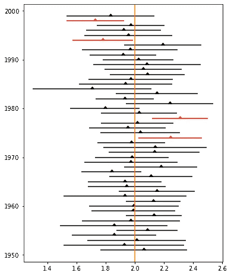

图 7:使用 z*计算的样本均值的置信区间。

```
1837/2000=0.92
```

我们期待的事情发生了，因为真正的平均值只有 92%的时间包含在我们的置信区间内。这不是有意的，因为我们正在计算平均值的 95%置信区间。

在第二个实验中，现在使用的临界值是从 t 分布计算出来的。

```
def confidence_interval_mean_t(μ, σ, n, number_trials, N, ci=0.95, sample='random'):
    x_ = norm.rvs(loc=μ, scale=σ, size=N)
    x_hat_list = []
    SE_hat_x_list = []

    if sample!='random':
        # Inducing bias on the sampling
        x_.sort()
        x_ = x_[:-int(0.2*N)]
        np.random.shuffle(x_)

    for i in range(number_trials):
        s_ = np.random.choice(x_, n, replace=False)
        x_hat = np.mean(s_)
        x_hat_list.append(x_hat)
        SE_hat_x_list.append(t.ppf(ci+(1-ci)/2, df=n-1)*np.std(s_)/np.sqrt(n))

    j=0
    _, ax = plt.subplots(1, 1, figsize=(6, 8))
    for i in range(len(x_hat_list)):
        if (μ>x_hat_list[i]-SE_hat_x_list[i]) & (μ<x_hat_list[i]+SE_hat_x_list[i]):
            # interval contains p
            if i > len(x_hat_list)-50:
                ax.errorbar(x_hat_list[i], np.arange(len(x_hat_list))[i],lolims=True, xerr=SE_hat_x_list[i], yerr=0.0, linestyle='', c='black')
            j +=1
        else:
            # interval does not contain p
            if i > len(x_hat_list)-50:    
                ax.errorbar(x_hat_list[i], np.arange(len(x_hat_list))[i],lolims=True, xerr=SE_hat_x_list[i], yerr=0.0, linestyle='', c='red')
    ax.axvline(μ, color='darkorange')
    #plt.xlim(0,1)
    plt.show()
    print(f'{j}/{number_trials}={np.round(j/number_trials,2)}')confidence_interval_mean_t(2, 0.5, 12, 2000, 1000)
```


图 8:使用 t*的样本均值的置信区间。

```
1892/2000=0.95
```

我们的信心有效地收敛到 95%。再一次，我们可以对自己的自信充满信心。

# 有效 t 间隔的条件

我们已经看到了比例有效区间的条件。在 t 间隔的情况下，同样的规则适用。区别在于如何验证我们的分布是否可以被认为是正态分布。：

*   样本必须是随机的。
*   样本均值的抽样分布可以近似为正态分布。有三种方法可以实现:样本量大于 30(中心极限定理适用)，原始分布是正态的，或者原始分布是对称的。
*   要求样本是独立的。经验法则是，如果你是在没有替换的情况下抽样，你的样本量应该少于总体量的 10%。

我们把证明上述要点的实验作为本周的练习。

# 结论

在本文中，我们讨论了置信区间和误差幅度等概念。我们从定义和计算样本比例的置信区间开始。要计算这样的置信区间，必须满足 3 个条件。我们模拟了 3 种不满足条件的场景。通过分析这些影响，我们观察到在每个场景中引入的偏差影响了我们的信心水平。

我们还解决了计算样本均值置信区间的问题。在这种情况下，用于计算的临界值不能基于正态分布，而是基于 t 分布。通过模拟大量样本，我们展示了基于正态分布的临界值是如何低估实际置信区间的。最后，与我们对样本比例所做的一样，我们建立了有效 t 区间的条件。

保持联系: [LinkedIn](https://www.linkedin.com/in/luisbrasroque/)

# 练习

你将在下周的文章中找到答案。

1.  更改函数`confidence_interval_mean_t`并构建 5 个不同的实验来计算样本均值的 95%区间，其中 3 个不满足 t 区间的条件，2 个满足。对于不满足条件的 3，定义以下情况:抽样不随机，原始分布不近似正态，不满足独立性。对于满足条件的两种情况，定义一种情况下原始分布是正态分布，另一种情况下原始分布是偏斜的，但采样均值是正态分布。对于后两种情况，真正的总体均值应该包含在 95%的计算置信区间内。

*提示:您可能会发现使用* `*scipy*` *中的* `*skewnorm*` *函数很有用。下面，您有一个正态分布的修改版本，由偏斜度参数、平均值和标准偏差来偏斜。*

```
# code adapted from https://stackoverflow.com/questions/49367436/scipy-skewnorm-mean-not-matching-theory

skew = 4.0
mean = 2
stdev = 0.5

delta = skew / math.sqrt(1\. + math.pow(skew, 2.))
adjStdev = math.sqrt(math.pow(stdev, 2.) / (1\. - 2\. * math.pow(delta, 2.) / math.pi))
adjMean = mean - adjStdev * math.sqrt(2\. / math.pi) * delta

print('target mean={:.4f} actual mean={:.4f}'.format(mean, float(skewnorm.stats(skew, loc=adjMean, scale=adjStdev, moments='mvsk')[0])))
print('target stdev={:.4f} actual stdev={:.4f}'.format(stdev, math.sqrt(float(skewnorm.stats(skew, loc=adjMean, scale=adjStdev, moments='mvsk')[1]))))target mean=2.0000 actual mean=2.0000
target stdev=0.5000 actual stdev=0.5000# Original skewed distribution

plt.hist(skewnorm.rvs(a = skew, loc=adjMean, scale=adjStdev, size=2000), bins=50);
```

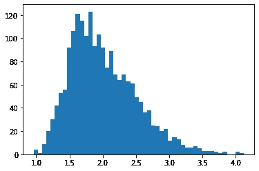

```
# Approximately normal distribution of the sample mean because sample 
# size is bigger than 30 (CTL applies)

plt.hist(np.mean([skewnorm.rvs(a = skew, loc=adjMean, scale=adjStdev, size=35) for _ in range(2000)], axis=1), bins=50);
```

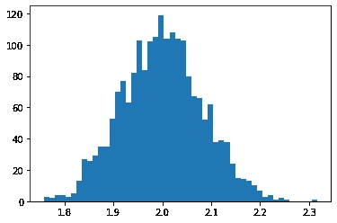

## 上周的答案

1.  里克在一个遥远的星球上对 75 名公民进行了 SRS 调查，以了解抽样调查的公民中有多少人对自己的生活水平感到满意。假设生活在这个星球上的 10 亿公民中有 60%对自己的生活水平感到满意。对生活水平满意的公民比例抽样分布的均值和标准差是多少？

```
mu_hat_p = 0.6
print(mu_hat_p)

sigma_p_hat = np.sqrt(0.6*(1-0.6)/75)
print(sigma_p_hat)0.6
0.0565685424949238
```

2.某个拥有超过 1，000，000 个家庭的星球的平均家庭收入为 1，000，000 美元，标准差为 150，000 美元。Rick 计划随机抽取 700 个家庭样本，计算样本平均收入。计算 x̄.抽样分布的平均值和标准差

```
μ = 1000000
σ = 150000
n = 700

print(f'μ_x_bar = {μ}')
print(f'σ_x_bar = {σ/n**(1/2)}')μ_x_bar = 1000000
σ_x_bar = 5669.467095138409
```

3.Rick 正在对不同的入口枪进行质量控制测试，因为在制造过程中存在一些可变性。某枪靶厚 5mm。厚度分布向右倾斜，平均值为 5 毫米，标准偏差为 1 毫米。该零件的质量控制检查包括随机抽取 35 个点，并计算这些点的平均厚度。样本平均厚度的抽样分布是什么形状？样品中的平均厚度在目标值 0.2 毫米以内的概率是多少？

```
# Since n = 35 >= 30, the central limit theorem applies.
# Even though the population is skewed to the right, the sample means
# are normally distributed due to the sample size.μ = 5
σ = 1
n = 100norm.cdf(5.2, μ, σ/n**(1/2)) - norm.cdf(4.8, μ, σ/n**(1/2))0.9544997361036418
```