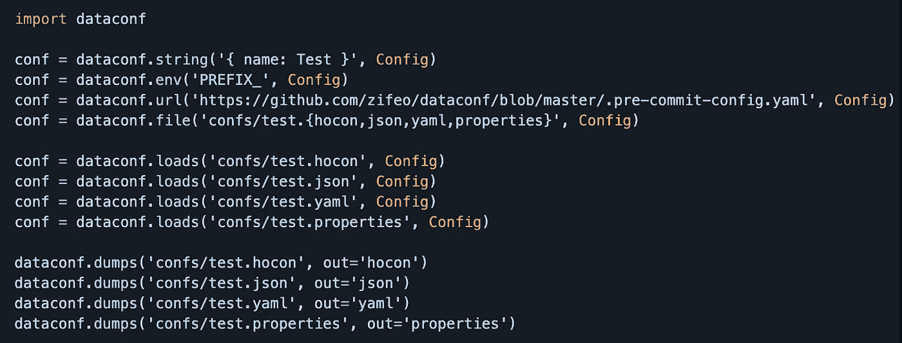

# 使用数据类的 Python 配置文件

> 原文：<https://towardsdatascience.com/configuration-files-in-python-using-dataclasses-ec8528e72e01?source=collection_archive---------12----------------------->

## 使用 dataclasses 对 Python 中的配置文件进行类型安全解析

作者图片

# TL；速度三角形定位法(dead reckoning)

有了 Python `dataclasses`和新的`dataconf`库，我们现在可以安全地将配置文件解析成数据类。对于来自 Scala 的用户来说，这是从 case 类和 PureConfig 类型安全解析的简单过渡。要查看 Python 和 PySpark 用例中的示例用法，请跳到用法。

# 介绍

啊，配置文件。一个人必须爱他们，对不对？也许吧？看情况。对于那些使用 Scala 和其他 JVM 语言的人，我们可以使用 [HOCON](https://github.com/lightbend/config) 、json 的人类可读格式、`typesafe config`和 [pureconfig](https://github.com/pureconfig/pureconfig) 轻松地将复杂的配置或属性文件直接加载到 case 类中。有了这些，生活是美好的。我们的 Python 用户呢？

# 数据类的介绍

在 Python 3.7 中，[数据类](https://www.python.org/dev/peps/pep-0557/)通过简单的 pip 安装向后兼容 Python 3.6。通过这个介绍，Python 本质上引入了可变格式的 Scala case 类。但是，`dataclasses`可以被冻结以实现不可变的变体。有了这个介绍，我们的 Python 用户能实现同样的简化的配置文件解析吗？还没有。的确，PyHocon 已经存在了很多年，但是仍然缺少了一些东西。2020 年 5 月，Github 用户 [@zifeo](https://github.com/zifeo) 将他的库 [dataconf](https://github.com/zifeo/dataconf) 发布到 PyPI，这是链中的最后一环。

# 数据会议库

`dataconf`所做的是允许用户读入带有定义参数的配置文件，并直接输入到 Python `dataclass`中。大约在 2021 年 8 月，我在寻找一种将配置文件轻松传递到 Python 的方法时偶然发现了这个库。根据我使用 Scala 的经验和对 Python 的`dataclasses`的了解，我很高兴看到这个功能。在过去的几个月里，我添加了一些已经在版本`0.1.5`、`0.1.6`和`0.2.0`中发布的附加特性，以进一步复制`pureconfig`。目前，`dataconf`已经快速成熟，目前是版本`0.3.0`。由于缺少 Python `3.7.x`中没有的更新，`dataconf`将只能在 Python `>= 3.8.x`上工作。

在 [True Digital Group](https://www.truedigital.com/) 这里，我们正在开发一个定制的 MLOps 管道，用 Python 以自动化的方式为我们的用户和客户服务。然而，为了编排这些管道，我们将使用类似于我们在 Scala 中构建的数据管道的配置文件。答案是。我添加了解析嵌套配置的能力，并使用 Python 中的抽象基类`dataclasses`模拟 Scala 密封特征的行为。这个库可能并不完美，但是我们现在可以依赖它来满足我们的 Python 管道需求。

为了使用`dataconf`，用户入口点主要是`load`和`loads`。然而，如果传递`ConfigTree`对象，它们将需要使用`__parse`。当前的计划是在未来的版本中，用`from_config`、`from_file`和`from_string`重构用法，使之类似于`pureconfig`或另一种类似的模式。带代码的演示报告可在[这里](https://github.com/dwsmith1983/demo-dataconf)找到。最后注意，版本`0.2.0`和更低版本不能解析`-`，所以使用版本`0.2.1`或更高版本。

# 用法示例

假设我们需要运行一个管道，接收数据或数据源，进行一些处理，然后将数据写出来。然而，数据可能来自 Python 中许多不同的文件格式，或者来自表、sql 查询或 HDFS 路径。在这种情况下，使用配置文件、数据类和`dataconf`可以简化我们的工作并避免分支。在示例中，我使用抽象元类来处理不同的输入类型。有了这个，我可以让`PipeParams`或`Params`手柄决定`dataclass`匹配。所有的类都带有`load_df`,所以我们可以使用相同的方法名调用来加载数据帧，而不管哪个被解析。下面的例子仅仅是关于如何使用 dataclasses 和`dataconf`来简化你的产品编码的皮毛。

*原载于 2021 年 10 月 25 日*[*https://tech . true analytics . ai*](https://tech.trueanalytics.ai/posts/dataconf-at-tdg/)*。*