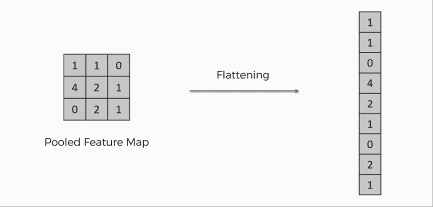

# 使用传统的机器学习算法配置 CNN 模型

> 原文：<https://towardsdatascience.com/configure-a-cnn-model-using-traditional-machine-learning-algorithms-ac31a11e1c12?source=collection_archive---------21----------------------->

## 将集成学习算法应用于影像数据集，影像数据集是通过 python 实现由卷积图层提取的要素

```
***Table of Contents* 1\. Introduction
2\.** [**Layers**](#096c) **2.1\. Convolutional Layer
2.2\. Pooling Layer
2.3\. Dropout Layer
2.4\. Flatten Layer
3\.** [**Tutorial**](#5928) **3.1\. Dense Layer Approach
3.2\. Ensemble Learning Approach
4\. Results
5\.** [**Discussion**](#bab4)
```

# 1.介绍

在传统的机器学习应用中，在对数据集应用必要的数据预处理过程之后，它主要被转换成 *(n_samples，n_features)* 并应用该算法。为了避免过拟合和欠拟合等情况，样本的数量应该很大。为了防止这种情况，或者通过各种方法来扩展图像数据集的图像扩充，或者应用诸如特征提取、特征选择或维数减少的方法。

卷积神经网络(CNN)是一种深度学习方法，主要用于图像数据集。它通过用人工神经网络训练模型来用于分类。当我们处理该模型时，给定图像数据集的特征与其结构中的层一起被提取，并且这些获得的特征由诸如密集层的各种层训练。

本文包括如何使用集成学习算法对使用卷积层提取特征的图像数据集进行分类。python 实现丰富了这项工作。


照片由[尤里·赛洛斯](https://unsplash.com/@yuridfv?utm_source=medium&utm_medium=referral)在 [Unsplash](https://unsplash.com?utm_source=medium&utm_medium=referral) 上拍摄

# 2.层

首先，让我们简要了解一下在构建本教程中使用的模型时使用的图层:

## 2.1.卷积层

卷积层是卷积神经网络(CNN)的主要构件。它们将像素值作为输入，并执行特征提取。它由过滤器和内核组成。学习是通过从数据集中提取一个子集，然后对其进行过滤和处理来进行的。利用线性乘法来执行这些处理，并且提取关于图像的诸如边缘检测之类的特征。图 1 显示了由具有不同内核的 *cv2 库*提供的梯度滤波器的应用。


图一。内核在渐变滤镜中的效果，图片作者

如果我们再深入一步，这个过程是如何发生的？如上所述，它是一个简单的数学运算，名为卷积。用数学来说明:

输入= [ 5 10 15 20 25 30]

过滤器= [0 1 0]

输出计算如下:

```
[5 10 15]  . [0 1 0] = 10
[10 15 20] . [0 1 0] = 15
[15 20 25] . [0 1 0] = 20
[20 25 30] . [0 1 0] = 25
```

过滤后的矩阵，即**输出为【10 15 20 25】**。这个过程也可以作为 2D 卷积层多样化。

## 2.2.汇集层

汇集层对卷积层之后获得的矩阵值执行各种操作。平均池取确定的矩阵大小中像素值的平均值，而顾名思义，最大池取最大值。如图 2 所示，通过使用 2x2 池，4x4 矩阵已经缩小到 2x2 大小。它概括了特定区域的特征，降低了特征的维数。这样，在模型变得更加通用的同时，避免了**过拟合**。


图二。最大池(左)和平均池(右)是做什么的？，[来源](https://www.researchgate.net/figure/Illustration-of-Max-Pooling-and-Average-Pooling-Figure-2-above-shows-an-example-of-max_fig2_333593451)

## 2.3.脱落层

用最简单的话来说，它删除了图 3 中获得的一些特征，也就是说，它导致了信息丢失。如果我们处理 128×128×3 的 RGB 图像，并考虑像素是图像数据集的特征，我们将有大约 50000 个特征。通过申请退学，可以放弃其中的一些功能。这样，也防止了**过拟合**。


图 3。辍学层是做什么的？，[来源](https://medium.com/@amarbudhiraja/https-medium-com-amarbudhiraja-learning-less-to-learn-better-dropout-in-deep-machine-learning-74334da4bfc5)

## 2.4.展平图层

扁平化层用于 CNN 模型第一部分的最后一层，该模型将矩阵形状从 3x3 转换为 9x1，如图 4 所示，以便为通过完全连接的层进行分类准备数据集。



图 4。展平图层是做什么的？，[来源](https://www.superdatascience.com/blogs/convolutional-neural-networks-cnn-step-3-flattening)

# 3.辅导的

在图像的特征之后，使用卷积层提取数据集，这些特征分别由密集层和集成学习算法训练。讨论了实现和结果。

> 可以通过[链接](https://github.com/theibrr/kitchenware)访问数据集。

## 3.1.密集层方法

该数据集由 233 个样本组成，包含杯子、盘子、碟子，被训练用于分类。首先，使用图像增强过程来扩展数据集。在应用数据预处理过程之后，它被分成训练集和测试集。训练数据集使用如下构建的模型进行训练:

*   **[1] -图像放大、调整大小和缩放**

预定义的图像增强过程重复 15 次，并且样本数量增加大约 3500。数据集中的所有图像都调整为 128 x 128 像素，每个像素除以 255 进行缩放。

*   **【2】-型号**

CNN 模型由两个主要部分组成。使用`‘model’`提取特征，它作为第一个组件按顺序构建。由于像素是图像数据集的特征，并且图像的形状是 128×128×3，所以特征的总数是 49152。输入形状在第一卷积层中定义。在接下来的卷积层中， `L1 & L2 regularizations`被用于防止**过拟合**。*L1&L2 正则化的作用是调整权重的重要性，因此可以假设卷积层的正则化参数是层的学习速率。*此外，以不同的速率应用`Dropout` 以防止**过拟合**，最后，使用`Flatten layer`将模型的形状转换为(n_samples，n_features)。该模型的概要如图 5 所示。


图 5。模型摘要，图片由作者提供

查看展平层的输出形状，可以看到，开始时的特征数为 49152，使用层后为 1728。

在模型的第二部分中，在提取特征之后，应用密集层来执行分类过程。最后，通过组合输入(**是提取特征的部分**)和输出(**是进行分类的部分**)来创建“T4”。

*   **【3】-模型评估**

准备混淆矩阵和测试数据集的分类报告来评估模型。

*   **【4】——模型泛化性能**

使用 google images 随机下载了 15 张杯子和盘子的图像，并用训练好的模型进行预测，以测试模型的泛化性能。

## 3.2.集成学习方法

在引言句中已经提到，机器学习中的数据集是以 *(n_samples，n_features)* 的格式进行训练的。在这一部分中，应用了集成学习算法，但是可以使用任何分类算法来代替。查看图 5 中的展平图层，可以看到它被提取为 1728 个要素。在这一部分中，分类过程使用集成学习算法而不是密集层来完成，如下所示:

*   [1]-通过 CNN 模型的第一部分`‘model’`预测训练集、测试集和外部测试集，并创建派生数据集。
*   [2]-创建包含混淆矩阵结果的函数，以便应用所有算法。
*   [3]- XGBoost、LGBM、基于直方图的 GB、ExtraTree、AdaBoost、Bagging 算法在其基础版本中用于分类。

# 4.结果

密集层方法的混淆矩阵如图 6 所示。


图 6。测试集的混淆矩阵(左)，外部测试集的混淆矩阵(右)，图片作者

可以看出，在测试数据集中实现了 91%的成功，而在外部测试数据集中获得了 13/15 的准确性，该外部测试数据集是从不同的源随机生成的，用于模型泛化性能。

集成学习方法的结果如图 7 所示。


图 7。集成学习算法的结果，图片由作者提供

可以看出，尽管测试数据集精度高，但是在外部测试数据集中获得了低精度结果。这表示**过拟合**。

# 5.讨论

由于这项研究主要是关于开发一个 CNN 模型，它不是集中在集成学习方法。然而，可以看出，尽管没有调整超参数，但是这些方法中的一些，例如 XGBoost，具有令人满意的结果。

有必要了解它是如何工作的，以促进卷积神经网络的应用。本文旨在提供不同的选择和灵活性。有可能提高在集成学习算法中获得的准确性结果，例如使用 GridSearch 检测超参数的最佳组合或扩展数据集。深度学习中的 CNN 模型在图像数据集上的效果无可争议地好，但当作为替代方案进行研究时，这种方法甚至可以被评估用于不同的目的。

## 回到指引点击[这里](https://ibrahimkovan.medium.com/machine-learning-guideline-959da5c6f73d)。

[](https://ibrahimkovan.medium.com/machine-learning-guideline-959da5c6f73d) [## 机器学习指南

### 所有与机器学习相关的文章

ibrahimkovan.medium.com](https://ibrahimkovan.medium.com/machine-learning-guideline-959da5c6f73d) [](/comprehensive-guide-for-principal-component-analysis-7bf2b4a048ae) [## 主成分分析综合指南

### 用 python 实现主成分分析的理论和实践部分

towardsdatascience.com](/comprehensive-guide-for-principal-component-analysis-7bf2b4a048ae)