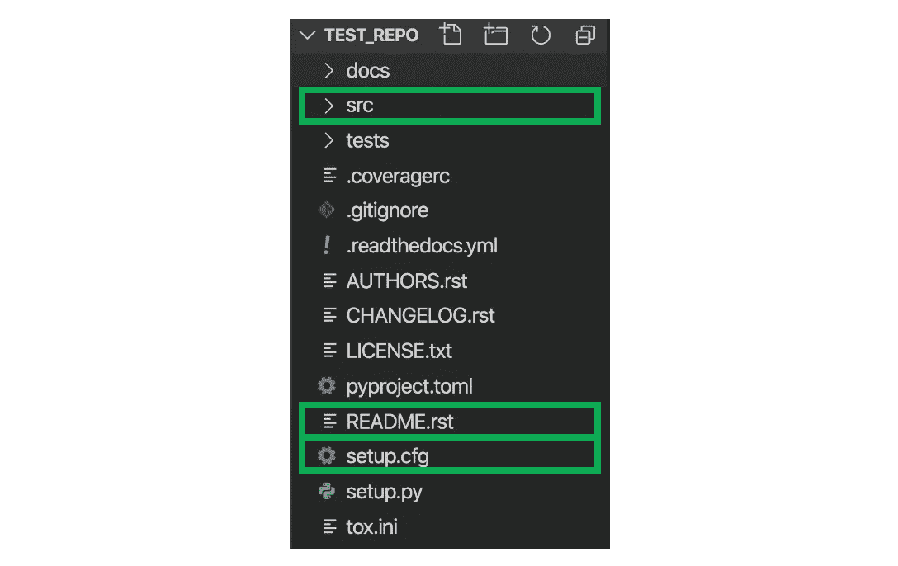

# 在 1 分钟内创建一个你的同事能够理解的代码库

> 原文：<https://towardsdatascience.com/configure-a-codebase-your-colleagues-will-understand-in-1-minute-faa02483cbf?source=collection_archive---------14----------------------->


晚上创作的背景照片 _ 陶—

## [实践教程](https://towardsdatascience.com/tagged/hands-on-tutorials)

## *使用 PyScaffold 和预提交挂钩配置结构化数据科学报告*

在组织中，数据科学代码库(又名存储库或包)有一个**通用文件结构*。***

结构是指代码库中文件的布局，例如:


基本代码回购结构。(图片由作者创作)。

在大学、Kaggle 或宠物项目中，你可以在代码库结构上有点无赖——毕竟，最重要的是输出。

但是在组织中，代码库的结构也很重要，而且非常重要。

我们在这里讨论的是构建代码库的*通用最佳实践*——组织希望你作为数据科学家使用的那种。

# 为什么通用代码库结构很重要？

这很重要，因为在组织中，其他人会与你的代码进行交互。当其他人与你的代码交互时，你希望他们**在尽可能短的时间内理解你的代码库**这样他们就可以开始为之做出贡献。

如果文件结构是一种通用格式，您的数据科学家和开发人员同事只需花几分钟就能理解它，然后就能进入有趣的部分——钻研代码本身。

或者，如果代码库结构*不是*的通用格式，那么每次有人查看新的代码库时，他们将不得不花费额外的时间(比如 2 小时)来熟悉它的结构。无聊吧？我们宁愿直接找到代码并开始编程！

然后是整个团队的时间损失。如果你考虑一个有 100 名开发人员的企业，每个人平均一年开发 10 个现有的代码库，他们花 2 个小时熟悉每个代码库的结构—**2000 个小时仅仅是理解回购结构。**那就是每年有 83 天或 3 个月不必要的工作损失。

令人难以置信的是，如果开发者花 **1 分钟，**为回购建立一个共同的结构，这是可以避免的。对于 10 次回购，这是**10 分钟的** **成本，以节省 3 个月的损失时间。**

多划算啊！

# 如何在 1 分钟内创建结构化 Git 回购

好消息是，实际上就这么简单:

```
your_directory$ **pip install pyscaffold**
your_directory$ **putup your_repo_name**
```

就是这样！在您想要存储 repo 的目录中执行这两行代码后，它将在大多数数据科学家常用的文件结构中创建—不到 1 分钟！它将看起来像这样，并立即准备好开始编码:


你的结构性回购。(图片由作者创作)。

# 让您的代码库*更加可用*

在你的新代码库中有 3 部分标准文件对此有帮助——**src**文件夹、 **setup.cfg** 文件(和预提交钩子)和 **README** 文件:



(图片由作者创作)。

# **src 文件夹**

这个 repo 最重要的部分是 **src** (source)文件夹，因为这是您的数据科学代码将要存放的地方。您可以从 src 构建一个完整的数据科学项目，而无需接触任何其他文件。

src 文件夹最初看起来像这样:


使用 pyscaffold putup 函数后的 src 文件夹(图片由作者创建)。

可以忽略 __init__。py 和 skeleton.py 文件。重要的是您*添加*到该文件夹的内容，即**用于数据清理、标记、建模等的功能。**

**构造 src 文件夹的常用方法如下:**

*   包含函数的文件
*   一个连续调用这些函数并提供输出的 runner 文件

以下是一个 src 结构示例:


一个非常基本的 src 文件夹结构的例子(图片由作者创建)。

如您所见，有三个文件夹**和**，每个文件夹都包含 python 文件和函数:

1.  **预处理:**用于清理你的数据(处理缺失值，标准化数据等)
2.  **模型**:任何需要建立的模型(如贝叶斯神经网络)以及根据需要训练它的功能
3.  **结果**:用于输出您的预测结果(以图表或 CSV 等形式)

然后我们有了非常重要的 **runner.py** 文件，它导入数据，按顺序调用这些函数，并提供输出(可能会将结果保存到 csv 或绘图到文件夹等)。

# 自述文件

自述文件是你回购的另一个重要部分。这告诉你的数据科学家同事如何使用你的代码库。它非常有用，可以解释如下内容:

*   你的回购做什么
*   需要哪些依赖项以及任何安装说明
*   任何其他使用说明
*   如何与作者取得联系

您的同事在开始处理您的代码库时，可能会首先查看这个文件，所以有必要弄清楚这一点

# **setup . CFG 文件&预提交钩子**

在这最后一步，我们会告诉您的同事他们需要哪些安装来运行您的代码库，并配置规则(挂钩),以帮助确保只有格式良好的代码才能提交到您的代码库。

首先让我们看看 setup.cfg 文件。这里值得编辑的主要部分是“ **install_requires”。**这个是一个超级有用的部分，因为它告诉新用户**需要哪些包和版本来运行你的代码库**。如果没有这一点，您的同事可能会安装没有所需功能的旧版本(因此在运行时会导致错误)。

库以 ***库* == *版本*** 的形式添加到本节中，例如:


(图片由作者创作)。

在 install_requires 部分，我们还可以**添加三个高质量的包**，这有助于**使您的*实际代码*对您的同事来说更具可读性**:


(图片由作者创作)

**预提交和预提交钩子是很棒的包！它们本质上拥有一组格式化“钩子”和格式化规则，在你提交任何东西之前，你的代码必须遵守这些规则。这些规则是标准的最佳实践，在数据科学中被广泛使用(并被期待)。例如:**

*   **代码** **行长度**不能大于 100 个字符
*   **导入语句**必须在文件的顶部
*   每个函数之间必须留有两个空行

当您尝试提交时，预提交包将**让您知道哪些规则没有被满足**，以便您可以修复它们。

**设置预提交挂钩的两个简单步骤**:

1.  **通过在 repo 的终端(或其他 shell)中执行以下命令来安装预提交**:

```
your_directory$ **pip install pre-commit**
your_directory$ **pre-commit install -t pre-commit**
```

2.**创建一个. pre-commit-config.yaml** 文件来存储你的钩子

这个文件是 pre-commit 在你提交某个东西的时候读取的— **所以** **你应该在这里列出你想要哪个钩子**。添加*。将 pre-commit-config.yaml* 文件提交到您的根文件夹(即 src 上面的文件夹)。

**下面是一个基本配置，你可以复制到你的*中。pre-commit-config . YAML***文件开始—它指示上面要点中的三个钩子:*尾随空格*，*重新排序 python 导入*， *flake8* (代码风格指南实施—使用非常广泛)。

用于复制和粘贴的代码:

```
default_language_version: python: python3repos: - repo: local hooks: - id: reorder-python-imports name: reorder-python-imports entry: reorder-python-imports language: python types: ["python"] - id: flake8 name: flake8 entry: flake8 language: python types: ["python"] - id: trailing-whitespace name:  trailing-whitespace entry: trailing-whitespace-fixer language: python types: ["python"]
```

它应该是这样的:


(图片由作者创作)。

**现在，当您提交时，钩子应该开始工作:)**为了进行测试，尝试提交一个包含错误代码的. py 文件——它应该被拒绝，并且应该在终端中返回一个需要修复的代码行列表。

**您可以在中添加任意数量的挂钩。预提交 config.yaml 文件。**预提交的文档可以在[这里](https://pre-commit.com/)看到，更完整的钩子列表可以在[这里](https://pre-commit.com/hooks.html)看到。

**就这样！**您可以像往常一样将这个代码库推送到 GitHub，因为您已经掌握了专业代码库设置的基础知识:)

# 最后一个音符

结构化回购有用的关键在于，每个人都使用相同的结构——一种大家熟悉的已知结构。你的组织可能会有一个固定的结构，它可能与上面的不同。然而，上述方法是数据科学中一个众所周知的结构，在没有其他指导原则的情况下，这是一个很好的选择。

希望那有用！如果您有任何问题，请随时在 LinkedIn 上给我发[消息](https://www.linkedin.com/in/lucyrothwell/)。你也可以**订阅我的帖子** [这里](https://medium.com/subscribe/@LuRoth_)。

最后，如果你想进一步支持 Medium 上的作者，你可以在这里注册成为会员。