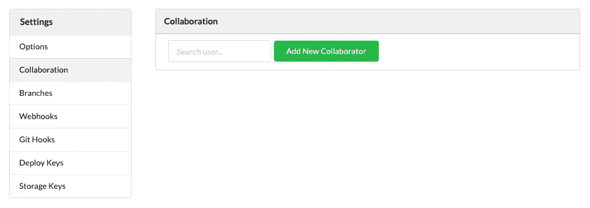
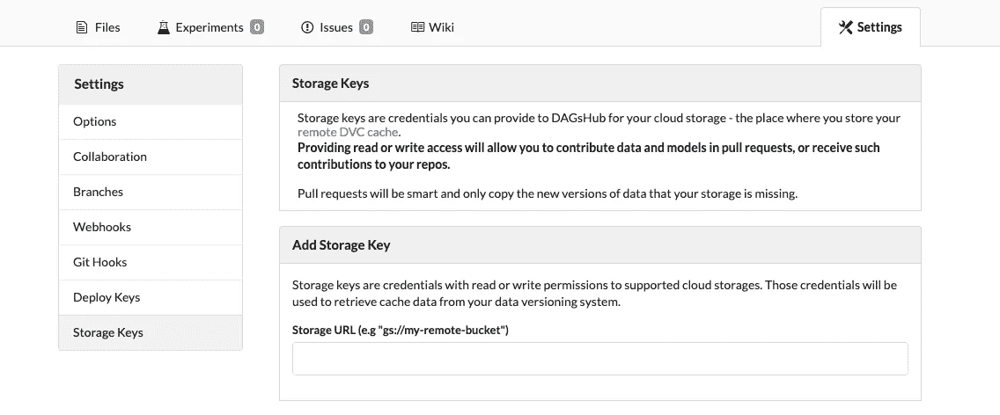

# 配置没有 DevOps 学位的 DVC 远程

> 原文：<https://towardsdatascience.com/configure-a-dvc-remote-without-a-devops-degree-3b2b06961e8f?source=collection_archive---------37----------------------->


照片由 [Honey Yanibel Minaya Cruz](https://unsplash.com/@honeyyanibel) 在 [Unsplash](https://unsplash.com/) 上拍摄

## 有了 DAGsHub 储物件，一切都变得简单了

[DVC](https://dvc.org/) 是一个伟大的工具；它可以让你追踪和分享你的数据、模型和实验。它还支持管道对典型 ML 工作流中的步骤进行版本控制。要共享您的数据和模型，您需要配置一个 DVC 遥控器(如 S3、GCloud Storage、GDrive 等。)，但这样做可能会很麻烦，而且会花费大量时间。


要订购的东西太多了…照片由[汉斯-彼得·高斯特](https://unsplash.com/@sloppyperfectionist?utm_source=ghost&utm_medium=referral&utm_campaign=api-credit) / [Unsplash](https://unsplash.com/?utm_source=ghost&utm_medium=referral&utm_campaign=api-credit) 拍摄

在这篇文章中，我将向你展示这种配置不应该如此困难；应该是流畅轻松的。为了解决这个问题，我们创建了 DAGsHub Storage，这是一个超级容易配置的 DVC 遥控器，无需信用卡，无需授予复杂的权限，也无需云设置。只需五个命令，您就可以开始了！

首先，您需要在 DAGsHub 上有一个项目。有两种方法可以做到这一点，要么[从头创建一个](https://dagshub.com/repo/create)要么[从任何其他平台连接一个现有项目](https://dagshub.com/repo/connect)(我们支持 GitHub、GitLab、BitBucket 和任何其他可访问的 Git remote)。

如果你需要，我们有一个关于如何在我们的平台上开始一个新项目的教程[](https://dagshub.com/docs/experiment-tutorial/overview/)**。**

*要继续这个教程，你需要先安装 DVC。*

*在 Git 项目中安装 DVC 后，通过运行以下命令初始化它*

```
*dvc init*
```

*该命令将创建`.dvc/.gitignore`、`.dvc/config`、`.dvc/plots`和`.dvcignore`。这些条目可以用*

```
*git commit -m "Initialize DVC"*
```

*对于本教程，我已经创建了一个具有以下结构的新项目*

```
*data
├── processed
│   ├── test_text.txt
│   └── train_text.txt
└── raw
    └── test_full.txt*
```

*为了开始跟踪我们的数据，无论是文件还是目录，我们使用`dvc add`*

```
*dvc add data*
```

**这里是 DVC 施展魔法的地方。*存储关于添加到`.dvc`文件中的条目的元数据；这是一个小文本文件，包含关于如何访问原始条目的信息，但不是原始条目本身。这个命令将添加的条目添加到`.gitignore`文件中，这样我们就不会不小心提交了。*

*在我们的例子中，DVC 创建了一个名为`data.dvc`的文件，如下所示*

```
*outs:
- md5: 61b3e1a6439d6770be4d210b758f6cbd.dir
  size: 0
  nfiles: 3
  path: data*
```

*这是将由 Git 进行版本控制的文件。*

*在这一步之后，我们准备提交`.dvc`文件，就像我们处理任何源代码一样。*

```
*git add data.dvc .gitignore
git commit -m "Add data"*
```

# *远程存储数据*

**

*配置一个桶不应该这么难！杰西卡·约翰斯顿 / [Unsplash](https://unsplash.com/?utm_source=ghost&utm_medium=referral&utm_campaign=api-credit) 拍摄的照片*

*太棒了。我们现在正在跟踪数据的版本，现在我们必须弄清楚在哪里存储数据本身。*

*正如我之前提到的，我将向你展示如何毫不费力地配置 DVC 遥控器。遵循五个简单的命令，您将把您的数据和模型与代码放在一起。为了便于比较，我还将向您展示设置遥控器的传统方式，这样您就可以很容易地理解使用 DAGsHub 存储节省的时间。*

# *没有 DevOps 学位怎么做*

*在 DAGsHub，我们会自动为平台上的每个项目创建一个 DVC 遥控器来推送您的数据和模型，就像您收到 Git 遥控器来推送您的代码一样。这就是简单性开始显现的地方！要从该 URL 推送或提取数据，我们将使用现有的 DAGsHub 凭据(通过 HTTPS 基本身份验证)。这意味着我们不需要配置任何 IAM，不需要提供访问令牌来访问您的存储桶或任何与云提供商相关的东西。*

*公共存储库将拥有公开可读的数据，就像代码一样。如果您想要共享或接收来自协作者的数据，请将他们添加为项目协作者。如果你的库是私有的，那么只有维护者能够将数据拉进或推进其中。*

**

*基本上能克隆代码就能拉数据！在 DAGsHub 上添加合作者*

*让我们把手弄脏吧！*

1.  *我们需要添加 DAGsHub 作为我们的 DVC 遥控器*

```
*dvc remote add origin --local <https://dagshub.com/><username>/<repo_name>.dvc*
```

*2.接下来，我们需要告诉 DVC 如何要求我们的凭证*

```
*dvc remote modify origin --local auth basic
dvc remote modify origin --local user <username>
dvc remote modify origin --local ask_password true*
```

*3.最后，将数据推送到新的遥控器*

```
*# Make sure you are using DVC 1.10 or greater for the next command
dvc push -r origin*
```

*就是这样！只需 5 个命令，您就可以毫不费力地配置您的 DVC 遥控器；我们从未打开云提供商网页，处理复杂的 IAM，或提供信用卡信息。*

**

*简易柠檬榨汁机。由 [Unsplash](https://unsplash.com/@louishansel?utm_source=unsplash&utm_medium=referral&utm_content=creditCopyText) 上的 [Louis Hansel @shotsoflouis](https://unsplash.com/@louishansel?utm_source=unsplash&utm_medium=referral&utm_content=creditCopyText) 拍摄的照片*

**如果你需要更多关于 DAGsHub 存储的信息，你可以阅读我们的* [*功能参考*](https://dagshub.com/docs/reference/onboard_storage/)*

# *如何用 DevOps 学位做这件事——一个比较*

*在我们深入本节之前，除了 DAGsHub 存储之外，DAGsHub 目前还支持 [AWS S3](https://aws.amazon.com/s3/) 和 [GCS](https://cloud.google.com/products/storage/?utm_source=google&utm_medium=cpc&utm_campaign=emea-il-all-en-dr-bkws-all-all-trial-e-gcp-1009139&utm_content=text-ad-none-any-DEV_c-CRE_253511057659-ADGP_Hybrid%20%7C%20AW%20SEM%20%7C%20BKWS%20~%20EXA_1%3A1_IL_EN_Storage_Storage_TOP_google%20cloud%20storage-KWID_43700053287112977-kwd-11642151515-userloc_1008004&utm_term=KW_google%20cloud%20storage-NET_g-PLAC_&&gclid=EAIaIQobChMIi-v79KLk7QIVQ7TtCh1xpwckEAAYASAAEgLqPvD_BwE) 。如果你的目标是用最简单的方式安装 DVC 遥控器，那么你已经完成了。*

*为了便于比较，我们来看看亚马逊 S3 是如何做的。*

1.  *聘请 AWS 作为您的云提供商。这包括拿出你的信用卡(如果你已经有一个账户，你可以跳过这一步)*
2.  *[设置一个存储桶](https://docs.aws.amazon.com/AmazonS3/latest/gsg/CreatingABucket.html)来存储您的数据*
3.  *安装 [AWS CLI 工具](https://aws.amazon.com/cli/)*
4.  *使用 CLI 工具登录 AWS*
5.  *如果将要使用存储桶的用户不是管理员，[创建一个 IAM 用户](https://docs.aws.amazon.com/IAM/latest/UserGuide/id_users_create.html)*
6.  *分配正确的权限来使用铲斗*

```
*{
    "Version": "2012-10-17",
    "Statement": [
        {
            "Effect": "Allow",
            "Principal": {
                "AWS": "<IAM-user-ARN>" (e.g: "arn:aws:iam::7777777:user/dags-lover")
            },
            "Action": [
                "s3:GetObject",
                "s3:PutObject",
                "s3:ListBucket",
            ],
            "Resource": [
                "arn:aws:s3:::/*"
                "arn:aws:s3:::"
            ]
        }
    ]
}*
```

*很多事情，对吧？即使对于最有经验的用户来说，所有这些步骤都容易出错，所以如果你是第一次这样做，预计会错过一些东西。*

*这还没有结束。如果你想集成 DAGsHub，你需要在你的项目设置中添加一个存储键，这样我们就可以在我们的文件查看器中列出、显示和区分你的文件。*

*你会在[https://dagshub.com/](https://dagshub.com/)用户名> / <回购名称>/设置/存储/密钥中找到这个设置页面*

**

*DAGsHub 上的存储键菜单*

*一旦您输入您的 bucket URL，您将收到添加存储密钥的所有说明。*

*跟上！我们还没完成呢！现在你需要为 DVC 安装 S3 软件包*

```
*pip install "dvc[s3]"
#Or if you are using poetry
poetry add dvc --extras "s3"*
```

*接下来，我们需要添加 bucket 作为我们的遥控器*

```
*dvc remote add s3-remote s3://your-bucket/storage*
```

*最后，我们把我们的数据*

```
*dvc push -r origin*
```

**

# *了解更多信息*

*我希望这能帮助你理解如何设置 DVC 遥控器(一个简单的方法和一个困难的方法)。更多关于 DAGsHub 的信息，请查看我们的[网站](https://dagshub.com/)、[文档](https://dagshub.com/docs/)，或者加入我们的 [Discord 社区](https://discord.com/invite/9gU36Y6)。*