# 验证性因素分析基础

> 原文：<https://towardsdatascience.com/confirmatory-factor-analysis-theory-aac11af008a6?source=collection_archive---------0----------------------->

## [思想和理论](https://towardsdatascience.com/tagged/thoughts-and-theory)

## 它是如何工作的，可以在你的研究中使用

由 [Charles Deluvio](https://unsplash.com/@charlesdeluvio?utm_source=medium&utm_medium=referral) 在 [Unsplash](https://unsplash.com?utm_source=medium&utm_medium=referral) 上拍摄的照片

如果你已经做到这一步，你可能已经读过我的探索性因素分析(EFA) [文本](/exploratory-factor-analysis-vs-principal-components-from-concept-to-application-b67bbbdb82c4)。如果你还没有读过，在直接进入验证性因素分析(CFA)之前先检查一下，因为这两种分析有一些重要的相似之处！在本文中，我们将介绍 CFA 的基本原理，它是如何工作的，并且我们将比较 CFA 和 EFA。

# 我如何表示我的构造？

与 EFA 一样，CFA 使用公共因子模型，即它将观察变量之间的协方差视为一个或多个因素影响的反映，也是一个未解释的方差。这与网络分析不同，网络分析允许项目之间的协方差在它们之间有一个原因。换句话说，因素分析的心理测量模型一般认为项目的协方差只是因为有一个潜在的因素来解释它。这是一个要记住的非常重要的假设，因为也许你的结构不符合公共因子模型，而是一个网络模型。我将用 Borsboom 和 Cramer (2013)给出的一个例子来解释。

下面，我们看到一个测量重度抑郁症的工具的因子模型。在这份报告中，这些项目衡量的方面包括:情绪低落、体重增加、睡眠问题、运动问题、疲劳、注意力不集中等。我们从图中看到，项目得分的变化有一个共同的原因，即抑郁(即，一个人的抑郁水平越高，他们越多地报告有这些症状)。

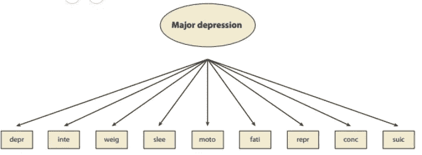

主要抑郁因素模型。图片来自 Borsboom 和 Cramer (2013 年)

然而，我们可以认为一些项目之间的关系不仅仅是由于抑郁。这方面的一个例子是注意力集中问题的原因及其与其他症状的关系。睡眠有问题的人会变得疲劳，因此会有注意力问题(睡眠问题→疲劳→注意力问题)。换句话说，可以推断一个可观察变量和另一个变量之间的因果关系，这与公因子模型“决裂”。下图是这种模型的一种可能的表示形式，其中各个项目之间存在因果关系。

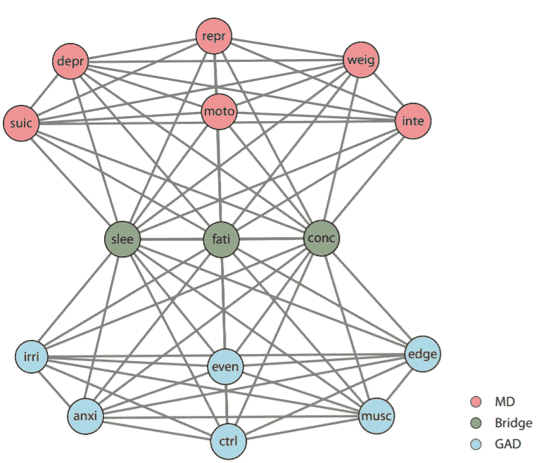

焦虑与抑郁症的关系。图片来自 Borsboom 和 Cramer (2013)。

那么，我如何知道我的结构是遵循公因子模型还是更像网络模型呢？嗯，基于理论！我知道研究人员在很长一段时间里只关心统计数据来指导一切，但对我们来说，重要的是从理论上重新思考我们的构建，然后从经验上测试理论。

好了，你决定最适合你的结构的模型是因子模型，现在呢？

# 什么是 CFA？我们何时申请 CFA？

CFA 是一种多变量统计，用于估计工具的结构，验证测量变量在多大程度上代表结构的数量。也就是说，它验证一个乐器的结构是否可以是真实的，但不一定是真实的。为此，我们需要陈述我们想要测试的结构。一般来说，当有先前的研究告诉我们该工具的维度时，就使用 CFA。例如，我们将有一项北美研究，它使用 EFA 来验证工具的维度，而您使用 CFA 来验证这种结构在巴西数据中的表现如何。然而，这不是你使用 CFA 的唯一方法！例如，你可以在同一个研究中使用 EFA(探索维度)，但仍然可以使用 CFA 测试不同的理论模型。

因此，当您想要估计工具的维度时，EFA 和 CFA 都适用(注意，我说的是估计，而不是探索/发现维度)。例如，我们可以在自我报告工具中应用 CFA，其中项目代表行为、想法或感觉。另一个例子，我们可以将它应用于一系列其他的测量，比如焦虑的心理物理学测量。因此，CFA 适用于测量幸福、焦虑、偏见等属性的工具。

# 饱和/无限制模型和限制模型之间的差异

全民教育模式可以称为饱和/无限制模式。这是因为所有潜在维度解释了所有项目的差异，如下图所示。

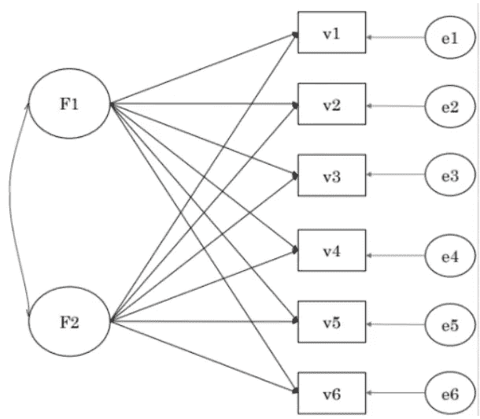

饱和/无限制模型。作者制作的图像。

至于 CFA，我们可以称之为限制模型，即我们对模型施加一些限制，例如，一个因素不能与另一个因素的项目交叉加载。下图举例说明了受限模型。

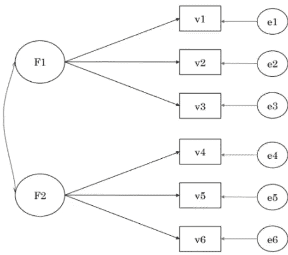

受限模型。作者制作的图像。

当然，一种模式和另一种模式之间存在一些实际差异。第一个是，一般来说，CFA 的因子加载输出不同于 EFA。在 EFA 中，所有因素都有交叉负荷，而在 CFA 中，一些负荷被设置为 0，如下图所示。

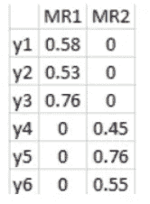

CFA 中因子加载的例子。作者制作的图像。

我做了一个表格，展示了非限制模式(EFA)和限制模式(CFA)的区别。

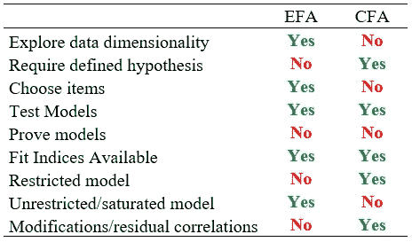

EFA 和 CFA 的区别。作者制作的图像。

我们在上表中看到，对于验证性因素分析，我们需要有一个明确的假设，即背后必须有一个理论来直接指导我们的分析，我们不能只是在没有适当理由的情况下继续探索。这和 EFA 有一点不同，EFA 的结构背后有一个理论，但是你测试这个结构是否会在数据中得到佐证(通过平行分析之类的)。当然，在全民教育中，我们可以根据理论提取因素，这在某种程度上类似于直接指导分析的假设。

同样重要的是再次强调，在 CFA 中，我们可以测试不同的模型，能够进行修改并允许残差相关性。见下图。

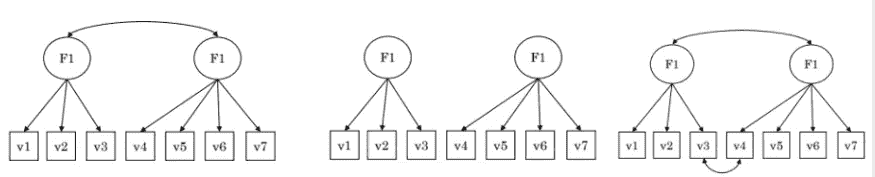

同一结构的不同 CFA 模型。作者制作的图像。

我们甚至可以测试更复杂的模型，比如层次模型或者双因素模型。

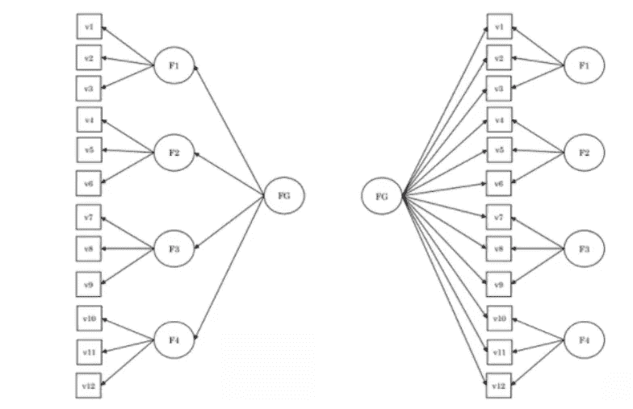

分层模型(左)和双因素模型(右)。作者制作的图像。

简而言之，因为 CFA 对模型进行了限制，所以我们有可能测试大量的东西！CFA 的一个用途是通过多组 CFA，我在之前的[文本](/measurement-invariance-definition-and-example-in-r-15b4efcab351)中写过。

# 模型识别

当我们谈论一个受限模型时，我们必须处理一个称为模型识别的“问题”(Bollen，1989)。换句话说，我们需要我们的数据有足够的“信息”来进行必要的统计。

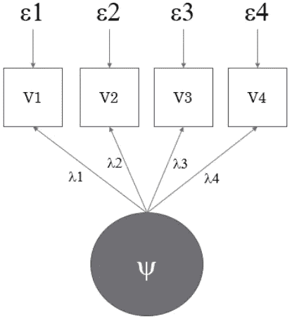

有 4 个项目的因素模型。作者制作的图像。

在上图中，我们使用 CFA 来估计单维度。我们看到我们估计了 4 个因子负载(λ；每个项目一个)和 4 个残差(ε；每项一个)，也就是我们有 8 个信息需要估计。我们拥有的信息片段是 V1、V2、V3 和 V4 的分数(即这个人对每个观察到的变量的分数)以及它们之间的相关性。

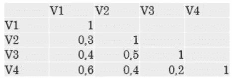

V1、V2、V3 和 V4 之间的关联矩阵。作者制作的图像。

因此，我们有 4 个分数+ 6 个相关性= 10 条信息。换句话说，由于我们手中有 10 条信息，用 4 个项目我们可以估计 8 条因子载荷和残差。按照这个逻辑，很容易看出，为了能够识别模型，每个潜在因素的最小项目数是 3 个项目。看，在有 3 个项目的单因素模型中，我们将估计 3 个因素负荷+ 3 个剩余= 6 个必要信息。我们有 3 个项目的信息+ 3 个相关性= 6 个信息。所以我们将有 0 个自由度(DF)。

*   如果 DF < 0, the unidentified model (nothing will be estimated);
*   If DF = 0, the model is under-identified (only factor loadings will be arbitrarily estimated; no fit indexes will be generated);
*   If DF> 1，过度识别的模型(一切都可以估计)。

只有当 DF> 1 时，才应解释模型，因为这是解决项目和潜在变量的协方差方程的唯一方法，允许拟合指数的输出。

# 拟合指数

拟合指数代表你所估计的模型的似是而非程度。拟合良好的模型会减少适马矩阵(人口协方差矩阵，即您放入模型的模式)和 S 矩阵(样本协方差矩阵，即您的经验矩阵)之间的差异。

有几个适合指数，每一个都有其分界点(布朗，2015；Mair，2018)。我制作了另一个表格，显示了 fit 指数的描述及其建议。

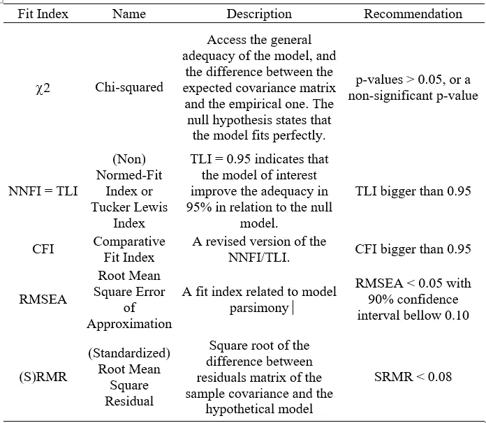

不同的拟合指数及其推荐临界值。作者制作的图像。

# 拟合指数中的高级主题

一个模型可以有很好的拟合指数，但不能推广到总体。换句话说，我们必须小心适应指数！更复杂的模型通常具有更好的拟合指数。我们可以调整我们的模型来解释来自线性方程、二次方程甚至六次方程的数据。有时候，6 次方程完美地解释了数据！然而，考虑到方程的复杂性，这种模型不太通用。因此，我们在模型复杂性和拟合指数之间有一个成本效益关系，我们必须小心不要过度拟合(或夸大拟合)。

Bonifay 和蔡(2017)的一篇论文验证了以下每个模型的总体拟合程度。也就是说，模型是否总是呈现良好的拟合指数。为此，测试了一个半无限制模型(只有 2 个负载受到限制；黑色的模型)；双因素模型(绿色模型)；分级模型(蓝色和黄色)；和一维模型(红色)。为此，对 1000 个模拟数据集的拟合指数进行了分析。

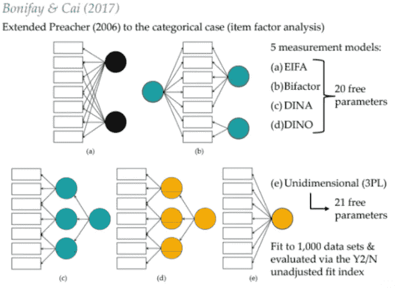

在 Bonifay 和 Cai (2017)中测试的模型。图像由 Bonifay 和蔡制作(2017)。

下图总结了他们的发现。我们看到，在样本空间所有可能的拟合指数中，半无限制模型和双因素模型几乎总是表现出良好的拟合指数。这意味着在这些情况下，我们不能以与其他模型相同的方式解释拟合指数。例如，如果您要比较双因素模型和一维模型，您很可能会在双因素模型中找到更好的拟合指数，但这不一定是解释数据的最佳模型。当然，我们必须比较嵌套模型的拟合指数，但是这个例子只是一个说明。

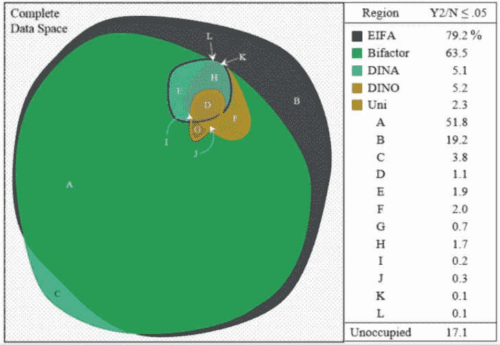

完整的数据空间。图像由 Bonifay 和蔡制作(2017)。

考虑到这一点，有一个[闪亮的应用程序](https://dynamicfit.app/connect/)可以为你的数据模拟最合适的分界点(McNeish 和 Wolf，2020)。我不会详细解释它是如何工作的，因为网站本身有一个解释。这样，我们就有机会检查一维模型和多维模型的最合适的拟合指数，并测试它们的等价性。该站点如下所示。

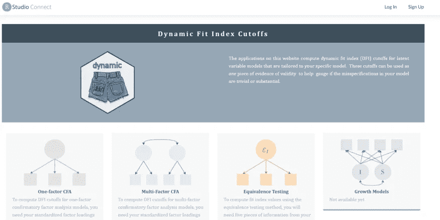

闪亮的应用程序网站的图像。

非常感谢您阅读本文到目前为止！我希望你喜欢并学到了很多！如果你喜欢，不要忘记与同事和朋友分享你的知识！很快，我们将制作一个关于如何在数据集中做 CFA 的教程。跟着我！

这篇文章最初是在巴西葡萄牙语的 [PsicoData](https://medium.com/psicodata/fundamentos-da-analise-fatorial-confirmatoria-d56f49dac236) 上发表的，我也是作者。

# 接触

> [*LinkedIn*](https://www.linkedin.com/in/rafael-valdece-sousa-bastos/)[*ResearchGate*](https://www.researchgate.net/profile/Rafael-Bastos-3)[*谷歌学术*](https://scholar.google.com.br/citations?user=xCjGr7AAAAAJ&hl=pt-BR) *如需论文合作或统计咨询，可通过邮件联系(rafavsbastos@gmail.com)*

# 参考

K.验证性因素分析。在 K. A. Bollen(编辑。)，*含潜变量的结构方程，* 1989，Willey。

W.Bonifay 和 L. Cai，论项目反应理论模型的复杂性，2017，*多元行为研究*， *52* (4)，465–484。

D.Borsboom 和 A. O. Cramer，网络分析:精神病理学结构的整合方法，2013 年，*临床心理学年度回顾*， *9* ，91–121。

T.A. Brown，*应用研究验证性因素分析第二版，* 2015，吉尔福德出版社。

页（page 的缩写）Mair，*现代心理测量学带 R，* 2018，施普林格。

D.麦克内什和 M. G .沃尔夫。验证性因子分析模型的动态拟合指数截止值，2020 年 7 月 7 日[https://doi.org/10.31234/osf.io/v8yru](https://doi.org/10.31234/osf.io/v8yru)