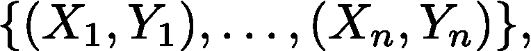
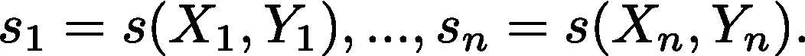
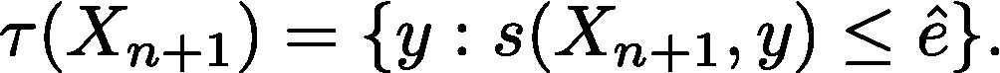
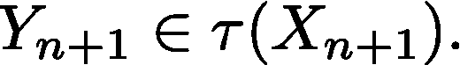
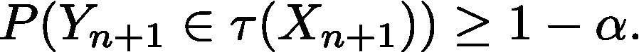
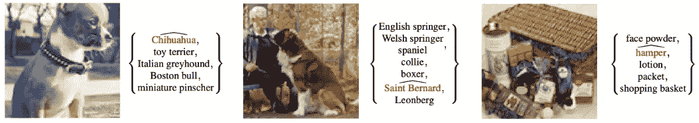
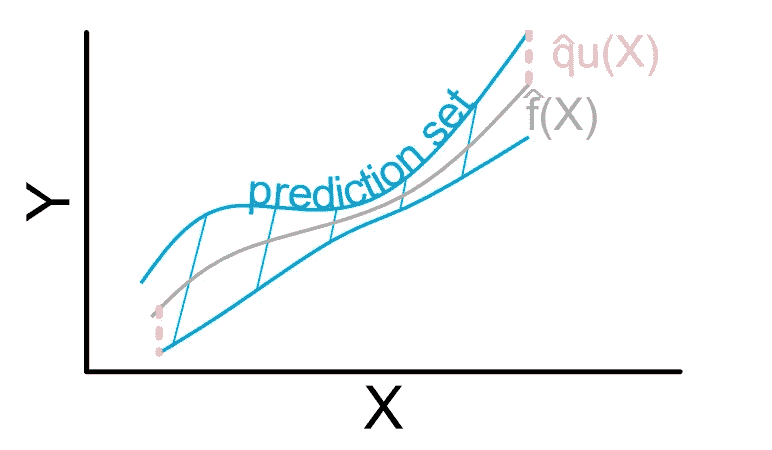

# 共形预测导论

> 原文：<https://towardsdatascience.com/conformal-prediction-4775e78b47b6?source=collection_archive---------8----------------------->

## 量化人工智能不确定性时，你应该始终考虑的一种方法

在决策中，人工智能(AI)系统不仅需要做出预测，还需要量化其预测的确定性(不确定性)。例如，考虑一个股票自动交易系统，其中人工智能系统预测股票价格。由于股票市场的高度随机性，人工智能系统的点位预测可能与真实值有很大差异。但是，另一方面，如果人工智能系统可以估计保证以高概率覆盖真实价值的范围，交易系统可以计算最好和最差的回报，并做出更明智的决定。

共形预测是一种量化人工智能系统不确定性的技术。特别地，给定输入，保形预测估计回归问题中的预测区间和分类问题中的一组类。预测区间和集合都保证以高概率覆盖真实值。

在关于保形预测的教程中，Glenn Shafer 和 Vladimir Vovk 给出了如下定义:

> "保形预测利用过去的经验来确定新预测的精确置信水平."

在本文中，我们利用同独立分布(i.i.d)数据集上的保形预测，即，

其中 X 是输入要素，Y 是标注，n 是数据点的数量。我们还假设已经训练了一个机器学习模型 f: X->Y。该模型可以是经典的机器学习模型，如线性回归、支持向量机(SVM)或深度学习技术，如全连接或卷积网络。目标是估计模型输出的预测集。为了说明这个想法，我们将描述保形预测的步骤、保证和例子。

作者图片

# **一、步骤**

**a .确定分数函数以量化不一致性**

确定一个合适的得分函数 s(X，Y) ∈ R，以测量模型输出ŷ's 和标签 y 之间的差异。这个得分函数非常关键，因为它实际上决定了我们可以得到什么样的预测集。例如，在回归问题中，我们可以将|ŷ-y|作为得分函数。这样，得到的预测集的值在预测ŷ周围的 L1 范数球内；在分类问题中，我们可以把 1-ŷ_i 作为得分函数，其中ŷ_i 是真正经典的预测逻辑。通过这种方式，我们将获得一个预测逻辑大于某个阈值的类的预测集。

**b .计算分数的(1- ɑ)分位数**

计算分数{s_1，…，s_n}的分位数，其中

在全共形预测方法中，我们需要训练 m 个模型来计算分数并构建预测集，其中 m 是 Y { n+1 }可能取值的数量。这无疑在计算上是昂贵的。为了降低计算复杂度，可以使用归纳(分裂)保形预测。简而言之，该方法将整个训练集分成适当的训练集和校准集。然后，只在适当的训练集上训练模型；并且分数仅在校准集上计算。这样，我们只需要对模型进行一次训练。

**c .使用模型预测和(1- ɑ)分位数构建预测集**

使用分位数形成新示例的预测集，

对于(1-分位数),我们可以通过包含值 y 来构建输入 X_{n+1}的预测集，这些值的得分小于或等于。

# **二世。担保**

保形预测可以提供数学上的严格保证。设 Y_{n+1}为真值。y 可以是分类问题中的类别标签，也可以是回归问题中的真实值。设τ(X_{n+1})为预测集(或区间)。我们定义τ(X_{n+1})覆盖 Y_{n+1}如果 Y_{n+1}在τ(X_{n+1})中，即，

然后，给定一组相同独立分布(i.i.d)的样本{(X_1，Y_1)，(X_2，Y_2)，，…，(X_n，Y_n)}，共形预测集满足以下覆盖保证，即，

基于可交换性(i.i.d)假设的覆盖保证的证明可以在[的附录《保形预测和无分布不确定性量化的简明介绍》](https://arxiv.org/abs/2107.07511)中找到。注意，在这个证明中,( 1- ɑ)水平变为(n+1)(1- ɑ)/n，以考虑有限样本的情况。

# **三。示例**

在这一节中，我们的目标是给出一些关于共形预测集的直觉。

**a .分类预测集**

我们在图 1 中显示了三个分类预测集。在这项任务中，训练一个神经网络来对输入图像进行分类。保形预测用于构建类别集(在花括号中),这些类别集保证以高概率包括输入图像的真实标签。

图 1 分类预测集(来自 Sangdon Park 等。:[通过校准预测的深度神经网络的 PAC 置信集](https://scholar.google.com/citations?view_op=view_citation&hl=en&user=Vi2E2F4AAAAJ&citation_for_view=Vi2E2F4AAAAJ:eJXPG6dFmWUC)

**b .回归预测区间**

在图 2 中，我们展示了一个回归预测区间。该系统的目标是在给定输入 x 的情况下预测ŷ。保形预测构建回归预测集(蓝线之间的间隔),保证以高概率覆盖真实值 y。

图 2 回归预测集(来自 Anastasios N. Angelopoulos 和 Stephen Bates: [保形预测和无分布不确定性量化的温和介绍](https://arxiv.org/abs/2107.07511))

# **四世。结论**

本文简要介绍了保形预测，包括它的步骤、保证和例子。我们可以将保形预测应用于分类和回归问题。在这两种情况下，保形预测旨在量化机器学习模型的不确定性。保形预测易于实现，并且可以提供严格的保证。我们相信保形预测是走向安全人工智能的一个很好的垫脚石，其中不确定性量化是必须的！