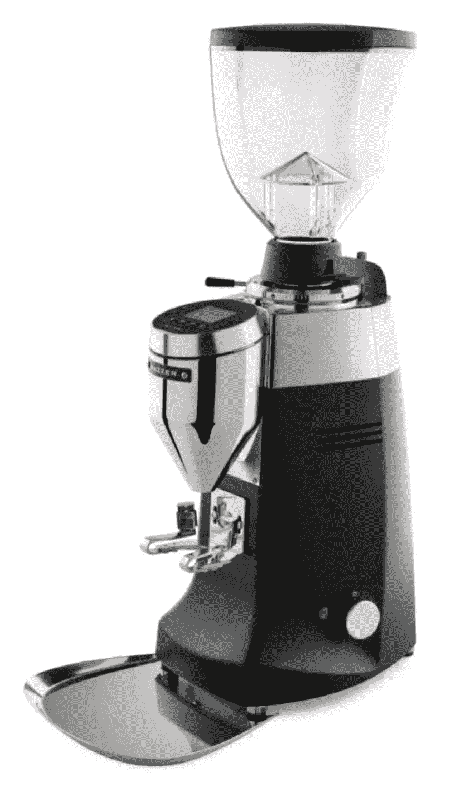
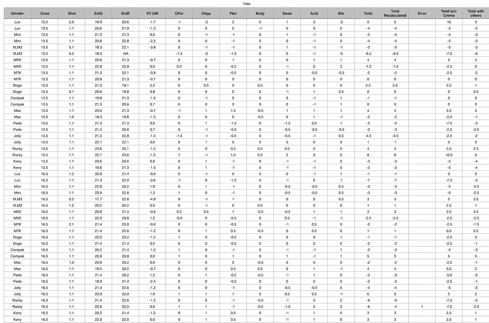
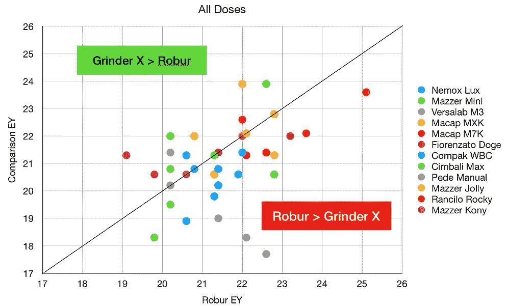
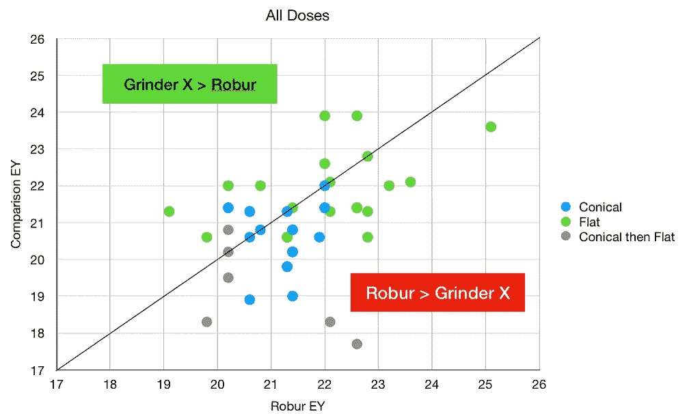
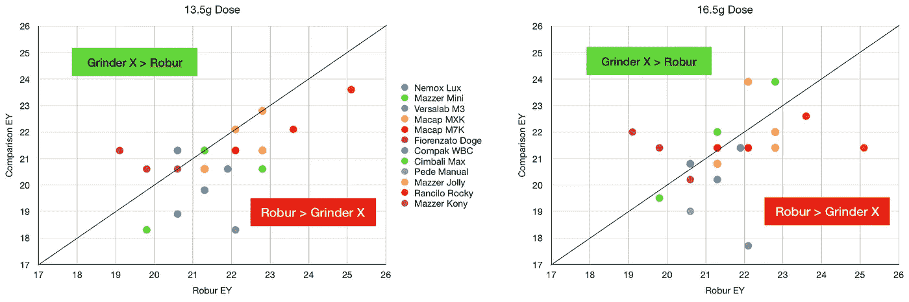
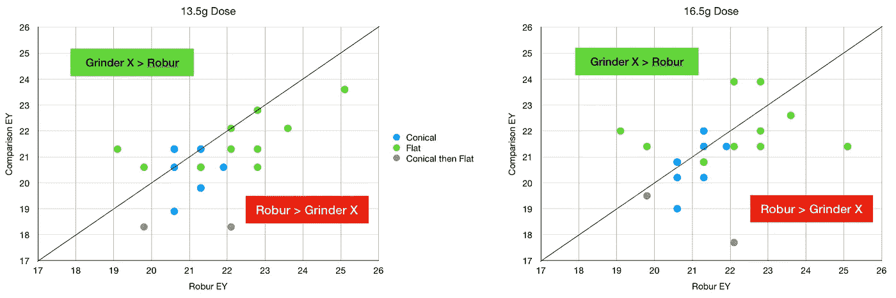
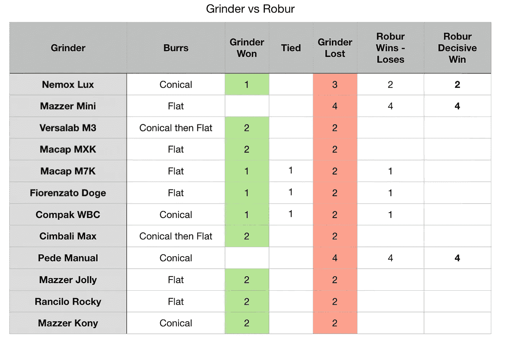
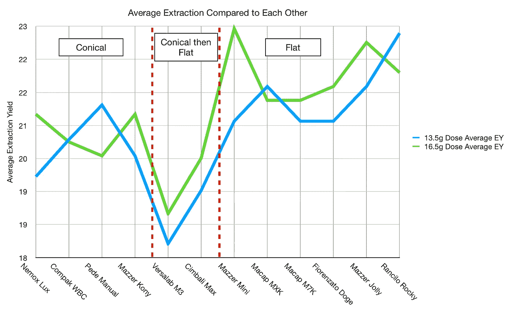
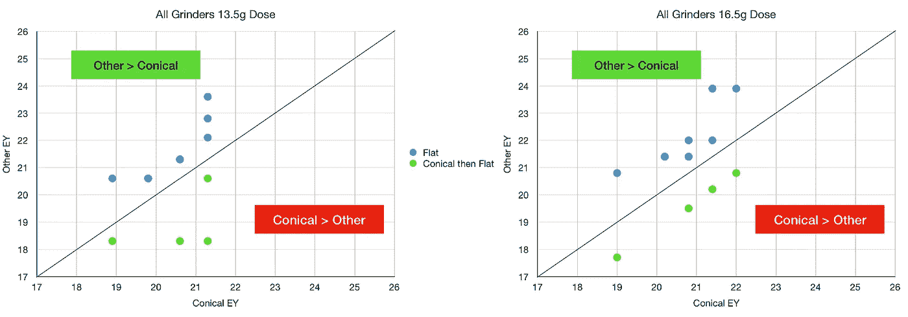
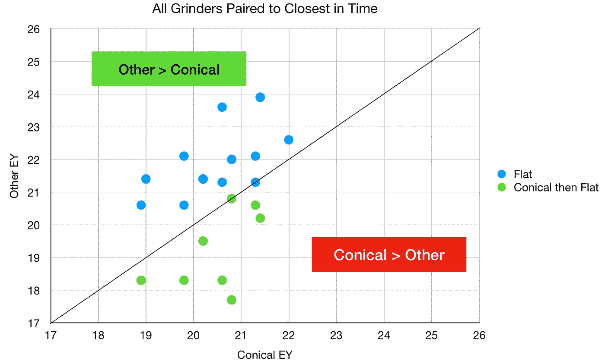

# 锥形与平面毛刺:初始数据

> 原文：<https://towardsdatascience.com/conical-vs-flat-burrs-initial-data-57762063f915?source=collection_archive---------28----------------------->

## 咖啡数据科学

## 泰坦磨床项目综述

在咖啡社区，关于咖啡研磨机的讨论已经持续了很多年，特别是平磨锥与圆锥磨锥的对比。还没有一个决定性的答案，但是很多个月前( [2007](https://www.home-barista.com/blog/titan-grinder-project-t4126.html) )，在家庭咖啡师论坛上，有一个关于多台研磨机的评论。

所有图片由作者提供

然而，该评论被分散在他们论坛的多个帖子上，最终结果并不明显。我对[关于磨床相互比较的数据特别感兴趣](https://www.home-barista.com/grinders/titan-grinder-project-can-it-beat-mazzer-robur-t4499.html)。甚至他们对 grinders 的比较分析也是以文本形式(没有图表)在单条线程的多个页面上进行的。

我一直在为研磨机做一些咖啡颗粒[分析](https://medium.com/nerd-for-tech/measuring-coffee-grind-distribution-d37a39ffc215)，有人建议看看这项研究。所以我看了这个研究，我认为它在当时是一个伟大的研究，但是有一些小事情我会做得不同:

1.  分析了每台研磨机的多种研磨设置(我见过一些，但不在本文中)。
2.  测量更多变量，如输出重量(即 TDS)
3.  采集更多样本
4.  将所有数据绘制成图表
5.  在数据收集的同一天收集所有数据，因为烘烤在数据收集期间老化了几天。

撇开这些批评不谈，这些数据非常有趣。我想把其中的一些绘制成图表，以便更仔细地观察。也许会出现一个更清晰的画面。

# 原始数据

我将把重点放在使用不同研磨机比较浓缩咖啡的数据上。他们每天使用相同的烘焙方法，将研磨机与他们的质量标准进行比较，如下图所示的 [Mazzer Robur](https://www.mazzer.com/en/electronic-grinder-dosers/robur-s-electronic/) 。这台研磨机很贵，应该放在咖啡店里。

有两个剂量设置，13.5g 和 16.5g，并且在每个剂量设置下为每个研磨机拍摄两个镜头。更多详情，请参见[数据](https://www.home-barista.com/grinders/titan-grinder-project-can-it-beat-mazzer-robur-t4499.html)。

作者们还做了一个盲品测试，并相互比较了几组照片。

# 分析

让我们首先来看提取率，它是被提取的可溶物的量。他们有多页文字形式的数据，我在这里编译了一下。

他们在计算味道指标的最终分数时只有一个错误，所以这很好！

让我们通过将每台研磨机与基线进行比较来绘制一些数据。

数据显示，所有这些研磨机都无法达到与 Robur 相同的 EY。在 EY 也有一些很大的波动，这很可能是因为拍摄量而不是重量是停止的标准。由于无法获得注射重量信息，所以我无法使用总溶解可溶物(TDS)作为另一个比较指标。

然后我拿出了两剂:

对于 13.5 克的剂量，Robur 肯定更好。对于 16.5 克的剂量，就不太清楚了。肯定有一个较低的平均值，但它没有 13.5 克剂量的变化大。

我还看了研磨机和它们的磨锥装置:

我对锥形然后是平的毛刺感到惊讶，因为我本以为这些是最好的，但也许在颗粒分布和提取上有一种有趣的相互作用，这还不清楚。

另一个不清楚的变量是研磨机是如何调整的，因为研磨设置的变化很可能会产生更大的影响。另一个被控制的输出变量是时间，我也不认为时间是一个很大的变量，或者至少是总拍摄时间。

# 尝

对于他们的口味测试，所有的测试都是相互关联的，我认为他们没有尽可能客观地在所有的研磨机上给每一个镜头打分。

我把他们赢-平-输的数字放在一起，我加入了一个决定性胜利的指标，这意味着任何平局都被认为是有问题的磨床赢了，而不是罗布。

罗布人赢了，但实际上，大多数研磨者的口味没有太大差异。

# 圆锥形与扁平形

我拿走了所有磨床的数据，忽略了照片是在不同的日子拍摄的。然后，我绘制了 13.5 克和 16.5 克拍摄的平均 EY，以查看不同类型的研磨机(即，圆锥形、扁平形和圆锥形然后扁平形)。

从该图来看，似乎有证据表明平毛刺具有更高的提取率。

因此，让我们将每种毛刺类型的最佳提取方法配对，不包括 Robur 刀片:

我们可以在 13.5 克剂量和 16.5 克剂量之间进行划分，但我们得到的是相同的模式:

这提供了一些强有力的证据，表明基于提取率，平毛刺比圆锥毛刺好，但成对的拍摄经过一周，这可能会引入一些误差。

相反，让我们根据时间上最接近的镜头来配对镜头。这些收集之间最多有 2 天的时间。结论还是和之前一样。

所有这些数据总体上意味着什么？从这些数据中可以得出两个结论，但要说这两个结论中的任何一个是确定的，还需要更多的数据和更多的控制。

1.  罗布在性能上是无可匹敌的，但它几乎可以与之匹敌。
2.  平毛刺比锥形毛刺提取率高。

如果你愿意，可以在 Twitter 和 YouTube 上关注我，我会在那里发布不同机器上的浓缩咖啡视频和浓缩咖啡相关的东西。你也可以在 [LinkedIn](https://www.linkedin.com/in/robert-mckeon-aloe-01581595?source=post_page---------------------------) 上找到我。也可以关注我[中](https://towardsdatascience.com/@rmckeon/follow)。

# [我的进一步阅读](https://rmckeon.medium.com/story-collection-splash-page-e15025710347):

[浓缩咖啡系列文章](https://rmckeon.medium.com/a-collection-of-espresso-articles-de8a3abf9917?postPublishedType=repub)

[工作和学校故事集](https://rmckeon.medium.com/a-collection-of-work-and-school-stories-6b7ca5a58318?source=your_stories_page-------------------------------------)

[个人故事和关注点](https://rmckeon.medium.com/personal-stories-and-concerns-51bd8b3e63e6?source=your_stories_page-------------------------------------)

[乐高故事启动页面](https://rmckeon.medium.com/lego-story-splash-page-b91ba4f56bc7?source=your_stories_page-------------------------------------)

[摄影启动页面](https://rmckeon.medium.com/photography-splash-page-fe93297abc06?source=your_stories_page-------------------------------------)

[使用图像处理测量咖啡研磨颗粒分布](https://link.medium.com/9Az9gAfWXdb)

[改善浓缩咖啡](https://rmckeon.medium.com/improving-espresso-splash-page-576c70e64d0d?source=your_stories_page-------------------------------------)

[断奏生活方式概述](https://rmckeon.medium.com/a-summary-of-the-staccato-lifestyle-dd1dc6d4b861?source=your_stories_page-------------------------------------)

[测量咖啡磨粒分布](https://rmckeon.medium.com/measuring-coffee-grind-distribution-d37a39ffc215?source=your_stories_page-------------------------------------)

[咖啡萃取](https://rmckeon.medium.com/coffee-extraction-splash-page-3e568df003ac?source=your_stories_page-------------------------------------)

[咖啡烘焙](https://rmckeon.medium.com/coffee-roasting-splash-page-780b0c3242ea?source=your_stories_page-------------------------------------)

[咖啡豆](https://rmckeon.medium.com/coffee-beans-splash-page-e52e1993274f?source=your_stories_page-------------------------------------)

[浓缩咖啡用纸质过滤器](https://rmckeon.medium.com/paper-filters-for-espresso-splash-page-f55fc553e98?source=your_stories_page-------------------------------------)

[浓缩咖啡篮及相关主题](https://rmckeon.medium.com/espresso-baskets-and-related-topics-splash-page-ff10f690a738?source=your_stories_page-------------------------------------)

[意式咖啡观点](https://rmckeon.medium.com/espresso-opinions-splash-page-5a89856d74da?source=your_stories_page-------------------------------------)

[透明 Portafilter 实验](https://rmckeon.medium.com/transparent-portafilter-experiments-splash-page-8fd3ae3a286d?source=your_stories_page-------------------------------------)

[杠杆机维护](https://rmckeon.medium.com/lever-machine-maintenance-splash-page-72c1e3102ff?source=your_stories_page-------------------------------------)

[咖啡评论和想法](https://rmckeon.medium.com/coffee-reviews-and-thoughts-splash-page-ca6840eb04f7?source=your_stories_page-------------------------------------)

[咖啡实验](https://rmckeon.medium.com/coffee-experiments-splash-page-671a77ba4d42?source=your_stories_page-------------------------------------)