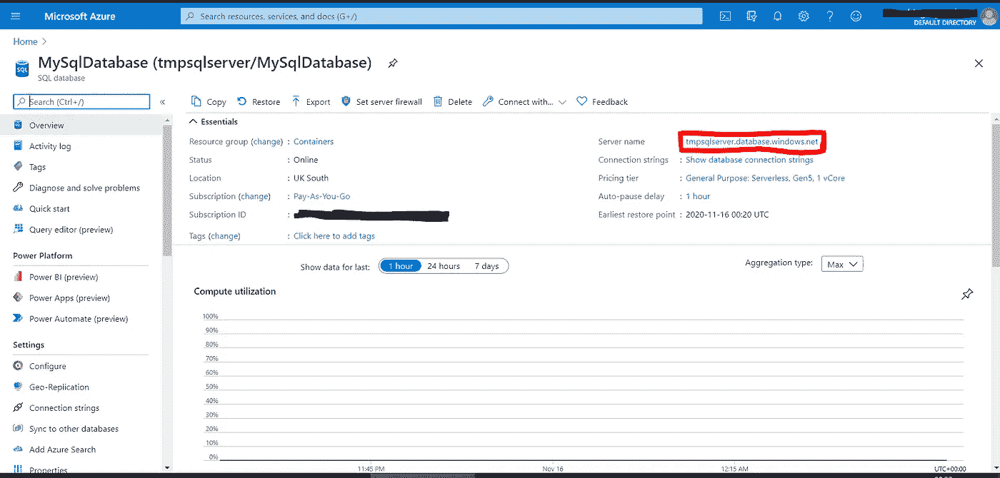

# 使用 Python 连接到 Azure SQL Server

> 原文：<https://towardsdatascience.com/connect-to-azure-sql-server-using-python-76eba1fb458b?source=collection_archive---------9----------------------->

## 本文提供了在 Linux 操作系统上使用 Python 连接到 Azure SQL Server 的分步教程。


马库斯·温克勒在 [Unsplash](https://unsplash.com?utm_source=medium&utm_medium=referral) 上拍摄的照片

本文提供了在 Linux 操作系统上使用 Python 连接到 Azure SQL Server 的分步教程。

创建 Azure SQL 数据库/服务器后，您可以在概述页面上找到服务器名称。



Azure SQL Server 使用 ODBC(开放式数据库连接)作为驱动程序。

> *数据库驱动程序是实现数据库连接协议(ODBC 或 JDBC)的计算机程序。*

让我用通俗易懂的语言解释一下。您还记得我们购买硬件或软件时，会附带一张驱动程序磁盘，您必须在使用应用程序之前安装该驱动程序吗？嗯，你可以把数据库想象成应用程序，数据库驱动程序本质上是使我们能够访问数据库的驱动程序，或者 DBMS(数据库管理系统)。不同的数据库系统(Postgresql、Mysql、SQL Server、Oracle 等)有不同的驱动程序，大多数不是 ODBC 就是 JDBC。

`Pyodbc`是一个开源的 python 包，使访问 ODBC 数据库变得容易。有些人使用`pymssql`，但`pyodbc`是最受欢迎的一个。

让我们把手弄脏吧！首先，导入所需的包。我们使用`sqlalchemy`，这是一个流行的 python SQL 工具包，在这里创建连接，使用`urllib`创建连接字符串。

```
import os
import pyodbc
import sqlalchemy assa
from sqlalchemy import create_engineimport urllib (Python 2.7)
from urllib.parse import quote_plus (Python 3)
```

注意，我们将用来生成连接字符串的 quote_plus 在 Python 2.7 和 Python 3 中是不同的。建立连接的第一步是声明环境变量。我们使用`os.getenv`来指定变量和凭证，以便它们处于安全的状态。

```
server = os.getenv('SERVER_NAME')
database = os.getenv('DB_NAME')
username = os.getenv('USERNAME')
password = os.getenv('PASSWORD')
port = os.getenv('PORT')
```

Azure SQL Server 的默认端口是 1433。我们还需要一个变量，司机。为了找到正确的驱动程序，在您的终端中运行以下命令行(确保您安装了`**pyodbc**`):

```
$ odbcinst -j
unixODBC 2.3.4
DRIVERS............: /etc/odbcinst.ini
SYSTEM DATA SOURCES: /etc/odbc.ini
FILE DATA SOURCES..: /etc/ODBCDataSources
USER DATA SOURCES..: /home/jamesho/.odbc.ini
SQLULEN Size.......: 8
SQLLEN Size........: 8$ cat /etc/odbcinst.ini
[ODBC Driver 13 for SQL Server]
Description=Microsoft ODBC Driver 13 for SQL Server
Driver=/opt/microsoft/msodbcsql/lib64/libmsodbcsql-13.1.so.9.0
UsageCount=1
```

驱动程序的信息存储在`odbcinst.ini`文件中。将驱动程序设置为您的驱动程序的名称。

```
driver = '{ODBC Driver 13 for SQL Server}'
```

接下来，我们将设置连接字符串。定义连接字符串有两种方法，一种是使用`urllib`包下的 quote_plus 解析字符串，另一种是使用 sqlalchemy 的 URL 格式。

```
# Using urllib
odbc_str =
'DRIVER='+driver+';SERVER='+server+';PORT='+port+';DATABASE='+database+';UID='+username+';PWD='+passwordconnect_str = 'mssql+pyodbc:///?odbc_connect='+quote_plus(odbc_str)#Using sa URL format
sa_url = f"mssql+pyodbc://{username}:{password}@{server}:{port}/{database}?driver={driver}"
```

不同数据库的连接字符串的完整列表可以在[这里](https://docs.sqlalchemy.org/en/13/core/engines.html)找到。

最后，创建一个引擎，并将字符串传递给引擎。使用引擎的 execute 函数运行您的查询，该查询也应该作为字符串传递。

```
engine = create_engine(connect_str / sa_url)print(engine.execute(‘’’
                      YOUR SQL QUERY
                     ‘’’).fetchall())
```

完整脚本:

```
import os
import pyodbc
import sqlalchemy assa
from sqlalchemy import create_engine
import urllib (Python 2.7)
from urllib.parse import quote_plus (Python 3)server = os.getenv('SERVER_NAME')
database = os.getenv('DB_NAME')
username = os.getenv('USERNAME')
password = os.getenv('PASSWORD')
port = os.getenv('PORT',default=1433)driver = '{ODBC Driver 13 for SQL Server}'#connect using parsed URL
odbc_str = 'DRIVER='+driver+';SERVER='+server+';PORT='+port+';DATABASE='+database+';UID='+username+';PWD='+ password
connect_str = 'mssql+pyodbc:///?odbc_connect=' + quote_plus(odbc_str)#connect with sa url format
sa_url = f"mssql+pyodbc://{username}:{password}@{server}:{port}/{database}?driver={driver}"engine = create_engine(connect_str/sa_url)print(engine.execute('''
                        YOUR SQL QUERY
                    ''').fetchall())
```

转到您的终端，像这样导出环境变量，并运行这个 python 脚本。

```
$export SERVER_NAME = 
$export DB_NAME = 
$export USERNAME = 
$export PASSWORD = 
$export PORT =$python {your script name}.py
```

您已经成功连接到您的 Azure SQL 数据库，并且可以使用 sqlalchemy 与其进行交互。