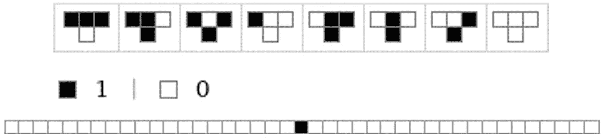
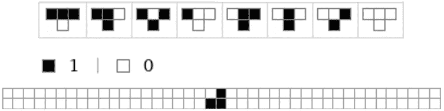
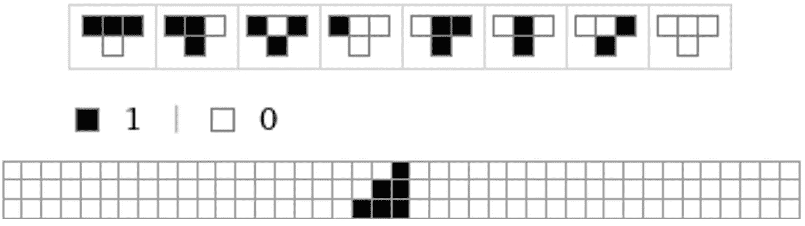
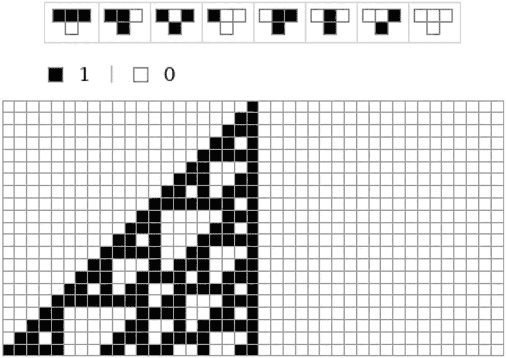
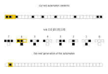
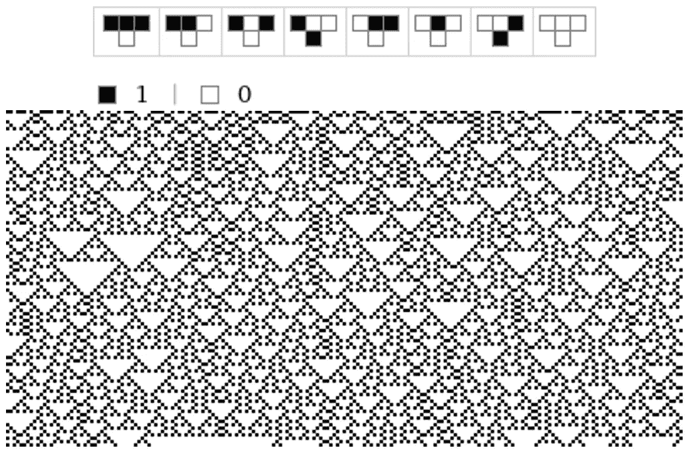
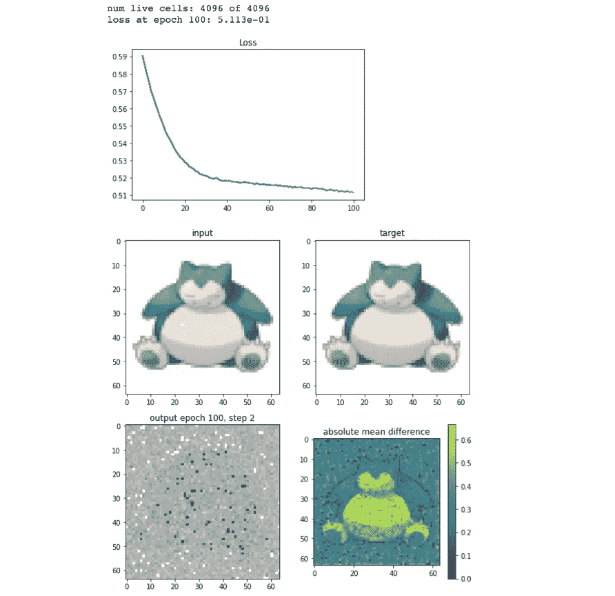
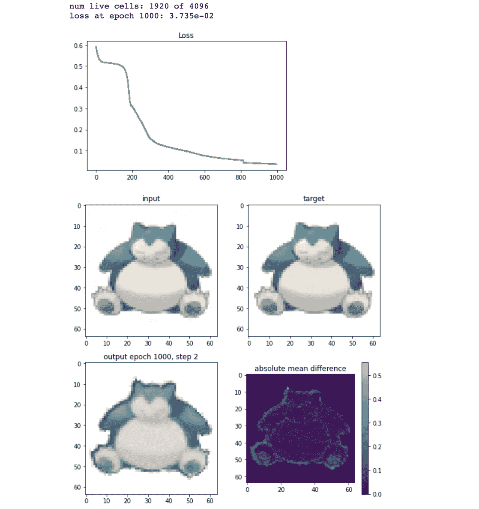

# 连接生物学和人工智能:生长神经细胞自动机

> 原文：<https://towardsdatascience.com/connecting-biology-and-ai-growing-neural-cellular-automata-fd53f2834ee2?source=collection_archive---------24----------------------->

卡罗琳娜·格拉博斯卡在[的照片](https://www.pexels.com/photo/grayscale-photo-of-computer-laptop-near-white-notebook-and-ceramic-mug-on-table-169573/)

1966 年，被认为是 20 世纪顶级数学家之一的约翰·冯·诺依曼引入了术语细胞自动机，并将其定义为以离散步骤进化的动态系统。四年后，约翰·康威(John Conway)创造了众所周知的生命游戏(Game of Life)，其主要特点是进化是由其初始状态决定的，不需要进一步的输入。

[维基百科](https://en.wikipedia.org/wiki/Conway%27s_Game_of_Life)，康威的人生游戏

此后，基于这些细胞自动机(CA)的研究不计其数。像扬森斯(2009 年)或者梅勒妮·米切尔(1998 年)这样的评论描述了这个领域中一些最相关的作品。

然而，一篇引起机器学习社区注意的文章是由 [Mordvintsev 等人(2020)](https://distill.pub/2020/growing-ca/) 发表的，他描述并实现了一个开发细胞自动机更新规则的神经网络。此外，当我阅读这篇文章时，我的一个相关贡献是作者将这项工作与形态发生联系起来，形态发生是一个生物学术语，指的是单细胞如何自我组装成高度复杂的有机体的过程。

我在这篇文章中的目标是向您介绍几个概念，以便这篇文章之后变得易于阅读。其结构如下:

1.  CA 简介
2.  与生物学的联系
3.  生长神经细胞自动机
4.  未来的工作

## 1.CA 简介

如前所述，细胞自动机(CA)被约翰·冯·诺依曼定义为一个以离散步骤进化的动态系统。换句话说，元胞自动机由一个网格单元组成，该网格单元根据一组预定义的规则在每个时间步进行更新。单元的新状态将取决于它的当前状态和它的紧邻单元的状态。

这里有一个基本的例子，以便你简单地理解它的方法。

*   1D CA 有两个可能的状态和一个 3 单元的邻域

*   选择的规则是 [**规则 110 元胞自动机**](https://en.wikipedia.org/wiki/Rule_110) (通常简称为**规则 110** )，这是一个[初等元胞自动机](https://en.wikipedia.org/wiki/Elementary_cellular_automaton)，在稳定和混沌的边界上具有有趣的行为。此 CA 的规则显示如下。

*   在第一个时间步长之后，输出如下所示。

*   在第二个时间步骤之后，这里是输出。

*   经过 *n* 个时间步后，我们得到下图。

下面是它如何更新的动画:

[维基百科](https://en.wikipedia.org/wiki/Rule_110)，动画为规则 110。

更改算法会显著改变输出。例如，使用规则 18:

有趣吧？在我看来，非常令人惊讶的是，我们可以用如此简单的规则创建这些数字。

如果你感兴趣，这里有一个规则的编号系统。这在以下链接的章节*编号系统*中有很好的解释。

 [## 基本细胞自动机-维基百科

### 在数学和可计算性理论中，初等元胞自动机是一维元胞自动机，其中…

en.wikipedia.org](https://en.wikipedia.org/wiki/Elementary_cellular_automaton) 

## 2.与生物学的联系

与 CAs 类似，大多数多细胞生物从单细胞开始其生命，并生长直至成为高度复杂的解剖结构。这个过程被称为*形态发生*，它包括细胞如何与它们的邻居沟通，以决定器官的形状和位置。或者，更令人印象深刻的是，何时停止。

有趣的是，一些贝壳的图案如*芋螺*和 *Cymbiola* 是由自然细胞自动机生成的。对于这些贝壳来说，色素细胞位于贝壳边缘的一个狭窄区域。每个细胞根据其相邻色素细胞的激活和抑制活性分泌色素，遵循数学规则的自然版本。细胞带在缓慢生长时在外壳上留下彩色图案。

尽管对于从单细胞和规则中出现复杂生物体的相互作用仍有许多问题，但似乎很清楚的是，进化已经将这些信息编码在它们的基因组编码细胞硬件中。

## 3.生长神经细胞自动机

由于理解细胞形态发生过程的重要性，我们在计算机科学界的目标是制定新的模型来帮助阐明这些过程。

如上所述， [Mordvintsev 等人(2020)](https://distill.pub/2020/growing-ca/) 做出了相关贡献，因为他们实现了一个自动机，你可以给它一个图像，并可以创建一个算法，不仅可以增长细胞，直到获得图像，而且还可以在被破坏时再生。

如果你想看他们的结果，我鼓励你去这个网页，玩动画。

 [## 生长神经细胞自动机

### 形态发生的可区分模型点击或轻敲图像擦除图案的一部分，并看到它再生…

蒸馏. pub](https://distill.pub/2020/growing-ca/) 

在这篇文章中，我不打算解释这个模型的架构，因为其他优秀的文章已经描述过了。特别是，除了原文，我强烈推荐阅读以下文章，并尝试他的[代码](https://github.com/riveSunder/dca)。

 [## 用可微分细胞自动机玩口袋妖怪成长

### 回顾 20 世纪 80 年代，你会发现，伴随着连接主义的蓬勃发展，为…奠定了基础

medium.com](https://medium.com/the-scinder/playing-pokemon-grow-with-differentiable-cellular-automata-a233eb345439) 

我做了一些修改就实现了它，下面是我的输出。

*   培训的第 100 个时代

*   训练纪元 500 年

*   训练纪元 1000 年

## 4.未来的工作

一旦你到了这一步，我想你会对这个话题感兴趣。因此，我首先会建议阅读原文，然后观看以下视频(点击视频下方的链接)。它展示了一些现在正在进行的关于这个话题的研究。这个视频属于 [Cross Labs](https://www.crosslabs.org/) ，这是一个跨学科的研究机构，致力于通过计算研究来理解智能和生命的数学基础。具体来说，如果你有 10 分钟的时间，从 12 点 20 分到 22 点 20 分。

[https://www.youtube.com/watch?v=XVmzGW293bI&t = 797s](https://www.youtube.com/watch?v=XVmzGW293bI&t=797s)

***如果你喜欢这篇文章，请考虑*** [***订阅***](https://javiferfer.medium.com/membership) ***。你将获得我所有的内容+所有其他来自牛逼创作者的文章！***