# 将 Google Colab 连接到 Amazon EC2 实例

> 原文：<https://towardsdatascience.com/connecting-google-colab-to-an-amazon-ec2-instance-b61be9f9cf30?source=collection_archive---------15----------------------->

## 提升您的 Colab 笔记本电脑的 GPU 性能


照片由[西格蒙德](https://unsplash.com/@sigmund?utm_source=unsplash&utm_medium=referral&utm_content=creditCopyText)在 [Unsplash](/s/photos/cloud-services?utm_source=unsplash&utm_medium=referral&utm_content=creditCopyText) 上拍摄

在深入学习教程之前。让我们来谈谈 Jupyter 笔记本。

# **朱庇特**

Jupyter 是一个免费的、开源的、可共享的、交互式的 web 应用程序，它允许用户组合代码、计算输出、可视化、文本和媒体。

Jupyter 笔记本已经成为数据科学家的首选计算工具。名字是由 Jupyter 目前支持的 40+编程语言中的三种语言 **Ju** lia、 **py** thon、 **R** 组成的。

**笔记本的问题**

笔记本并不都很棒。与使用笔记本相关的一些问题包括—

笔记本在运行长时间异步任务时会遇到问题。像深度学习中典型的那样训练一个模型几个小时或几天可能会变得乏味，特别是当显示超时时。对此的解决方法是定期检查模型权重并将日志文件写入磁盘。

笔记本电脑出现故障时返回的错误(应该注意，这更多是用户问题)

它鼓励糟糕的软件工程实践。例如，缺乏单元测试，将代码编写成可重用的块。

然而，许多人会认为这些都不应该被认为是问题，因为笔记本电脑从来就不是为解决这些问题而设计的。它非常适合快速实验和原型制作。很有可能将代码移动到脚本中，并且仍然从笔记本中调用它们。

> Jupyter 笔记本是一种探索工具，而不是生产工具

# 科拉布

google Colaboratory 是一个基于 Jupyter 的免费笔记本环境，运行在 Google 的云服务器上，允许用户利用 Google 提供的硬件(CPU、GPU 和 TPU)。其中后两个对于数据科学家和机器学习工程师来说相当有用。使用 Colab 的另一个优点是它允许访问 google drive，可以通过文件浏览器安装和访问它。Colab 还预装了一套像 TensorFlow 和 Keras 这样的深度学习库。

谷歌 Colab 提供了 12GB 的 NVIDIA Tesla K80 GPU，NVIDIA 计算能力为 3.7，可连续使用长达 12 小时。虽然这对于实验和原型制作来说非常好，但是在处理大型数据集和/或大型网络时，很快就会遇到限制。

在我们进入教程之前，重要的是要注意，这不仅适用于亚马逊的 EC2 实例，还可以用于谷歌云的计算引擎、微软 Azure 的虚拟机，甚至是本地设置。

将外部运行时连接到 Colab 只是允许用户在使用 GPU 加速而不是 Colab 默认提供的加速时保留 Colab 接口。

使用 AWS，许多人更喜欢使用 SageMaker，因为它负责在后台创建 EC2 实例和设置 Jupyter 笔记本连接的细节，这使得 Sagemaker 比 EC2 更贵。因此，创建一个 EC2 实例并将其连接到一个 Colab 笔记本上，比使用 SageMaker 更便宜，同时还能保留(许多人)首选的 Colab 接口。

比较成本，俄亥俄州地区 EC2 上的一个 p3.2xlarge 实例每小时的成本为 3.06 美元，而同一地区 SageMaker 上的相同实例每小时的成本为 3.825 美元。

让我们开始吧。

# **亚马逊 EC2**

登录 AWS 管理控制台。

点击左上角的服务并选择 EC2。

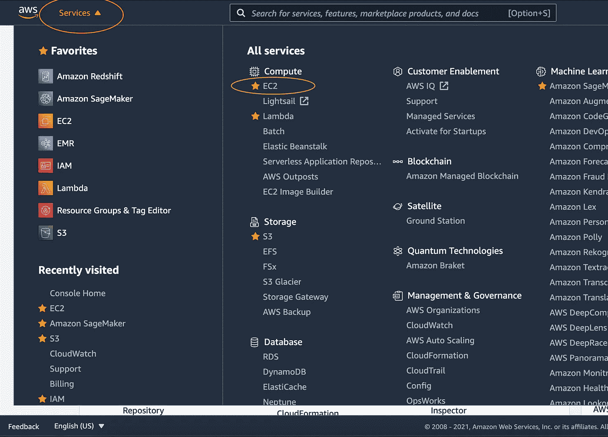

EC2 仪表板

在左窗格中选择实例，然后启动实例。

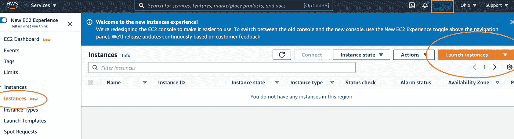

EC2 左侧窗格

选择图像类型。这决定了预装的操作系统和软件版本。这里我们选择了一个 Ubuntu 18.04 安装和 TensorFlow 2.4.1 以及 CUDA 安装。

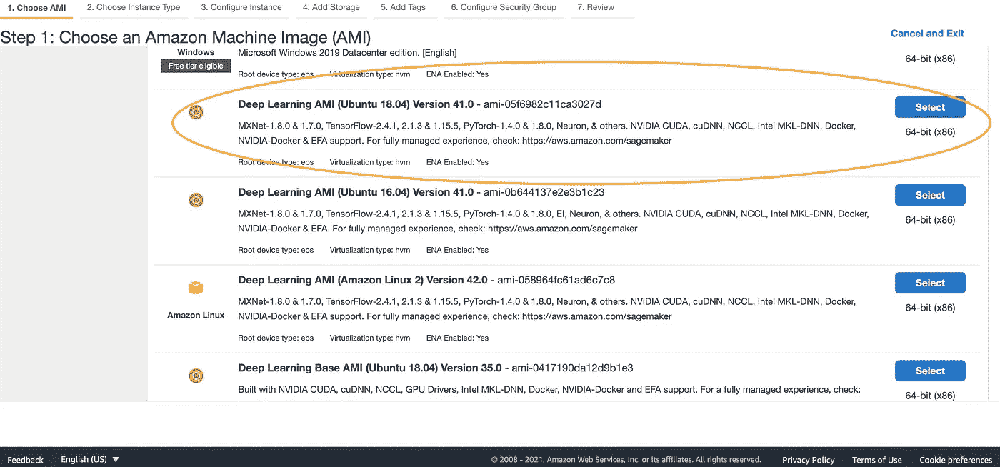

AMI 图像

接下来，我们选择实例类型。这将决定我们得到的硬件类型。出于本教程的考虑，我将选择一个 p 3.2x 大型实例。这包括一个 Nvidia V100 GPU、8 个 vCPUs 和 61GB RAM。

如果这是您第一次启动 GPU 实例，请注意默认情况下 GPU 实例不可用。查看包含的[链接](https://docs.aws.amazon.com/AWSEC2/latest/UserGuide/ec2-resource-limits.html)了解如何使用 AWS 增加 GPU 实例限制。此外，GPU 实例不是免费的，请参见此[链接](https://aws.amazon.com/ec2/pricing/on-demand/)了解点播价格。请注意，不同地区的价格不同。

如果您希望设置存储和网络选项等其他详细信息，可以选择“配置实例详细信息”。要保留默认设置，请选择“查看并启动”。

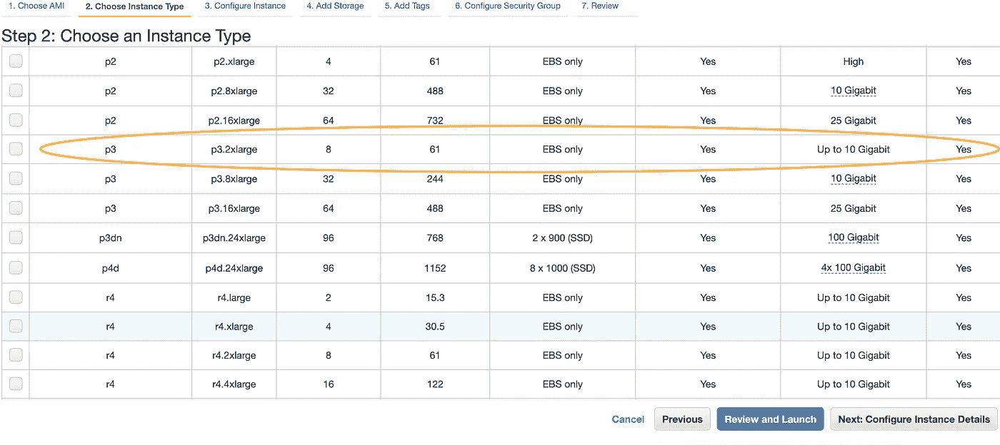

实例类型

选择现有的密钥对或创建新的密钥对。这将作为登录服务器的身份验证。如果一个新的被创建，一个<keyfile>。pem 文件将被下载到您的本地计算机。</keyfile>

查看详细信息，然后单击启动

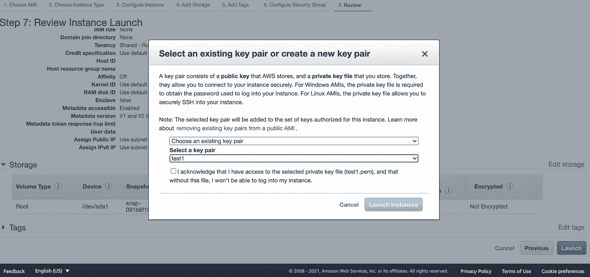

密钥对

通过单击左侧窗格中的实例，返回到实例仪表板。这将列出所有实例，包括刚刚创建的实例。等待创建的实例如下所示，实例状态显示为“正在运行”，状态检查为“2/2 检查通过”。这意味着实例现在正在运行。

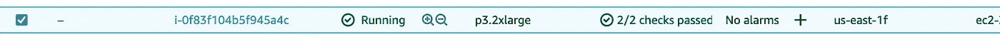

单击实例 ID。您应该会看到如下所示的屏幕。然后点击连接。

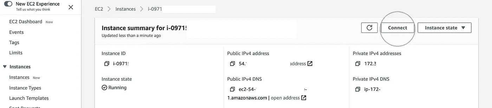

通过 SSH 连接

单击 ssh 客户端的<https://console.aws.amazon.com/ec2/v2/home?region=us-east-1#>****选项卡，查看该实例的 SSH 登录详细信息。****

****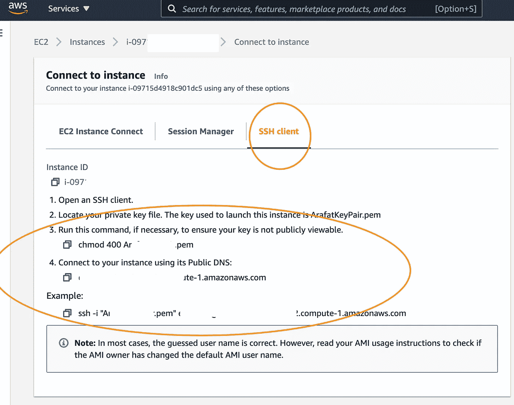****

****SSH 详细信息****

****然而，对于本教程，我们将使用 putty SSH 客户端登录到实例。Putty 可以从[这里](https://www.putty.org/)下载。我们使用 Putty 的主要原因是为了设置 SSH 隧道。这是让 Colab 连接到 EC2 运行时所需要的。****

# ******PuttyGen******

****在我们安装油灰之前。如果我们回想一下，从 AWS 下载的密钥文件是. pem 文件格式。我们需要将它转换成 putty 可以识别的格式。putty 的安装中包括另一个名为 PuttyGen 的程序。此工具可以将. pem 文件转换为. ppk 文件。打开 PuttyGen，选择文件→加载私钥****

****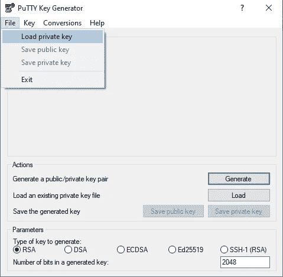****

****PuttyGen****

****选择。要加载的 pem 文件。选择文件→保存私钥以存储加载的内容。pem 文件在。ppk 格式。****

****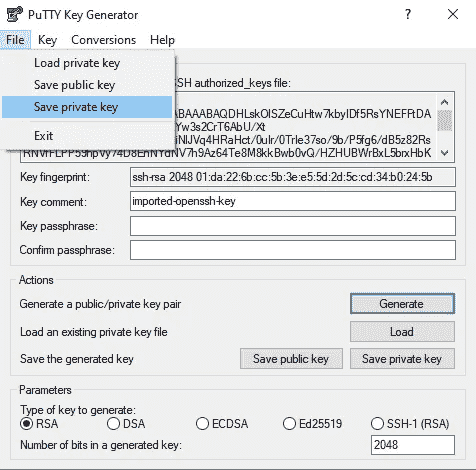****

****PuttyGen 另存为 ppk****

****既然密钥文件的格式正确，我们就可以在 putty 上设置 SSH 连接了。****

# ******油灰******

****在前面的步骤中，在 SSH Client 选项卡中，我们查看了 EC2 实例的 SSH 登录信息。我们现在需要它。(需要注意的一点是，每次重启实例时，SSH 登录信息都会改变，请务必再次复制该信息)。****

****确保通过在“保存会话”文本框中指定名称并单击“保存”将详细信息保存到配置文件中。在下面的例子中，我选择“aws”作为要另存为的概要文件名。****

****油灰应如下图所示设置—****

****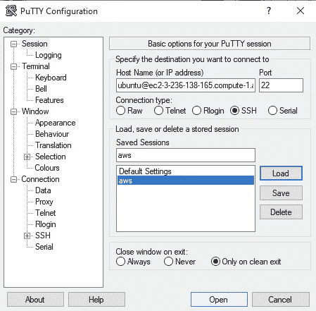****

****油灰型材****

****保存后，单击配置文件名，然后单击 Load。****

******SSH 隧道******

****在左侧导航树中，选择连接→ SSH →隧道。****

****在源端口中，填写 8888(我们将在后面指定，这是 Jupyter 将通过的端口)。在目的端口中，填写 127.0.0.1:8888，然后单击添加。最终结果应该如下所示—****

****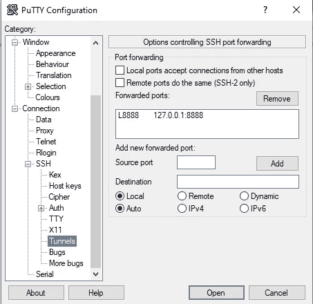****

****SSH 隧道****

****也可以将它保存到个人资料中，这样就不需要每次都输入了。转到会话，选择配置文件，然后单击保存。****

****现在我们已经准备好用 putty 登录 EC2 实例了。在左侧导航树中，转到连接→ SSH → Auth，单击浏览并选择。ppk 文件，然后单击打开。****

****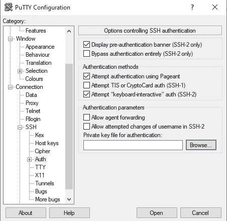****

****油灰认证****

****成功登录后，putty 应该看起来像这样。我们现在有一个命令行来控制 EC2 实例。只要 SSH 终端窗口打开，来自源端口的所有流量都会被转发到目的端口。****

****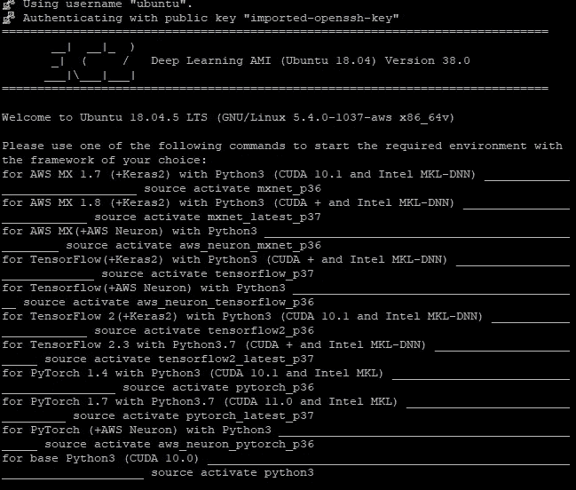****

****EC2 端子****

****如果 Jupyter 还没有安装，应该通过命令行安装。跟着这个[链接](https://jupyter.org/install)。****

****接下来需要安装由 Google Colabotory 创作的 jupyter_http_over_w 扩展，以允许连接到 Colab。在命令行中运行下面的命令—****

```
*****pip install jupyter_http_over_ws******jupyter serverextension enable — py jupyter_http_over_ws*****
```

****使用下面的命令在 EC2 实例上启动 Jupyter Notebook 服务—****

```
****jupyter notebook \
 — NotebookApp.allow_origin=’**[**https://colab.research.google.com**](https://colab.research.google.com/)**' \
 — port=8888 \
 — NotebookApp.port_retries=0
 — NotebookApp.disable_check_xsrf=true”****
```

****我们将端口 8888 指定为 SSH 隧道配置期间指定的相同端口。****

****如果一切顺利，终端屏幕上应该会显示一个 IP 地址。应该复制该地址，因为下一步将需要它。****

****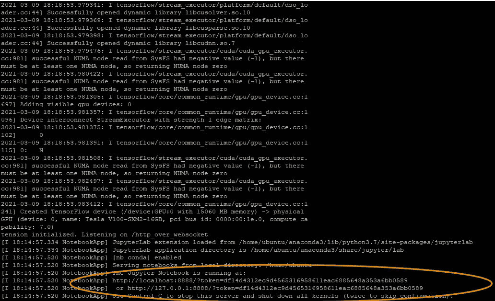****

****笔记本终端****

****打开 Google Colab，在右上角选择 Connect to local runtime。****

****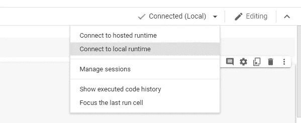****

****Colab 本地运行时****

****从终端复制 IP 地址并点击连接。****

****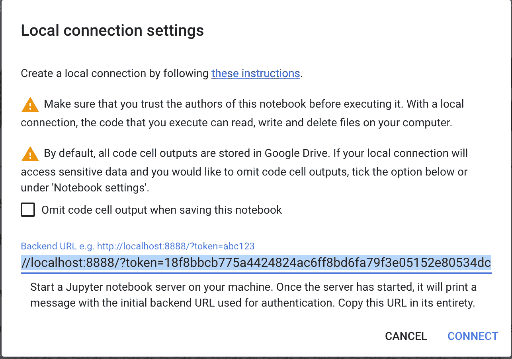****

****Colab 后端 URL****

****最终结果应该是这样的。请注意“已连接”旁边的“本地”。这意味着 Colab 连接到一个运行时，而不是默认的 Colab。我们还运行一些测试来确认 GPU 被检测到。****

****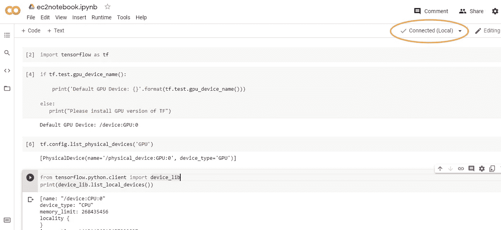****

****Colab 笔记本****

****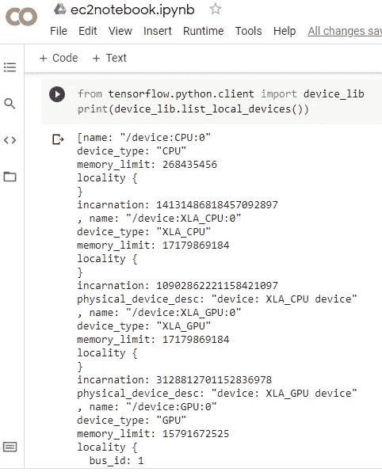****

****Colab 列出设备****

****我们在下面注意到，检测到的 GPU 是 Tesla V100，这是典型的 P3.2xlarge 实例类型。****

****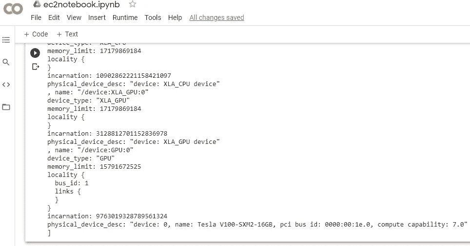****

****Colab T100****

****快速笔记。连接到本地运行时意味着 Colab 将不再能够访问 Google Drive。为了解决这个问题，一个可能的工具是 P [yDrive](https://pythonhosted.org/PyDrive/) 。****

## ****完成后，不要忘记关闭 EC2 实例。****

# ******参考文献******

****Stern J (2012)如何用 PuTTY 建立 SSH 隧道[https://www . sky verge . com/blog/How-to-Set-Up-an-SSH-Tunnel-With-PuTTY/](https://www.skyverge.com/blog/how-to-set-up-an-ssh-tunnel-with-putty/)****

****Perkel J (2018)为什么 Jupyter 是数据科学家的首选计算笔记本[https://www.nature.com/articles/d41586-018-07196-1](https://www.nature.com/articles/d41586-018-07196-1)****

****穆勒 A (2018)木星笔记本吸的 5 个理由[https://towards data science . com/5-reasons-why-jupyter-notebooks-suck-4d c201 e 27086](/5-reasons-why-jupyter-notebooks-suck-4dc201e27086)****