# 连接朴素贝叶斯和逻辑回归:二元分类

> 原文：<https://towardsdatascience.com/connecting-naive-bayes-and-logistic-regression-binary-classification-ce69e527157f?source=collection_archive---------4----------------------->

## 概率、似然和张量流概率库


给企鹅分类【照片由[马丁·韦特斯坦](https://unsplash.com/@ncx1701d?utm_source=unsplash&utm_medium=referral&utm_content=creditCopyText)在 [Unsplash](https://unsplash.com/s/photos/penguins?utm_source=unsplash&utm_medium=referral&utm_content=creditCopyText) 上拍摄】

朴素贝叶斯和逻辑回归都是非常常用的分类器，在这篇文章中，我们将试图找到并理解这些分类器之间的联系。我们还将使用[帕尔默企鹅数据集](https://allisonhorst.github.io/palmerpenguins/)来看一个例子，该数据集在 CC-0 许可下可用。你希望从这篇文章中学到什么？

*   概率和可能性基础。
*   朴素贝叶斯分类器是如何工作的？
*   区分和生成分类器。
*   朴素贝叶斯和逻辑回归之间的联系。

这里使用的所有公式都来自我的笔记本，链接和其他有用的参考资料都在参考资料部分。我们开始吧！

## 概率和可能性:

每个概率分布都有一个连续分布的概率密度函数(PDF ),如高斯分布(或离散分布的概率质量函数或 PMF，如二项式分布),表示样本(某点)取特定值的概率。该函数通常由 *P* ( *y* | *θ* 表示，其中 *y* 是样本值， *θ* 是描述 PDF/PMF 的参数。当一个以上的样本彼此独立抽取时，我们可以写成—

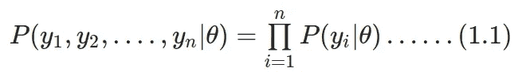

情商。1:独立绘制样本的 PDF。

当我们知道分布(和相应的参数 *θ* )并想要推导出*y*s 时，我们在计算中考虑 PDF。这里我们认为 *θ* 对于不同的样本是固定的(已知的),并且我们想要推导出不同的 *y* 。似然函数是相同的，但是有所改变。这里 *y* 是已知的，而 *θ* 是我们想要确定的变量。至此，我们可以简单介绍一下最大似然估计(MLE)的思想。

*极大似然估计:* MLE 与数据的建模密切相关；如果我们观察数据点 *y* 1， *y* 2，…， *yn* 并假设它们来自一个由 *θ* 参数化的分布，那么似然性由 *L* ( *y* 1， *y* 2，…、*yn*|*θ*)；对于 MLE，我们的任务是估计最大似然的θ。对于独立观察，我们可以将最佳θ的表达式写成如下所示—

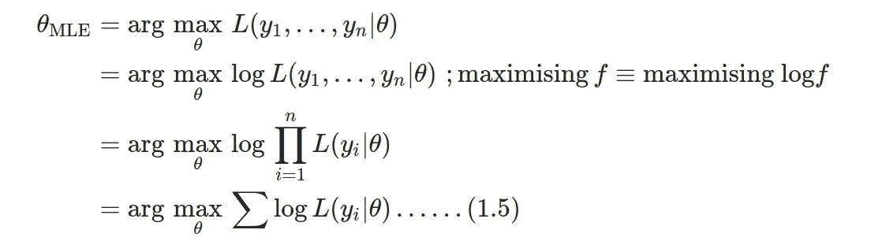

情商。2:最大化可能性

优化的惯例是最小化一个函数；因此，最大化似然归结为最小化负对数似然。这些是我们稍后将会用到的概念，现在让我们转到朴素贝叶斯分类器。

## 朴素贝叶斯分类器:

朴素贝叶斯分类器是*生成分类器*的一个例子，而逻辑回归是*鉴别分类器*的一个例子。但是我们所说的生成性和辨别力是什么意思呢？

**判别分类器:**一般来说，分类问题可以简单地认为是预测给定输入向量的类别标签*p*(*C _ k*|*x*)。在判别模型中，我们假设*p*(*C _ k*|*x*)的某种函数形式，并直接从训练数据中估计参数。

**生成分类器:**在生成模型中，我们估计*p*(*x*|*C _ k*)的参数，即每个类的输入的概率分布以及类先验 *p* ( *C_k* )。两者都用在贝叶斯定理中计算*p*(*C _ k*|*x*)。

我们已经将类别标签定义为 *C_k* ，让我们在此基础上定义贝叶斯定理——

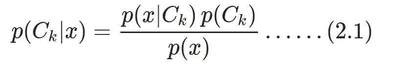

情商。3:贝叶斯定理，x 是训练数据 C_k 代表类别标签。

*p* ( *x* )可以认为是一个归一化常数；*p*(*x*)=∑*p*(*x*|*C _ k*)*p*(*C _ k*)，∑超过类标签 *k* 。

让我们考虑一个一般化的场景，其中我们的数据有 *d* 个特征和 *K* 个类，那么上面的等式可以写成—

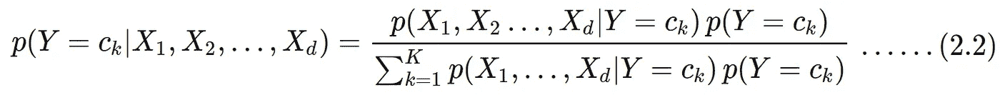

情商。4:同 Eq。3 但是对于具有 d 特征的数据。

给定类 *Y* *，通过“天真地”假设每个数据特征 *X_i* 是相互条件独立的**，可以极大地简化类条件概率项。现在我们重写等式(2.2)，如下所示***

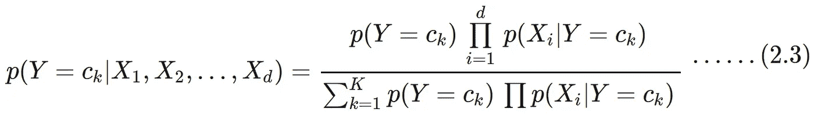

情商。5:同 eq。但是对于给定的类 y，数据特征有条件地相互独立。

这是朴素贝叶斯分类器的基本方程。一旦估计了类别先验分布和类别条件密度，朴素贝叶斯分类器模型就可以为新的数据输入 *X* 做出类别预测 *Y* ^ (y hat)

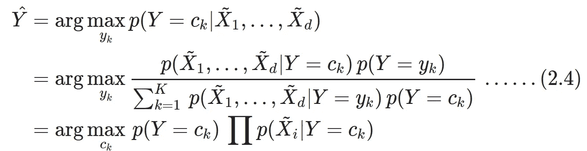

情商。6:对新数据点的类别预测。

由于我们这里的分母 *p* ( *X_* 1， *X_* 2，…， *X_d* )对于给定的输入是常数。我们可以用最大后验概率(MAP)估计来估计*p*(*Y*=*c _ k*)和*p*(*X _ I*|*Y*=*c _ k*)。前者则是训练集中类别的*相对频率*。这些在我们后面做编码部分的时候会更加清晰。

不同的朴素贝叶斯分类器的区别主要在于它们对*p*(*X _ I*|*Y*=*c _ k*)的分布所做的假设。这对于 MAP 估计非常重要，例如，如果我们假设类别条件是单变量高斯分布，则需要确定的参数是均值和标准差。要估计的参数数量取决于特征和类别。

## 连接朴素贝叶斯和逻辑回归:

代替上述具有 *K* 类的朴素贝叶斯分类器的一般化情况，我们简单地考虑 2 个类，即 *Y* 现在是布尔型(0/1，真/假)。由于逻辑回归(LogReg)是一种判别算法，它从假设*P*(*Y*|*X*)的函数形式开始。

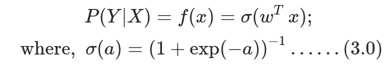

情商。7:用于逻辑回归任务的 Sigmoid 函数。

正如所料，逻辑回归的条件类分布的函数形式基本上是 sigmoid 函数。在另一篇[文章](/logit-of-logistic-regression-understanding-the-fundamentals-f384152a33d1)中，我详细讨论了如何从线性回归开始实现逻辑回归。可以使用训练数据导出参数(权重 *w* )。我们可以拓展情商。7，对于 Y(类标签)为布尔型—

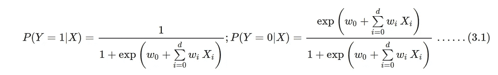

情商。8:同 Eq。7，但明确是为二进制分类编写的。

对于给定的 X，要指定 Y=0，我们施加一个简单的条件如下—

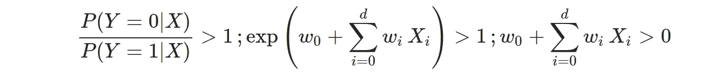

在 Eq 上加一个条件。8，并在第二步中对两边应用自然对数。

*我们将使用高斯朴素贝叶斯(GNB)分类器，恢复 P(Y|X)的形式，并将其与逻辑回归结果进行比较。*

## 高斯朴素贝叶斯作为二元分类器；

在高斯朴素贝叶斯(GNB)分类器中，我们将假设类条件分布*p*(*X _ I*|*Y*=*c _ k*)是单变量高斯分布。让我们明确地写出假设—

1.  *Y* 有一个布尔形式(即 0/1，真/假)，它由伯努利分布控制。
2.  既然是 GNB，对于类条件句*P*(*X _ I*|*Y*=*c _ k*)我们假设一元高斯。
3.  对于所有 *i* 和*j*≦*I*， *X_i* ， *X_j* 都是有条件独立给定 *Y* 。

让我们用贝叶斯法则写出*P*(*Y*= 1 |*X*)

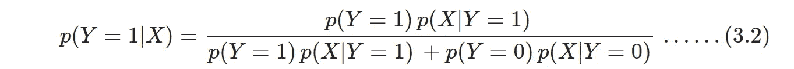

情商。9:类似于 Eq。4，但只为 Y=1 而写。

我们可以通过引入指数和自然对数来进一步简化这个方程，如下所示—

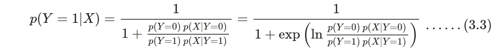

情商。10:由等式简化而来。用一种更适合与逻辑回归比较的形式来写它。

让我们假设*p*(*y*= 1 |*x*)=*π，*⟹*p*(*y*= 0 |*x*)= 1-*π*并且还使用给定类别标签的数据点的条件独立性来将上面的等式重写如下——

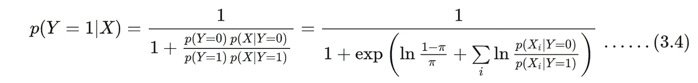

情商。11:来自 Eq。10 我们假设*P*(*Y*= 1 |*X*)=*π的先验分布，并使用条件独立性。*

对于类别条件*P*(*X _ I*|*Y*=*c _ k*)我们假设**单变量高斯函数**带参数*N*(*μ_ { ik】*， *σ_i* )，即标准偏差为我们将用它来简化上面等式的分母。

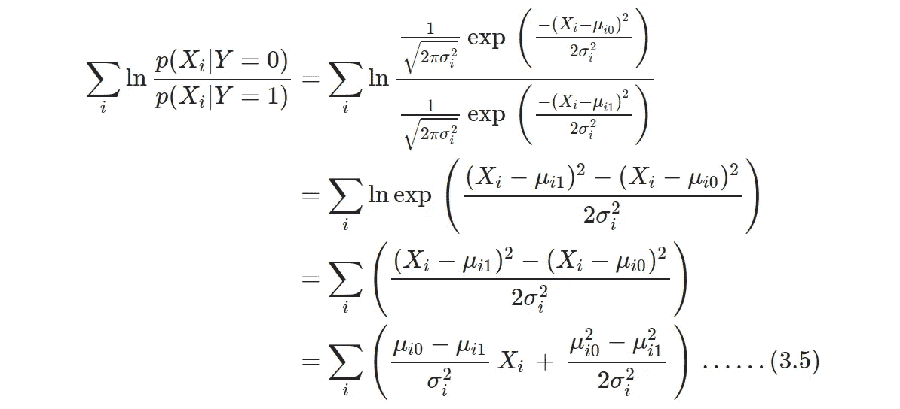

情商。12:简化等式中的分母。11 假设类条件句由单变量高斯函数描述。

我们可以将该表达式用于之前的等式(等式)。11)以更简洁的形式写出 Y=1 的后验分布，如下所示

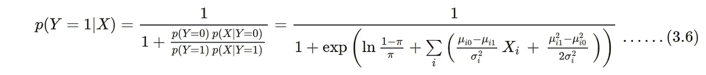

情商。13:使用等式中的表达式。12 回到 Eq。11

把*P*(*Y*= 1 |*X*)写成这种形式，让我们有了直接和 Eq 比较的可能。8，即逻辑回归的条件类分布的函数形式，我们根据高斯均值和标准差获得参数(权重和偏差)，如下所示—


情商。14:以高斯平均值和标准偏差表示的逻辑回归参数。

这里，我们从高斯朴素贝叶斯分布出发，得出了逻辑回归的生成公式，并且，对于给定的二元分类问题，我们还可以找到这两种分布的参数之间的关系。

## 实现高斯朴素贝叶斯；循序渐进:

理解上述步骤的最佳方式是实现它们，为此，我将使用 [Palmer Penguin 数据集](https://github.com/allisonhorst/palmerpenguins)，它与 Iris 数据集非常相似。让我们从导入必要的库和加载数据集开始。

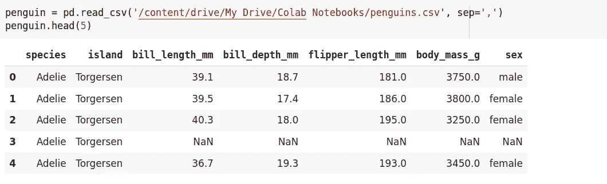

这是一个数据集，包括 3 种不同的企鹅‘阿德利’、‘巴布亚’和‘下颚带’，以及一些特征，如喙长、鳍长等。都是给定的。我们可以看到企鹅类基于两个参数“喙长度”和“喙深度”的分布，使用简单的一行代码如下—

```
penguin_nonan_df = penguin.dropna(how=’any’, axis=0, inplace=False)
sns_fgrid=sns.FacetGrid(penguin_nonan_df, hue=”species”, height=6).map(plt.scatter, “bill_length_mm”, “bill_depth_mm”).add_legend()plt.xlabel(‘Bill Length (mm)’, fontsize=12)plt.ylabel(‘Bill Depth (mm)’, fontsize=12)
```

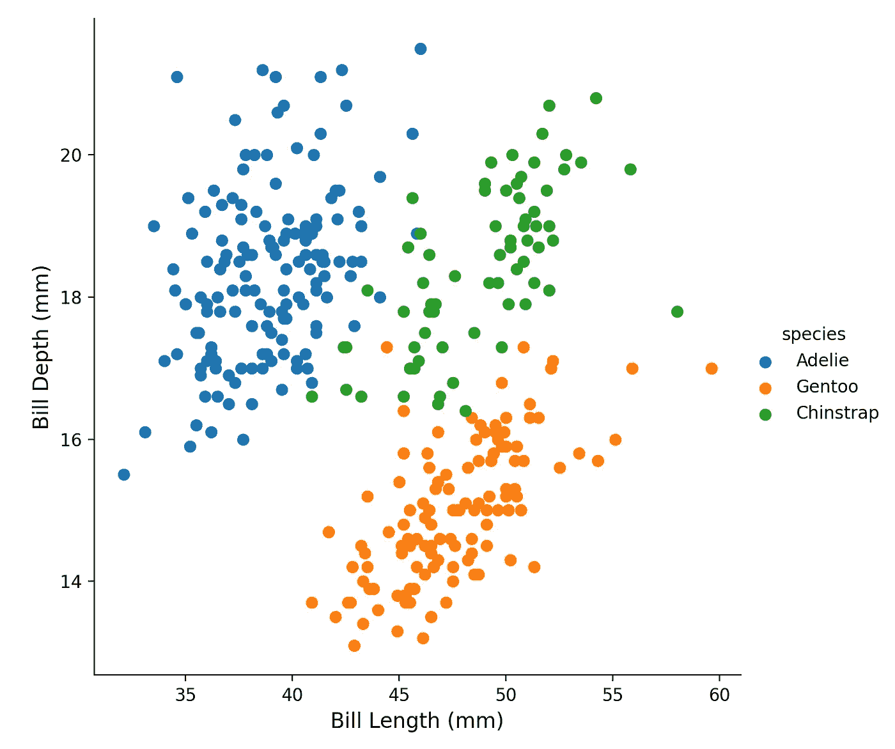

图 1:基于 2 个不同参数的不同企鹅种类的分布。(来源:作者笔记本)

为了简单起见，我们将只选择这两个特性，而不是使用所有可用的特性。

```
penguin_nonan_selected_df = penguin_nonan_df[['species', 'bill_length_mm', 'bill_depth_mm']]X=penguin_nonan_selected_df.drop(['species'], axis=1)Y=penguin_nonan_selected_df['species']from sklearn.model_selection import train_test_splitX_train, X_test, y_train, y_test = train_test_split(X, Y, test_size=0.2, random_state=30, stratify=Y)print (X_train.shape, y_train.shape, X_test.shape)>>> (266, 2) (266,) (67, 2)X_train = X_train.to_numpy()
X_test = X_test.to_numpy()y_train = y_train.to_numpy()
y_test = y_test.to_numpy()
```

要从头开始构建朴素贝叶斯分类器，首先，我们需要定义类的先验分布，在这种情况下，我们将计算唯一类的数量，然后除以样本总数，以获得类的先验分布。我们可以定义如下—

让我们打印基于训练样本的先验分布—

```
prior = get_prior(y_train)print (prior)print (‘check prior probs: ‘, prior.probs,)>>> [0.43984962 0.20300752 0.35714286]
tfp.distributions.Categorical("Categorical", batch_shape=[], event_shape=[], dtype=int32)
>>> check prior probs:  tf.Tensor([0.43984962 0.20300752 0.35714286], shape=(3,), dtype=float64)
```

定义先验分布后，我们将定义类别条件分布，正如我之前所述，对于高斯 NB，我们将假设单变量高斯分布，如下式所示。记住，对于我们的问题，我们有 2 个特性和 3 个类。


情商。15:高斯分布作为类条件

为了定义类别条件，我们需要知道均值和方差，对于正态分布，它们可以很容易地计算出来，查看这里的。


情商。16:等式中类别条件分布的均值和方差。15:

让我们把它们放在一起，定义类条件函数。

再次检查代码块，理解并领会它确实给了我们 Eq。15 使用等式的平均值和方差。16.我们还可以打印来检查训练数据的均值和方差—

```
class_conditionals, mu, sigma2 = class_conditionals_MLE(X_train, y_train)print (class_conditionals)print (‘check mu and variance: ‘, ‘\n’)print (‘mu: ‘, mu, )print (‘sigma2: ‘, sigma2, )# batch shape : 3 classes, event shape : 2 features>>> tfp.distributions.MultivariateNormalDiag("MultivariateNormalDiag", batch_shape=[3], event_shape=[2], dtype=float64)>>> check mu and variance:
>>> mu:  [ListWrapper([39.017094017093996, 18.389743589743592]), ListWrapper([49.12592592592592, 18.479629629629624]), ListWrapper([48.063157894736854, 15.058947368421052])]
>>> sigma2:  [[7.205861640733441, 1.5171597633136102], [10.038216735253773, 1.1042146776406032], [9.476642659279785, 0.9687357340720222]]
```

最后，我们在测试集上进行预测。因此，我们逐个样本地选择，并使用来自先验概率和类别条件的信息。这里我们构建一个函数来表示 Eq。5 和情商。这是我们在文章开头写的。

```
def predict_class(prior_dist, class_cond_dist, x):“””We will use prior distribution (P(Y|C)), class-conditional distribution(P(X|Y)),and test data-set with shape (batch_shape, 2).“”” y = np.zeros((x.shape[0]), dtype=int) for i, train_point in enumerate(x): likelihood = tf.cast(class_cond_dist.prob(train_point), dtype=tf.float32) #class_cond_dist.prob has dtype float64 prior_prob = tf.cast(prior_dist.probs, dtype=tf.float32) numerator = likelihood * prior_prob denominator = tf.reduce_sum(numerator) P = tf.math.divide(numerator, denominator) # till eq. 5 #print (‘check posterior shape: ‘, P.shape) Y = tf.argmax(P) # exact similar to np.argmax [get the class]
       # back to eq. 6 y[i] = int(Y) return y
```

我们可以预测测试数据点的类别，并将它们与原始标签进行比较

```
predictions = predict_class(prior, class_conditionals, X_test)
```

为测试数据点绘制决策边界(使用等高线图)将产生下图

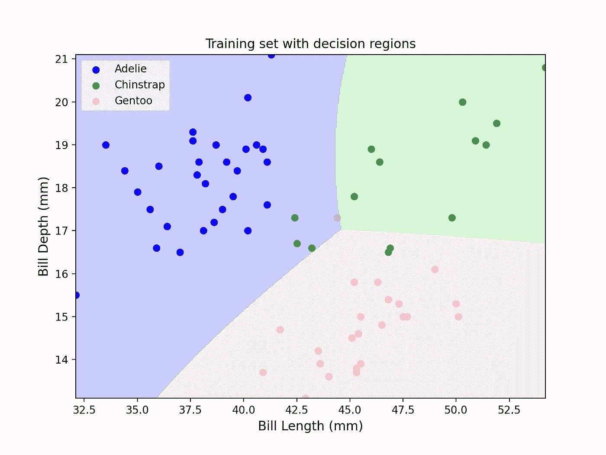

图 2:使用 GNB 分类器的测试数据集的决策区域。(来源:作者笔记本)

以上所有任务都可以用 Sklearn 完成，只需要几行代码—

```
from sklearn.naive_bayes import GaussianNBsklearn_GNB = GaussianNB()
sklearn_GNB.fit(X_train, y_train)predictions_sklearn = sklearn_GNB.predict(X_test)
```

了解这些基本算法的幕后工作总是好的，我们可以比较与我们之前获得的参数非常接近的拟合参数—

```
print ('variance:',  sklearn_GNB.var_)print ('mean: ', sklearn_GNB.theta_)>>> variance: [[ 7.20586167  1.51715979]
 [10.03821677  1.10421471]
 [ 9.47664269  0.96873576]]
mean:  [[39.01709402 18.38974359]
 [49.12592593 18.47962963]
 [48.06315789 15.05894737]]
```

让我们绘制决策区域，以便与我们的硬编码 GNB 分类器进行比较—

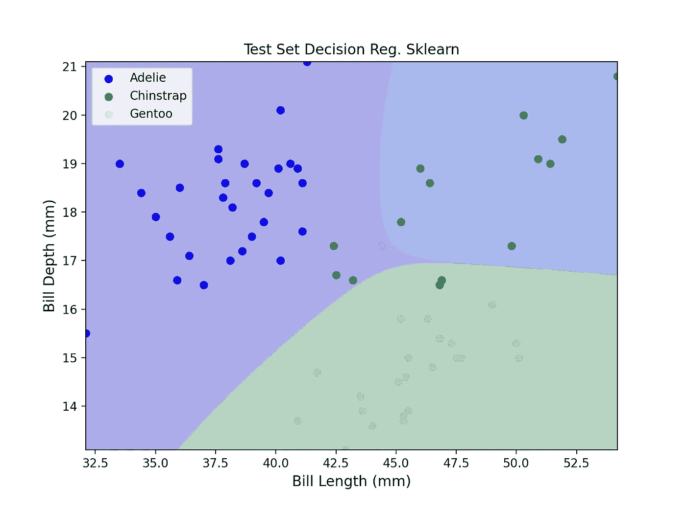

图 3:与图 2 相同，但结果来自使用 Sklearn 库。(来源:作者笔记本)

他们看起来和预期的非常相似。让我们移动到明确连接 GNB 和逻辑回归分类器的二元分类问题。

## 来自 GNB 的逻辑回归参数:

如前所述，为了将朴素贝叶斯和逻辑回归联系起来，我们会想到二元分类。由于企鹅数据集中有 3 个类，首先，我们将问题转化为一个 vs rest 分类器，然后确定逻辑回归参数。同样关于 GNB 作为二元分类器的推导，我们将使用*相同的σ_i 用于两个不同的类*(没有 k 依赖性)。这里我们会找到 6 个参数。4 为 *μ_{ik}* & 2 为 *σ_i* 。这排除了使用我们之前使用的类条件函数的可能性，因为在标准差公式中使用了 *μ_{ik}* ，并且均值取决于类和特征。所以我们要写一个函数，用梯度下降型优化来学习类独立标准差。这是主要的编码任务。

在所有这些之前，我们需要对标签进行二值化，为此，我们将对标签为 2 的样本使用标签 1。

```
class_types_dict = {'Adelie':0, 'Chinstrap':1, 'Gentoo':2}y_train_cat = np.vectorize(class_types_dict.get)(y_train)y_train_cat_binary = y_train_caty_train_cat_binary[np.where(y_train_cat_binary == 2)] = 1 
# gentoo == chinstrapy_test_cat = np.vectorize(class_types_dict.get)(y_test)y_test_cat_binary = np.array(y_test_cat)y_test_cat_binary[np.where(y_test_cat_binary == 2)] = 1print (‘check shapes: ‘, y_train_cat_binary.shape, y_test_cat_binary.shape, y_train_cat_binary.dtype, ‘\n’, y_train_cat.shape)>>> check shapes:  (266,) (67,) int64
>>> (266,)
```

我们可以绘制数据分布图，如下图所示—

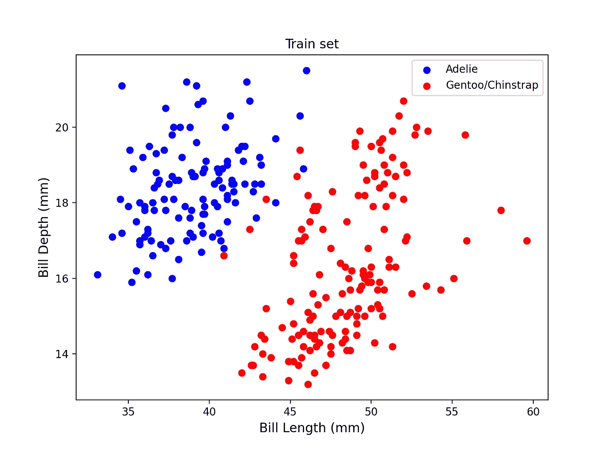

图 4:对巴布亚企鹅和下颚带企鹅使用相同的分类标签，将问题转化为二元分类。(来源:作者笔记本)。

我们可以使用先验分布函数来获得这两个类别的类别标签先验

```
prior_binary = get_prior(y_train_cat_binary)print (prior_binary.probs, print (type(prior_binary)))>>> [0.43984962 0.56015038]
<class 'tensorflow_probability.python.distributions.categorical.Categorical'>
tf.Tensor([0.43984962 0.56015038], shape=(2,), dtype=float64) None
```

与之前的先验分布相比，我们会看到 Adelie penguin 类具有相同的先验(0.43)，并预期增加 Gentoo 和 Chinstrap 先验分布(≈ 0.20 + 0.35)。

为了学习标准差，我们将在给定数据和标签的情况下，使用梯度下降来最小化负对数似然。

一旦训练结束，我们就可以检索参数—

```
print(class_conditionals_binary.loc.numpy())print (class_conditionals_binary.covariance().numpy())
```

使用类条件句，我们可以绘制如下等高线——

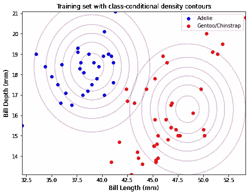

图 5:2 类[0，1]的类条件轮廓。(来源:作者笔记本)。

我们也可以画出二元 GNB 分类器的判定边界——

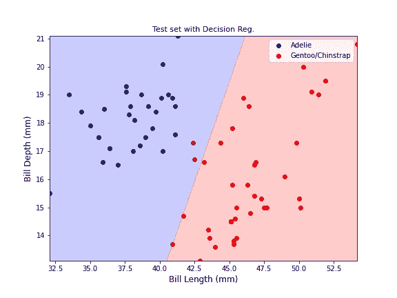

图 6:使用 GNB 分类器的二元分类的判定边界。

一旦我们有了均值和对角协方差矩阵，我们就可以为逻辑回归寻找参数了。权重和偏差参数是使用等式中的均值和协方差导出的。14，让我们再重写一遍—

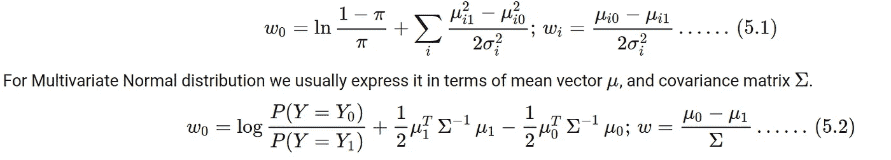

情商。17:用均值和协方差矩阵表示的逻辑回归参数。

就这样，我们到了帖子的末尾！涵盖了许多重要的基本概念，希望这对您有所帮助。

## 参考资料:

[1] [企鹅数据集](https://allisonhorst.github.io/palmerpenguins/)，CC-0 许可，可自由改编。

[2]机器学习的书；卡内基梅隆大学的汤姆·米切尔；[新章节](http://www.cs.cmu.edu/%7Etom/NewChapters.html)。

[3]本帖使用的完整笔记本。 [GitHub 链接](https://github.com/suvoooo/Machine_Learning/blob/master/NB_LogisticReg.ipynb)。

保持坚强！！