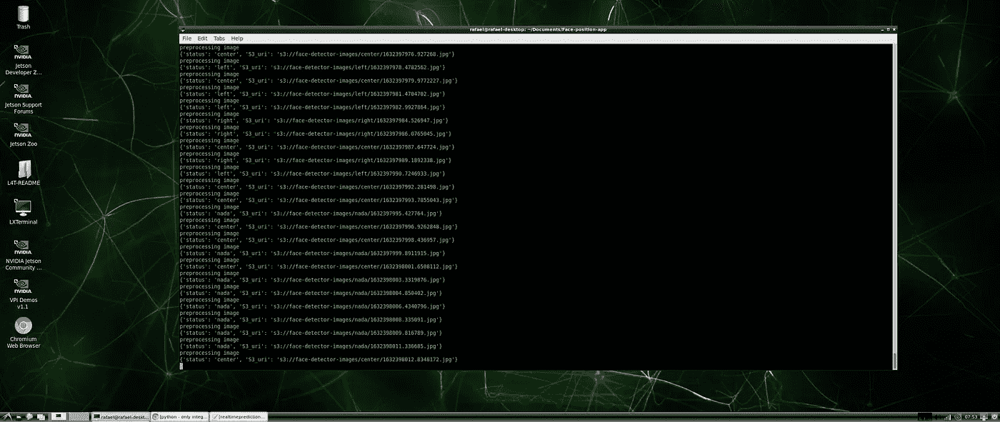

# 连接人工智能、物联网、云和网络开发

> 原文：<https://towardsdatascience.com/connecting-the-dots-ai-iot-cloud-and-web-dev-848447e1ca66?source=collection_archive---------34----------------------->

## 使用趋势技术进行端到端解决方案开发的小旅程

# 最终目标和步骤:

这个项目背后的想法是确定我在家工作的性能，并了解如何使用物联网设备、AWS 云以及简单的 Web 应用程序在 edge 上使用计算机视觉来改善我的工作站设置。

此外，我想分享在开发过程中发现的挫折，以及我为解决这些挫折而采取的措施。

所以，根据需求，我的第一个想法是这样的:


我工作站上方的摄像机，为了确定脸部位置，我*拍摄作者*

一旦定义了初始设置，我就开始确定获取数据所需的最少工具，在本例中是相机；由于在 [**LPR 识别文章**](https://rafael-a-rodriguez-m.medium.com/train-and-deploy-an-alpr-for-colombian-license-plate-with-tiny-yolov4-and-jetson-nano-without-5da6f975ea14) 中我使用了 [SV3C](https://www.amazon.com/-/es/gp/product/B077889YRN/ref=ppx_yo_dt_b_asin_title_o01_s00?ie=UTF8&psc=1) 低成本摄像头，我决定使用相同的摄像头，因为集成已经使用 HTTP 完成。

这些是最初的图像:


右中我*作者*法师


空，左，我作者*法师*

我使用了两个脚本来获取这些图像，一个用 Python，一个用 Bash(注意:关于这个项目的所有信息都可以在下面的 [Github](https://github.com/RrodriguezM/Face-position-app) repo 中获得)。第一个用于创建名为[create-folder-structure . sh](https://github.com/RrodriguezM/Face-position-app/blob/main/create-folder-structure.sh)的文件夹结构，第二个用于收集名为 [collect_images.py](https://github.com/RrodriguezM/Face-position-app/blob/main/collect_images.py) 的数据。

# 获取输入数据:

此时，我有了每个位置的设置和 200 张图像，我开始考虑如何使用这些图像，所以我最终使用带有 [EfficientNetB0](https://www.tensorflow.org/api_docs/python/tf/keras/applications/efficientnet/EfficientNetB0) 的迁移学习作为特征提取器，只训练最后一层。这里是 [Colab 链接](https://colab.research.google.com/drive/1bjI2YLTwkMcrwIjK6Fo92C-IKzKHJSAJ?usp=sharing)

仅仅过了几个纪元，我就能达到 80%以上的准确率。然而，我在实时测试中发现了一些挫折，因为我的想法是基于我的头部位置进行训练。然而，网络实际上学习了我的肩膀和手臂的位置，所以我有了更多的选择，如获得更多的数据，获得不同的图像，数据增强和更复杂的网络。不过，我想保持简单，所以我做了更多的研究，找到了一种新的方法。

基于我最初的想法，我想跟踪我的脸，经过一些研究，我发现了一个名为 [MoveNet](https://blog.tensorflow.org/2021/05/next-generation-pose-detection-with-movenet-and-tensorflowjs.html) 的神经网络，它由谷歌在 2021 年发布，能够检测身体中的 17 个关键点(*鼻子，左眼，右眼，左耳，右耳，左肩，右肩，左肘，右肘，左手腕，右手腕，左臀部，右臀部，左膝盖，右膝盖，左脚踝，右脚踝)*，通过前五个关键点，我有了一些关于我的脸的信息，或者任何信息

另外，我改变了摄像机的位置。这就是做一个真正的项目而不是用数据集测试和学习的区别。对于真实的项目，您可以更改输入数据，并验证新数据是否比以前的数据提供了更多信息，我可以这样做，因为这是一个端到端的项目。


我是作者的*法师*

有了这个信息，现在的方法是检测这 5 个关键点，并选择 ML 分类器来确定头部的位置。

# 选择分类器:

作为面向 ML 初学者的趋势技术的一部分，有几个 **AutoML** 解决方案( [FLAML](https://github.com/microsoft/FLAML) 和 [MLJAR](https://github.com/mljar/mljar-supervised) )，所以我决定测试 FLAML 并获得使用哪个分类器的初始方向

只用几行代码:

```
from flaml import AutoML
automl = AutoML()
automl.fit(X_train, y_train, task=”classification”, time_budget=120)
```

我在验证集里得了 84 分


最佳 ML 解决方案*，作者本人*作者*

但是在测试集中有 93%。


我*作者法师*

这里是用于 MoveNet 未来提取和 AutoML 分类器的 [Colab](https://colab.research.google.com/drive/1RD-a-c9Gs0oDoA39rkQAnCvvkxVB3qGo?usp=sharing) 。

# 与 AWS 物联网的集成:

一旦我设置好获取图像，使用 MoveNet 获取关键点，并使用 FLAML 对图像进行分类，我想将信息发送给 AWS。一个有趣的服务是 AWS 的物联网核心，所以这是我最后要介绍的基本架构:


建筑，我*作者法师*

# 基本架构描述:

SV3C 摄像头符合 OVNIF 标准。OVNIF 有一些使用 HTTP 协议获取图像快照的标准方法，允许您随时获取图像，而不必处理视频流。你可以在 [Github](https://github.com/RrodriguezM/Face-position-app/blob/main/GetImagesCameraSv3c/getImage.py) 中看到这个请求。

对于终端设备和 AWS 物联网核心之间的通信，我使用了 MQTT，这是一种帮助我轻松通过远程设备进行通信和操作的通信协议，允许我在未来添加任何智能开关，以便在我离开办公室时关灯。

这部分是基于下面的 AWS [博客](https://aws.amazon.com/premiumsupport/knowledge-center/iot-core-publish-mqtt-messages-python/)来使用 Python **awsiotsdk**

关于我正在使用的 AWS 服务，两者都是无服务器的，可以扩展到数十亿台设备，我只为我使用的服务付费(按需付费)。对于 DynamoDB，集成基于以下[文档](https://docs.aws.amazon.com/iot/latest/developerguide/iot-ddb-rule.html)。我还将图片上传到一个 S3 桶中，并存储在一个名为 predictions 的文件夹中，这将帮助我验证模型的行为。

然后我们有 Streamlit，我现在在本地使用它只是为了得到一个概述。

# 在 JetsonNano 中运行它:

当我准备好模型并在我的电脑上工作后，我决定将它转移到 Jetson Nano 上时，真正的挑战就开始了。主要原因是 Jetson 耗尽了内存，AutoML 库(Flaml)有一些问题需要安装。

经过进一步的研究，我发现使用 **Tflite** 的 MoveNet 模型解决了内存问题，但我仍然有 Flaml 库的问题。然而，这个博客中提到了解决方案；我建议 AutoML 获得一个初始方向，并且基于从 Flaml 库获得的输出，我找到了 AutoML 建议的模型的特定库，在这种情况下， [LGBM](https://lightgbm.readthedocs.io/en/latest/index.html) 如(最佳 ML 解决方案*)图所示。

参见`realtimepredictionmovenetflaml.py`中的 Tflite 实现和本 [Colab](https://colab.research.google.com/drive/1JA-fomqWhzD570D4QlmX623bzc6Fk7kR?usp=sharing) 中的初始测试

参见本 [Colab](https://colab.research.google.com/drive/1RD-a-c9Gs0oDoA39rkQAnCvvkxVB3qGo#scrollTo=--pI-RmRrNEI) 中的 LGBM 培训



我*作者法师*


杰特森留言，我*法师作者*


AWS 物联网控制台记录消息

# 运行项目的脚本:

*   要进行实时推断并将数据发送给 AWS:

`python realtimepredictionmovenetflaml.py`

*   要在本地运行 Streamlit 服务器:

`streamlit run app.py`

*   要从相机收集图像:

`python collect_images.py`

*   要训练 NN，去[实验室](https://colab.research.google.com/drive/1RD-a-c9Gs0oDoA39rkQAnCvvkxVB3qGo?usp=sharing)


网页原型，作者本人*图片*

# 从原型到产品的改进和评论:

本项目有许多需要改进的地方，例如:

*   从 Streamlit 到 SPA 的变化可能类似于 React.js
*   使用更多图像进行训练，以提高准确性
*   添加数据扩充
*   添加基础设施作为配置所有 AWS 服务的代码
*   获取更多指标
*   添加可见性(日志)