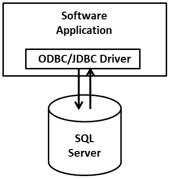
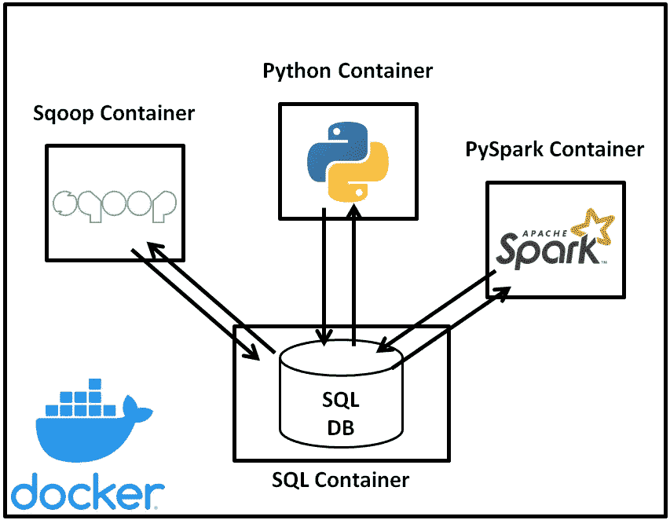
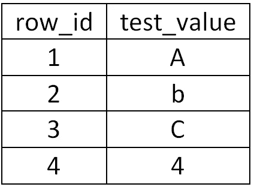

# 为数据科学家、分析师和工程师连接到 SQL 数据库

> 原文：<https://towardsdatascience.com/connecting-to-sql-databases-for-data-scientists-analysts-and-engineers-58dc77a9165e?source=collection_archive---------8----------------------->

## 了解如何利用企业中最常见的数据存储来源之一。


本杰明·雷曼在 [Unsplash](https://unsplash.com?utm_source=medium&utm_medium=referral) 上的照片

无论你是在构建分析还是在寻求训练一个机器学习模型，数据工程、分析和科学的基础都是对数据的访问。数据本身可以从许多不同的来源收集:web 抓取、API 调用、平面文件；但是跨企业的数据存储的最常见来源之一是结构化数据库，它通常被称为 SQL 数据库。

SQL 数据库是一个包罗万象的术语，指的是使用结构化查询语言(SQL 查询)进行交互的关系数据库管理系统(RDBMS)。SQL 数据库能够快速处理和存储大量数据，使其成为企业中非常常用的数据存储和管理应用程序。

虽然 SQL 语言能够对数据库执行标准分析(GROUP BY/FILTER/etc……)，但在实践中，许多企业不鼓励直接在数据库本身上大量使用 SQL，因为它们要么是热数据库(根据它们所服务的软件应用程序的需要而活动)，要么是报告数据库(从热数据库同步，专门用于数据提取)。此外，由于 SQL 语言的限制，许多统计和机器学习工具不可用，因此在企业环境中，在处理数据之前摄取数据是常见的做法。

数据接收是从一个存储介质(源)获取数据并将其转储到另一个更适合数据操作的存储介质(接收器)的过程。谈到大数据，企业环境中最常见的大规模数据吸收汇是数据湖(通常通过 Hadoop 生态系统)。一旦数据进入湖中，就可以由任何 Hadoop 生态系统工具(Spark、Pig 等)自由转换或操纵。)或转换成开发者喜欢的不同形式。为了将数据从 SQL 数据库接收到您选择的介质中，必须使用连接器作为开发的软件应用程序的一部分。

# ODBC / JDBC 驱动程序

开放式数据库连接(ODBC)是数据库采用的 API 标准，它允许软件应用程序与数据库管理系统(DBMS)接口。在这方面，ODBC 驱动程序或 Java 数据库连接器(JDBC)驱动程序都是这些标准的实际应用，它们可以被软件应用程序用来连接到如图 1 所示的数据库。



图 1 软件应用程序通过 ODBC/JDBC 驱动程序连接到 SQL 数据库的描述(图片由作者提供)

由于每个数据库引擎(MySQL、Microsoft SQL、PostGreSQL、Oracle 等)的内部操作不同，每个数据库引擎都有自己特定的 ODBC/JDBC 驱动程序用于交互。然而，这些 ODBC/JDBC 驱动程序的功能都是相似的，因此许多编程语言都有一种标准的方式来调用用于连接这些数据库的各种 ODBC/JDBC 驱动程序。一旦软件应用程序加载了 ODBC/JDBC 驱动程序，该驱动程序就被配置为指向 SQL 数据库并与之交互，这需要设置:主机/URL、数据库名称以及可以访问数据集的凭证。

为了演示从 SQL DB 获取或加载数据的不同连接方式，本教程将介绍使用 Python (pyodbc 包)、Spark(Scala Spark 和 PySpark)和 Sqoop(Hadoop 生态系统的数据获取工具)获取数据。此外，Docker 将用于容器化环境，以更接近地模拟企业环境，并允许读者轻松复制演示。

# 码头工人

Docker 是一个允许您轻松构建和部署轻量级虚拟机(也称为容器)的工具，这些虚拟机可以连接起来形成一个网络。在大多数实际的企业环境中，需要来自 SQL 服务器的数据的软件应用程序不会在与 SQL 服务器相同的机器上运行，因此我们可以使用图 2 所示的 Docker 体系结构来模拟这样的企业环境。



图 2 使用 Docker 容器和网络的模拟企业环境(图片来自作者)

为了便于跟随教程，上面的 Docker 环境和所有用于连接 MySQL 数据库的脚本都可以在 GitHub [1]上找到。

# 使用 MySQL 设置 SQL 数据库

MySQL 是一个用于存储和管理企业架构中常见的结构化数据的通用数据库引擎，它代表了一个用于本地部署的开源(并且容易获得)SQL DB，以构建我们的沙盒企业环境。

mysql 提供了一个基本的 Docker 映像，mysql/mysql-server [2]，它在一个容器中启动一个预安装的 MySQL 实例，该实例将在我们的模拟企业环境中充当 SQL Server。

此 Docker 图像接受。sql 脚本作为容器初始化时运行的命令，我们可以使用它(与。下面的 sql 脚本)来配置数据库，并为我们的连接测试创建假数据。

```
*-- Create database**CREATE DATABASE test_db;**USE test_db;**-- Create table**CREATE TABLE test_table(**row_id INT AUTO_INCREMENT PRIMARY KEY,**test_value VARCHAR(255) NOT NULL**);**-- Fill table with values**INSERT INTO test_table(test_value) VALUES ("A");**INSERT INTO test_table(test_value) VALUES ("b");**INSERT INTO test_table(test_value) VALUES ("C");**INSERT INTO test_table(test_value) VALUES ("4");**-- Add user with remote access priveleges**CREATE USER "remote_connect_user"@"%" IDENTIFIED BY "remote_connect_password";**GRANT ALL PRIVILEGES ON * . * TO "remote_connect_user"@"%" WITH GRANT OPTION;**FLUSH PRIVILEGES;*
```

上面的代码执行两个主要功能:

1.  MySQL 服务器创建一个数据库(名为 test_db ),在数据库中创建一个表(名为 test_table ),并用少量记录填充 test_table(见下面的表 I ),当我们尝试提取数据时，可以在接收端验证这些记录
2.  MySQL 服务器创建一个用户帐户(名称:remote_connect_user，密码:remote_connect_password ),该帐户具有远程访问数据库的权限

表 I: test_db.test_table 值



设置好 MySQL 数据库后，我们可以专注于如何通过各种软件应用程序提取数据，在本教程中从 Python(和 pyodbc 包)开始。

# 使用 Python 的 MySQL 数据库连接(通过 pyodbc)

通过使用 pip install 调用许多可用的 ODBC 包之一，可以很容易地使用 Python 连接到 SQL DB。在本教程中，我们将重点关注使用 pyodbc [3]包使用 Python 连接到 MySQL DB，该包作为 Docker 映像 laudio/pyodbc [4]提供，并包含 MySQL ODBC 8.0 驱动程序。

为了连接到容器以建立 python 连接，我们可以运行命令:

```
*docker exec -it sql-ingestion-tutorial-python-client-1 python*
```

它远程连接到容器，并在容器中启动 python 的交互式会话。

加载 python 后，我们可以使用下面的代码来加载 pyodbc 包，配置驱动程序的设置以连接到我们的 MySQL 实例，并运行测试查询来选择*并在控制台中输出结果。

```
*# Imports**import pyodbc**# Set configuration for DB**MYSQL_HOST="mysql-server"**MYSQL_USER="remote_connect_user"**MYSQL_PASS="remote_connect_password"**MYSQL_DB="test_db"**MYSQL_TABLE="test_table"**# Establish connection to MySQL DB**cnxn = pyodbc.connect(f"DRIVER={{MySQL ODBC 8.0 Driver}};SERVER={MYSQL_HOST};DATABASE={MYSQL_DB};UID={MYSQL_USER};PWD={MYSQL_PASS}")**cursor = cnxn.cursor()**# Run query to select * and output results**cursor.execute(f"SELECT * FROM {MYSQL_TABLE}")**row = cursor.fetchone()**while row:* *print (row)* *row = cursor.fetchone()*
```

在这种情况下，pyodbc.connect 函数引用 MySQL DB 的预安装 odbc 驱动程序，并且该驱动程序被配置为包括服务器 URL、数据库名称和运行查询所调用的凭证。然后，test 命令通过对 DB 中的表运行 SELECT *语句来引用这个连接，并迭代地打印输出，如下所示。

```
(1, 'A')
(2, 'b')
(3, 'C')
(4, '4')
```

# 使用 Apache Sqoop 的 MySQL 数据库连接

Apache Sqoop [5]是 Hadoop 生态系统中的一个工具，用于结构化数据库中的数据与 Hadoop 文件存储之间的批量传输。虽然 Apache Sqoop 已于 2021 年 6 月退役[6]，但该工具通常被企业用来将数据吸收到数据湖中，实际上需要一段时间才能从企业生产系统中完全退役。

与其他容器类似，Apache Sqoop 可以使用 dvoros/sqoop 映像[7]立即获得，该映像预装了 Apache Sqoop 和所有用于支持 Sqoop 的 Hadoop 生态系统工具。

Sqoop 映像不包含 JDBC 驱动程序，Sqoop 将使用该驱动程序连接到 MySQL 数据库，因此正在启动的 Docker 容器包括将 JDBC 驱动程序装载到容器中，当该容器放置在/usr/local/sqoop/lib 文件夹中时，Sqoop 将自动识别该容器。考虑到要连接到一个 MySQL 数据库，我们可以通过下载 MySQL 网站[8]上提供的连接器的平台无关版本来获得这个连接器。

Sqoop 本身有许多参数来帮助实现常见的数据摄取功能[9]，但是出于本教程的目的，演示将是使用下面给出的代码以文本形式从 MySQL 数据库到 HDFS 的基本摄取:

```
*# Create the data ingestion location**hdfs dfs -mkdir /user/sqoop* *# Sqoop import example**MYSQL_HOST=mysql-server**MYSQL_USER=remote_connect_user**MYSQL_PASS=remote_connect_password**MYSQL_DB=test_db**MYSQL_TABLE=test_table**sqoop import --connect jdbc:mysql://$MYSQL_HOST/$MYSQL_DB --table $MYSQL_TABLE --username $MYSQL_USER --password $MYSQL_PASS --as-textfile --target-dir /user/sqoop/text -m 1**# Test the output**hdfs dfs -ls /user/sqoop/text**# Inspect the parquet file**hdfs dfs -cat /user/sqoop/text/part-m-00000*
```

如代码所示，首先在 HDFS 创建一个目标文件夹来存储接收到的数据。Sqoop 摄取过程直接从命令行执行，与建立连接的其他应用程序类似，MySQL 连接器被引用并配置为指向正确的表位置和凭证。

```
1,A
2,b
3,C
4,4
```

代码的最终结果如上所示，它验证了 MySQL 数据库的快照已经被 HDFS 接收。此时，可以通过 Spark 或其他方式在 Hadoop 中原生拾取。

# 使用 Spark 的 MySQL 数据库连接

与上面的例子类似，我们可以利用 Spark 自带的 Docker 容器，在这种情况下，我们将使用 jupyter/pyspark-notebook 映像[10]。然而，与其他连接不同，当我们提交应用程序时，我们必须将 JDBC 驱动程序作为一个添加的 jar 文件包含在 Spark 中。下面是 Scala Spark 和 PySpark 连接 MySQL 数据库的示例代码。

## 使用 Scala Spark 连接 MySQL 数据库

与之前的容器一样，我们首先运行以下命令来连接 Spark 容器并调用 Scala 提示符:

```
*docker exec -it sql-ingestion-tutorial-pyspark-client-1 spark-shell --jars /jdbc/**
```

连接到 Scala 提示符后，以下命令调用 JDBC 驱动程序连接到 DB 并打印结果数据以验证连接成功。

```
*// Set configuration for DB**val MYSQL_HOST="mysql-server";**val MYSQL_USER="remote_connect_user";**val MYSQL_PASS="remote_connect_password";**val MYSQL_DB="test_db";**val MYSQL_TABLE="test_table";**// Establish connection for MySQL DB using credentials provided**val df = (spark.read**.format("jdbc")**.option("url", s"jdbc:mysql://$MYSQL_HOST/$MYSQL_DB")**.option("driver", "com.mysql.cj.jdbc.Driver")**.option("dbtable", MYSQL_TABLE)**.option("user", MYSQL_USER)**.option("password", MYSQL_PASS)**.load())**// Display results for validating successful connection**df.show()*
```

成功建立连接后，将生成以下输出。

```
+------+----------+
|row_id|test_value|
|     1|         A|
|     2|         b|
|     3|         C|
|     4|         4|
+------+----------+
```

## 使用 PySpark 连接到 MySQL 数据库

为了连接到 PySpark 提示符，将调用之前使用的同一个容器，但是下面的命令将启动一个 PySpark 会话来连接到 DB。

```
*docker exec -it sql-ingestion-tutorial-pyspark-client-1 pyspark --jars /jdbc/**
```

调用 JDBC 驱动程序并提取数据的 PySpark 版本代码如下:

```
*# Set configuration for DB**MYSQL_HOST="mysql-server"**MYSQL_USER="remote_connect_user"**MYSQL_PASS="remote_connect_password"**MYSQL_DB="test_db"**MYSQL_TABLE="test_table"**# Establish connection for MySQL DB using credentials provided**df = spark.read.format('jdbc').options(**url = f"jdbc:mysql://{MYSQL_HOST}/{MYSQL_DB}",**driver = "com.mysql.cj.jdbc.Driver",**dbtable = MYSQL_TABLE,**user = MYSQL_USER,**password = MYSQL_PASS**).load()**# Display results for validating successful connection**df.show()*
```

成功建立连接后，将会看到以下输出。

```
+------+----------+
|row_id|test_value|
|     1|         A|
|     2|         b|
|     3|         C|
|     4|         4|
+------+----------+
```

# 结论

没有数据，分析或数据科学就没有机会让业务受益。大多数企业系统严重依赖 SQL 数据库来存储大量数据，并不是每个团队都有专门的数据工程师或数据仓库来提供对开发数据的轻松访问。在这种情况下，值得你自己学习这些技能，让你的生活变得更轻松。本文简要介绍了如何使用 ODBC 和 JDBC 连接器在软件应用程序中建立与数据库的连接，并使用 Python (pyodbc 包)、Sqoop 和 Spark (PySpark 和 Scala Spark)进行了演示。

# 参考

[1] SQL 摄取教程 Github 页面，[https://github.com/mkgray/sql-ingestion-tutorial](https://github.com/mkgray/sql-ingestion-tutorial)

[2] MySQL 服务器 Dockerfile，【https://hub.docker.com/r/mysql/mysql-server/ 

[3] PyODBC 包，【https://pypi.org/project/pyodbc/ 

[4]pyodbc dock file，[https://hub . docker . com/r/laudo/pyodbc](https://hub.docker.com/r/laudio/pyodbc)

[5] Apache Sqoop，[https://sqoop . Apache . org/](https://sqoop.apache.org/)

[6] Apache Sqoop Attic，[https://attic . Apache . org/projects/sqoop . html](https://attic.apache.org/projects/sqoop.html)

[7]Apache sqoop docerfile，[https://hub . docker . com/r/dvosos/sqoop](https://hub.docker.com/r/dvoros/sqoop)

[8] MySQL JDBC 连接器，[https://dev . MySQL . com/downloads/connector/j/](https://dev.mysql.com/downloads/connector/j/)

[9] Apache Sqoop User Guide，[https://sqoop . Apache . org/docs/1 . 4 . 6/sqoop user guide . html](https://sqoop.apache.org/docs/1.4.6/SqoopUserGuide.html)

[10]spark dock file，[https://hub . docker . com/r/jupyter/pyspark 笔记本电脑](https://hub.docker.com/r/jupyter/pyspark-notebook)