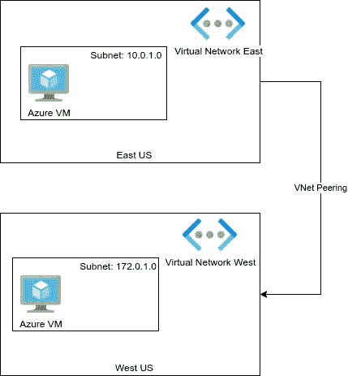
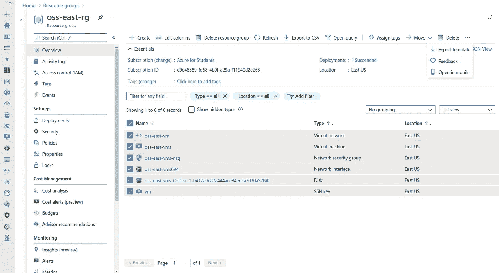
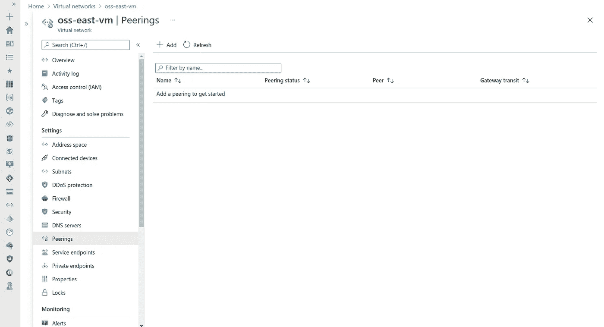
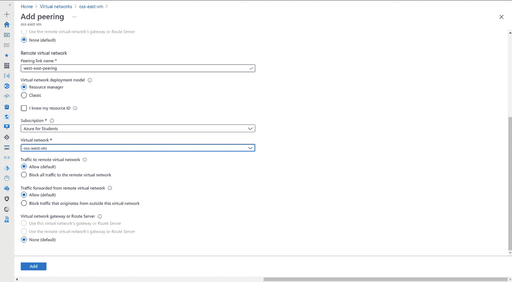
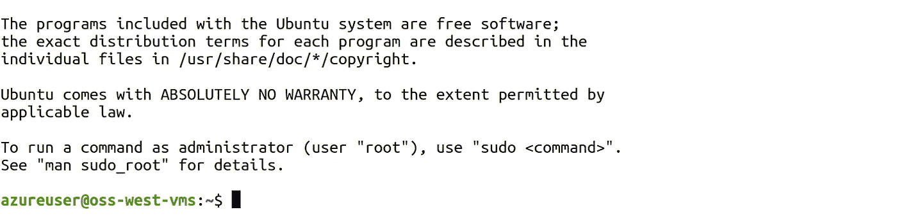
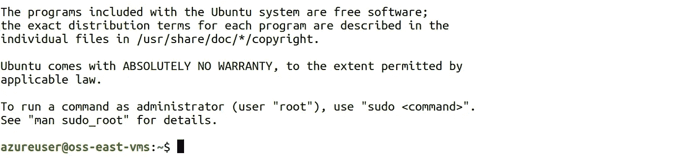

# 使用虚拟网络对等和 ARM 模板连接两个分立虚拟网络

> 原文：<https://towardsdatascience.com/connecting-two-discrete-vnets-using-vnet-peering-and-arm-templates-c33a96812d9c?source=collection_archive---------33----------------------->

## 利用 VNet 对等和 Azure ARM 模板从我们的代码构建基础设施


照片由 [Unsplash](https://unsplash.com/s/photos/connection?utm_source=unsplash&utm_medium=referral&utm_content=creditCopyText) 上的 [israel palacio](https://unsplash.com/@othentikisra?utm_source=unsplash&utm_medium=referral&utm_content=creditCopyText) 拍摄

# 动机:

如果操作不当，连接虚拟网络有时可能会很麻烦。一次又一次地创建它，会更容易出错。因此，我们将利用来自 Azure 的名为 Azure ARM Templates 的服务，以幂等的方式部署我们的基础设施。我们也将只为一些任务使用门户网站，但它的大部分将从模板完成。

# 建筑:



苏拉布什雷斯塔。使用 VNet 对等和 ARM 模板连接两个分立的 VNet 1。2021.JPEG 文件。

# 先决条件:

1.  Azure 帐户
2.  Azure 虚拟机
3.  Azure VNet
4.  ARM 模板

# Azure 虚拟网络:

Azure 虚拟网络是 Azure 在云中的网络。这个虚拟网络可以细分成不同的子网。在本练习中，我们将创建两个虚拟网络:东和西，每个虚拟机有两个子网，其中东 VNET 仅限于私有 IP，西可以访问公共 IP，如上图所示。稍后，我们将使用 VNet 对等来连接不同地区的这两个不同的 VNet。

# ARM 模板:

ARM 模板是以 JSON 形式编写基础设施以获得最大可用性的幂等方法。创建虚拟机、虚拟网络和子网是一个非常漫长的过程，我们在创建过程中可能会出现错误，因此，ARM 模板是首选。我已经创建了 ARM 模板，并且在我的 [GitHub](https://github.com/codexponent/oss-vnet-peering) 上。但是不要担心，我会教你如何编写 ARM 模板，更重要的是生成它们，因为从头开始编写非常困难。

假设我已经创建了一些基础设施，我想为它创建一个 ARM 模板。进入**资源组，**选择**资源，**和**导出模板。**



苏拉布什雷斯塔。使用 VNet 对等和 ARM 模板连接两个分立的 VNet 2。2021.JPEG 文件。

然后点击**下载**按钮。


苏拉布什雷斯塔。使用 VNet 对等和 ARM 模板连接两个分立的 VNet 3。2021.JPEG 文件。

您将获得 template.json 和 parameter.json。template . JSON 包含您想要使用其详细信息创建的基础结构，parameter . JSON 包含您想要为资源指定的唯一名称。在这篇文章中，我将添加我自己的默认值。您可以通过 parameter.json 添加唯一的名称，并输入下面给出的命令。

在您使用 CLI 执行命令后，它可能无法运行，因为您必须对 JSON 文件进行一些整理，比如删除订阅 id 以实现动态可用性，还需要删除不必要的键值对。对于这篇文章，你不必担心，因为我提供的 JSON 已经发挥到了极致。打开代码后，这里是您需要线性输入的命令。

```
az group create --name oss-east-rg --location eastusaz group create --name oss-west-rg --location westusaz deployment group create --resource-group oss-east-rg --template-file template.jsonaz deployment group create --resource-group oss-west-rg --template-file template.json
```

# 虚拟网络对等:

我们将使用一个门户来对等这两个虚拟网络。进入东方虚拟网络，**设置，peering**和 **+Add**



苏拉布什雷斯塔。使用 VNet 对等和 ARM 模板连接两个分立的 VNet 4。2021.JPEG 文件。

我们应该记住，我们连接的是东到西，但也是西到东，所以有两个空白的**对等链接名称。**填写基本信息，点击**添加。**



苏拉布什雷斯塔。使用 VNet 对等和 ARM 模板连接两个分立的 VNet 5。2021.JPEG 文件。

# 演示:

现在，让我们连接到具有公共 IP 地址(west)的虚拟机，然后使用不同 VNet 上的私有 IP 地址连接到 east。我已经在存储库中提供了 PEM 文件。先从西 VM 说起。

```
sudo ssh -i vm.pem azureuser@104.40.10.98
```

已经建立了连接。



苏拉布什雷斯塔。使用 VNet 对等和 ARM 模板连接两个分立的 VNet 6。2021.JPEG 文件。

现在，让我们使用私有 IP 连接到东部虚拟机。记得将 PEM 文件复制到虚拟机本身。

```
sudo ssh -i vm.pem azureuser@10.0.0.4
```

再次建立了连接。



苏拉布什雷斯塔。使用 VNet 对等和 ARM 模板连接两个分立的 VNet 7。2021.JPEG 文件。

# 结论:

我们展示了如何利用 Azure ARM 模板轻松创建复杂的基础设施。这只是最低限度，因为我们可以向 ARM 模板添加越来越多的内容。还有其他工具，如 Terraform 和 Pulumi，我们可以利用它们以声明和命令的方式编写 IaC 代码。可能性是无限的，选择是无限的，你想做什么取决于你自己。如果你遇到任何问题或难以遵循这些步骤，请在下面评论这篇文章或在 tsulabh4@gmail.com 给我发消息。也可以在 [Linkedin](https://www.linkedin.com/in/sulabhshrestha/) 和 [GitHub](https://github.com/codexponent) 上和我联系。

# 资源:

[1] Azure 虚拟网络:[https://docs . Microsoft . com/en-us/Azure/Virtual-Network/Virtual-networks-overview](https://docs.microsoft.com/en-us/azure/virtual-network/virtual-networks-overview)

[2] ARM 模板:[https://docs . Microsoft . com/en-us/azure/azure-resource-manager/templates/overview](https://docs.microsoft.com/en-us/azure/azure-resource-manager/templates/overview)