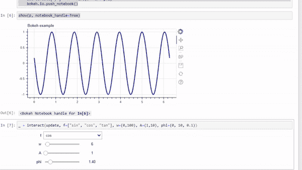
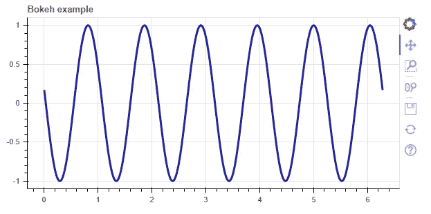
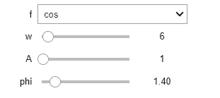

# 将微件连接到可视化

> 原文：<https://towardsdatascience.com/connecting-widgets-to-visualizations-dc668bbeaeb?source=collection_archive---------43----------------------->

## 使用 IPyWidgets 创建小部件来控制可视化



来源:作者

数据可视化有助于分析数据中肉眼不可见的隐藏模式。它有助于理解数据行为和数据关联。有各种各样的可视化工具可用于分析数据，如条形图、散点图等。

当我们试图分析不同的数据点时，控制可视化会很有帮助。它不仅有助于控制数据，还可以用来显示一个数据点相对于其他数据点的表现。

IPyWidget 是一个开源 Python 库，用于创建有助于控制图形或数据并使其具有交互性的小部件。

在本文中，我们将探讨如何使用通过 IPyWidgets 创建的小部件来控制数据可视化。

让我们开始吧…

# 安装所需的库

在本文中，我们将使用 Bokeh 创建一个可视化，并使用 IPyWidgets 创建小部件。所以我们需要使用 pip 安装来安装这些库。下面给出的命令将安装这两个库。

```
!pip install bokeh
!pip install ipywidgets
```

# 导入所需的库

在这一步中，我们将导入创建可视化和小部件所需的所有库。

```
import numpy as np
import bokeh
from bokeh.models import ColumnDataSource
from bokeh.plotting import figure, show, output_notebook
from ipywidgets import interact
```

# 创建可视化

现在我们将创建想要使用小部件控制的可视化。在创建可视化之前，我们需要运行散景命令来显示笔记本中的可视化。

```
output_notebook(bokeh.resources.INLINE)x = np.linspace(0, 2*np.pi, 2000)
y = np.sin(x)
source = ColumnDataSource(data=dict(x=x, y=y))
p = figure(title="Bokeh example", plot_height=300, plot_width=600)
p.line('x', 'y', source=source, color="#2222aa", line_width=3)
show(p, notebook_handle=True)
```



可视化(来源:作者)

# 创建小部件

现在我们将开始创建小部件，我们将使用它来控制我们上面创建的可视化。

```
def update(f, w=2, A=1, phi=0):
    if   f == "sin": func = np.sin
    elif f == "cos": func = np.cos
    elif f == "tan": func = np.tan
    source.data['y'] = A * func(w * x + phi)
    bokeh.io.push_notebook()_ = interact(update, f=["sin", "cos", "tan"], w=(0,100), A=(1,10), phi=(0, 10, 0.1))
```



来源:作者

现在我们将使用这个小部件来控制我们上面创建的可视化。


来源:作者

在这里，您可以清楚地看到我们如何控制我们创建的可视化的不同方式。继续尝试不同的可视化效果，并使用小部件控制它们，让我知道你在回复部分的评论。

本文是与 [Piyush Ingale](https://medium.com/u/40808d551f5a?source=post_page-----dc668bbeaeb--------------------------------) 合作完成的。

# 在你走之前

***感谢*** *的阅读！如果你想与我取得联系，请随时通过 hmix13@gmail.com 联系我或我的* [***LinkedIn 个人资料***](http://www.linkedin.com/in/himanshusharmads) *。可以查看我的*[***Github***](https://github.com/hmix13)**简介针对不同的数据科学项目和包教程。还有，随意探索* [***我的简介***](https://medium.com/@hmix13) *，阅读我写过的与数据科学相关的不同文章。**