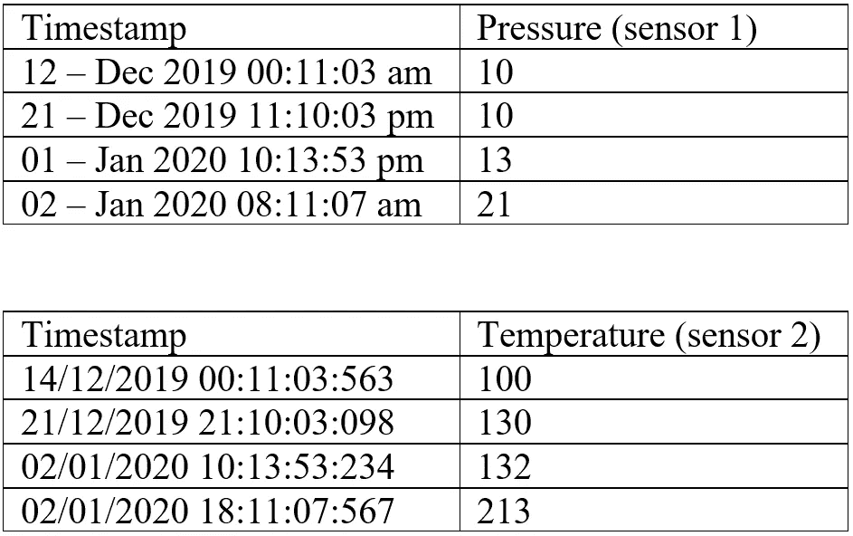

# 征服数据科学面试中的 Python 编码回合

> 原文：<https://towardsdatascience.com/conquer-the-python-coding-round-in-data-science-interviews-5e27c4513be3?source=collection_archive---------2----------------------->

## **我 2021 年在印度班加罗尔作为数据科学家面试的经历。**

编码环节已经成为数据科学面试不可或缺的一部分。尽管它可能无处不在，但对许多人来说，它也是一个可怕的回合。在这篇文章中，我的目标是通过分享我最近遇到的不同类型的编码采访和问题，用信息战胜恐惧。

让我们看看执行和提问的不同格式，并了解问题所测试的是什么概念。

## **格式 1 —现场编码**

照片由[在](https://unsplash.com/@thisisengineering?utm_source=unsplash&utm_medium=referral&utm_content=creditCopyText) [Unsplash](https://unsplash.com/s/photos/coding-round?utm_source=unsplash&utm_medium=referral&utm_content=creditCopyText) 上绘制

你被要求打开一个编辑器(Jupyter 笔记本)，与面试官分享你的屏幕。当一个候选人在整个过程中与面试官保持一致时，这是值得赞赏的。通常，面试官会将应聘者推向预期的方向。大多数面试官都很体贴，允许稍微搜索一下语法等。

一些例子:

**Q1。探索新冠肺炎数据集。绘制各州的月环比 Covid 正数。显示六月份的前 3 个州。**

[https://www.kaggle.com/sudalairajkumar/covid19-in-india?select=covid_19_india.csv](https://www.kaggle.com/sudalairajkumar/covid19-in-india?select=covid_19_india.csv)

**概念测试**

1.  *探索性数据分析*

*2。数据清理*

*3。处理缺失值*

*4。数据帧操作*

*5。执行聚合操作*

*6。日期时间操作*

*7。数据可视化*

Q2。创建一个包含传感器值的虚拟数据集

传感器数据，虚拟数据集(图片由作者提供)

**找出这个时间范围内压力与温度的最高比值。**

**概念测试—**

1.  *探索性数据分析*

*2。数据清理*

*3。数据帧操作*

*4。执行聚合操作*

*5。日期时间操作*

*6。数据可视化*

**Q3。编写一个代码，从用户那里获取一个数字，并输出小于用户输入的所有斐波纳契数。**

**概念测试—**

*1。基本 Python 编程*

*2。基本逻辑思维*

*3。了解数据结构和算法(使用动态编程可以更快地解决这个问题)*

照片由 [LinkedIn 销售解决方案](https://unsplash.com/@linkedinsalesnavigator?utm_source=unsplash&utm_medium=referral&utm_content=creditCopyText)在 [Unsplash](https://unsplash.com/s/photos/computer-man?utm_source=unsplash&utm_medium=referral&utm_content=creditCopyText) 上拍摄

## **格式 2 —基于平台的测试**

在 Hackerrank/Hackerearth(或其他)平台上作为定时测试执行。

公司使用这种测试来检查数据科学的各个领域。因此，常见的是混合了概率和统计、机器学习、深度学习的客观类型问题(比如 10 个问题，每个 2 分)和一些关于 SQL、机器学习和数据结构和算法的编码问题(很少但很明显)(2-5 个问题，其权重基于复杂性和概念)

几个例子:

**Q1。给定一个分布的 CDF，求其均值。**

**概念测试—** 基础概率论

**Q2。人 A 决定进行一次跳伞旅行。根据他的研究，小故障导致死亡的概率是 0.001。如果 A 进行 500 次高空跳伞，死亡概率是多少？**

解决方案选项:

答:50

b) .29

**c) .39**

d) .01

**概念测试—** 分布知识

**Q3。给定 1 年期间欧洲 4 家商店出售的软饮料的数据集。执行数据争论和可视化。你能预测未来的需求并确定不同的特征如何影响它吗？如果合适，请使用评论和可视化方式向技术和非技术受众有效地解释您的发现。**

**概念测试** — *数据科学项目直到建模的全部活动。*

**Q4。关于在样本数据集上编写 SQL 查询的问题。**

**概念测试—** *联接、分区和排序、排序依据、分组依据*

**Q5。给定两个数字 a，b；a<b .**的打印输出

**f(a，b)= g(a)+g(a+1)+g(a+2)+…+g(b-2)+g(b-1)+g(b)**

**其中 g(x)定义为所有小于 x 的斐波那契数。**

**概念测试—**

*1。Python 编程*

*2。逻辑思维*

*3。数据结构和算法*

**Q6。给定一个数 X，求 X 的两个因子(a，b)的最小和**

**概念测试—**

*1。Python 编程*

*2。逻辑思维*

Q7。**使用 get 请求读取这个** [**链接**](https://ocw.mit.edu/ans7870/6/6.006/s08/lecturenotes/files/t8.shakespeare.txt) **中的数据。它包含了莎士比亚的全部作品。删除** [**链接**](https://gist.githubusercontent.com/sebleier/554280/raw/7e0e4a1ce04c2bb7bd41089c9821dbcf6d0c786c/NLTK's%2520list%2520of%2520english%2520stopwords) **中出现的数字和停止字。现在数数课文中出现的独特单词的数量。**

**概念测试—**

1.  使用 Get 和 Pull 请求读取数据

2.基本的自然语言处理，如停用词移除

3.将字符串拆分成标记

照片由 [BRUNO EMMANUELLE](https://unsplash.com/@brunocervera?utm_source=unsplash&utm_medium=referral&utm_content=creditCopyText) 在 [Unsplash](https://unsplash.com/s/photos/woman-using-laptop-at-home?utm_source=unsplash&utm_medium=referral&utm_content=creditCopyText) 拍摄

## 格式 3 —现场案例研究/带回家作业

这可以是现场(现在是在线)短期(1-3 小时)案例研究，也可以是为期 3-7 天的带回家作业，其中给候选人一个样本数据集(在大小和复杂性上与真实数据集非常相似)，并要求其在 90 分钟内解决一个业务目标。指出他们需要向面试小组介绍他们的解决方案和思考过程。

在带回家的版本中，大多数公司理解人们也有他们的日常工作，并且足够体贴地在合理的范围内延长时间表。

## **亲提示:**

> 这种形式是展示你知识广度和深度的好地方。超越所陈述的问题会得到高分。比如找与手头问题相似的文献(论文)。展示你的解决方案是如何受到论文启发的。如果小组特别要求基于深度学习的解决方案，那么就这样做，但也要创建一个机器学习解决方案，并比较和对比他们的结果。也许一个模型在数据的某些部分优于另一个。调查这些细分市场。尝试建立两者的整体模型。
> 
> 这向面试小组展示了你超越了最低要求，并展现了你所有的技能。

**举例:** [**零售交易案例分析**](https://github.com/divya-chou/Retail_Transactions)

这家公司给了我一个礼品店两年的交易数据集。

**商业问题:预测一个客户下个月是否要买一个产品。**

**他们坚持要我用深度学习技术解决这个问题。**

这是一个完美的地方来展示我在模型制作方面的技能，我充分利用了上面提到的技巧来将面试转化为工作机会。

## 结论

我希望通过这篇文章，我减轻了对编码的恐惧，并在一定程度上平衡了比赛场地。它展示了公司测试应聘者编码和解决问题能力的各种方法。实践上面提到的概念肯定会有很大的帮助。

如有问题，您可以在 [LinkedIn](https://www.linkedin.com/in/divya-choudharyiisc/) 上留言或给我发信息。

**你可能也喜欢:**

</4-types-of-data-science-interview-questions-part1-d17db4253c69>  </4-types-of-data-science-interview-questions-part2-106f5bf7218d> 