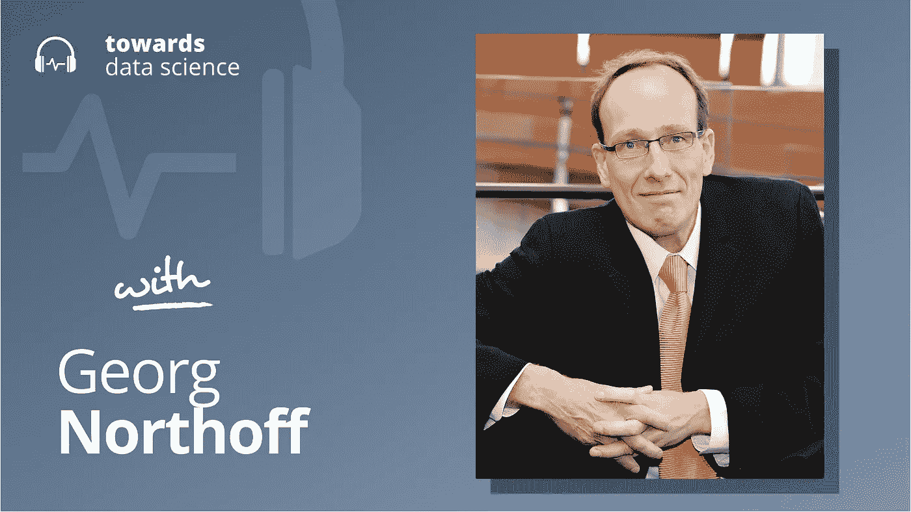

# 意识和人工智能

> 原文：<https://towardsdatascience.com/consciousness-and-ai-8be0f8860247?source=collection_archive---------35----------------------->

## [播客](https://towardsdatascience.com/tagged/tds-podcast)

## 格奥尔格·诺瑟夫解释了一个好的意识理论如何能带来更好的人工智能

[苹果](https://podcasts.apple.com/ca/podcast/towards-data-science/id1470952338?mt=2) | [谷歌](https://www.google.com/podcasts?feed=aHR0cHM6Ly9hbmNob3IuZm0vcy8zNmI0ODQ0L3BvZGNhc3QvcnNz) | [SPOTIFY](https://open.spotify.com/show/63diy2DtpHzQfeNVxAPZgU) | [其他](https://anchor.fm/towardsdatascience)

在过去的十年里，人工智能的进步主要是由深度学习推动的——这是一个直接从人脑的结构和功能中汲取灵感的研究领域。通过在大脑和计算机之间进行类比，我们已经能够建立计算机视觉、自然语言和其他预测系统，这在十年前是不可思议的。

但是类比有两种方式。既然我们已经有了自动驾驶汽车和人工智能系统，它们在日益复杂的任务中经常胜过人类，一些人想知道逆转通常的方法——并从人工智能中汲取灵感以告知神经科学的方法——是否可能是一种有前途的策略。这种更加数学化的神经科学方法正是今天的嘉宾格奥尔格·诺尔托夫正在研究的。Georg 是渥太华大学的神经科学、精神病学和哲学教授，作为他为神经科学发展更多数学基础的工作的一部分，他探索了一种独特而有趣的意识理论，他认为这种理论可能会成为开发更先进的人工智能系统的有用框架，从而造福人类。

以下是我最喜欢的对话内容:

*   格奥尔格的意识理论强调感知的时间维度的重要性。他认为，如果某种东西的内部状态能够在很大范围的不同时间尺度上跟踪其环境的状态，那么它就是有意识的。作为一个例子，他引用了人类大脑及其欣赏音乐的能力，这要求我们对非常短时间范围内的事件(如单个音符或一小组音符)以及更长时间范围内的事件(如叠句和合唱)做出反应。这些不同的时间尺度被一起处理，导致对“旋律”的感知。他讨论了一些有趣的实验数据，这些数据支持大脑从根本上感知和处理不同时间尺度的观点，我们讨论了致幻剂和心理障碍对这种感知的影响。
*   由于格奥尔格的理论从一个实体能够做出反应的时间和空间范围来确定它的意识水平，这表明人工智能没有理由不能变得有意识，而且它还表明人类可以变得比现在更有意识，只要增加我们能够感知的时间窗口。例如，人类无法从视觉上察觉时间尺度小于 30Hz(30 分之一秒)的事件。我们也往往不会注意到当时足够缓慢的视觉变化——例如，我们不认为植物是移动的生物，但它们在一天中确实移动了相当一部分，因为它们试图将自己朝向太阳。通过让自己对更多的时间尺度敏感，我们将能够欣赏更多的世界，甚至可能意识到更多的东西比我们想象的更有意识，包括像植物([移动太慢](https://www.youtube.com/watch?v=z0I3174S8Xg))和变形虫([移动太慢，而且太小](https://www.youtube.com/watch?v=4XlzCe5gDu0))这样的东西。Georg 认为人工智能的一个重要用例将是人类直接感知在新的时间尺度上的延伸。
*   Georg 在一定程度上深入考虑了大脑/计算机类比，我们讨论了 OpenAI 的 GPT-3 等高级语言模型使用的处理策略与 Georg 主张的基于时间的处理相比如何。特别是，我们回顾了婴儿学习新单词和抽象概念的学习过程，以及今天深度学习系统使用的学习过程。Georg 认为这种比较提供了洞察力，可以导致更具表演性的人工智能系统。

你可以[点击这里](http://www.georgnorthoff.com/)查看乔治的网站，或者[点击这里](https://twitter.com/jeremiecharris)在 Twitter 上关注我

## 播客中引用的链接:

*   乔治出版了关于神经科学的书籍。

## 章节:

*   0:00 介绍
*   1:33 乔治的背景
*   8:09 时标问题
*   14:32 音乐示例
*   18:00 与神经科学的联系
*   26:44 衬底独立性和 AI
*   人类文明和意识
*   33:19 共同货币
*   40:46 透视隐形实体
*   43:42 气候变化示例
*   51:51 生活经历
*   55:12 大脑
*   57:57 总结

## 请查看以下文字记录:

杰瑞米·哈里斯(00:00):
大家好，我是杰瑞米。欢迎回到“走向数据科学”播客，顺便说一下，该播客现在配备了一个全新的专业麦克风。对此我真的很兴奋。显然是如此兴奋，以至于我甚至没有等到摊位的到来。它仍由亚马逊运送，但我们会为您设置一整套专业设置，并很快准备就绪。我甚至不能在这一集使用它，但我想在这个介绍中使用它。

Jeremie Harris (00:19):
无论如何，尽管我对麦克风感到兴奋，但我对今天的嘉宾感到超级兴奋。我们采访了乔治·诺瑟夫，他是渥太华大学的神经科学、精神病学和哲学教授。他有一个令人着迷的意识理论，实际上是非常独特的，它与我们在前几集关于人工智能甚至人工智能安全的很多对话有着惊人的联系。我们会讨论意识理论。

Jeremie Harris (00:44):
如果我们要在未来设计更好的人工智能系统，我们还将研究 Georg 的想法，为什么意识对于理解意识非常重要，以及意识和大脑之间可能有什么联系。在这一集里，一大堆真正有趣的哲学、神经科学和人工智能的话题交织在一起。我希望你喜欢它。录制音乐非常有趣。我二话没说，就要让开了，让你们尽情聊天。乔治，非常感谢你能来参加这个节目。

格奥尔格·诺瑟夫(01:10):
不客气。

Jeremie Harris (01:11):
我听过很多你的演讲。我看过你很多关于意识主题的作品，也看过很多关于人工智能的第一次。我认为这是一个非常有趣的领域，因为现在很少有人探索这种协同作用。在我们深入讨论之前，我不想在这里超越自己。你能不能先给我们定位一下，你最初是怎么进入这个领域的，你的背景是什么？

Georg Northoff (01:33):
我最初的背景，我是一名神经科学家、精神病学家和哲学家，但我一直对大脑思维感兴趣。就大脑而言，我们并不真正知道大脑是如何工作的。我们只是不知道。我们喜欢模型和设计。我们现在有了一个特定的想法，并在整个演讲中展现出来。我现在可以用人工智能来探索我的一些想法，真正地探索它是否可行，因为你们大多数人都是工程师，这个东西必须可行。这证明了你的模型是正确的。

Georg Northoff (02:10):
另一件事是，我也是一名精神病医生，我看到这些病人，我们仍然在通过反复试验来治疗他们。我希望从大脑中学习一些东西，但超越大脑，我们可以通过使用一些人工智能设备更好地治疗这些患者。你会看到，在我的关注点，用户关注点…当然，对于临床医生，你需要一些分类，你有大规模数据集，10，000 名受试者，然后你会得到一些更好的。这不是我在《人工智能在精神病学中的案例》中预见的过去。

Jeremie Harris (02:44):
那么，可以公平地说，你正在使用人工智能作为一种更多地从基本原则出发解决大脑问题的方法，从我们可以更直接地理解和操纵的数学基础上建立它吗？

乔治·诺瑟夫(02:57):
是的。非常好的问题。我们缺少大脑的数学运算。我们不知道。我们也不知道神经元活动如何转化为精神活动。实际上，我的一个非常聪明的博士后学生，Kolozaki 元帅说，“你真的缺乏关于大脑内在特征的知识。”独立于认知的大脑的内在是什么？我们不知道。这基本上是你的基本设计原则，你需要知道，设计你的人工智能设备，设计你的深度学习网络，这可能是有帮助的。

杰里米·哈里斯(03:36):
对不起。在这种情况下，什么是内在特征？什么-

格奥尔格·诺瑟夫(03:39):
例如，对于大脑来说，你有不同的时间尺度。你操作，你很慢的时间尺度，很快的时间尺度。我给你举个例子。当你去海边的时候，你会去大西洋或太平洋，这里是加拿大。你有一个非常暴风雨的一天，你会看到很多缓慢的海浪。缓慢是极其强大的。

格奥尔格·诺瑟夫(04:01):
然后你会看到许多其他的波浪，慢一些，快一些，你会看到各种不同的波浪。不同持续时间的波浪，很强的，很强的，不太强的等等。大脑有丰富的时间尺度。我们称之为内在神经时间尺度。基本上不同的大脑区域，不同的时间尺度。例如，我认为这是大脑典型的内在特征。你和我不同。你和我的时间表略有不同，因为你和我是在不同的环境中形成的。

Jeremie Harris (04:44):
不，不。这真的很有趣，因为开幕式上有一个人，我叫他 Nick Camerata。他是他们安全小组的成员，他自己也做过很多探索性的药物实验。他贴了很多关于这个话题的非常有趣的链接。我看到的其中一项研究谈到了这一点……有一种特征性的频闪效应，当你服用 LSD 或某些种类的药物时，人们称之为频闪效应，每个人似乎都会经历遵循特定频率或特征模式的感官知觉扭曲。那和这个有关系吗？或者我说的太离谱了？

格奥尔格·诺瑟夫(05:23):
不，不，不。你说得很对，因为这个例子表明，你的感知和认知强烈依赖于你的时间尺度。这些人中的许多人随后体验到时间变快或扭曲或变慢。这决定了你能感知什么，以及你如何感知它。这就像你有一栋有很多不同窗户大小的房子，透过每扇窗户你都能看到不同的东西。你可以看到树枝，也可以看到树干，但是如果不把所有的时间尺度放在一起，你就不能把它们放在一起。

杰瑞米·哈里斯(06:03):
是的。

格奥尔格·诺瑟夫(06:06):
我现在可以向你展示我的观点。三个窗口，每个窗口的大小，较小的和较大的一个，我感知完全不同的东西。但是我需要把它们放在一起。当前人工智能的一个问题是，尽管取得了进步和强化学习，但它们的时间范围非常有限。大脑是巧妙的。大脑显然并不聪明，它有很多局限性，但结合不同的时间尺度真的很好。当你听音乐时，你有各种各样的时间尺度，不同的层次。你可以把它们分开，但是你把它们放在一起。这时你会听到旋律。

Jeremie Harris (06:50):
所以，核心，我不想称之为大脑的神秘功能，但是大脑做的核心事情与大多数人工智能策略做的事情有很大不同，你会说这是它结合这些不同时间尺度的方式……顺便说一下，我不知道这句话对不对。其他感知模式，比如长度，是不是太简单了，如果我放大得太近，就像只见树木不见森林。差不多吧？

格奥尔格·诺瑟夫(07:18):
是的，没错。然后你看到了绝对的细节，但你没有看到整个森林。正是如此。你的大脑有人把它放在一起，这可能也是人类和非人类大脑的区别，他们有稍微不同的时标。正如我的博士后所说，卡拉佐基元帅指出了这一点。我们刚刚提交了一篇论文。它说不同物种之间的时间尺度有些重叠。这就是为什么我们可以和我们的狗交流。是啊。我每天早上跑步的时候都会看到，为了狗的主人，是吗？

杰里米·哈里斯(07:54):
是的。

格奥尔格·诺瑟夫(07:55):
但在另一端，这是一个微小的差异。也许我们有更精细、更慢的窗口、更大的时间窗口，这样我们就可以感知更多、整合更多，以不同的方式把事情放在一起。

杰里米·哈里斯(08:09):
是的。这真的让我产生了共鸣。在过去的几个月里，我围绕这个话题进行了很多奇怪的对话。举个例子…事实上，我很乐意让你来做这件事。当你看到一个长时间快进的植物视频时。当你看着一株植物时，它看起来是静止的，但一天下来，它实际上是在移动，它在世界上表达自己。如果你快进的话，它几乎看起来栩栩如生。然而我们似乎不认为植物是有生命的东西。你会说因为我们的时间尺度不相容，因为我们在更短的时间尺度上运作？

格奥尔格·诺瑟夫(08:44):
我们缺少时间表。我们缺少看到这一点的时间尺度。你看，我们认为它是静态的，并说，“好吧，这很好。”但也许只是因为我们的时间表。是一个很好的例子。另一个例子是在哲学中大量讨论的。你们中的一些人可能知道，托马斯·内格尔，做一个坏的什么是什么感觉[听不清 00:09:06]。他说，“好吧，坏罐工序。我不相信波，因为它的生物物理设备，最终它的时间尺度。我们不能。”好吧。那部分现实对我们来说仍然是一个黑洞。

耶雷米·哈里斯(09:22):
有意思。它真的为一些基本问题打开了大门，这些问题是关于有多少事情是我们有意识的，但我们可能没有意识到，或者无法接受。在我们深入讨论这个问题之前，我确实想先缩小一下，因为我让我的兴奋情绪占了上风。但是你会说，有更多的事情，比如，你的客人，有更多的事情是有意义的意识的，比我们想象的要多吗？

格奥尔格·诺瑟夫(09:50):
我当然认为其他物种也有意识，但范围略有不同/比如说可能只是感知小窗户，但在那里面他们有独立的意识。当然，我可能会说，你的时间尺度对你意识的延伸有很大的影响。如果你有一个更大的曲目，你有更大的可能性拥有更广泛的意识。我这里说的扩展指的是时间空间，然后你可以考虑不同种类的内容。如果我有更小的时间尺度，我可以考虑花在移动。但我不是。也许某个聪明的工程师明天会打电话给我说，“是的，诺瑟夫，我在你的大脑中以较慢的时间尺度打败了你，这样你就能感知花的运动。”这就是我想要人工智能的原因。文档。

杰里米·哈里斯(10:57):
嗯，这真的是……这让我想到了有意识的东西之间的区别，换句话说，就是有意识，能够对它做出反应。让你的大脑知道，“哦，看植物在动。”或者意识到 20 年时间跨度内的市场变动，否则我们不会注意到。但它似乎也潜在地不同于意识的概念，在某种意义上，我有这种体验，我不觉得我是一个非玩家角色，一个哲学僵尸，有时被称为。但是我觉得…在我眼睛后面这里，有东西在我眼睛后面。你认为这两件事有联系吗？你如何从一个地方到另一个地方？

格奥尔格·诺瑟夫(11:44):
我想是后一种情况，对我来说意识是非常基本的东西。你在世界上导航。

杰里米·哈里斯(11:52):
好的。

格奥尔格·诺瑟夫(11:53):
是的。你表现得很好。即使有变焦，我们也不在同一个房间，但至少在同一个城市。我导航，我们共享某个空间，当然在这种情况下是虚拟空间。这意味着我可以连接我内心的时间和空间坐标，将它们延伸到我之外的你身上。然后把照片放大作为一种奇妙的工具，因为你总是把自己看作更广阔场景的一部分，这就是我的意识。你在世界中航行。为了在这个世界中导航，你现在需要把自己定位为一个更广阔的背景的一部分。否则，你可以导航。如果你失去了那种能力，你只是站在那里，不知道该怎么办。在精神疾病中你可以看到这一点。

哈利斯(12:47):
什么样的失调？

格奥尔格·诺瑟夫(12:49):
例如，精神分裂症患者。他们经常会失去空间感。他们无法将自己定位为更广阔空间的一部分。然后他们不知道去哪里。他们只是站在那里。从认知上来说，他们知道那个地址到处都是，但是他们就是不能把这个和他们联系起来。

哈利斯(13:11):
好的。所以你是说某人的意识在一定程度上取决于他的精神状态与环境的相关性？这样说公平吗？就像精神分裂症患者一样，因为他们有这种关联是一种习惯？

格奥尔格·诺瑟夫(13:25):
对我来说，我不喜欢这种相关性的东西，因为这样看起来好像你有两个不同的东西。我是世界的一部分，我和你一起在这里导航，你现在可以阅读我的手的动作，你知道它是什么，所以我们现在真正共享一个特定的虚拟空间。你就住在里面。有了这个，你就可以和他们交流了。所以你多少意识到你是你的事物中的一部分。这和导航一样，没有覆盖现实。

Jeremie Harris (14:00):
本质上，有这样一个连续统一体。不清楚我在哪里结束，环境在哪里开始，反之亦然。

格奥尔格·诺瑟夫(14:05):
是的。

杰瑞米·哈里斯(14:06):
好的。如果我非常粗略地放置一个分隔符…假设我们真的可以放置一个分隔符，在这种情况下，说它是某种相关性是否公平？就像是我头脑中发生的事情反映了世界上正在发生的事情，以至于我意识到了这一点？

格奥尔格·诺瑟夫(14:26):
让我给你举个例子。如你所见，我试图回避这个问题。

哈里斯(14:31):
很公平。

格奥尔格·诺瑟夫(14:32):
让我给你举个例子。当你随着音乐跳舞时，你会做什么？很明显你和音乐的节奏同步。你可以在大脑中看到这一点，大脑的节奏与音乐的节奏同步。你可以测量一下。你可以测量一下。

杰里米·哈里斯(14:55):
通过脑电波还是？

格奥尔格·诺瑟夫(14:58):
脑电波。脑电波的开始总是与曲调的开始同步。

哈利斯(15:04):
好的。

格奥尔格·诺瑟夫(15:05):
是啊。是两个同步的波。你可以测量一下。你与音乐节奏同步得越好，你就越能感受到音乐的最佳状态。你越有感觉，“哇。这真的很好。我要死了。我真的感觉到了。”所有精神动力药物都能改善这种情况。大脑就是这么做的。我认为这是一个关键的区别，这种与环境节奏波动的同步。不仅仅是音乐，还有语言。

格奥尔格·诺瑟夫(15:43):
或者实际上，当我看到我的一些精神病患者时，他们马上会做和你一样的事情。他们与你同步。当我像这样移动我的手臂时，在几毫秒内，他们也这样做，反之亦然。当他们这样做的时候，我经常观察自己，我也在这样做。完全无意识。我导航，所以我同步。这就像[听不清 00:16:07]。然后你会觉得你和音乐同步得越好，给你的感觉就越好。

耶雷米·哈里斯(16:13):
你认为也有反例吗？比如说，我不知道……某人被丢进一个不熟悉的环境，然后顽固地拒绝加入新环境的仪式。新环境和他们自己的倾向之间的不和谐。那怎么会映射到这里？

格奥尔格·诺瑟夫(16:35):
好的。当然是非常不同的水平，但我真的同意。实际上，昨天我和一个学生进行了一次长时间的采访和讨论，他是在美国的第一代中国人。你可以清楚地看到他是如何在两种不同的价值体系之间挣扎的。在中国，你需要一些附庸风雅，你需要 100 岁，你非常正式。在美国，你必须说，“在这里，我是最伟大的，等等，等等。”它更加以自我为中心等等。你真的可以看到他是如何在这两者之间被撕裂。

格奥尔格·诺瑟夫(17:11):
这是一个非常无意识的层面。我们的大脑替我们做这项工作。我们不知道。我们无法接触到它。我认为这是人工智能可以从脑科学中学习的地方。不是这个认知水平高。AI 在这方面很棒。在强化学习，深度学习模型中，这是一个博弈，目标。比任何人类都好。但这里的问题是，他们只能在非常有限的任务中做到这一点，也就是你所说的[听不清 00:17:45]概括问题。大脑非常慷慨，可以做各种各样的任务，甚至可以学习新的任务。我认为这是我与，例如，时间尺度的东西相交的地方。

杰里米·哈里斯(18:00):
好的。好吧。那是有帮助的。也许在我们深入到人工智能方面的事情之前，只是因为我知道很多人在听，坦率地说也喜欢我，我真的不熟悉神经科学。我真的不熟悉意识理论。你能不能把这些东西放在一个角度看？还有其他的意识理论吗？你的理论符合什么情况？这样我们就能对这里的风景有所了解。

格奥尔格·诺瑟夫(18:24):
好的。神经科学，这是我的小背景，它专注于特定的内容。你感知这个，然后你观察大脑。当你感知到这些内容时，大脑在做什么？它以许多刺激输入为导向，这就是我们所说的认知神经科学。你从认知开始，你用内容感知，然后你看我看到这个内容的时候大脑发生了什么。然后我转移到这个内容。我现在向你们展示另一个关于大脑活动的例子。然后你寻找-

Jeremie Harris (19:01):
如果你看不到视频，Georg 拿着两支不同的笔。他说，当你看着这支笔时，发生的是你看着那支笔…对不起，我只是为人们做这些-

乔治·诺瑟夫(19:12):
我知道。在我做的那一刻，我变得-

哈利斯(19:12):
不，这很好。太好了。是啊。

格奥尔格·诺瑟夫(19:14):
那就是你要做的。这也适用于，好吧，你有某些想法，现在你寻找这些想法的神经关联。

耶雷米·哈理斯(19:26):
对。

格奥尔格·诺瑟夫(19:27):
然而，那只是大脑上部的 10%。许多关于意识的理论都集中在这个上面的表格上，例如，全球工作空间理论这是一个很好的理论，它将大脑视为一个全球神经元空间。传入的内容需要在整个大脑中处理和分配，然后你就有了意识。还有一个非常流行的理论，综合信息理论。该理论认为，你需要将这些内容与背景融为一体，然后你就很有可能产生后果。

格奥尔格·诺瑟夫(20:10):
但对我来说，那只是蛋糕上面的 10%。这只是它上面的樱桃，因为你有一整个更深的层，这不是关于意识的处理。是你的无意识。你有你的梦想。当你走进雪中时，你会想知道。你有一些梦或者其他什么，与你环境中的内容完全无关。这怎么可能呢？这就是精神分析所说的无意识。

格奥尔格·诺瑟夫(20:40):
还有更深的一层。在这个时间空间里，基本上你的时间尺度的数量，对你的大脑能够处理什么内容，然后感知什么内容有很大的影响。就像我最初画的那样。当你有一个非常…这个更深的层不允许我感知植物的缓慢运动。我永远无法意识到植物的运动和植物的运动。事实上，我不能感知，我不能同源，我不存在，但那不是真的。你说只有…你需要在设计中考虑这个更深的层次。大脑设计的不同时间尺度。

哈里斯(21:36):
有意思。每当我遇到意识理论时，我总会有一个恼人的问题，这是主观经验的概念吗？举例来说，当你谈论意识的神经关联时，基本上那意味着什么，据我所知，你有一个输入。有人把一支笔放在你面前，然后我们说，“好吧，神经元放电模式是什么？”所以我们实际上可以使用观测仪器或设备进行客观测量。然后我们研究移动笔和这些东西做什么之间的映射。基本上就像 neural link 在做的一样。

杰里米·哈里斯(22:10):
虽然这显然是描述性的，但你可以很好地描述客观世界。我仍然很难理解……这几乎让人觉得是一个奇怪的问题，不管你能对世界的方式做出多少真实的陈述，你永远也不会对世界应该如何做出陈述。有一个障碍，似乎这些世界不能融合。你如何看待主观世界和客观世界之间的联系，主观世界就像我们似乎经历了什么，而客观世界只是数学描述？我不知道。你对此有什么看法？

格奥尔格·诺瑟夫(22:46):
显然，这几乎是一个哲学问题，但也是一个工程问题。问题是，我认为用神经科学。它的视野非常有限。它只是从这种主观的东西接近。当然，当你说，“好吧。”你从一些主观的东西开始，然后测量默认情况下留下差距的相关性。弥合这一差距。我决定也许我应该反过来。没有错，只是太局限了。

格奥尔格·诺瑟夫(23:16):
所以我说，也许我可以反过来，我从下往上看，独立于所有这些认知，大脑自己在做什么。那是大脑的内在特征。这是我团队中一位聪明的博士后 Marhal Kolozaki 说的。这些都是大脑的内在品质。忘掉所有的感知，认知。我们只是想看看在此之前大脑本身做了什么。这让我想到了时间和空间。

格奥尔格·诺瑟夫(23:42):
令人惊讶的是，这一方面让我想到大脑的时间和空间是如何与环境中的时间和空间同步的，比如音乐。另一方面，至少也许我们的一些心理特征有一个时空结构。这就是为什么我们主张意识的时空理论。基本上你可以变得有意识，如果你有一定的体温持续时间。如果温度持续时间太短你的内容，你不能成为有意识的。

耶雷米·哈理斯(24:16):
哦，有意思。这就像是意识的连续体。你认为它是一个连续体还是像你说的有一个明显的分界线？

格奥尔格·诺瑟夫(24:23):
这就是链接。这是客观和主观之间的联系。如果你有一个更长的持续时间，比方说，如果你真的…再次，我再次呈现取决于，一段时间。你看到的越多，它到达你意识的可能性就越大。如果我只提出很短，你有一个非常缓慢的船。意思是内容是一样的，但是脾气背景是不同的，这对你的大脑很重要。你的大脑部分根据时间特征对内容进行编码。

杰里米·哈里斯(25:01):
这非常直观。这很有道理。我们可以看到，作为生物有机体，当然有一个最大的时间窗口。没有人处理信息的时间跨度超过 100 年左右。更短的时间跨度，我们会遇到像神经回路这样的工程限制。这两者之间的空间充满了人类意识。比方说你拿一只蚂蚁或者别的什么东西，甚至不是蚂蚁，一只寿命很短的阿米巴原虫，在这一生中，可能阿米巴原虫对发生在比我们更短的时间范围内的事情更敏感。你会说它的意识体验向光谱的那一端转移吗？也许意识不那么强烈，因为它没有那么宽广。

格奥尔格·诺瑟夫(25:51):
真的。

耶雷米·哈里斯(25:52):
好的。

格奥尔格·诺瑟夫(25:53):
我完全可以说，你有一系列不同程度的可能意识。这显然是一个时空谱。音阶，不同的音阶。尺度很重要。变形虫的时间尺度非常小。很明显，由于生物因素，蚂蚁的时间尺度非常小，但在这个小时间尺度内，它可能比我们更精细。你可以看到他们在社会组织中表现出色。所以他们必须有一个更精细的临时窗口，在他们的小窗口中有许多细分，因为他们在他们的上下文中非常敏感。我希望通过人工智能，我们可以扩大一些我们到达的时间范围。

耶雷米·哈里斯(26:44):
好的。太好了。这就把我们带到了人工智能的起点。我想通过问你一个问题来让我们到达那里，我希望这个问题能引发很多关于人工智能的对话。这就是底物依赖性的问题。人们经常认为有一场关于机器是否会有意识的辩论，因为它们是由硅树脂或其他材料制成的。我认为意识的底物独立性或底物依赖性，当你达到人类群体或 ed 群体的水平时，这已经是一个问题了。你可能会说，当你拉远观察很长一段时间。就像如果你看一个城市，一个快速前进的人类城市，它看起来像一个该死的动物，一些模式反映了一些怪异的生物。你会如何描述人类城市和人类文明的意识？那你对 AI 的底物独立性有什么看法？我认为这可能是一个值得探索的有趣领域。

格奥尔格·诺瑟夫(27:39):
是的。我先说最后一件事。在上世纪 80、90 年代，有很多关于功能主义与非功能主义的讨论，以及在没有基础的情况下，是否需要某些输入输出关系。作为一名神经科学家，这听起来很奇怪。我不应该说这个。我不认为这是基质的问题。重要的是你的时间表。时标显然是时标的放大，它依赖于时标的上下文。

格奥尔格·诺瑟夫(28:12):
显然，大脑提供了一个完美的[听不清 00:28:15]神经服务和我自己的亚麻布，等等，等等。是啊。但那只是一个模型。这并不意味着我们的模型是什么，对于安装所有这些时间尺度和意识也是必要的。我认为我们经常混淆我们的模型，我们的方法论与现实和真理。从我的观点来看，我对意识的时空理论的观点是完全独立的，因为重要的是时间尺度。

格奥尔格·诺瑟夫(28:49):
如果你给我生产一些具有相似时标数量的代理，现在不仅是时标的数量，还有时标的灵活性，因为这些时标是变化的。当您提供外部输入时，它们会以[听不清 00:29:05]的方式发生变化。我有另一个非常聪明的博士后工程师，他实际上已经造了一个机器人北欧野蛮人，他称这个机器人为技术对话。他是个搭桥的人。他直接将所有的认知操作转化为行为。你真的可以在机器人的行为中看到认知，这太棒了。

格奥尔格·诺瑟夫(29:36):
我讨论了很多，说:“是的。”但最终它并不灵活，这是事实。为了具有灵活性和动态性，适应环境，根据环境的持续需求改变其工作记忆输出，这是机器人做不到的。这就是为什么他来到我的小组，说，“也许我们可以转换。”我认为这就是我们可以从大脑中学到东西的地方。并不是说我们可以从大脑学习底物，我不这么认为。但是我们可以从大脑难以置信的适应性和灵活性机制中学习，同时保持它的连续性和独特性。

哈里斯(30:22):
有意思。好吧。这确实让我想到了关于城市、国家和文明的问题，因为我想这些图表显示了什么是最受欢迎的…抱歉。谷歌搜索次数最多的术语是在一个特定的州，例如，在美国。在不同的时间，你会对两周后或总统选举产生兴趣。这些尖峰很有趣。它们持续很长一段时间，在某些情况下，持续很短一段时间，其他情况视情况而定，或者随着环境的变化而定。在我看来，根据这个定义，我们可以认为，人类文明或者任何人类的集合，只要足够连贯，能够交流，有叙述和话语，就有资格成为有意识的。你同意这种描述吗，或者说这有点过了？

格奥尔格·诺瑟夫(31:14):
你看我是如何拼命地回避意识这个话题的。我希望在某个时候我们不需要它。这是一个常识术语。意识，是的，现在我们试图找到哲学家所说的意识的自然种类。一个叫做意识的实体。我认为我们在某些时候不需要它。记得我们说过遗传密码…当然，我们知道基因是什么，但最终我们现在知道它是 DNA，是以不同方式结合的四种不同的蛋白质。沃森和克里克就是这么做的。好吧。还有很多其他的例子。20 世纪初，存在生命能源的可能性。我们不再需要那个了。

格奥尔格·诺瑟夫(31:56):
就大脑而言，20、30 年前，我们应该听说过很多关于边缘系统的事情。现在是什么限制了它的拼接？它是一个海马体，杏仁核是这个和那个的整体。我也是。我认为意识只是我们缺乏知识，以为我们拼命在世界上或大脑中寻找一个叫做意识的实体。对我来说，这只是，好吧，我们在世界上航行，这可能是不同形式的连接世界，你描述了其中的一些是城市。你可以再次看到，这种波动和不同形式的同步。那我们就不再需要那个了。我们没有明智的研究。

杰瑞米·哈里斯(32:37):
好的。研究方面。有意思。好吧。你会说我们不需要它来对世界做出任意好的预测，这是我直觉上同意的吗？我们真的不需要一个意识的概念来拿起一堆亚当斯说，“它要做这个，或者它要做那个。”当我想到意识时，我最终会想到主观体验。这似乎是我可以用盒子围起来的东西，但也许我错了。是主观体验，你在这个语境下把它看做和意识一样吗？

格奥尔格·诺瑟夫(33:11):
意识是多种不同的含义。

耶雷米·哈里斯(33:14):
是的。

格奥尔格·诺瑟夫(33:15):
你不会想进入那种状态的。

耶雷米·哈里斯(33:16):
是的。

格奥尔格·诺瑟夫(33:19):
传统上它有很高的等级。认知。我不一样。我开始意识到自己，这是从哲学中传达出来的。大部分仍然在意识中是非常特殊的。非常特别，主要区别于任何无意识的事物。然而，神经科学在某种程度上超越了这一点，因为它仍然在寻找特殊的神经元特征，这些特征只是专用于意识，与我们的实验室不同。特殊的意识。我称之为专家的观点。然而，我会说，算了吧。那是一种错觉。你最好寻找什么是相似的，什么是大脑和意识共有的。那是我的时空物品。我称之为共同货币。

格奥尔格·诺瑟夫(34:07):
现在我们来看一下持续时间，或者说我感觉这个采访，这个问题持续了一分钟，但是只有 20 秒钟，因为它是……然后我会假设在我的大脑中，你有相应的一分钟的持续时间间隔，这是那个方向的频率。一旦你明白了这一点，好吧，就很清楚了。我可以预测。这是读数。就像内科一样。从我的血糖水平来看。我的天啊。糖分真的很高。你一定有很多症状。

杰里米·哈里斯(34:50):
是啊。

格奥尔格·诺瑟夫(34:51):
我也是。嗯，你一定很清楚这一点。

杰瑞米·哈里斯(34:55):
意识，无论是主观体验的还是其他的，都只是一种输出。这是一种你可以预测的症状，因此科学已经做到了这一点。这是公平的吗？

格奥尔格·诺瑟夫(35:06):
是也不是，但是科学，现在你可以说它不是【听不清 00:35:12】。它只是消除，它不相信。不，因为我说大脑构建自身神经元活动的方式本质上是主观的。那是时间和空间的东西。你给我一个 20 秒的间隔，我把它想象成一分钟。我的大脑增加了一些东西。我的大脑加上剩下的 40 秒。当然，这不太可能，但我还是要问一件事，那就是意识。

杰瑞米·哈里斯(35:44):
嗯，肯定有【相声 00:35:45】

格奥尔格·诺瑟夫(35:46):
加入任何东西，我都不会有意识。

杰里米·哈里斯(35:48):
好的。是啊。是啊。这和你之前说的非相关性是有道理的。我想称之为相关性，但是是的。完美。好吧。我认为这是一个开始我们关于人工智能的对话的好地方，因为我认为你正在探索的那些时间窗口和真正的深度学习系统的架构之间的映射有很多东西可以说，只是它们设置的方式。你介意从你的角度来探讨一下你如何看待意识和人工智能之间的交集吗？

格奥尔格·诺瑟夫(36:20):
最好让我们说说大脑和人工智能。我看着…我的照片调查了很多有趣的特征，大脑中不同的时间尺度以及它们之间的联系。它们被展开到大脑的空间。训练组织中的大脑有一定的地形组织。它有一定的组织，有一定的等级制度。这是一个时间层次。时间在空间中展开。现在你可以想象，比方说，如果我有一个代理人，我是一个精神病人，我想对我不正常的想法进行某种治疗，我总是听到声音。

Georg Northoff (37:06):
采访前一切就绪，我听到了你的声音。我们能做什么？也许代理人能帮我。也许我现在可以不断地记录我的脑电波，比方说，用脑电图仪或脑电图仪或扫描设备，FMI。那是在特定的时间范围内。也许现在我可以把它转给一个代理，这个代理可能有自己的时间表，并且比现在的代理有更多的曲目。

Jeremie Harris (37:44):
喜欢更长或更短的时标。

格奥尔格·诺瑟夫(37:45):
更长，更短，更多的可变性，更细的颗粒，更粗的颗粒，不仅仅是两三个时间尺度或有限的数量，而是展开的。然后也许那个代理人可以说，我们在幻觉期间把我的时间尺度输入代理人。然后，也许理想的代理，这是类似的行为，当我听到你的声音，而你不在时，我感到困惑。然后也许那个代理人也能告诉我，我需要如何改变我大脑中的时间尺度来使这些声音消失？因为我不能消除时间尺度。

格奥尔格·诺瑟夫(38:26):
我不能只是抑制，因为那意味着我改变了整个大脑。我需要和大脑本身一起工作。也许我稍微改变了这些时间表。我认为代理可以帮助我很多，因为代理还可以提供可能不同的阴影，不同程度的时间尺度，这是我的大脑不可用的，或者当我听到声音时，我的时间尺度曲目非常有限。也许我的代理人可以在我的曲目中提供一些反馈机制，这样我就不再需要听到声音了，因为我还有其他的时间表。相同的输入可以在另一个时间刻度上工作。

耶雷米哈里斯(39:11):
有趣。我们的希望是，你基本上可以让一个智能体成为一个模仿健康人类大脑行为的人工智能，这样你就可以用它来建立一个可比性，“好吧，这就是我们所缺少的。这是我们需要弥补和修补的。”

格奥尔格·诺瑟夫(39:27):
是的。我一直反对模拟人类。在日本和英国，有托尼·普雷斯科特、朱尼·唐尼的自我模型。这是一个非常好的模型。但它是否真实的问题是一样的。它经历过它们吗？总会有你提出的问题。我的代理人有意识吗？我认为这是徒劳的。对我来说，申请人更感兴趣的是什么，从这个意义上来说，我真的很满足，我说，“也许我们不能意味着……我不能代表曲目的某个时间表。也许我可以增强这个或者改变那个。”代理可以帮助你。这可能会改变我们的行为。

哈利斯(40:15):
对。实际上，我也发现了这个问题的有趣之处，有这么多轴线，人类是沿着这些轴线看不见的。有时间尺度的部分，有空间的部分，所有你谈论过的东西。此外，我想作为一名前物理学家，我想到了现在所有无形地流经我们身体的中微子，我们周围的红外线和紫外线，我们没有意识到，因为…嗯，我想这是一个有趣的问题。我们意识到我们意识到的事物，因为进化大概优化了我们，使我们能够意识到它们。

Jeremie Harris (40:46):
很明显，比如紫外线，虽然它可以长期导致癌症，皮肤癌，但它不是一种超级致命的疾病，也不是我们生活中的一个问题，所以我们对它视而不见。我们能够同样好地狩猎，同样好地制造而不浪费能量追踪紫外线。除了你已经讨论过的时间尺度和空间的东西，你认为获得那些看不见的实体的观点有价值吗，或者你认为时间尺度和空间更有前途？

格奥尔格·诺瑟夫(41:20):
这对我来说很难讲。我和物理学家李斯·斯莫林进行了很多讨论。我在那里给了一个谈话时间和大脑。这是一种乐趣，因为我基本上可以说出我所有关于时间和大脑的想法，因为物理学家是聪明的人，他们理解时间的东西。神经科学家对这段时间有真正的问题，因为他们不认为这是一个动态。对我来说很难讲出来。你深入到量子层次…我是所谓的无标度的忠实粉丝，这意味着你有不同的时间标度或嵌套在其他时间标度中。是啊。

格奥尔格·诺瑟夫(41:58):
这就像一扇俄罗斯的门。你有更小的，更大的，更大的时间尺度，它们都嵌套在一起。这个嵌套模型在特殊条件下可能是真的。那么当然，量子级应该会有影响。但这可能是由于我缺乏我要提到的知识。是啊。这就像我们对植物的了解。很难说。我认为我现在工作中最关注的事情是大脑的时间尺度和环境的时间尺度之间的趋同程度有多大？因为那个界面。

Georg Northoff (42:42):
我的时间刻度可以与你的时间刻度同步多少？你想知道。在我们的 Zoom 访谈中，你会无意识地将自己与我的时间表对齐，因为特别是在 Zoom 中，这并不总是很容易，因为你非常清楚。例如，我们在人工智能方面获得了英国和加拿大的一大笔拨款[听不清 00:43:11]，我们正在研究时间尺度的联系，以及他所说的环境和大脑之间的三种能量交换，我们将其与时空动态联系起来。我认为这是关键。这是理解大脑和意识的关键，也是产生更好的人工智能的关键，人工智能更具适应性，并具有这些增强的能力。

Jeremie Harris (43:36):
你能详细说明一下吗？我个人并不熟悉那些意识理论。

格奥尔格·诺瑟夫(43:42):
让我给你举个气候变化的例子。气候变化当然是一个大话题。气候变化发生的时间极其缓慢，除了我们的生活方式之外，我们无法了解。但是当然时间尺度是非常重要的，因为许多气候现象是非线性的。我们需要过渡，这又是一个时间表。一个很长很长很长很长的时间尺度会突然变成很短的时间尺度。这就像冰涂抹地震，你有更长的一些构造系统起飞，突然你有大爆炸。

格奥尔格·诺瑟夫(44:22):
你需要了解正在发生的事情。你需要了解动力学，而我们没有模型。为什么？因为我们自己的大脑不涵盖这些时间尺度。我会说，也许我们可以创造一个与我们自己的时间表有些重叠的代理。如果我们知道不同时间尺度如何相互作用的原理，例如，它们如何放大。野蛮人，我组里做人工的那个学生……特工干的正是那个。这些时标是如何放大的？然后，也许我们可以创建一个代理，它有更大的时标，但仍然与我们连接，这样我们就可以…然后，如果我们知道时标如何相互转换，我们仍然可以读取代理的输出。这可能是一个很好的代理建模客户。

耶雷米哈里斯(45:14):
有趣。这里的要求是，至少我们能够与代理交互，在你的模型中，在时间尺度上必须有重叠，因为否则我们就不能交流。就像植物什么的，因为我们只是-

格奥尔格·诺瑟夫(45:27):
是的。

杰里米·哈里斯(45:27):
好的。

格奥尔格·诺瑟夫(45:28):
你与可怜的植物不同步。如果植物在想，我不知道它是否会想，“这些人类真是傲慢。”是啊。

杰里米·哈里斯(45:38):
是的。如果是看人好。是啊。是啊。我也发现这个很有趣，因为它确实在玩弄可预测性的概念。就像大卫·休谟有这个…我希望我没看错是大卫·休谟。但是你不能 100%确定，无论你如何研究过去，未来会发生什么。物理定律可能会改变。数学法则明天可能会改变。这将永远是一个艰难的上限，但有一些连续体，在那里我们接近那个极限，在那里我们只能访问在这个短时间内发生的事情，如你所说。这使得气候之类的事情看起来不可预测，而在现实中，如果我们缩小范围，我们可以看到整个事情，突然之间，这是一个可预测的过程。

格奥尔格·诺瑟夫(46:26):
是的。因为这样我们就能更好地了解一些现象的统计或随机分布。如果我们有最多的时间刻度，我们就有更多的时间点，所以我们可以做一个更好的模型。如果因为我们有限的时间窗口，你有非常有限的时间点，那么当然你有不确定性。这是默认的。这种纯粹统计层面上的不确定性…

格奥尔格·诺瑟夫(46:52):
实际上，我以前的一位博士后，现在在日本，日本人中尾孝(Takashi Nakao)向我展示了这也体现在心理层面上。你对某件事的心理不确定性和你大脑的不确定性有关系。这是怎么回事，你怎么能预测。这是一回事。如果我们的时间尺度与环境不匹配，你说的股票市场波动，地震地震波，气候变化，我们就有很多不确定性。你所说的不确定性并不是一个有趣的特征。只是我们缺乏时间尺度和知识。我们太蠢了，就这样。

杰里米·哈里斯(47:31):
是的。我对这个假设持开放态度。是啊。我确实有一个关于深度学习系统的问题，我猜它们是否可能是有意识的。当我们谈论时间尺度时，我想到的一件事是，是时间尺度真正重要，还是空间技能重要，或者是抽象层。我的意思是看自然语言模型。如果我给你一个句子，我们的大脑一次专注于一个单词，然后最终像孩子一样，我们学会把单词串在一起。然后我们学会了在句子层面，然后在段落层面理解事情。这实际上正是 GPT 三和其他语言模型所做的。

杰里米·哈里斯(48:16):
一开始他们完全不知道，然后他们开始看到一大堆单词。最终他们会明白，“哦，这就是香蕉这个词。”然后他们可以理解为，“哦，在香蕉上滑倒是这个意思。”然后他们可以把整个句子放在一起，你实际上可以看到这在自然语言人工智能的进化历史中发挥作用。起初，它们只适用于文本自动完成，下一个单词，猜测，这个单词可能是什么？现在我们让他们把连贯的多段文章放在一起。让我想到这两者可能有联系的一点是当你看时标的时候。

杰里米·哈里斯(48:49):
当我们看到生命中的一瞬间时，我们可以讲述这些故事。这几乎就像我们最终专注于与文字相似的细枝末节，但当你把事情拉长，最终我可以告诉你在过去五分钟或最后一天发生在我身上的故事。现在这个故事开始变得更加有力，看起来也更加抽象了。涉及到更多的抽象实体。最终我到达了 GPD 三，我在讲述一个很长时间的故事。你认为这两者之间有对应关系吗？或者你不同意其中的一部分？

格奥尔格·诺瑟夫(49:22):
不，我觉得这很有趣。对我来说，抽象并不重要。这个单词是障碍，因为你从上下文中孤立和抽象出来了。这可能也更符合大脑的工作方式。大脑在全球范围内快速运转。它着眼于整个事情。它观察整个空间，然后开始构建空间。它从整个复杂的句子开始，然后试图在时间上分割句子。已经证明了这一点。如果你的大脑进步是暂时的，那么它提取一些单词，一些其他区域提取单个句子，其他一些段落。你把它们放在一起，这给了你意义。

耶雷米·哈里斯(50:13):
哦，有意思。

格奥尔格·诺瑟夫(50:15):
你所谓的阻碍，你从外部感知它的方式，但可能确实有强大的…你的大脑有一个全球组织，地形辉光。就像地图这个词。当你看整个世界地图时，那么单一的大陆和国家就是整个世界的障碍。这就是大脑的工作方式。

耶雷米·哈里斯(50:39):
有意思。

格奥尔格·诺瑟夫(50:40):
这就是我们拥有大量信息的原因，它以一种压缩的方式对所有这些信息进行了统计编码。但是在随后的处理中，它提取某些东西。现在它提取非洲，好吧。下一个区域，提取非洲南部。下一个地区，提取南非。然后是另一个地区，纳米比亚等等。它变得越来越精细，越来越抽象，在空间尺度上也越来越有限。所以国家变得越来越小，时标也是如此。

杰里米·哈里斯(51:19):
有意思。好吧。我可能误解了自己的思维过程。但我想象，这几乎就像…我的感觉是，两个方向有时发生在不同的背景下。比如作为一个婴儿，如果听到杯子这个词，或者饿或者好。即使很好，也有人拍拍你的头说，“很好。”你得到了与“好”这个词联系在一起的奖励，所以你很早就构建了这些非常有限的、精细的实体。

Jeremie Harris (51:51):
最终，就像在生活经历中一样，你会经历一系列个人生活经历，有时你不得不缩小视野。然后有一个故事跃入眼帘，你会说，“哦，这是我可以从所有这些微观经历中吸取的重要教训。”然而，我也看到另一种情况，你从这个大的高层次的东西，然后你意识到，“哦，等等，但那是由于所有这些小的微观的东西。”然后你会变得更加精细。但是你会说，就像第一个例子是虚幻的，那是我告诉自己关于我的大脑实际上在做什么的错误故事吗？

格奥尔格·诺瑟夫(52:27):
不，回到你孩子的例子。宝宝说:“好的，太好了。”母亲说很好。但这在很大程度上取决于母亲的语气，她是如何轻拍婴儿的，当然是在什么样的背景下，因为你可以让同一个人用完全不同的语气说话。这是一种完全不同的情绪，在不同的背景下，用完全不同的拍法。

杰瑞米·哈里斯(52:55):
好的。

格奥尔格·诺瑟夫(52:57):
这决定了价值。有一个深层的生态社会因素。

杰里米·哈里斯(53:05):
有意思。

格奥尔格·诺瑟夫(53:08):
意思是如果你只是孤立了那件小事，你已经得到了回报，现在你应该高兴了，但是你为什么不高兴呢？

耶雷米·哈里斯(53:14):
对，对。

格奥尔格·诺瑟夫(53:14):
我母亲总是说:“是的，是的。现在你得到你的奖励。”

耶雷米哈里斯(53:18):
是啊。

格奥尔格·诺瑟夫(53:19):
那对婴儿来说不可行。婴儿对此非常敏感。[听不清 00:53:25]。

杰里米·哈里斯(53:26):
我笑是因为这真的让我意识到我的大脑在不知不觉中做了多少错误的计算，直到我说:“哦，这是回报。”那么你会说在人工智能中我们可能会希望看到一点范式的转变，比如从上到下而不是从下到上？

格奥尔格·诺瑟夫(53:46):
是的。我会说，首先，看看你的代理人必须运作的环境，这是你要做的第一件事。为此，你会说，好吧，如果你真的想让你的代理与上下文同步，看看你的上下文的时标。比方说，如果你想在一个充满背景音乐的环境中操作你的代理，看看它的时间尺度。现在你有一个学生，然后你说…好吧，你想让一个学生学习[听不清 00:54:19]，我让它变得简单。然后，根据[听不清 00:54:30]的上下文，培训您的代理，在您的代理中设计时间表。

格奥尔格·诺瑟夫(54:31):
然后你就可以上场了。这就是你们工程师的聪明之处，这就是你们能做的。现在，您可以细化这些时间表，然后您可以去找您的学生，教他们将您的代理的时间表与您的学生的时间表联系起来。如果你制作一个具有前馈反馈效果的界面，那么你可以训练学生变得更加敏感，对[听不清 00:55:00]有更好的时间刻度。这当然是一个非常简单的例子。另一件事，正如我所说的，背景，看环境背景，看背景的时间尺度。你需要知道的。

格奥尔格·诺瑟夫(55:12):
这就是为什么我认为我们可以从大脑中学习，因为大脑非常聪明。大脑在很多方面都很笨，但是在那方面……简直不可思议。同样的窗口，我们可以处理各种各样的输入，并从中获得一些意义。目前的强化学习只有非常有限的时间范围，并且在一个特定的任务或几个任务中非常好，但是这种广泛的任务和人类，我们甚至可以适应和改变。难以置信。

Jeremie Harris (55:42):
这也很有趣，因为它也提出了大脑日常学习的差异。当你有了一个孩子…在我的例子中，我是这样的，“哦，假设一个孩子。”所以我们想象一个有大脑的婴儿，然后你正确地说，婴儿看着它的环境，然后从那里，它梳理出这些微观细节。我想这也是故事中缺失的一部分。至少我讲述这个故事的方式是，婴儿的大脑不是在真空中出现的。它是由进化在非常长的时间内编程的。我想，这个过程可能更像是 GPT 三人组的训练过程。这是一种进化算法。在那里，我们可以看到一些出现在大脑中的结构，它们是从更精细的颗粒开始的。这公平吗？

格奥尔格·诺瑟夫(56:32):
非常。我喜欢对这个问题的两个回答的评论。两个答案。一个神经的，一个心理的。很明显大脑中的某些时间尺度是进化保留下来的。不管我们愿不愿意，我们和老鼠有着相同的波动频率。甚至可能是恐龙，因为这是进化的一部分。进化对我和我认为我强有力的支持，它像一层，它像一个巢。这是一个层次的东西。毫无疑问，这是一种嵌套的新鲜感。例如，在心理上，这表现为跨代的创伤。我从我父母那里继承了他们无法承受的创伤。我有更多的经验证据来证明这一点。所以你对语义相关的线索非常敏感，而不是和你父母经历的创伤一样。

Jeremie Harris (57:33):
这是表观遗传吗，就像【相声 00:57:36】。

格奥尔格·诺瑟夫(57:38):
可能是遗传和某些事情，当然还有对你的时间尺度的钦佩，因为你对类似的环境线索很敏感。这里的上下文是关键，而不是安全本身。是啊。

杰里米·哈里斯(57:57):
有意思。是啊。这么多都是视角的改变，甚至只是为了思考这些问题，因为你开始意识到你的大脑自动填补了多少空白，随之而来的是多少假设？有时候有点吓人，也有点挑战性。我喜欢这次谈话。你有这么多有趣的见解。有什么地方人们可以查看吗…我认为你有一个有很多很棒内容的网站。你有什么特别推荐给那些想了解更多的人的吗？

格奥尔格·诺瑟夫(58:23):
是的。他们可以在网站上看看，www.georgnorthoff.com。你会看到很多 YouTube 上的谈话，诸如此类。然后还有我写的一本书，神经哲学和健康思维，2016，诺顿出版社面向更广泛的读者。最近意大利出版了一本书，时间和大脑，大脑的时间代码，也许你们中的一些人读过。不幸的是，它计划被翻译成英语，以及中文和日语。到目前为止，它上个月才以意大利语出版。只要看看我的网站，看看会谈。如果你愿意，你可以发邮件给我。

杰瑞米·哈里斯(59:02):
牛逼。我们会在博客中提供所有的链接。他们会附带一个播客。非常感谢。这真是令人兴奋。我喜欢这次谈话。

格奥尔格·诺瑟夫(59:09):
是的。很好。谢谢您们。