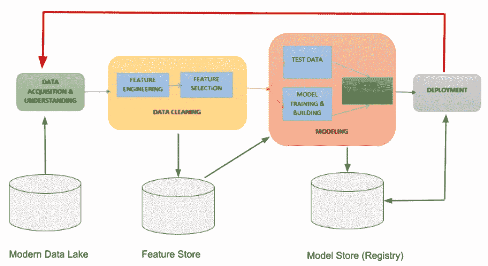
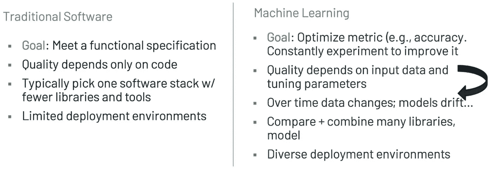
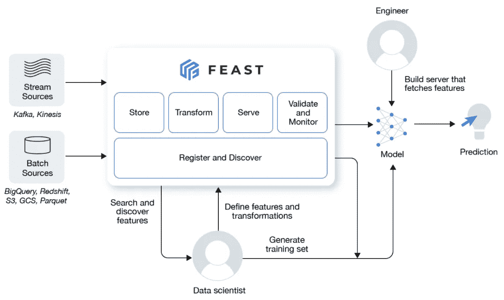
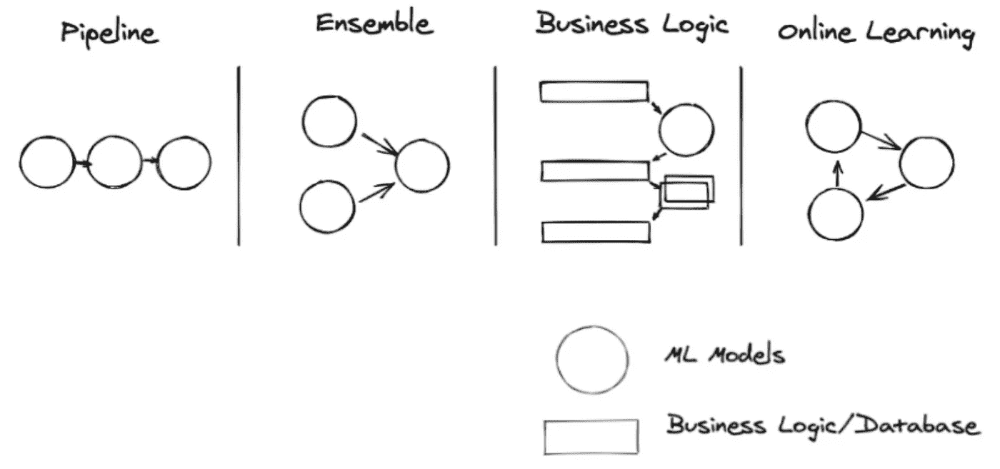
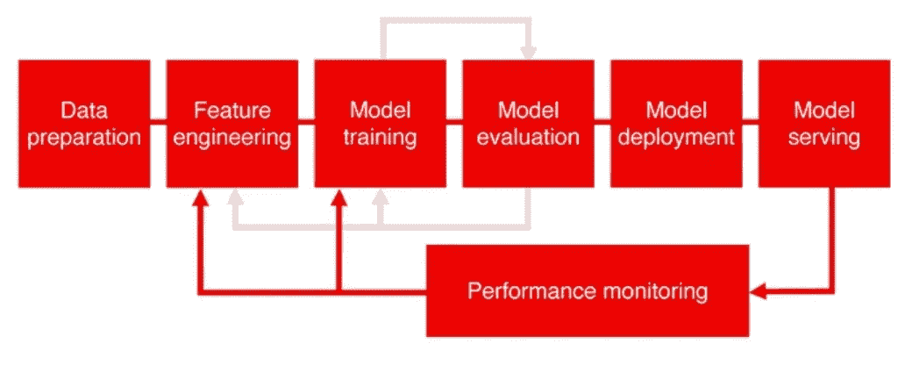

# 在生产中部署机器学习模型的注意事项

> 原文：<https://towardsdatascience.com/considerations-for-deploying-machine-learning-models-in-production-89d38d96cc23?source=collection_archive---------3----------------------->

由[朱尔斯·s·丹吉](https://twitter.com/2twitme)、[迈克尔·加拉尼克](https://twitter.com/GalarnykMichael)

模型开发周期的各个阶段(图片由 [Jules S. Damji](https://twitter.com/2twitme) 提供)

数据科学或机器学习研究人员或从业者中常见的抱怨是，将模型投入生产很困难。因此，一些人声称，很大一部分，87%的模型从未在生产中看到[的曙光。](/why-90-percent-of-all-machine-learning-models-never-make-it-into-production-ce7e250d5a4a)

“我有一个模型，我花了大量时间在我的笔记本电脑上开发它。下一步是什么？我如何让它进入我们的生产环境？我应该为我的 ML 堆栈和工具考虑什么？”

这些问题经常出现在聚会或会议上，在关于机器学习操作(MLOps)的演讲之后。对于这个试图解决和补救这一关键问题的新兴领域，没有什么灵丹妙药或灵丹妙药。

然而，在考虑您的 ML 堆栈和工具时，有一些可接受的和常见的技术考虑和陷阱要记住。在将 ML 模型投入生产的系列文章的第一部分中，我们将讨论工具和最佳实践以及 ML 模型服务模式的一些常见注意事项和常见陷阱，它们是您从模型开发到在生产中部署的必不可少的一部分。

# 轻松发展

首先考虑你的开发环境。大多数数据科学家或 ML 工程师总是使用他们的笔记本电脑来开发、测试或调试代码。由于简单、易于访问和安装最新的 ML 库，从业者压倒性地倾向于使用笔记本电脑而不是集群进行开发。我们被 ide 和强调语法的编辑器宠坏了，这是有原因的。

Python 开发人员喜欢定制他们的环境来匹配他们的登台环境，使用 conda 或 Python 虚拟环境的库依赖。理想情况下，作为一种最佳实践，如果在他们的笔记本电脑上开发的相同代码可以在集群上的试运行或生产环境中以最小的改动运行，这将极大地提高端到端开发人员的工作效率。

考虑将您的笔记本电脑作为开发环境的首选，它有可能将您的代码扩展或同步到云中的集群环境。

克里斯汀·休姆在 [Unsplash](https://unsplash.com?utm_source=medium&utm_medium=referral) 上拍摄的照片

*考虑因素#1* : *将笔记本电脑用于开发作为最佳实践*

# 大规模训练和跟踪模型实验

与传统的软件开发周期不同，模型开发周期范式是不同的。许多因素会影响 ML 模型在生产中的成功。首先，模型的结果由它的度量来衡量，比如可接受的准确性。

第二，达到满足业务目标的准确性意味着在跟踪每个实验运行时，不仅仅使用一个模型或 ML 库，而是使用许多模型和 ML 库进行实验:度量、参数、工件等。准确性是至关重要的，开发人员选择 ML 库进行实验也是如此。

朱尔斯·s·丹吉的图片

第三，准确性与获取数据的质量直接相关:坏数据导致坏模型。如下图所示，数据准备-特征提取、特征选择、标准化或规范化特征、数据插补和编码-都是清理后的数据进入特征库之前必不可少的步骤，可用于模型训练和测试阶段或部署中的推理。

模型开发周期的各个阶段(图片由 [Jules S. Damji](https://twitter.com/2twitme) 提供)

第四，选择一种编程语言，这种语言不仅为您的数据团队(数据分析师、数据科学家和 ML 工程师)所熟悉，而且还受到模型实验和培训阶段使用的许多 ML 库的支持。Python 似乎是事实上的选择。

除了选择编程语言，还可以选择 ML 框架来驯服计算密集型 ML 工作负载:深度学习、分布式训练、超参数优化(HPO)和推理，所有这些都是水平规模的，从您的笔记本电脑、单节点多核到多节点多核。

最后，能够在不同的环境中轻松地大规模部署模型:web 应用程序的一部分、移动设备内部、云中的 web 服务等。

*考虑号#2:考虑使用模型生命周期开发和管理平台，如*[*ml flow*](https://mlflow.org/)*[*DVC*](https://dvc.org/)*[*Weights&bias*](https://wandb.ai/site)*，或*[*SageMaker Studio*](https://aws.amazon.com/sagemaker/studio/)*。以及*[*Ray*](https://www.ray.io/)[*Ray Tune*](https://docs.ray.io/en/latest/tune/index.html)*[*Ray Train*](https://docs.ray.io/en/latest/train/train.html)*(原 Ray SGD)*[*py torch*](https://pytorch.org/tutorials/beginner/dist_overview.html)*和*[*tensor flow*](https://www.tensorflow.org/guide/distributed_training)*用于分布式、计算密集型和深度学习的 ML 工作负载。****

# **管理机器学习功能**

**[特征库](https://www.featurestore.org/)是现代机器学习开发周期中新兴的关键组件。随着越来越多的数据科学家和工程师共同努力，成功地将模型投入生产，作为模型开发周期的一部分，拥有一个单一的存储来保存经过清理和特征化的数据变得越来越必要。**

****

**用于管理 ML 特性的特性存储([图像源](https://github.com/feast-dev/feast)，Apache 2.0)**

**功能存储解决了运营挑战。它们在训练和推理之间提供了一组一致的数据。它们避免了任何数据偏差或无意的数据泄漏。在训练时的特征提取过程中，它们提供了在批处理和流数据上编写特征转换的定制能力。并且它们允许在推断时使用历史数据来增加请求，这在大型欺诈和异常检测部署模型或推荐系统中很常见。**

**除了将模型投入生产的挑战和考虑之外，操作 ML 数据同样重要。模型的准确性取决于良好的数据，要素存储有助于管理预先计算和清理的要素，以便在模型服务期间进行模型训练和生产推理。**

**考虑因素#3:将特征库视为模型开发过程的一部分。看向 [*盛宴*](https://feast.dev/)*[*泰克顿*](https://www.tecton.ai/)*[*萨格马克*](https://sagemaker.readthedocs.io/en/stable/amazon_sagemaker_featurestore.html) *，* [*数据块*](https://databricks.com/product/feature-store) *进行特色店铺。*****

# **大规模部署、服务和推理模型**

**一旦模型被训练和测试，并确信它满足模型准确性的业务需求，可伸缩模型服务框架要考虑的七个关键需求是:**

****框架不可知**:一个服务选举框架的模型应该是 ML 框架不可知的。也就是说，它可以部署任何用通用 ML 框架构建的通用模型。比如 PyTorch，TensorFlow，XGBoost，或者 Scikit-learn，每个都有自己的算法和模型架构。**

****业务逻辑:**模型预测通常需要预处理、后处理或通过连接到特征存储或任何其他数据存储进行验证来扩充请求数据的能力。模型服务应该允许这作为其推理的一部分。**

****模型复制:**有些模型是计算密集型的或网络受限的。因此，选择的框架可以将请求分散到模型副本，在副本之间进行负载平衡，以支持高峰流量期间的并行请求处理。**

****请求批处理:**并非所有生产中的模型都用于实时服务。通常，模型在大批量的请求中被评分。例如，对于深度学习模型，将这些图像请求并行化到多个内核，利用硬件加速器来加快批量评分和利用硬件资源，这是值得考虑的。**

****高并发和低延迟:**生产中的模型需要低延迟的实时推理，同时处理突发的大量请求。这对于获得最佳用户体验以接收毫秒级预测请求响应至关重要。**

**模型部署 CLI 和 API:负责部署模型的 ML 工程师应该能够使用模型服务器的部署 API 或命令行界面(CLI)简单地将模型工件部署到生产中。这允许从现有的 CI/CD 管道或工作流中进行模型部署。**

****生产中的模型模式**:随着人工智能应用在工业的各个领域越来越普及，为这些人工智能应用训练的模型变得复杂而复合。它们的范围从计算机视觉到自然语言处理，再到推荐系统和强化学习。**

**也就是说，模型不是孤立存在的。他们也不会单独预测结果。相反，他们通常以[四种模式](https://www.anyscale.com/blog/serving-ml-models-in-production-common-patterns)联合运作:管道、合奏、商业逻辑和在线学习。每种模式都有其目的和价值。**

****

**生产中的 ML 模型模式([图像源](https://www.anyscale.com/blog/serving-ml-models-in-production-common-patterns))**

**机器学习工程师采用[两种常见的方法](https://youtu.be/gV4YS4e1CXg?t=272)在生产中部署这些模型模式。一种是将模型嵌入 web 服务器，另一种是卸载到外部服务。就上述七个考虑事项而言，每种方法都有自己的优点和缺点。**

***考虑数#4:看向* [*谢顿*](https://www.seldon.io/) *，*[*KFServing*](https://www.kubeflow.org/docs/components/kfserving/)*，或者* [*雷 Serve*](https://docs.ray.io/en/latest/serve/index.html) *对于这七个要求。***

# **生产中的观察和监控模型**

**作为模型开发生命周期的一部分，模型监控通常是一个被忽视的阶段，它对于模型在部署后生产阶段的生存能力至关重要。这通常是事后的想法，由 ML 工程师承担风险。**

**模型有来世的生存能力。生产中可行的生命需要一个持续的警惕或哨兵的眼睛。事实上，作为一个阶段的监控只是模型服务的延续，如下图所示。**

****

**生产中的 ML 模型监控([显然是 AI 的图像](https://evidentlyai.com/blog/machine-learning-monitoring-what-it-is-and-how-it-differs)**

**为什么要考虑模型监控？出于许多实际原因，这一阶段至关重要。我们简单讨论一下。**

****数据随时间漂移:**正如我们上面提到的，我们的模型的质量和准确性取决于数据的质量。数据是复杂的，从来不是静态的，这意味着随着时间的推移，用提取的特征训练的原始模型可能不再重要。可能会出现一些需要考虑的新特征。比如季节性的数据变化。数据中的这种[特征漂移](https://evidentlyai.com/blog/machine-learning-monitoring-data-and-concept-drift)需要重新训练和重新部署模型，因为变量的分布不再相关。**

****模型概念随着时间而变化:**许多从业者称之为模型[衰退或模型陈旧](https://evidentlyai.com/blog/machine-learning-monitoring-data-and-concept-drift)。当训练模型的模式不再适用于漂移数据时，该模型将不再有效，因为其输入特征的关系可能不一定会产生模型的预期预测。因此，它的精度会降低。**

****模型故障时间:**模型故障原因不明:某系统故障或网络连接不良；超负荷的系统；错误的输入或损坏的请求。如果用户收到错误或伪造的结果，及早检测这些故障的根本原因或其频率可以减轻用户的不良体验或阻止对服务的不信任。**

****系统因负载过重而降级:**时刻警惕您部署的专用模型服务器或服务的健康状况，这与监控传输数据的数据管道或整个数据基础架构的关键组件(数据存储、web 服务器、路由器、集群节点的系统健康状况等)的健康状况同样重要。**

**这些前述的监控模型概念统称为[模型可观测性](/what-is-ml-observability-29e85e701688)。在 [MLOps 最佳实践](/mlops-practices-for-data-scientists-dbb01be45dd8)中，这一步现在是可接受的必要步骤。监视数据和模型的健康状况永远不应该是事后才想到的。相反，它应该是你的模型开发周期的一部分。**

***考虑数#5:对于模型的可观测性，显然要看*[*. ai*](https://github.com/evidentlyai/evidently)*，*[*arize . ai*](https://arize.com/)*，*[*Arthur . ai*](https://www.arthur.ai/)， [*Fiddler.ai*](https://www.fiddler.ai/) ，<https://valohai.com/model-monitoring/>**，或*[*why*](https://whylabs.ai/)***

# **结论**

**让我们回顾一下。为了避免常见的抱怨模型不能投入生产或让你的模型在生产中看到阳光，如果你想让你的模型旅行到他们想要的目的地，并有一个可行的来世，请在心中考虑所有上述因素。**

**每种考虑都有其优点。每个考虑事项都有解决每个问题的开源解决方案或来自供应商的托管解决方案。评估每个工具如何最好地适应和满足现有机器学习工具堆栈中的所有考虑因素。**

**但是将它作为 ML 模型开发工具栈的一部分是至关重要的；这将显著提高您将模型投入生产的端到端成功率。**

**在以后的博客中，我们将研究如何实现考虑事项#1 和#2，重点关注我们建议的一些工具。**

***原载于*[*https://www.anyscale.com*](https://www.anyscale.com/blog/considerations-for-deploying-machine-learning-models-in-production)*。***