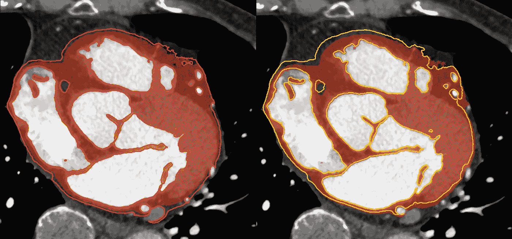

# 双线性上采样层的一致性

> 原文：<https://towardsdatascience.com/consistency-of-bilinear-upsampling-layer-76458f52d817?source=collection_archive---------31----------------------->

## [实践教程](https://towardsdatascience.com/tagged/hands-on-tutorials)

## TensorFlow-Keras 2.5 和 Apple Core ML 的代码，通过训练和预测产生一致的结果

照片由[詹姆斯·哈里逊](https://unsplash.com/@jstrippa?utm_source=medium&utm_medium=referral)在 [Unsplash](https://unsplash.com?utm_source=medium&utm_medium=referral) 上拍摄

# 介绍

深度学习狂热者中众所周知，TensorFlow 中的双线性上采样层存在像素偏移问题。通过在 TensorFlow 2.x 中为它们添加“align_corner”属性，这一问题已得到部分修复。但问题仍然存在，当通过各种版本将 TensorFlow 中的训练模型导出到另一个 DL 框架时，会导致计算流不一致。

在我的例子中，当使用 **coremltools 3.4** 将训练好的模型从 **TensorFlow 2.5** 转换为 **Apple Core ML** 时，具有双线性上采样层的神经网络模型显示出怪异的行为。在无数次的编码、尝试、删除-删除-删除之后，我几乎放弃了 TensorFlow 和 Core ML 之间的上采样层的一致结果。

> 我想在最新的 TensorFlow 2.5 中使用 Keras 进行 Windows PC 中的训练，我想使用以前的 coremltools 3.4 将训练好的模型转换为 macOS 笔记本电脑的 Core ML。这是因为 2.5 版有稳定的自动混合精度计算，也是因为我因为 macOS 中 anaconda 和 pip 的依赖错误而无法使用 TF 2.5 的 coremltools 4.x。

## 什么是像素偏移问题？

一些尊敬的程序员对 TensorFlow 中定义的这个(麻烦的)规范提供了很好的解释。它们对我有帮助，也许对你也有帮助:

*   **Oleksandr Savsunenko**——[tensor flow 的 tf.image.resize 如何偷走了我生命中的 60 天](https://medium.com/hackernoon/how-tensorflows-tf-image-resize-stole-60-days-of-my-life-aba5eb093f35)
*   **Matthijs holle mans**—[岩心 ML 中的上采样](https://machinethink.net/blog/coreml-upsampling/)
*   **巴特·沃伦斯基**——[双线性下/上采样，对齐像素网格，以及臭名昭著的 GPU 半像素偏移](https://bartwronski.com/2021/02/15/bilinear-down-upsampling-pixel-grids-and-that-half-pixel-offset/)

# 待解决的问题

***"coremltools 3.4 无法正确转换 TensorFlow 2.5 中的双线性上采样图层。"***

这并不奇怪，**只是版本不匹配**其中 TensorFlow 2.5 可以对齐该层中的图像角，但 coremltools 3.4 使用原始方法，倾向于像 TensorFlow 1.x 一样移动图像。

> 然而，无论如何，我必须在我的 macOS 中使用 TensorFlow 从我训练过的 Keras 模型中获得一致的结果，**不管它们的版本如何…**

# 实现双线性上采样层

我只是在这里上传我的努力。它们是用于双线性上采样的 TF-Keras 和 Core ML 的自定义层。

## 在喀拉斯

这是一个简单的自定义层，没有任何可训练的参数。您必须实现 **call()** 来计算张量。我用[**TF . compat . v1 . image . resize _ bilinear()**](https://www.tensorflow.org/api_docs/python/tf/compat/v1/image/resize_bilinear)但是[**TF . compat . v1 . image . resize()**](https://www.tensorflow.org/api_docs/python/tf/compat/v1/image/resize)会等价。注意，必须使用 **align_corners=True** 。您可以在 TensorFlow 中使用其他上采样或图像缩放方法。

## 在核心 ML 中(目标 C)

> ***注:*** 我在 2021 年 7 月 2 日更新了核心 ML 实现。也请参考底部的最新内容。

在您基于 **MLCustomLayer** 的自定义图层类中，您必须实现**encodecommandbuffer**方法来激活 GPU。苹果的金属性能着色器提供了效果很好的[**mpscnnupsampling 双线性**](https://developer.apple.com/documentation/metalperformanceshaders/mpscnnupsamplingbilinear?language=objc) ，结果似乎与 **tf 的一致...上面 Keras 中使用的 image.resize_bilinear** 。多亏了这个**mpscnnupnupsampling bilinear**，我不用自己写 METAL 代码了。

老实说，我用的是[**MPSImageBilinearScale**](https://developer.apple.com/documentation/metalperformanceshaders/mpsimagebilinearscale?language=objc)，不是 **MPSCNN...**，起初。结果明显不稳定，出乎意料。在我的理解中，它们应该是相同的“双线性”和“上采样(=重新缩放)”，具有对齐的角，但它们不是。我猜**MPs CNN……**是纯双线性上采样，因为结果也与 CPU 的裸代码一致。同时**模拟...**可能有一些定制，以保持在重新缩放的图像好看。

额外的工作是**evaluateonpuwithinputs**改为使用 CPU。对于计算机无法使用或其中没有 GPU 的情况，您必须实现方法。我基于 [**Matthijs** 的网站](https://machinethink.net/blog/coreml-upsampling/)实现了双线性上采样代码(他的指导很有帮助)。

## 在转换器中(coremltools 3.4)

使用之前的 coremltools 3.4 无法将 TF-Keras 2.5 的一个训练好的模型直接 ***转换成核心 ML 模型*** 。 **coremltools…convert()** 或 **keras…load_model()** 方法不起作用。但是可以通过如下方式间接使用*:*

1.  *我从我的神经网络代码中新建了一个裸模型，该代码已用于最新的 TF-Keras 2.5 中的训练。注意，这个空模型我用的是纯 Keras 2.2.x，而不是 TF-Keras。*
2.  *因为 pure Keras 2.2.x 和 coremltools 3.4 的版本匹配，所以裸模型可以被 coremltools 3.4 转换成核心 ML 模型。但是该模型没有经过训练的参数。*
3.  *我用 keras_model.load_weights()将 TF-Keras 2.5 训练好的参数加载到 pure Keras 2.2.x 新建的模型中，这个效果很好，coremltools 3.4 可以从中创建一个训练好的核心 ML 模型。*

# *最后，*

*我感到欣慰的是，我可以通过 TensorFlow 2.5 和 Core ML 使用 coremltools 3.4 实现双线性上采样层，保持一致的计算结果。*

*我希望这将对尝试这个问题的人有所帮助。*

**P.S .我正在为即将到来的 MacBook Pro 2021 攒钱…但是当它到来的时候呢？**

# *更新[2021 年 7 月 2 日]*

*我发现了一些上面的**mpscnnupsamplingb 双线性**显示**不一致**结果的情况，即使一开始在其他情况下看起来是一致的。因此，我尝试了另一个金属性能着色器函数，**mpsnresizebilinear**来实现内核 ML 中的 Keras 对应函数，，并发现**具有更好的结果。***

*下图显示了使用上述 Keras 代码，使用双线性上采样层训练的神经网络模型的分割结果。*

> *红色区域是 CPU 代码的结果，红线是**mpsnresizebilinear**的结果，黄色是**mpscnnupsamplingb 双线性**。*

**

*并且，我为核心 ML 更新了目标 C 代码，如下所示:*