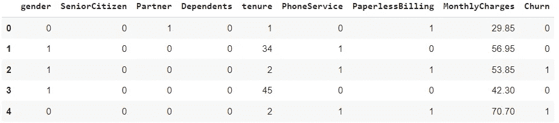
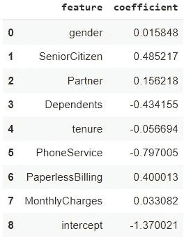
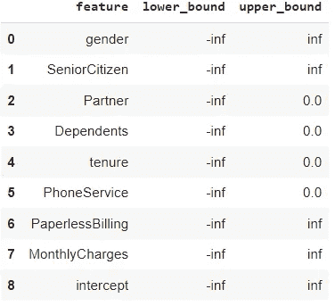
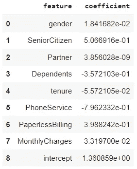
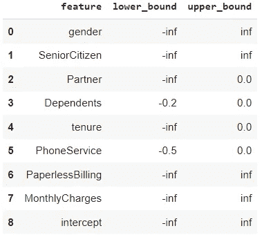
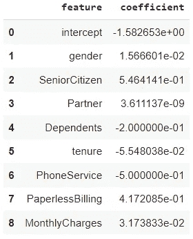

# 用 Python 实现约束逻辑回归

> 原文：<https://towardsdatascience.com/constrained-logistic-regression-with-python-c694fcd7a029?source=collection_archive---------15----------------------->


照片由[卡罗来纳·加西亚·塔维森](https://unsplash.com/@karock12?utm_source=unsplash&utm_medium=referral&utm_content=creditCopyText)在 [Unsplash](https://unsplash.com/s/photos/paper-origami?utm_source=unsplash&utm_medium=referral&utm_content=creditCopyText) 拍摄

## 如何对逻辑回归的参数应用特定的约束

逻辑回归是一个基本但流行的分类模型。尽管简单，逻辑回归是一个强大的工具，在现实世界中使用。

这种方法的主要好处也许是它的可解释性，因为它的参数/系数很容易解释。因此，通过充分理解每个特性对模型的影响，人们可以从模型中获得洞察力。

在这篇博客中，我将分享如何对逻辑回归模型应用特定的限制。换句话说，如何在每个特征系数的给定范围内构建逻辑回归。

文章的其余部分将安排如下。

1.  **本文中使用的数据**
2.  **动机**:为什么我们首先需要对系数应用一些约束？
3.  **方法**:如何实现逻辑回归的具体约束
4.  **后果**:承认这样约束的效果

在我们继续之前，请注意，本文涉及的所有代码都可以在我的 GitHub repo [这里](https://github.com/pararawendy/constrained-logistic-regression)找到。

# 数据

我们将使用 IBM **电信客户流失**数据。这个数据是关于一个虚构的电信公司的客户流失，基于各种可能的因素。该数据根据 Apache 自由软件许可证版本 2 [ [1](https://github.com/IBM/telco-customer-churn-on-icp4d#license) ]获得许可。因此，我们可以出于任何目的使用它，修改它，并分发它[ [2](https://en.wikipedia.org/wiki/Apache_License#Apache_License_2.0) ]。

数据可以从 IBM 社区网站[这里](https://community.ibm.com/accelerators/catalog/content/Telco-customer-churn)下载。

我们将执行如下几个预处理步骤:

1.  通过首先移除其值包含空白的行，将列`TotalCharges`转换为 float。
2.  为简单起见，删除非重复值数量大于 2 的分类列。
3.  此外，删除`TotalCharges` 列以防止与`tenure` 的多重共线性问题(验证您自己😉).

上面的代码应该会产生下面的数据片段。



图 1:预处理数据(图片由作者提供)

为了让你的生活更容易，我把干净的/处理过的数据集放在我的 GitHub [这里](https://github.com/pararawendy/constrained-logistic-regression/blob/main/telco_churn_clean.csv)。

# 动机

假设您的任务是基于数据集构建分类模型(re:预测客户流失)。

因为你是一个出色的数据科学家，你知道逻辑回归是可用的方法之一，所以你用 sklearn 库创建了一个。

您向您的利益相关者报告以下系数，以及相关的见解(关于系数的解释)。

产生的系数:



图 2:来自 sklearn 模型的系数(图片由作者提供)

本质上，你的见解可能是这样的:

*   该模型表明 `gender male, SeniorCitizen, Partner, PaperlessBilling`和`MonthlyCharges` 与用户流失可能性的**增加**相关联
*   而`Dependents, tenure,`和`PhoneService` 与用户流失可能性的**降低**相关联(这是一件好事)

但是，他们(利益相关者)向您提出了以下挑战:

> “你的模型的大部分输出对我来说是有意义的。我同意`Dependents, tenure`和`PhoneService` 应该有负系数(减少流失的风险)。
> 
> 然而，根据我多年的经验和知识，我坚定地认为，有配偶(`Partner`)也应该减少流失的风险，因为逻辑类似于有家属；你需要更多的电话来联系他们，因此你不太可能流失。因此，系数不得为正(最大值为零)。"

你将如何适应这种限制？

# 克洛斯蒂克来救援了！

[clogistic](https://github.com/guillermo-navas-palencia/clogistic) 是一个约束逻辑回归的 Python 实现，带有一个类似 scikit-learn 的 API。在引擎盖下，库使用凸优化来实现这个目标。

第一步是具体化约束。也就是说，我们指定每个特征的系数的下限和上限。为了更好的可解释性，我们将约束定义为 pandas 数据框架。



图 3:约束数据框架(作者图片)

从上面的`constraint_df`，我们知道:

*   对于特征`gender, SeniorCitizen, PaperlessBilling`和`MonthlyCharges`，我们不**而**施加任何约束，即这些特征的系数可以是任何实数(从超大负数到超大正数)
*   而对于特征`Partner, Dependents, tenure`和`PhoneService`，我们要求系数永远不为正(最大值为零)，如上限= 0 所示。

使用这个数据框架，我们可以使用 clogistic 进行模型训练。当然，先决条件是安装这个库(如果您还没有安装的话)。如果您使用的是 Google Colab Notebook，只需运行以下命令。

```
!pip install clogistic
```

我们现在准备训练模型。clogistic 中的 LogisticRegression API 与 sklearn 中的 API 非常相似，只是我们可以在训练模型时指定一个`bounds`参数，它可以适应我们希望应用的约束。

得出的系数如下所示。



图 4:来自逻辑模型的系数(图片由作者提供)

看啊！约束得到了很好的满足！现在特性`Partner` 有一个负系数(实际上为零)。其他三个约束特征(`Dependents, tenure, PhoneService`)也保持为负。你可以满怀信心地带着这个结果回到你的利益相关者那里。

接下来，出于本教程的目的，假设约束更新如下。

*   `Partner, Dependents, tenure, PhoneService`仍需非正
*   但是现在`Dependents and PhoneService`得到**下限要求**；`Dependents > -0.2`，`PhoneService > -0.5`

别着急，我们需要做的只是更新约束数据框。



图 5:更新的约束(图片由作者提供)

之后，我们做同样的训练步骤。

接下来是检索模型系数。



图 6:带更新约束的系数(图片由作者提供)

请注意，模型已经满足了更新后的约束；我们有`Dependents` 系数= -0.2，和`PhoneService` 系数= -0.5。

霍雷。🎉

# 设置约束的效果

需要注意的重要一点是，通过施加约束，我们基本上是在一定程度的优化(模型性能)上进行权衡，以满足约束。如下所示，随着我们添加额外的约束，我们的模型在训练数据(F1 分数)中的性能下降。

```
F1 score on train set for sk_logreg model is 0.5593 
F1 score on train set for cl_logreg model is 0.5575 
F1 score on train set for cl_logreg_rev model is 0.5513
```

发生这种情况是因为约束会缩小适合作为解的系数值的可行区域。结果，与没有任何约束的原始(更大的)可行区域相比，评估度量(这里是 F1 分数)将是次优的。

# 在你走之前

恭喜你读到这里！

在本文中，我们学习了如何构建一个对系数有特定约束的逻辑回归模型。我们使用 clogistic Python 库实现了这一点。最后，我们承认在我们的模型性能上强加这样的约束的“副作用”。

作为一个友好的提醒，整个笔记本可以在我的 GitHub repo [这里](https://github.com/pararawendy/constrained-logistic-regression/blob/main/clogistic_logistic_regression.ipynb)获得，对于那些喜欢 GitHub 界面的人来说。

希望这篇文章在你遇到类似需求时有所帮助！总而言之，感谢您的阅读，让我们在 [LinkedIn](https://www.linkedin.com/in/pararawendy-indarjo/) 上与我联系吧！👋

# 参考

[1][https://github . com/IBM/telco-customer-churn-on-ICP 4d # license](https://github.com/IBM/telco-customer-churn-on-icp4d#license)。备注:IBM 在这个 GitHub 存储库中使用数据集，IBM 是数据集的所有者。整个存储库是根据 Apache 软件许可证版本 2 许可的，因此数据集也是如此。

[2][https://en . Wikipedia . org/wiki/Apache _ License # Apache _ License _ 2.0](https://en.wikipedia.org/wiki/Apache_License#Apache_License_2.0)