# 用自然语言处理构建生物医学知识图

> 原文：<https://towardsdatascience.com/construct-a-biomedical-knowledge-graph-with-nlp-1f25eddc54a0?source=collection_archive---------3----------------------->

## [实践教程](https://towardsdatascience.com/tagged/hands-on-tutorials)

## 了解如何结合 OCR、命名实体链接、关系提取和外部丰富数据库来构建生物医学知识图

我已经演示了如何[从维基百科页面](/from-text-to-knowledge-the-information-extraction-pipeline-b65e7e30273e)中创建知识图表。然而，由于这篇文章引起了很多关注，我决定探索使用 NLP 技术构建知识图有意义的其他领域。在我看来，生物医学领域是一个很好的例子，当你经常分析基因、疾病、药物、蛋白质等之间的相互作用和关系时，用图表表示数据是有意义的。

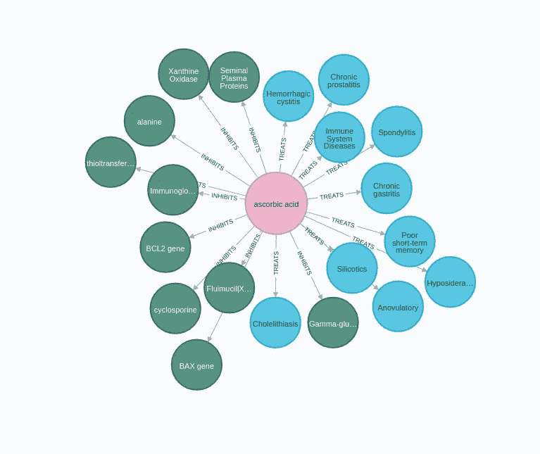

显示抗坏血酸与其他生物医学概念关系的子图范例。图片由作者提供。

在上面的可视化中，我们有抗坏血酸，也称为维生素 C，以及它与其他概念的一些关系。例如，它表明维生素 C 可以用来治疗慢性胃炎。

现在，你可以让一组领域专家为你绘制药物、疾病和其他生物医学概念之间的所有联系。但是，不幸的是，我们中没有多少人能够负担得起聘请一组医生来为我们做这项工作。在这种情况下，我们可以求助于使用 NLP 技术来自动提取这些关系。好的方面是，我们可以使用 NLP 管道来读取所有的研究论文，坏的方面是，并不是所有获得的结果都是完美的。然而，鉴于我身边没有一组科学家准备好人工提取关系，我将求助于使用 NLP 技术来构建我自己的生物医学知识图。

在这篇博文中，我将用一篇研究论文来引导你完成构建生物医学知识图谱所需的所有步骤。

<https://arxiv.org/abs/2110.03526>  

我将使用由[穆罕默德·礼萨·艾哈迈迪](https://arxiv.org/search/q-bio?searchtype=author&query=Ahmadi%2C+M)撰写的皮肤再生和毛发生长的组织工程论文。文章的 PDF 版本在 CC0 1.0 许可下提供。我们将通过以下步骤来构建知识图:

*   使用 OCR 阅读 PDF 文档
*   文本预处理
*   生物医学概念识别和链接
*   关系抽取
*   外部数据库丰富

在本文结束时，您将使用以下模式构建一个图。

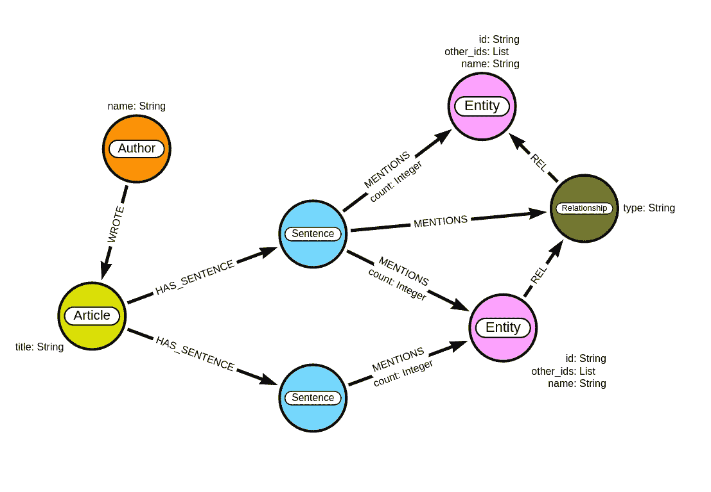

生物医学图表。图片由作者提供。

我们将使用 Neo4j 来存储我们的图形，Neo4j 是一个图形数据库，具有带标签的属性图模型。每篇文章可以有一个或多个作者。我们将文章内容拆分成句子，并使用 NLP 提取医疗实体及其关系。我们将实体之间的关系存储为中间节点而不是关系，这可能有点违背直觉。这一决定背后的关键因素是，我们希望对从中提取关系的源文本进行审计跟踪。使用带标签的属性图模型，您不能让一个关系指向另一个关系。为此，我们将医学概念之间的联系重构为一个中间节点。这也将允许领域专家评估关系是否被正确提取。

在这个过程中，我还将演示使用构建的图来搜索和分析存储信息的应用程序。

让我们开始吧！

## 使用 OCR 阅读 PDF 文档

如前所述，研究论文的 PDF 版本在 CC0 1.0 许可下对公众开放，这意味着我们可以轻松地用 Python 下载它。我们将使用 [pytesseract](https://pypi.org/project/pytesseract/) 库从 PDF 中提取文本。据我所知，pytesseract 库是 OCR 中比较流行的库之一。如果你想跟随代码示例，我已经准备了一个 [Google Colab 笔记本](https://colab.research.google.com/github/tomasonjo/blogs/blob/master/bionlp/bioNLP2graph.ipynb)，所以你不必自己复制粘贴代码。

## 文本预处理

现在我们已经有了文章内容，我们将继续从文本中删除部分标题和图描述。接下来，我们将把课文分成句子。

## 生物医学命名实体链接

现在是激动人心的部分。对于那些不熟悉 NLP 和命名实体识别和链接的人，让我们从一些基础知识开始。命名实体识别技术用于检测文本中的相关实体或概念。例如，在生物医学领域，我们想要识别文本中的各种基因、药物、疾病和其他概念。

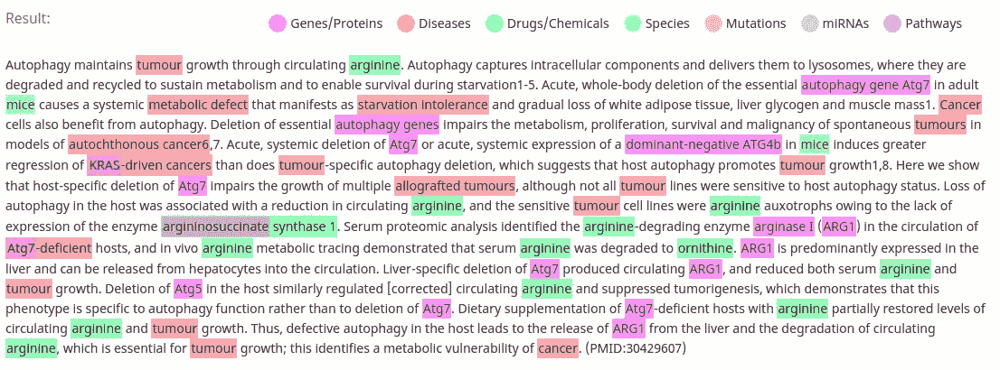

生物医学概念抽取。图片由作者提供。

在这个例子中，NLP 模型识别了文本中的基因、疾病、药物、物种、突变和途径。如前所述，这个过程称为命名实体识别。命名实体识别的升级是所谓的命名实体链接。命名实体链接技术检测文本中的相关概念，并试图将它们映射到目标知识库。在生物医学领域，一些目标知识库是:

*   [网](https://www.ncbi.nlm.nih.gov/mesh/)
*   [车壁](https://www.ebi.ac.uk/chebi/)
*   [OMIM](https://www.omim.org/)
*   [恩森布尔](https://www.ensembl.org/index.html)
*   以及其他等等

为什么我们要将医疗实体链接到目标知识库？主要原因是它有助于我们处理实体消歧。例如，我们不希望在图中用单独的实体表示抗坏血酸和维生素 C，因为领域专家会告诉你这是一回事。第二个原因是，通过将概念映射到目标知识库，我们可以通过从目标知识库获取关于映射概念的信息来丰富我们的图模型。如果我们再次使用抗坏血酸的例子，如果我们已经知道它的 CHEBI id，我们可以很容易地从 CHEBI 数据库中获取额外的信息。

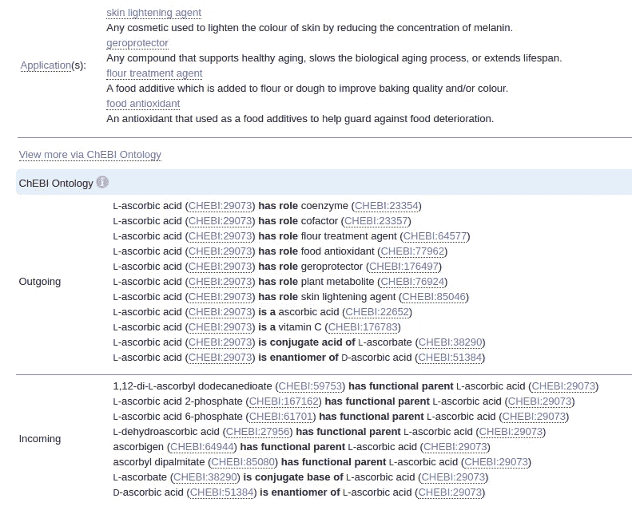

CHEBI 网站上关于抗坏血酸的浓缩数据。网站上的所有内容都可以在 **CC BY 4.0 许可下获得。**图片由作者提供。

我一直在寻找一个体面的开源预培训生物医学命名实体链接有一段时间了。许多 NLP 模型只专注于提取医学概念的特定子集，如基因或疾病。更罕见的是找到一个模型，检测大多数医学概念，并将它们链接到目标知识库。幸运的是，我偶然发现了[BERN](https://bern.korea.ac.kr/)【1】，一个神经生物医学实体识别和多类型规范化工具。如果我理解正确的话，它是一个微调的 BioBert 模型，集成了各种命名实体链接模型，用于将概念映射到生物医学目标知识库。不仅如此，它们还提供了一个免费的 REST 端点，因此我们不必处理让依赖项和模型工作的头痛问题。我上面使用的生物医学命名实体识别可视化是使用 BERN 模型创建的，因此我们知道它可以检测文本中的基因、疾病、药物、物种、突变和路径。

不幸的是，BERN 模型没有为所有概念分配目标知识库 id。所以我准备了一个脚本，首先查看是否为一个概念给出了一个不同的 id，如果没有，它将使用实体名称作为 id。我们还将计算句子文本的 sha256，以便在以后进行关系抽取时更容易识别特定的句子。

我检查了命名实体链接的结果，不出所料，它并不完美。例如，它没有将干细胞确定为一个医学概念。另一方面，它检测到一个名为“心脏、大脑、神经和肾脏”的单一实体。然而，在我的调查中，BERN 仍然是我能找到的最好的开源生物医学模型。

## 构建知识图表

在查看关系提取技术之前，我们将仅使用实体构建一个生物医学知识图，并检查可能的应用。如前所述，我准备了一个 [Google Colab 笔记本](https://colab.research.google.com/github/tomasonjo/blogs/blob/master/bionlp/bioNLP2graph.ipynb)，你可以用它来跟踪本文中的代码示例。为了存储我们的图表，我们将使用 Neo4j。您不必准备本地 Neo4j 环境。相反，您可以使用免费的 Neo4j 沙盒实例。

<https://neo4j.com/sandbox/>  

在沙箱中启动[空白项目，并将连接细节复制到 Colab 笔记本中。](https://sandbox.neo4j.com/?usecase=blank-sandbox)


Neo4j 沙盒连接详情。图片由作者提供。

现在，您可以在笔记本中准备 Neo4j 连接了。

我们将从将作者和文章导入图中开始。文章节点将只包含标题。

如果打开 Neo4j 浏览器，应该会看到下图。

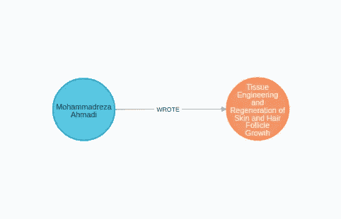

图片由作者提供。

您可以通过执行以下 Cypher 查询来导入句子和提到的实体:

您可以执行以下 Cypher 查询来检查构建的图形:

```
MATCH p=(a:Article)-[:HAS_SENTENCE]->()-[:MENTIONS]->(e:Entity)
RETURN p LIMIT 25
```

如果您已经正确导入了数据，您应该会看到类似的可视化效果。

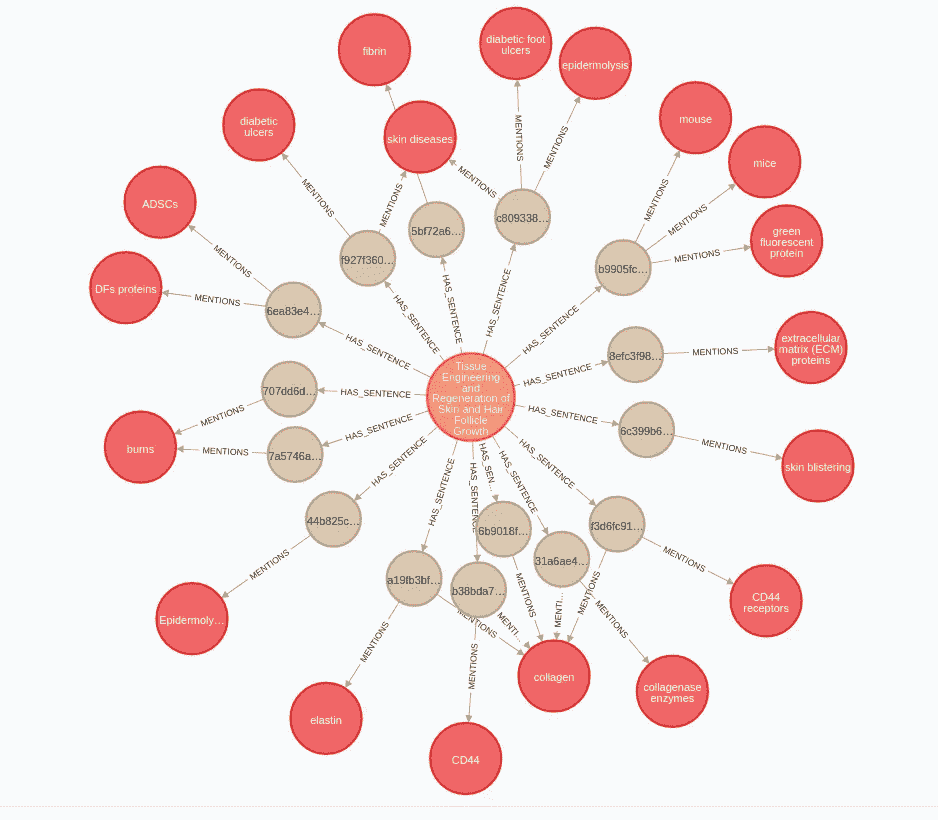

存储为图形的实体提取。图片由作者提供。

## 知识图应用

即使没有关系提取流程，我们的图也已经有几个用例了。

**搜索引擎**

我们可以用我们的图表作为搜索引擎。例如，您可以使用下面的 Cypher 查询来查找提到特定医疗实体的句子或文章。

```
MATCH (e:Entity)<-[:MENTIONS]-(s:Sentence)
WHERE e.name = "autoimmune diseases"
RETURN s.text as result
```

*结果*

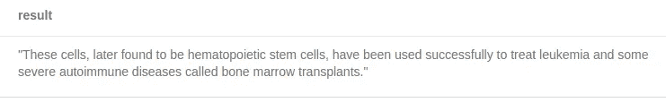

图片由作者提供。

**同现分析**

第二种选择是共现分析。如果医疗实体出现在同一个句子或文章中，您可以定义它们之间的共现。我发现一篇文章[2]使用医学共现网络来预测医疗实体之间新的可能联系。

<https://pubmed.ncbi.nlm.nih.gov/25160252/>  

您可以使用下面的 Cypher 查询来查找经常在同一个句子中同时出现的实体。

```
MATCH (e1:Entity)<-[:MENTIONS]-()-[:MENTIONS]->(e2:Entity)
WHERE id(e1) < id(e2)
RETURN e1.name as entity1, 
       e2.name as entity2, 
       count(*) as cooccurrence
ORDER BY cooccurrence
DESC LIMIT 3
```

*结果*

显然，如果我们分析成千上万或更多的文章，结果会更好。

**考察作者专长**

您还可以使用这个图表，通过检查作者最常写的医学实体来找到作者的专业知识。有了这些信息，你也可以建议未来的合作。

执行下面的 Cypher 查询，检查我们的作者在研究论文中提到了哪些医疗实体。

```
MATCH (a:Author)-[:WROTE]->()-[:HAS_SENTENCE]->()-[:MENTIONS]->(e:Entity)
RETURN a.name as author,
       e.name as entity,
       count(*) as count
ORDER BY count DESC
LIMIT 5
```

*结果*

## 关系抽取

现在我们将尝试提取医学概念之间的关系。根据我的经验，关系提取至少比命名实体提取难一个数量级。如果您不期望命名实体链接有完美的结果，那么您肯定会期望关系提取技术有一些错误。

我一直在寻找可用的生物医学关系提取模型，但没有发现任何现成的或不需要微调的模型。看起来关系抽取领域处于前沿，并且希望在未来我们会看到更多的关注。不幸的是，我不是 NLP 专家，所以我避免对自己的模型进行微调。相反，我们将使用基于论文[的零触发关系提取器，探索 few rel](https://www.aclweb.org/anthology/2020.coling-main.124)【3】的零触发限制。虽然我不建议将这个模型投入生产，但它对于简单的演示来说已经足够好了。该模型在 [HuggingFace](https://huggingface.co/fractalego/fewrel-zero-shot) 上可用，因此我们不必处理培训或设置模型。

使用零触发关系提取器，您可以定义您想要检测的关系。在这个例子中，我使用了*关联的*和*交互*关系。我也尝试过更具体的关系类型，如款待、原因等，但结果并不理想。

使用这个模型，您必须定义您想要检测哪对实体之间的关系。我们将使用命名实体链接的结果作为关系提取过程的输入。首先，我们找到所有提到两个或更多实体的句子，然后通过关系提取模型运行它们以提取任何联系。我还定义了一个阈值 0.85，这意味着如果一个模型预测实体之间的关联概率低于 0.85，我们将忽略该预测。

我们存储关系以及用于提取图中关系的源文本。

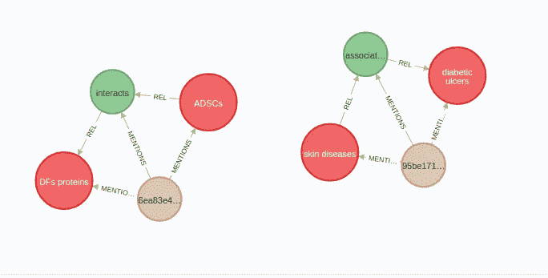

存储在图中的提取关系。图片由作者提供。

您可以使用以下 Cypher 查询来检查实体和源文本之间的提取关系:

```
MATCH (s:Entity)-[:REL]->(r:Relation)-[:REL]->(t:Entity), 
      (r)<-[:MENTIONS]-(st:Sentence)
RETURN s.name as source_entity, 
       t.name as target_entity, 
       r.type as type, 
       st.text as source_text
```

*结果*

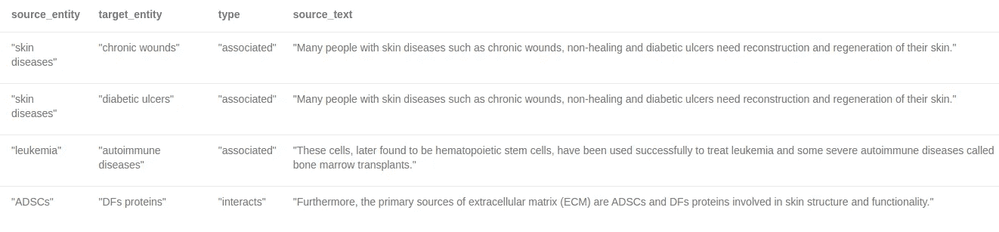

图片由作者提供。

如前所述，我用来提取关系的 NLP 模型并不完美，由于我不是医学博士，我不知道它遗漏了多少连接。然而，它检测到的似乎是合理的。

## 外部数据库丰富

正如我之前提到的，我们仍然可以使用外部数据库，如 CHEBI 或 MESH 来丰富我们的图表。例如，我们的图包含一个医疗实体[大疱性表皮松解症](https://id.nlm.nih.gov/mesh/D004820.html)，我们还知道它的网格 id。

您可以使用以下查询检索大疱性表皮松解症的网格 id:

```
MATCH (e:Entity)
WHERE e.name = "Epidermolysis bullosa"
RETURN e.name as entity, e.other_ids as other_ids
```

您可以继续检查网格以找到可用的信息:

<https://id.nlm.nih.gov/mesh/D004820.html>  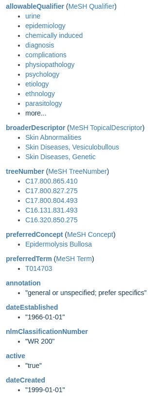

作者截图。数据由美国国家医学图书馆提供。

以下是 MeSH 网站上关于大疱性表皮松解症的可用信息截图。如前所述，我不是医学博士，所以我不知道在图表中模拟这些信息的最佳方式。但是，我将向您展示如何使用 apoc.load.json 过程从 MeSH REST 端点获取信息，从而在 Neo4j 中检索这些信息。然后，您可以请领域专家帮助您对这些信息进行建模。

从 MeSH REST 端点获取信息的密码查询是:

```
MATCH (e:Entity)
WHERE e.name = "Epidermolysis bullosa"
WITH e,
    [id in e.other_ids WHERE id contains "MESH" | split(id,":")[1]][0] as meshId
CALL apoc.load.json("https://id.nlm.nih.gov/mesh/lookup/details?descriptor=" + meshId) YIELD value
RETURN value
```

## 作为机器学习数据输入的知识图

作为最后一个想法，我将快速向您介绍如何使用生物医学知识图作为机器学习工作流程的输入。近年来，在节点嵌入领域已经有了大量的研究和进展。节点嵌入模型将网络拓扑转化为嵌入空间。

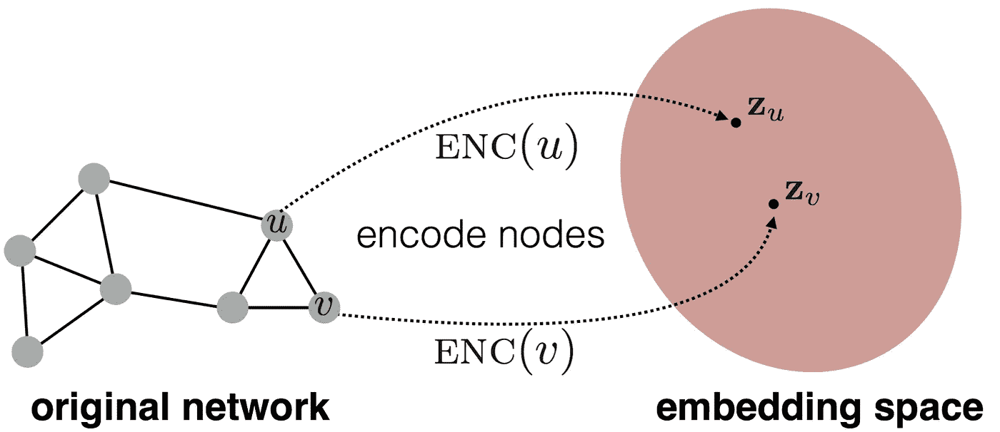

版权 2017 Manan Shah，SNAP Group。图片在 https://github.com/snap-stanford/cs224w-notes的麻省理工学院许可下提供。

假设您构建了一个生物医学知识图，其中包含医学实体和概念、它们之间的关系以及来自各种医学数据库的丰富内容。您可以使用节点嵌入技术来学习节点表示，这是固定长度的向量，并将它们输入到您的机器学习工作流中。从药物再利用到药物副作用或副作用预测，各种应用都在使用这种方法。我发现一篇研究论文使用[链接预测新疾病的潜在疗法](https://arxiv.org/abs/2010.09600)【4】。

## 结论

生物医学领域是知识图表适用的主要例子。有许多应用程序，从简单的搜索引擎到更复杂的机器学习工作流。希望通过阅读这篇博文，你能对如何使用生物医学知识图来支持你的应用有所启发。你可以开始一个[免费的 Neo4j 沙盒](https://neo4j.com/sandbox/)并从今天开始探索。

和往常一样，代码可以在 [GitHub](https://github.com/tomasonjo/blogs/blob/master/bionlp/bioNLP2graph.ipynb) 上获得。

## 参考

[1]丁·金*等人*。“一种用于生物医学文本挖掘的神经命名实体识别和多类型规范化工具”，载于 *IEEE Access* ，第 7 卷，第 73729–73740 页，2019，doi:10.1109/Access。20007.686686666607

[2] Kastrin A，Rindflesch TC，Hristovski D .网状共现网络中的链接预测:初步结果。学习健康技术信息。2014;205:579–83.PMID: 25160252。

[3]塞托利，A. (2020)。探索 FewRel 的零射击极限。在*第 28 届国际计算语言学会议记录*(第 1447-1451 页)。国际计算语言学委员会。

[4]张(r .)、赫里斯托夫斯基(d .)、舒特(d .)、卡斯特林(a .)、菲兹曼(m .)、基利科格鲁(h .)(2021 年)。通过知识图谱完成*实现新冠肺炎的药品再利用。生物医学信息学杂志，115，103696。*