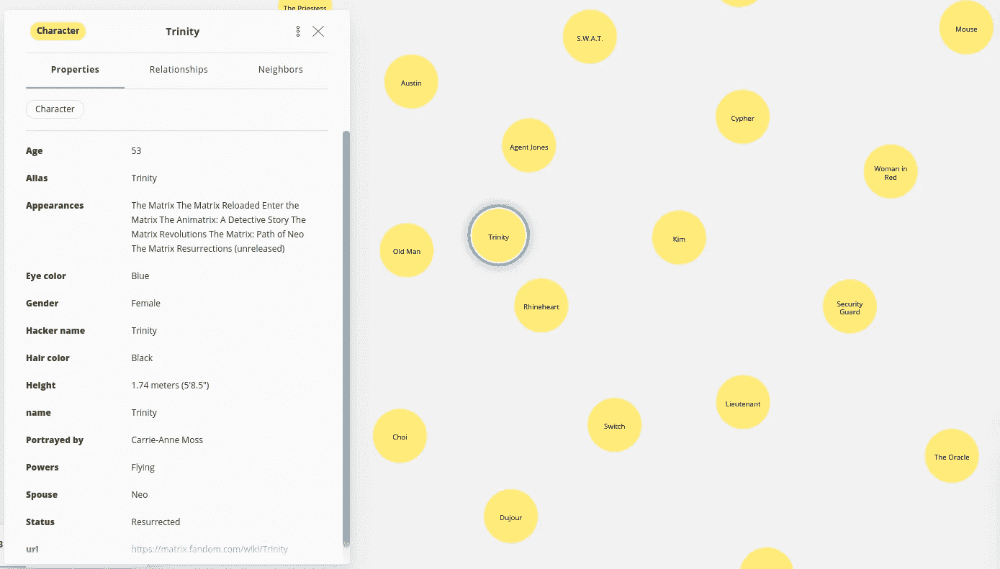
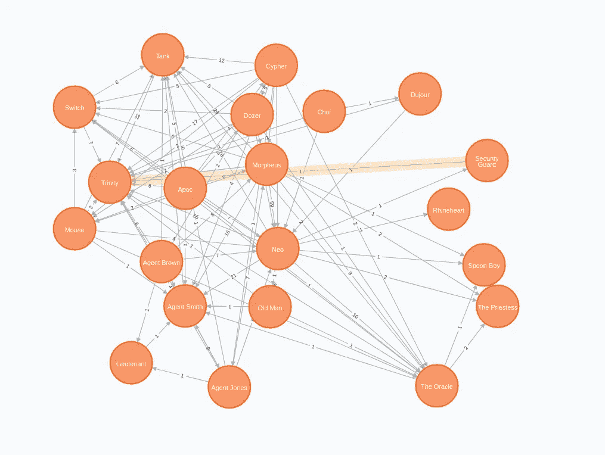
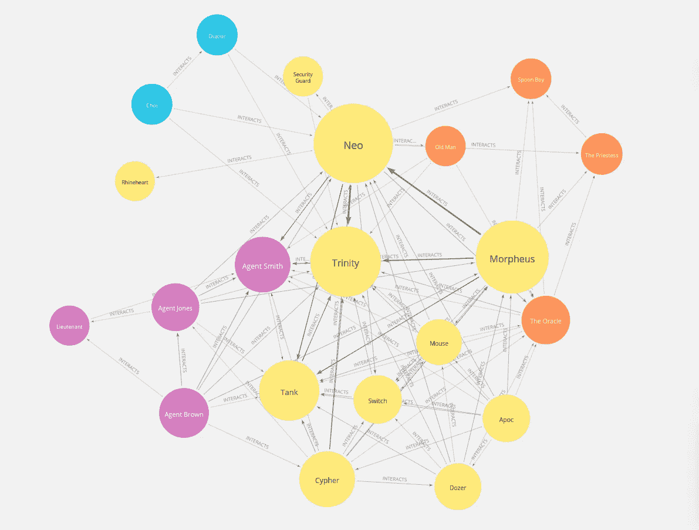

# 基于电影剧本构建矩阵互动网络

> 原文：<https://towardsdatascience.com/construct-the-matrix-interaction-network-based-on-the-movie-script-738b4fa9b46d?source=collection_archive---------15----------------------->

## 结合网页抓取、OCR 和实体识别来构建和分析 Neo4j 中的矩阵交互网络

圣诞节即将来临，随之而来的是最新的《黑客帝国》电影。我想不出比对第一部《黑客帝国》电影进行网络分析更好的等到电影上映的方法了。

## 议程

这篇博文将介绍如何结合 web 抓取、OCR 和 NLP 技术来构建矩阵交互网络。

*   用硒刮矩阵 fandom 页面
*   使用 PyTesseract 阅读黑客帝国电影脚本 PDF
*   使用空间的基于规则的匹配器提取每个场景中的角色
*   构建并分析 Neo4j 中人物的共现网络

我已经根据《T2》哈利波特系列进行了类似的分析，这次我们将使用《黑客帝国》电影剧本。

和往常一样，我准备了一个[谷歌协作笔记本](https://github.com/tomasonjo/blogs/blob/master/matrix/MatrixNLP.ipynb)，你可以用它来学习这篇文章中的例子。

## 用硒刮矩阵 Fandom 页面

我们将从抓取 [Matrix Fandom 页面](https://matrix.fandom.com/wiki/Main_Page)开始，获取电影中出现的角色列表。如前所述，我们将使用 [Selenium 库](https://selenium-python.readthedocs.io/)来实现这一点。fandom 页面的内容在 CC BY 4.0 许可下可用。

第一步，我们将提取出第一部《黑客帝国》电影中出现的角色的名字和链接。

正因为可以，我们也会从人物的个人页面中提取详细信息。

在继续之前，我们将把角色信息存储到 Neo4j 中。如果你使用的是 Colab 笔记本，那么最简单的方法就是创建一个免费的 [Neo4j 沙箱](https://neo4j.com/sandbox/)或者免费的 [Aura 数据库实例](https://neo4j.com/cloud/aura/)来存储结果。

一旦你创建了沙盒或光环环境，只需将连接细节复制到笔记本中。

现在您已经定义了到 Neo4j 实例的连接，接下来您可以导入角色的信息。

为了感受我们刚刚存储在 Neo4j 数据库中的信息，我准备了以下在 Neo4j Bloom 中制作的可视化。



人物信息在 Neo4j Bloom 中的可视化。图片由作者提供。

此时此刻，数据库中没有任何连接，只有孤独和孤立的节点。如果您愿意，您可以重构一些节点属性，比如将**配偶**重构为一个关系。然而，我们将跳过这一部分，继续根据电影剧本构建共现网络。

## 使用 PyTesseract 阅读黑客帝国电影脚本 PDF

电影剧本可以在[每日剧本网页](https://www.dailyscript.com/)上以 PDF 格式获得。虽然没有明确的许可声明，但网页上说这些脚本可用于教育目的，所以我们可以开始了。

我们将使用 [PyTesseract 库](https://github.com/madmaze/pytesseract)将 PDF 转换成文本格式。

这个过程大约需要 15 分钟，所以你可以利用这段时间休息一下，也许还可以伸伸腿。

在进入角色提取步骤之前，我们将执行一个简单的文本清理，并按场景分割脚本。

既然我们已经预处理了文本，我们将继续识别在特定场景中出现的所有字符。既然我们已经知道粉丝收集过程中会出现哪些角色，我们将使用 [SpaCy 的基于规则的匹配器](https://spacy.io/usage/rule-based-matching)来识别角色。

角色名可以以两种形式出现。首先，如果角色在说话，它的名字在文本中是大写的。第二种形式是有标题的版本，其中一个角色被其他人提到或在场景描述中提到。SpaCy 使得描述这两种模式变得非常容易。

我们还将从模式定义中省略**和**两个字。例如，fandom 页面包含字符**甲骨文**。因此，我们将跳过单词**和**，只搜索**甲骨文**模式**。**

下面的代码将构造 SpaCy 的 matcher 对象，用于下一步识别字符。

我们已经准备好了文本和实体匹配器。我们会对场景进行迭代，识别出里面出现的所有角色，一步到位直接把结果存入 Neo4j。

从电影脚本中提取信息并将输出存储到 Neo4j 中就是这么简单。

现在，我们将继续本博客的网络分析部分。首先，我们将评估所有没有出现在任何场景中的角色。

```
MATCH (n:Character) WHERE NOT (n)--()
RETURN n.name AS character
```

*结果*

12 个角色在任何一个场景中都没有被辨认出来。除了那个穿红衣服的女人，我不记得任何角色。可能她在文本中被称为红衣女子或类似的东西，所以我们的模式匹配器没有识别出她。当然，我们可以对模式进行微调，以包含这些类型的异常，但总的来说，主要角色似乎已经确定。

接下来，我们将检查在大多数场景中出现的角色。

```
MATCH (s:Scene)
WITH count(s) as countOfScenes
MATCH (n:Character)
WITH  n.name AS character,
      size((n)-[:IN_SCENE]->()) as scenes,
      countOfScenes
RETURN character,
       scenes,
       round(toFloat(scenes) / countOfScenes * 100, 2) AS scenePercentage
ORDER BY scenes DESC
LIMIT 5
```

*结果*

这里没什么令人震惊的。尼欧出现在超过一半的场景中，其次是墨菲斯和崔妮蒂。只有埃米尔·埃夫林出人意料地从这份名单中消失了。

我们可以将同现事件定义为出现在同一场景中的一对人物。在这种情况下，共现也可以理解为一种相互作用。角色阿朵出现的场景越多，他们在电影中的互动就越多。

我们可以通过执行下面的 Cypher 语句来评估哪些角色交互最多。

```
MATCH (n1:Character)-[:IN_SCENE]->()<-[:IN_SCENE]-(n2:Character)
WHERE id(n1) < id(n2)
RETURN n1.name AS character1,
       n2.name AS character2,
       count(*) AS count
ORDER BY count DESC
LIMIT 5
```

结果

大多数互动发生在尼奥、墨菲斯、三一和坦克之间。如果你看过这部电影，这一切都是有道理的。

最后，我们可以推断出字符之间的共现网络，并对其进行网络分析。我们将简单地计算一对角色之间的交互次数，并将信息存储为一个关系。

```
MATCH (n1:Character)-[:IN_SCENE]->()<-[:IN_SCENE]-(n2:Character)
WHERE id(n1) < id(n2)
WITH n1, n2, count(*) AS count
MERGE p=(n1)-[r:INTERACTS]-(n2)
SET r.weight = count
RETURN p
```

*结果*



矩阵共生网络。图片由作者提供。

## 图形数据科学图书馆

Neo4j 具有一个[图形数据科学库](https://neo4j.com/docs/graph-data-science/current/)，其中有 50 多种图形算法，包括中心性、社区检测和节点嵌入类别。

我们将使用 PageRank 来评估节点重要性，使用 Louvain 来确定推断的共现网络的社区结构。我们不是分别检查每个算法结果，而是存储结果，并构建一个网络可视化，以可视化节点重要性和社区结构。

首先，我们必须投影内存中的图形，以便能够在其上执行图形算法。请注意，我们将共现关系投影为无向关系。例如，如果 Neo 与 Trinity 互动，这直接暗示 Trinity 也与 Neo 互动。

```
CALL gds.graph.create("matrix", "Character", 
  {INTERACTS: {orientation:"UNDIRECTED", properties:"weight"}})
```

现在我们可以继续执行加权 PageRank 算法，并将结果存储回 Neo4j。

```
CALL gds.pageRank.write("matrix", {relationshipWeightProperty:"weight", writeProperty:"pagerank"})
```

最后，我们执行加权 Louvain 算法来推断社区结构，并将结果存储在数据库中。

```
CALL gds.louvain.write("matrix", {relationshipWeightProperty:"weight", writeProperty:"louvain"})
```

您可以使用 Neo4j Bloom 生成一个网络可视化，根据社区 id 为节点着色，并根据其 PageRank 得分计算节点大小。

查看[官方文档](https://neo4j.com/docs/bloom-user-guide/current/)了解如何在 Neo4j Bloom 中开发基于规则的可视化。



矩阵共生网络的网络可视化。节点的大小基于它们的 Pagerank 分数，颜色基于它们的社区。图片由作者提供。

结果比我预期的要好。黄色团体是尼布甲尼撒帮，尼欧、崔妮蒂和墨菲斯是最重要的成员。紫色社区由母体代理人组成，他们是尼布甲尼撒团伙的敌人。我们必须引入某种时间线来观察塞弗是如何从一个好人变成倒戈加入黑暗面的。最后，橙色社区由神谕、女祭司和勺子男孩组成，他们帮助尼奥超越了现实。

## 结论

我希望我们都同意，使用简单的假设作为共现交互可以产生令人难以置信的结果，可以帮助解释单一网络可视化中潜在的 150 页 PDF。所以今天就打开 [Neo4j 沙盒](https://neo4j.com/sandbox/)自己试试吧。如果你在数据管道中发现任何能产生更好或更准确结果的调整，请告诉我。

节日快乐！

和往常一样，代码可以在 [GitHub](https://github.com/tomasonjo/blogs/blob/master/matrix/MatrixNLP.ipynb) 上获得。