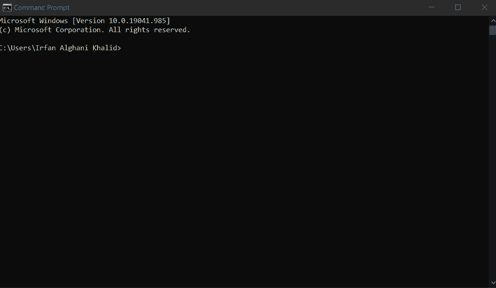
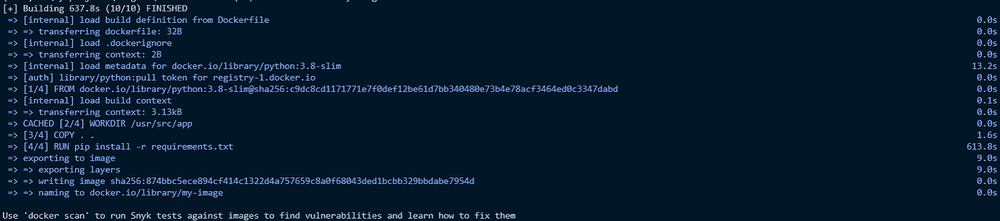
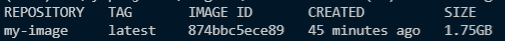
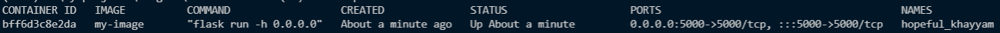
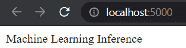
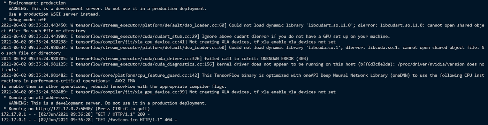
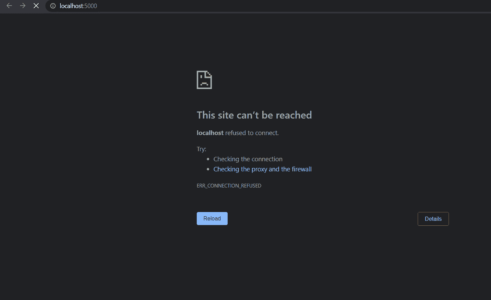

# 用 Docker 容器化你的应用程序

> 原文：<https://towardsdatascience.com/containerize-your-application-with-docker-b0608557441f?source=collection_archive---------6----------------------->

## 在虚拟化操作系统上运行您的应用。


托德·克雷文在 [Unsplash](https://unsplash.com/s/photos/whale?utm_source=unsplash&utm_medium=referral&utm_content=creditCopyText) 上的照片

# 动机

假设您想将一个应用程序部署到服务器上。在您的本地系统中，应用程序运行良好，没有任何问题。但是一旦你将应用程序部署到服务器上，嘣！你的应用程序不工作。

许多因素都会导致这种情况。这可能是操作系统兼容性或不同的库版本。因此，您的应用程序永远不会被部署，您会因此而感到头疼。

怎么才能去除仅仅因为不兼容问题而头疼的问题？码头工人来救你了！

本文将向您展示如何使用 Docker 来封装您的应用程序，以便您可以在任何服务器上运行它们，而不管它们内部的操作系统是什么。没有进一步，让我们开始吧！

# Docker 是什么？

在我们进入实现之前，让我向您解释一下 Docker。Docker 是一个部署应用程序的平台。它的工作原理是将应用程序隔离到一个映像中。该映像将由一个容器运行，其中包含操作系统和支持软件。

由于这种隔离，我们不必担心软件安装及其版本。您可以通过容器运行应用程序，而不管计算机中的操作系统和软件如何。因此，您可以专注于开发您的应用程序并直接部署它们。

# 履行

在你理解了 Docker 的概念之后，现在让我们进入实现。我们将执行几个步骤:

1.  安装 Docker
2.  创建名为 Dockerfile 的文件
3.  建立形象
4.  运行图像

## 安装 Docker

我们可以做的第一步是安装 docker 应用程序。你可以在这里下载 Docker[T5并确保根据你的操作系统选择正确的。](https://docs.docker.com/get-docker/)

安装 Docker 后，现在让我们测试 Docker 是否已经安装在您的计算机上。您可以运行命令“docker ”,如下图所示:



如果你的电脑显示如上提示，我们可以向你保证 Docker 已经安装在你的电脑上。现在让我们进入下一步。

## 创建 Dockerfile 文件

安装 Docker 后，下一步是创建一个名为 Dockerfile 的文件。Dockerfile 是一个用于构建 docker 映像的脚本。它包含了从安装库到运行我们的项目的设置映像的指令。

在本例中，我创建了一个基于 Flask 库的 API。这个 API 将被用作用户和机器学习模型之间的连接器，以返回预测结果。下面是 API 的代码:

要创建 docker 文件，请确保该文件与您的应用程序和机器学习模型文件夹位于同一位置。在我的例子中，文件夹位置如下所示:

```
**|   app.py
|   Dockerfile
|   requirements.txt
|
+---resnet50_food_model
|   |   saved_model.pb
|   |
|   +---assets
|   +---variables
|           variables.data-00000-of-00001
|           variables.index**
```

在该文件夹中，我们有用于运行我的应用程序的 [app.py](http://app.py) ，包含我们将使用的包列表的 requirements.txt，包含预训练模型的模型文件夹，以及用于构建 docker 映像的 docker 文件。

请记住，在创建 docker 文件时，请确保不要在文件名后添加任何扩展名。您只能写“Dockerfile”。

现在让我们编写 Dockerfile 脚本。以下是 Dockerfile 文件中的脚本:

让我解释一下脚本的每一行:

“FROM”指令将从 docker 注册表中获取 docker 映像。该映像将包含操作系统和 Python。

“WORKDIR”指令将设置我们将用来运行应用程序的默认工作目录。

“复制”指令会将当前目录中的每个文件复制到新的工作目录中。

“运行”指令将运行一个命令。在这种情况下，是“pip install”命令。

“EXPOSE”指令会将端口 5000 作为连接器暴露给 docker 映像。

最后，“CMD”指令将运行一个命令。在这种情况下，“烧瓶运行”命令。

> 旁注:
> ‘CMD’指令和‘RUN’指令有相同的功能，但是它们的用途不同。
> 
> “CMD”指令用于在开始运行 docker 映像时运行命令。
> 
> 同时,“RUN”指令用于在构建 docker 映像时运行命令。

## 建立 docker 形象

创建 docker 映像后，下一步是构建映像。要建立形象，真的很简单。你需要做的就是像这样运行“docker build”命令:

```
**docker build -t my-image .**
```

正如你在上面看到的，我在“docker build”命令旁边加上了“-t”标记。'-t '标记有两个参数。它们是图像名称和点字符，代表文件夹中的所有文件。

这是我们在构建 docker 映像时的预览(这将需要很长时间，所以请耐心等待) :



让我们运行“docker images”命令来显示已经构建的现有图像。以下是结果预览:



## 运行 docker 映像

从上面可以看到，图像已经存在。现在下一步是在我们的计算机上运行 docker 映像。要运行映像，您可以像这样使用命令“docker run ”,

```
**docker run -dp 5000:5000 my-image**
```

让我们等一会儿，等 3 到 5 分钟。要知道我们的映像是否已经在运行，我们可以使用' docker ps -a '命令来检查所有正在运行的映像。以下是预览:



正如你从上面看到的，图像已经上升了大约一分钟。这意味着映像已经在端口 5000 上运行。现在让我们使用 [localhost:5000](http://localhost:5000/) 或 127.0.0.1:5000 来访问映像。以下是预览:



正如您从上面看到的，我们的容器已经在我们的计算机上成功运行了。因为设置了'-d '参数，所以不能显示容器的日志。

要检查容器上的活动，可以使用“docker 日志”来完成。另外，请在旁边设置容器 id。您可以从“docker ps -a”命令中看到容器 id。该命令如下所示:

```
**docker logs bff6d3c8e2da**
```

下面是日志预览的样子:



如果你想停止容器，你可以使用' docker kill '命令，并在旁边设置容器 id。以下是停止 docker 命令的命令:

```
**docker kill bff6d3c8e2da**
```

停止容器后，它看起来像这样，



是的，我们的集装箱已经终止了。

# 结束语

干得好！您已经学习了如何将您的应用程序容器化为 docker 映像。我希望这篇文章能帮助你在你的项目中建立自己的 docker 形象。

如果你对这篇文章感兴趣，你可以关注我在**媒体**上的文章。如果你有任何问题或者想和我打招呼，你可以在 [**LinkedIn**](https://www.linkedin.com/in/alghaniirfan/) 上和我联系。

谢谢你看我的文章！

## 参考

[1][https://docs.docker.com/](https://docs.docker.com/)
【2】[https://nickjanetakis . com/blog/docker-tip-7-the-difference-between-run-and-cmd](https://nickjanetakis.com/blog/docker-tip-7-the-difference-between-run-and-cmd)