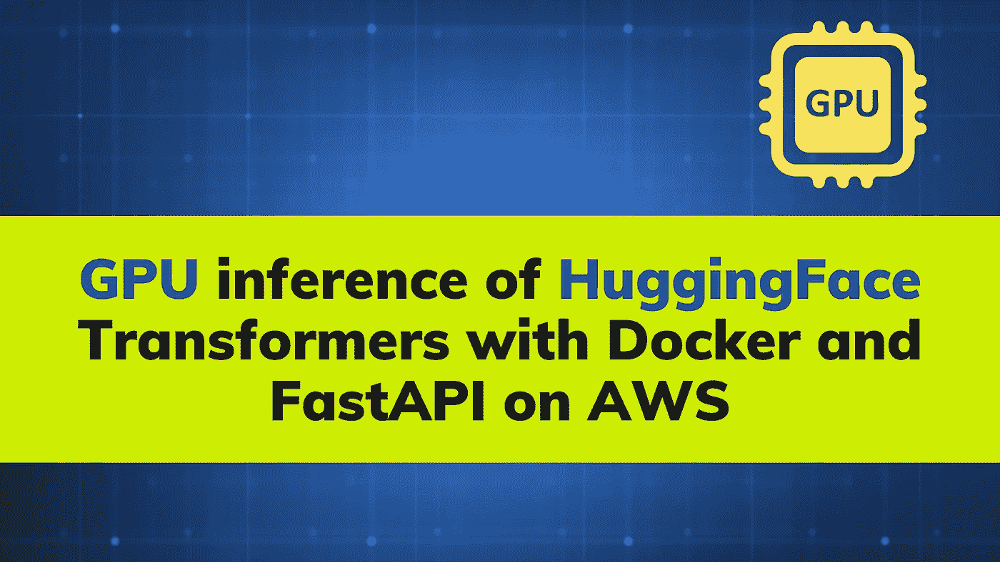
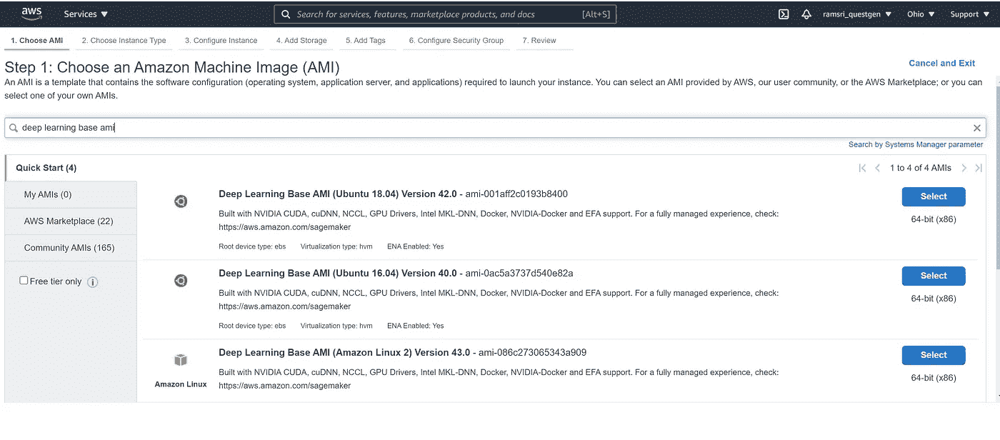
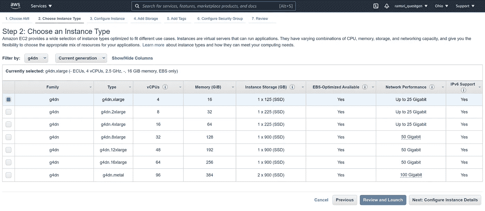
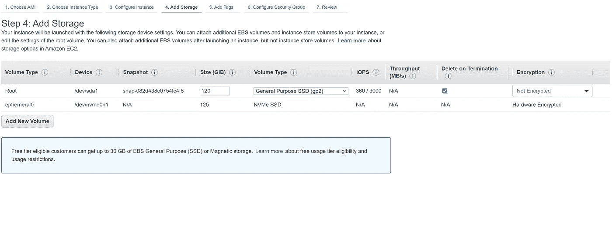
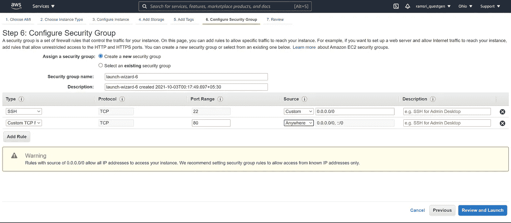
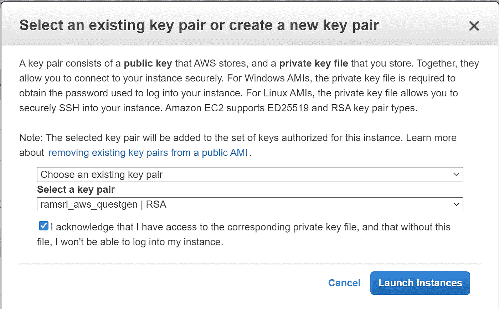
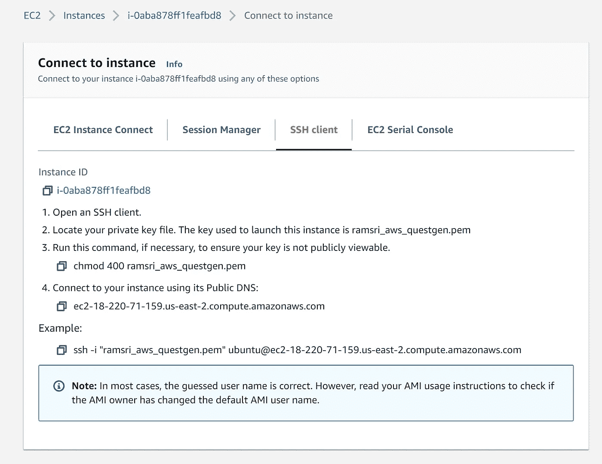
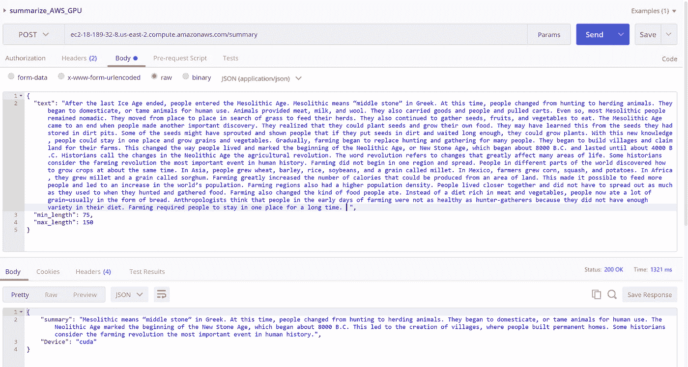

# 通过 AWS 上的 Docker 和 FastAPI 实现 GPU 推理的容器化 Huggingface 转换器

> 原文：<https://towardsdatascience.com/containerizing-huggingface-transformers-for-gpu-inference-with-docker-and-fastapi-on-aws-d4a83edede2f?source=collection_archive---------18----------------------->

## 为 GPU 上的总结任务创建 docker 容器



图片由作者使用来自 Canva.com 的免费图片

在 docker 容器中使用 **GPU 并不简单。容器和主机上的 **CUDA 和 CuDNN 驱动程序**之间不应该有任何不匹配，以实现无缝通信。**

理想的方法是在您的 docker 中使用**NVIDIA container toolkit image**，它支持自动识别您的基本机器上的 GPU 驱动程序，并在 Docker 容器运行时将这些相同的驱动程序传递到您的 Docker 容器。在 roboflow 团队的这篇[精彩文章中，你可以读到更多关于在 GPU 中使用 **Docker 的内容。**](/how-to-properly-use-the-gpu-within-a-docker-container-4c699c78c6d1)

在本文中，我们将看到如何使用 Docker 和 FastAPI 将来自 HuggingFace transformers 的**摘要算法**封装成用于 **GPU 推理**的容器，并将其部署在一台 AWS EC2 机器上。如果您想要更多的可伸缩性，您可以使用相同的 docker 容器来部署容器编排服务，如 AWS 提供的 **ECS** 。

## Youtube 视频

如果你想看视频，这里有-

[https://www.youtube.com/watch?v=I3kkQVNuXyc](https://www.youtube.com/watch?v=I3kkQVNuXyc)

# 汇总代码

首先，我们将使用 HuggingFace transformers 为摘要器编写代码。你可以看看这个 [**Colab 笔记本**](https://colab.research.google.com/drive/1I60y-8Hu_8gw6B80zovGJfvV-LgVD6G8?usp=sharing) 自己运行一下看看总结。

总结的基本代码如下所示:

上述代码的输出是我们传递给它的文本的摘要-

```
**Elon Musk has shown again he can influence the digital currency market with just his tweets. The SpaceX CEO has in recent months often tweeted in support of Dogecoin, but rarely for Bitcoin. In a recent tweet, Musk put out a statement from Tesla that it was concerned about the rapidly increasing use of fossil fuels. A day later he again tweeted saying, To be clear, I strongly believe in crypto but it can't drive a massive increase in fossil fuel use, especially coal. Following the two distinct statements from him, the world's largest cryptocurrency hit a two-month low.**
```

现在，我们将看到在 AWS EC2 机器上将它作为 API 进行封装和部署的步骤。

# 集装箱化代码

在这个 [**Github repo**](https://github.com/ramsrigouthamg/ramsrigouthamg-GPU_Docker_Deployment_HuggingFace_Summarization) 中提供了为上述摘要算法创建 GPU docker 容器所需的所有代码。

# 启动 AWS EC2 GPU 机器来服务 API

我们将从基础 AMI 映像(深度学习基础 AMI (Ubuntu 18.04)版本 42.0)启动一台 EC2 GPU 机器(g4dn.xlarge)，创建 docker 映像，并运行该映像以在同一台机器上提供用于摘要的 API。

**步骤 1:** 登录 AWS 控制台，进入 EC2 仪表板。

**步骤 2:** 进入仪表板后，点击右上角的**“启动实例”**。

**第三步:**现在我们被要求选择一个 AMI。在搜索栏输入**“深度学习基础 AMI”**。我们没有自己安装 CUDA、CuDNN 和 Docker(这很难),而是选择亚马逊机器映像(AMI ),它已经为我们预装了所有东西。

从返回的选项中选择**“深度学习基础 AMI (Ubuntu 18.04)版本 42.0”**。您可以相应地选择任何更新的映像，与我们 docker 文件中提到的基础映像中使用的 CUDA 和 CuDNN 库版本相匹配。



来自作者 AWS 帐户的快照

**步骤 4:** 在下一个屏幕中选择实例类型。选择**“g4dn”**并从选项中选择 g4dn.xlarge 并继续。请注意，如果您以前没有使用过此 GPU，您需要在 AWS 中提出限额增加请求，以将此 GPU 分配到您的帐户所在区域。

为什么是 G4 实例类型？这是可用的 AWS 实例中最具成本效益的选项。点击阅读更多关于在 AWS 上选择合适 GPU 的信息[。](/choosing-the-right-gpu-for-deep-learning-on-aws-d69c157d8c86)

然后单击“配置实例详细信息”



来自作者 AWS 帐户的快照

**第 5 步:**保留所有默认设置，然后单击“添加存储”。在“添加存储”部分，记住将根卷大小更改为 120 (GiB)等。我们需要这样做，因为我们的 docker 图像和其他必要的配置需要大量的空间。



来自作者 AWS 帐户的快照

**第 6 步:**接下来点击“添加标签”。这里没什么可改变的。
接下来点击“配置安全组”并点击“添加规则”来添加端口 **80** 的自定义 TCP，其来源可以来自任何地方。这将使我们能够在默认端口 80 上托管 API，并从任何地方访问 API。



来自作者 AWS 帐户的快照

**第 7 步:**接下来点击“审核并启动”，点击“启动”。创建“新的密钥对”或使用现有的密钥对。这用于 SSH，如果您在 Windows 上或从命令行，可以通过 Putty 等工具连接到 EC2 机器。



来自作者 AWS 帐户的快照

步骤 8: 一旦 EC2 机器准备就绪，您就可以通过任何 SSH 客户端连接到它。



来自作者 AWS 帐户的快照

**步骤 9:** 一旦你通过 SSH 进入 EC2 机器，运行“git clone[https://github . com/ramsrigouthamg/GPU _ Docker _ Deployment _ HuggingFace _ summary . git](https://github.com/ramsrigouthamg/GPU_Docker_Deployment_HuggingFace_Summarization.git)”来克隆包含 Docker 文件的存储库，以将来自 hugging face 的摘要算法容器化。

**第十步:** CD 到“GPU _ Docker _ Deployment _ hugging face _ summary”文件夹，依次运行以下命令。

```
**pip3 install transformers==4.6.1
pip3 install torch==1.9.0
python3 download_HF_Question_Generation_summarization.py**
```

我们从 HuggingFace 本地下载摘要模型，并将其打包在 docker 容器中，而不是每次下载时都将代码放在容器中。

**步骤 11:** 完成上一步后，使用以下命令构建 docker 映像

```
**docker build -t summarization .**
```

建立映像需要一些时间，所以请耐心等待。

**第 12 步:**一旦构建了映像，使用以下命令运行容器—

```
**docker run -p 80:80 --gpus all summarization**
```

一旦一切准备就绪，只需在浏览器中访问 EC2 机器的基本 URL，您应该会看到一条“hello world”消息。

ec2–18–189–32–8.us-east-2.compute.amazonaws.com

接下来，通过像 [Postman](https://www.postman.com/) 这样的工具测试摘要 API。您可以传入任何文本，并获得它的摘要版本。记住传递**文本**以及**最小 _ 长度**和**最大 _ 长度**参数。



作者快照

如果您想无限期地运行 API，请使用控制台应用程序，如 [Screen](https://linuxize.com/post/how-to-use-linux-screen/) ，这样即使您关闭连接，API 也会继续运行。

# 创建 GPU Docker 的代码

将我们在开头展示的 Colab 笔记本转换成由 FastAPI 托管的 API 的主要代码如下所示

用于从基础 Nvidia 映像创建 GPU docker 的 docker 文件如下所示

```
**FROM nvidia/cuda:11.0-cudnn8-runtime-ubuntu18.04****#set up environment
RUN apt-get update && apt-get install --no-install-recommends --no-install-suggests -y curl
RUN apt-get install unzip
RUN apt-get -y install python3
RUN apt-get -y install python3-pip****# Copy our application code
WORKDIR /var/app****# . Here means current directory.
COPY . .****RUN pip3 install --no-cache-dir -r requirements.txt****ENV LC_ALL=C.UTF-8
ENV LANG=C.UTF-8****EXPOSE 80****# Start the app
CMD ["gunicorn", "-b", "0.0.0.0:80","app:app","--workers","1","-k","uvicorn.workers.UvicornWorker"]**
```

这是 requirements.txt 文件

```
**pydantic==1.8.2
uvicorn==0.14.0
gunicorn==20.0.4
fastapi==0.67.0
torch==1.9.0
sentencepiece==0.1.82
transformers==4.6.1**
```

**点记:**

如果您想要确定，请确保您创建的 docker 映像(NVIDIA container toolkit 基本映像)中的驱动程序(CUDA 和 CuDNN 版本)与运行容器映像的主机中的 GPU 驱动程序匹配(或兼容)。在 AWS 中，您可以选择一台主机作为 AMI，它与您用来创建 docker 映像的 NVIDIA container toolkit 映像兼容(请记住在您的 docker 文件中使用 NVIDIA/cuda:11.0-cud nn8-runtime-Ubuntu 18.04)。

您可以使用 GPU 兼容的 Amazon 机器映像(AMI)作为主机映像，在 ECS 等容器编排服务上可伸缩地部署 API

祝 NLP 探索愉快，如果你喜欢它的内容，请随时在 Twitter 上找到我。

如果你想学习使用变形金刚的现代自然语言处理，看看我的课程[使用自然语言处理的问题生成](https://www.udemy.com/course/question-generation-using-natural-language-processing/?referralCode=C8EA86A28F5398CBF763)