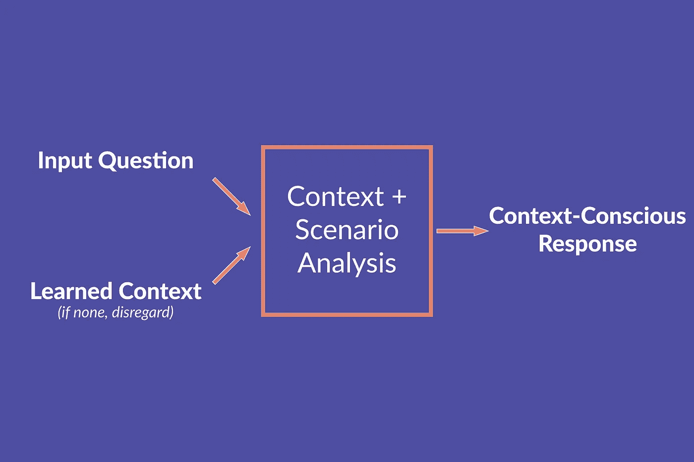

# 背景很重要:为什么人工智能(仍然)不擅长做决定

> 原文：<https://towardsdatascience.com/context-matters-why-ai-is-still-bad-at-making-decisions-975f2f797da7?source=collection_archive---------20----------------------->

## 意见

## 人工智能还不够聪明，不符合道德规范(尽管它足够聪明，可以收集你的大量数据)，但这里有一个想法可能会让它朝着正确的方向发展。

# 这里有一个假设。

一个男人和一个女人住在一起。

那人每次说话都不耐烦，在你没听懂他的问题时大声咒骂你。他粗暴得近乎生气，只在深夜和你说话，只问关于夜总会和酒吧的事。

这位女士每次说话，要么流着泪，要么声音单调。她的问题更多地与家务相关——食谱、购物提醒、财务问题。她整天和你聊天，经常问心理健康问题。她过去的搜索查询甚至包括有关家庭暴力求助热线的信息。

一天早上，凌晨 3:00，在那个人向你问路去最近的酒吧 5 个小时后，他问你最近的枪支商店在哪里。

想象你是这些人的朋友。你会怎么说？

现在想象一下，男人和女人不是在和你说话，而是在和一个支持亚马逊 Alexa 的设备说话。你认为 Alexa 会说什么？

很有可能，你的两个答案截然不同——因为人工智能仍然没有足够的智能在这些类型的情况下做出合乎道德的行为。

# 伦理人工智能是难以想象的。

人工智能中的伦理如此困难的众多原因之一是，没有人能够就什么是普遍伦理或道德达成一致。(目前)我们能做的最好的事情是基于边缘案例或思想实验定义一个*设计框架*，就像上面展示的那样。我想说的是，Alexa *知道*正在发生什么——有大量信息表明这个男人对女人来说是一个危险——但人工智能世界对 Alexa 应该做什么没有达成共识。粗略搜索一下伦理框架，你可能会找到一些术语，比如*价值伦理*(良好的品格定义了你的行为)*道义论*(你的职责定义了你的行为)，或者*结果主义*(结果证明了你的行为)，但在我看来，理想的设计要简单得多。*语境意识*。

“亚历克斯——嗯？”阿比纳夫·拉古纳坦。

# 有上下文意识的人工智能更好。

在任何真实的人类对话中，语境就是一切。背景是你不在葬礼上讲笑话或在生日聚会上谈论死亡的原因。为什么技术不能利用环境的力量做出更明智、更道德的决定呢？

在上面的场景中，Alexa 知道的事情(语音语调、音调、搜索历史等。)都是亚马逊收集或者已经可以收集的数据片段。他们利用这些信息来判断你是谁，以便更智能地推动他们的电子商务和广告。除此之外，他们还可以推动这种情境优先的方法做出道德决策。当人工智能能够收集数据，筛选可能的场景，并潜在地防止负面后果(无论这可能需要什么)时，会有更大的力量。

自然，这说起来容易做起来难。我列出的场景没有完美的答案，但是不考虑上下文就回答这个人的问题本身就是一个错误。也许 Alexa 提供了答案，但也通知警方作为预防措施。也许 Alexa 拒绝回答。当然，这个人可以稍后再用谷歌搜索，但是迫在眉睫的暴力不应该被激活或者让 T2 变得更容易。

我的观点很简单:

> 人工智能永远不应该在存在可访问的上下文信息时盲目行动。

这甚至适用于像机器学习这样的人工智能子集。数据集中总是有上下文的，无视这种上下文的算法根本不能被认为是可用的。这种情况可能包括数据偏差，如种族/性别代表性不足，或与犯罪记录或教育背景等有缺陷的来源有关。

我说这种方法绝对更好，因为如果从上下文中似乎没有任何可辨别、可学习的特征，它可以被忽略，AI 可以像正常情况下一样继续进行。如果 Alexa 确信给定的问题与上下文没有相关性或联系，它可以安全地回答该问题。

Abhinav Raghunathan 的《语境盲》。

# 背景是价值驱动因素。

上下文优先的人工智能为价值主张增加了额外的维度。就个人而言，如果我知道我的 Alexa 会在特定的情况和背景下做出合乎道德的故意反应，我可能会更愿意自愿提供我的数据。如果我看到它在工作，我甚至会更信任亚马逊的数据(即使他们仍然在后台执行他们不太值得信任的做法)。

如果你是一家数据公司，你的算法在提取见解之前考虑了数据集中的种族或性别背景，那就是增值。

如果你是一家机器人公司，你的机器人在行动之前会考虑社会背景，这就是一种增值。

如果你是一家支持语音的人工智能公司，并且你的产品在谈论枪支或毒品之前考虑到了你家里有小孩的事实，那就是增值。

# 具有上下文意识的人工智能很可怕，但却是必要的。

不可否认，让人工智能更多地了解你可能看起来令人毛骨悚然。也许是因为我的建议是，人工智能在判断情况和做出反应的能力上更像人类。不幸的是，我们在日常生活中越来越依赖技术*要求*这项技术的行为符合道德规范，不会危及或负面影响我们。我们也有一种“与机器建立友谊甚至亲密关系”的心理倾向[1]。如果这还不可怕，那就没什么可怕的了。这正是为什么我们需要更聪明、更有道德的人工智能。

从法律责任的角度来看，公司可能会担心。如果像谷歌、苹果和亚马逊这样的公司还没有通过 [*不断监听*](https://www.nytimes.com/wirecutter/blog/amazons-alexa-never-stops-listening-to-you/) 你的每一次谈话来让自己成为见证人的话，这就说得通了。上下文意识的目的是以更聪明的方式使用这个“特性”。他们已经在收集所有这些数据，为什么不明智地使用这些数据呢？

它的美妙之处在于它是一份保险:大多数时候，没有特别麻烦的上下文。然而，如果环境需要，人工智能应该准备好做出相应的响应。

Abhinav Raghunathan 的“环境意识框架”。

# 我们需要实现上下文相关的框架。

在一个日益互联的世界里，功能性已经不够了。仅仅能够回答“最近的枪支商店在哪里”这个问题是不够的背景很重要。道德很重要。

环境意识就是认识到所有的技术都积极地影响着人们的生活方式——而这些人不会生活在泡沫中。因为人工智能已经发展出了超越功能的力量，所以设计和工程团队有责任构建理解和尊重环境的人工智能。无论是数据集中的隐藏背景还是机器人的社会背景。

我们需要让技术做它最擅长的事情并改变生活，但要为它提供环境意识，以确保它以积极的方式这样做。

# 参考

[1] C. Bartneck 等人，*机器人学与人工智能中的伦理学导论，*伦理学中的 SpringerBriefs，[https://doi.org/10.1007/978-3-030-51110-4_7](https://doi.org/10.1007/978-3-030-51110-4_7)。

[2]原帖可以在这里找到[。](https://abhiraghunathan.com)