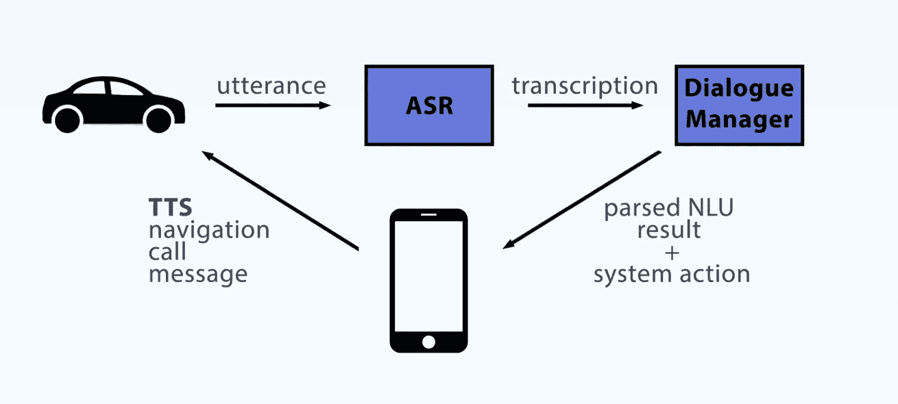
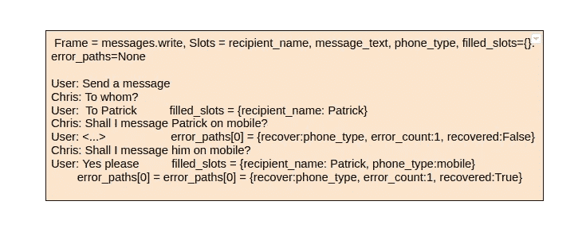

# 语境理论 II:语义框架

> 原文：<https://towardsdatascience.com/context-theory-ii-semantic-frames-f96693480779?source=collection_archive---------35----------------------->

## 对话管理的语义框架

在语境理论系列的前几篇文章中，[首先](/context-theory-i-conversation-structure-98713ad42175)我们发现了一些与语境相关的语言学概念。[接下来](/context-theory-i-introduction-9d121194bd48)，我们一头扎进对话结构；是什么让谈话变得有意义和连贯。在本文中，我们将关注一种结构化的对话管理方式，称为语义框架。顾名思义，语义框架是对话的**单元**，它们捕捉所有必要的信息来解析上下文。语义框架概念捕获了槽填充、共指解决、上下文相关的意图分类、解决错误路径以及分类/控制域切换的概念。

语义框架的诞生是为了给对话管理带来结构。我们先快速了解一下我们的 Chris，了解一下语义框架概念。

# 我们的克里斯

我们的克里斯是司机助理，由[德国 Autolabs](https://germanautolabs.medium.com/) 打造。

用户在开车时与克里斯在车里交谈，因此话语通常简洁而中肯。以下是克里斯话语的一些例子:

```
Hey Chris, navigate
Play music 
Send a message
Start the navigation
Make a call
```

结果，诸如导航目的地、消息的接收者姓名、要呼叫的联系人或要播放的艺术家的一些信息通常不在单个话语中提供。Chris 会跟进以填补所需的空缺。这是一个非常典型的对话片段:

```
User: Hey Chris make a call
Chris: OK, who do you want to call?
User: Alicia
Chris: Do you mean Alicia A?
User: Yes
Chris: Shall I call Alicia A on her mobile?
User: No, home
Chris: OK, I'm calling Alicia A on her home number.
```

虽然不太常见，但包含所有填充位置的话语也来自客户。我们称之为“一次性”话语。下面是上面的对话片段撞成的一句话:

```
Call Alicia on her home number
```

在语音助手中，通常有两种方式来设计和训练对话式 NLU；第一种方式是**端到端对话管理**，它输入话语并产生动作/响应。没有诸如 ASR(语音识别)输出或意图概率的中间步骤。这些系统很好，不需要单独处理 ASR 和 NLU 组件培训。此外，您不需要处理来自 ASR 组件的不良/噪声输出，不需要在 NLU 步骤中模拟噪声或无意义的 ASR 转录。

**第二种方法**显然是分别进行语音识别和 NLU。然后，人们可以明确地检查 ASR 转录，还可以看到每个步骤的输出，如意图分类和实体提取。克里斯会话 NLU 属于这一类。以下是对克里斯对话式 NLU 设计的高度描述:



克里斯对话 NLU 设计

每个话语首先访问语音引擎，然后变成文本。接下来，话语文本被提供给对话管理器进行识别和解析。然后触发一个响应和可能的系统动作，例如，在上面的对话片段中，当用户说出“不，家”时，Chris 用“好的，我正在用 Alicia A 家的号码呼叫她。”然后开始和艾丽西娅打电话。

正如我们所说，克里斯首先转录的演讲。车内环境非常嘈杂，因此处理噪音和可能的误解对克里斯 NLU 来说是一个挑战。语义框架就是这样诞生的。

# 上下文建模

典型的 Chris 对话以用户请求开始，然后是填充空位的话语。下面是一个对话示例:

```
User: Send a message
Chris: Who do you want to message?
User: Patrick
Chris: What do you want to say?
User: Hello Patrick, I'm on my way.
```

看看这个一次性的话语:

```
Send a message to Patrick saying hello
```

虽然，第一个对话片段实际上是 5 个话语的对话，而第二个句子只有一个话语，但语义上它们是等价的。最后，您知道收件人姓名和邮件正文；所以这两个语义框架是等价的。

没有适当的对话管理，生活有时会很困难。想想那些简短的话语，它们是后续；一般来说，它们没有任何意图，只是对前一个问题的回答。在传统系统中，每一个话语都必须被贴上意图标签。让我们考虑下面的例子，意图写在括号中的话语旁边:

```
User: Send a message [messages.write]
Chris: To who?
User: Patrick        [calls.dial]
Chris: Do you mean Patrick?
User: yes            [universals.accept]
```

这是来自传统系统的标记，其中联系人姓名的单个实体映射到呼叫意图(单个联系人姓名最有可能映射到呼叫或消息意图)。在这一点上，NLU 设计器只是放弃了意图，因为它是一个响应话语，并试图解析一个人名实体来填充收件人姓名槽。这就把我们带回了第一点，的确，“帕特里克”的话语根本不带有意图，这种处理方式看起来令人困惑和丑陋，尽管这个系统以某种方式工作。

如果出现不愉快的情况，比如 ASR 错误发生或者用户没有填写插槽，会怎么样？让我们看下面的例子:

```
User: Send a message [messages.write]
Chris: To who?
User: Britney        [music.play]## oopsi do, now what ask the recipient name or play Britney Spears??
```

下面是上面发生的事情:

*   用户想要发送消息
*   克里斯接着问了收件人的名字
*   此时麻烦开始了。用户说出“Brittany”或“Betty ”,但是 ASR 进行了错误的转录，并将话语转录为“Britney ”,这在用户的本地音乐中出现为“Britney Spears”。单个艺术家姓名映射到“music.play”话语。
*   那怎么办呢？再次询问收件人姓名或跟随音乐。播放意图？

在设计一个语音机器人的时候，我们总是牢记会出现 ASR 错误。语音是一个物理量，在对物理世界建模时，我们始终需要记住一些事情可能(并将)变得不理想。

另一种上下文失败发生在噪音上。假设您有一个噪声(无法识别的语音)的占位符文本和相应的意图。在下面的片段中，噪音话语引起了许多“请你重复一遍好吗”来烦扰用户:

```
User: Make a call  [calls.dial]
Chris: Ok, who?
User: <...>        [universals.noise]
Chris: Could you repeat that?
User: <...>        [universals.noise]
Chris: Could you repeat that?
User: <...>        [universals.noise]
```

这里，用户未能在给定的时间框架内说出响应，或者车内噪音太大。无论如何，语音助理设计师应该在一些尝试之后结束当前的框架。此外，在这里说“你能重复一遍吗？”是没有意义的，后续应该宁愿是:“你要打电话给谁？”；当前上下文是关于填充联系人姓名槽。

# 什么是语义框架？

语义帧是对话片段中所有语义成分的**总和，包括帧起始意图、与帧起始意图相关联的槽、到目前为止由用户填充的槽、使用的共同参照以及错误路径的当前展望。一个示例帧是:**



一个示例语义框架从意图消息开始

因此，语义框架为克里斯对话带来了以下**语境单位**:

*   领域
*   帧起始意图
*   上下文相关意图
*   时间
*   实体
*   共同参照
*   槽填充
*   插槽校正
*   插槽确认
*   插槽误差
*   畴跳跃分布
*   行动
*   误差建模

语义框架为克里斯对话带来了结构，每个话语都承认一个**上下文角色**，如**帧开始**、**槽填充**、**槽错误**和**槽确认**。这段对话解释了话语角色:

```
User: send a message         frameStarter
Chris: Who do you want to send a message?
User: Patrick                slotFill
Chris: Do you want to text him on mobile?
User: ergghh arghhh          slotError
Chris: Excuse me?
User: yes, mobile            slotConfirm
```

让我们看看动作的语义框架:

# 保持流动

语义框架的首要目标是保持流动。再次考虑我们现在看到的第一个例子，一个单独的实体被标记了意图，尽管它是一个响应。现在，该话语具有良好定义的会话上下文角色作为空位填充者，因此我们用当前帧的意图来标记该话语:

```
User: Send a message [messages.write]
Chris: To who?
User: Patrick        [messages.write]  slot-filler
Chris: Do you mean Patrick?
User: yes            [universals.accept]
```

布兰妮的第二个例子看起来也不同了。在这个例子中，发生了 ASR 转录错误，ASR 不理解联系人姓名和艺术家姓名，而是返回 Britney。传统系统可能会跳入音乐播放意图并进行错误的域切换，然而语义框架如下识别这种上下文:

```
User: Send a message [messages.write]
Chris: To who?
User: Britney        [messages.write]  slot-error
Chris: I didn't understand the recipient name, can you say again?
```

在这里，话语“布兰妮”是一个单一的实体，因此看起来像一个反应和一个真正的补缺；然而它的类型是艺术家，而不是联系人。我们在这里所做的是，我们将这个话语标记为时隙错误，并保留当前帧，即 messages.write。

有了双向标记——帧意图和上下文角色，NLU 的行为对于阅读对话日志的开发人员来说就一目了然了。我们还将当前话语的上下文角色(slot-filler)提供给上下文编码器(上下文编码器的细节将在另一篇文章中介绍)。它基本上是一个 LSTM 编码来自用户话语的当前上下文。

# 域开关

是保留当前框架还是删除当前框架并开始新的框架有时是一个复杂的交易。在会话的每一个话语中，下一个话语的语境角色分布都是不平凡的，总是有域跳转的可能性。尽管如此，从统计上来说，一些帧之间的一些跳跃更有可能发生，例如调用消息和消息调用。举例来说,《呼唤音乐》不太可能出现在上述布兰妮对话中。我们的上下文编码器在当前语义框架的帮助下生成域跳转概率。让我们看一些例子:

```
User: Send a message to Patrick                         frameStarter
Chris: Do you want to text Patrick on his mobile number?
User: Call him instead                                  frameStarter
Chris: Do you want to call Patrick on mobile?
User: Yes, pleaseUser: Call Patrick                                      frameStarter
Chris: Do you want to call Patrick on his mobile number?
User: No send a message                                 frameStarter
Chris: Do you want to message Patrick on mobile?
User: Yes, please
```

这里，在这两个例子中，第三个话语显然是一个框架开始。在第二话语之后，上下文编码器输出第一对话中第三话语的上下文角色分布(按可能到不太可能排序)，如下:

```
affirmative/negative answer
slot-confirmation(phone_type)
slot-correction     
cancel the message sending
domain jump, calldomain jump, navigation.start
domain jump, music.play
.
.
.
```

第三个话语看起来很可能是 calls.dial，因此此时上下文编码器判定这是域跳转。这个例子怎么样:

```
User: Call Patrick
Chris: Do you want to call Patrick on his mobile number?
User: Play Moby                   ASR confidence: low
```

在这个对话片段中，第三个话语很可能是一个 ASR 错误。根据上面的上下文角色分布，这里的音乐播放意图是非常不可能的，并且话语置信度低。因此，上下文编码器将该话语标记为 ASR 错误。

# 错误校正

错误恢复是对话系统的重要组成部分。语义框架允许灵活和准确的错误跟踪。考虑下面的例子:

```
User: Make a call                    calls.dial
Chris: Who should I call?
User: <...>                          noise,slot-error
Chris: Who should I call?
User: <...>                          noise, slot-error
Chris: Who is it?           
User: <...>                          too much errors in a row
Chris: I aborted the call
```

# 上下文相关意图

人类的语言是复杂的，同样的话语在不同的语境中可以表达完全不同的意思。让我们看一些例子:

```
User: Call Patrick                          calls.dial
Chris: Do you want me to call him on **mobile**?
User: **Mobile                                 universals.accept**
```

在这里，用户通过确认 Chris 询问的槽值给出了肯定的答案。这不是一个槽填充或槽确认，这是一个肯定的回答。

这个例子怎么样:

```
User: **Anrufen**  (make a call)    **calls.dial**
Chris: Wen willst du anrufen?  (Who do you wanna call?)
User: Patrick
Chris: Meinst du Patrick?
User: **Anrufen **                 **universals.accept**
```

在这里，同一个字“安如芬”在第一行是框架启动符，在最后一行却是一个肯定的回答。这是一种**显式的共指**方式，“安如芬”是意向名“calls.dial”的同义词；因此指代画面中的动作，**指代整个画面**。

我知道这看起来很多(确实很多)，但是对话管理从来都不容易。接下来是什么？首先，我们将看到我在文章中提到的上下文编码器架构。接下来的文章将提供更多关于槽和上下文相关槽提取的内容。我很高兴在这个非常好的关于语境理论的系列中见到你，我希望你和我一样喜欢这个系列。保持关注和健康，直到下一次！