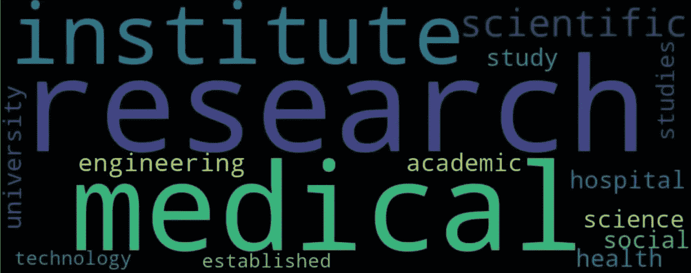
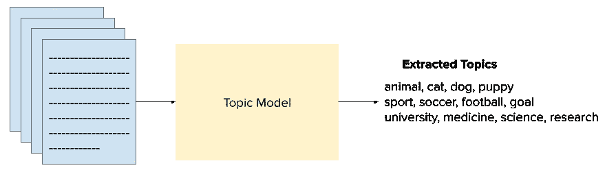
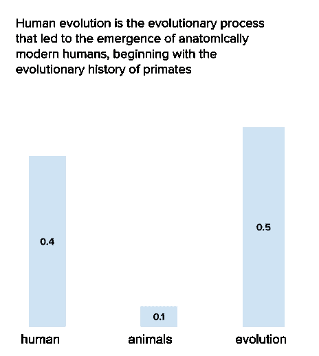
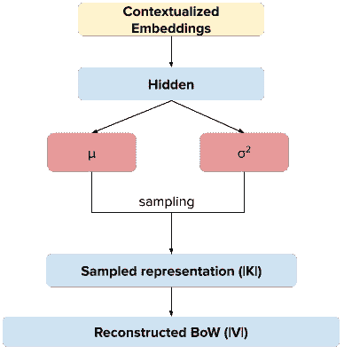
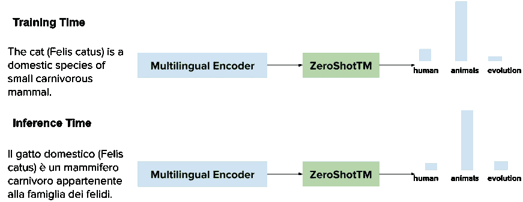
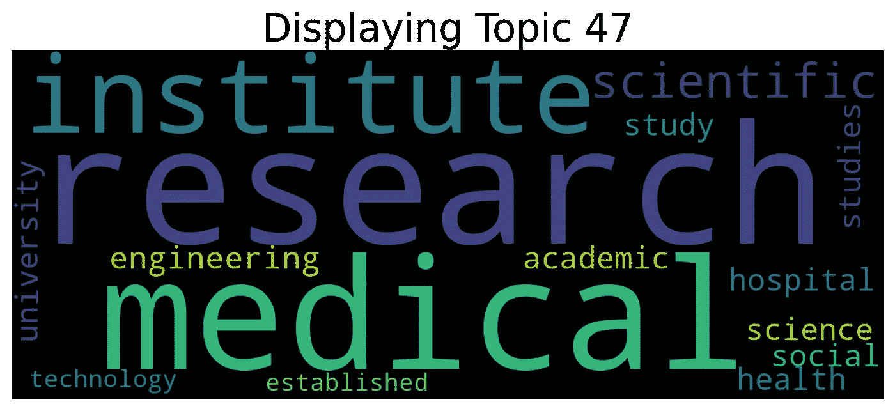

# 使用 Python 进行上下文化主题建模(EACL2021)

> 原文：<https://towardsdatascience.com/contextualized-topic-modeling-with-python-eacl2021-eacf6dfa576?source=collection_archive---------6----------------------->

## 将 BERT 和 friends 与神经变分主题模型相结合



图片作者。

在这篇博文中，我讨论了我们最新发表的关于主题建模的[论文](https://arxiv.org/pdf/2004.07737/):

比安奇、特拉尼、霍维、诺扎和弗西尼(2021)。零镜头学习的跨语言语境化主题模型。计算语言学协会(EACL)欧洲分会。https://arxiv.org/pdf/2004.07737

假设我们有一小组葡萄牙语文档，这些文档不够大，无法可靠地运行标准的主题建模算法。但是，我们在同一个域中有足够多的英文文档。使用我们的跨语言零触发主题模型( **ZeroShotTM** )，我们可以首先学习英语主题，然后预测葡萄牙语文档的主题(只要我们使用预先训练的表示法，既考虑英语又考虑葡萄牙语)。

我们还发布了一个 Python 包，可以用来运行主题建模！看看我们的 [github 页面](https://github.com/MilaNLProc/contextualized-topic-models)和我们的 [c *olab 教程*](https://colab.research.google.com/drive/13YhYgJN9EjSQw5bsZYzMaaiNKQpt_SQn?usp=sharing) *！*


我们的标志:)由[西尔维娅](https://silviatti.github.io/)用爱制成

# **热身:什么是话题建模？**

主题模型允许我们从文本中提取有意义的模式，使浏览文本数据更容易，并更好地理解隐藏在下面的主题的潜在分布。假设您想要获得手头一组文档的鸟瞰图；一个接一个地阅读它们不是一个好主意，对吗？

主题模型可以有所帮助:它们查看您的文档集合，并提取重复出现的主题。



图片作者。

## 一些细节

主题模型通常有两个主要假设。

首先，一个文档可以以不同的比例谈论不同的主题。例如，假设我们有三个主题，即“人类”、“进化”和“疾病”。一个文档可以讲一点人类，一点进化，剩下的讲动物。用概率的话来说，我们可以说它讲了 20%的人类，20%的进化，60%的动物。这可以很容易地用主题的多项式分布来表示。这种概率分布称为文档主题分布。



描述**人类进化**的文档如何分类到不同主题的例子。图片作者。

其次，主题建模中的主题不是无序的单词列表:在像“动物、猫、狗、小狗”这样的主题中，词汇表中的每个单词都有特定的权重。换句话说，主题也可以由多项式分布来表示，其中具有最高概率的词汇是对给定主题贡献最大的词汇。这种分布称为词-主题分布。

最著名的主题模型是 LDA (Blei et al .，2003)，它也假设文档中的单词是相互独立的，即被表示为单词包(BoW)。多年来已经提出了几个主题模型，解决了各种各样的问题和任务。最先进的主题模型包括基于变分自动编码器(VAE)的神经主题模型(金玛&韦林，2014)。

## 标准主题建模的两个问题

然而，这种模型通常必须处理两个限制:

1.  一旦经过训练，大多数主题模型就不能处理**未见过的单词**，这是因为它们是基于单词包(BoW)表示的，无法解释缺失的术语。
2.  如果不结合多种语言的词汇，很难将主题模型应用于**多语言语料库**(Minmo 等人，2009；Jagarlamudi 等人，2010)，使得该任务在计算上非常昂贵，并且不支持零射击学习。

我们如何解决这个问题？

# **情境化话题模式:邀请伯特和朋友们入席**

我们新的神经主题模型 **ZeroShotTM** ，解决了我们刚刚举例说明的两个问题。ZeroShotTM 是一个神经变分主题模型，它基于语言预训练的最新进展(例如，BERT 等上下文化单词嵌入模型)。

是的，你答对了！我们建议将基于深度学习的主题模型与最近的嵌入技术(如伯特或 XLM)相结合。



ZeroShotTM:我们的具有情境化嵌入的神经变分主题模型。图片作者。

文档的预训练表示被传递到神经架构，然后用于重建文档的原始弓形。一旦模型被训练，ZeroShotTM 可以生成测试文档的表示，从而预测它们的主题分布**，即使文档在训练期间包含看不见的单词**。

此外，如果我们在训练期间使用多语言预训练表示，我们可以在测试时获得显著优势。使用共享相同嵌入空间的表示允许模型学习不同语言文档共享的主题表示。然后，经过训练的模型可以在训练期间**预测看不见的语言文档的主题**。

我们扩展了基于变分自动编码器的神经主题模型 ProdLDA (Srivastava & Sutton，2017)。ProdLDA 将文档的 BoW 表示作为输入，并学习高斯分布的两个参数μ和σ。从这些参数中采样连续的潜在表示，然后通过 softplus，从而获得文档的文档主题分布。然后，使用这个主题-文档表示来重构原始文档 BOW 表示。

我们不是使用文档的 BoW 表示作为模型输入，而是将预先训练的文档表示传递给神经架构，然后使用它来重建文档的原始 BoW。一旦模型被训练，ZeroShotTM 可以生成测试文档的表示，从而预测它们的主题分布，即使文档在训练期间包含看不见的单词。



我们的 ZeroShotTM，由于多语言表示，可以有效地预测在训练期间没有见过的语言文档的主题。图片作者。

## TL；速度三角形定位法(dead reckoning)

ZeroShotTM 有两个主要优点:1)它可以处理测试集中缺失的单词，2)继承了最近预训练的多语言模型的多语言能力。

使用标准的主题模型，您经常需要从数据中删除那些在测试集中有但在训练集中没有的单词。在这种情况下，由于我们依赖于一个上下文化的模型，我们可以使用它来构建测试文档的文档表示，表达这些嵌入的全部功能。此外，标准的多语言主题建模需要考虑多语言词汇。

ZeroShotTM 可以在英语数据(这是一种数据丰富的语言)上进行训练，并在更低资源的数据上进行测试。例如，你可以在英文维基百科文档上训练它，并在完全看不见的葡萄牙语文档上测试它，正如我们在[论文](https://arxiv.org/abs/2004.07737)中所示。

# **情境化主题建模:一个 Python 包**

我们围绕这款车型打造了一整套[套件](https://github.com/MilaNLProc/contextualized-topic-models)。您可以运行主题模型并使用几行代码获得结果。在软件包主页上，我们有不同的 Colab 笔记本，可以帮助您运行实验。

你可以在这里或者直接在 [colab](https://colab.research.google.com/drive/13YhYgJN9EjSQw5bsZYzMaaiNKQpt_SQn?usp=sharing) 上看例子。

根据用例的不同，您可能想要使用特定的上下文化模型。在这种情况下，我们将使用[**distiluse-base-multilingual-cased**](https://github.com/UKPLab/sentence-transformers)**模型。**

**当使用主题模型时，执行文本预处理总是更好，但是当我们处理上下文化的模型时，如 BERT 或通用句子编码器，最好不要做太多预处理(因为这些模型是*上下文*并且大量使用*上下文*)。**

## **今天的任务**

**我们将在英语维基百科文档上训练一个主题模型，并预测意大利语文档的主题。**

**您需要做的第一件事是安装软件包，从命令行您可以运行:**

**确保为您的系统安装正确的 [PyTorch](https://pytorch.org/) 版本，另外，如果您想使用 CUDA，请安装支持 CUDA 的版本(您可能会发现使用 colab 更容易)。**

## **数据**

**让我们下载一些数据，我们将从在线存储库中获取它们。这两个命令将下载英文摘要和意大利文文档。**

**如果您打开英文文件，您看到的第一个文档应该包含以下文本:**

```
The Mid-Peninsula Highway is a proposed freeway across the Niagara Peninsula in the Canadian province of Ontario. Although plans for a highway connecting Hamilton to Fort Erie south of the Niagara 
Escarpment have surfaced for decades,it was not until The Niagara...
```

**现在，让我们应用一些预处理。我们需要这一步来创建单词包，我们的模型将使用它来表示主题；尽管如此，我们仍将使用未经预处理的数据集来生成来自[**distiluse-base-multilingual-cased**](https://github.com/UKPLab/sentence-transformers)**模型的表示。****

## ****让我们训练人们****

****我们的预处理文档将只包含 2K 个最常用的单词，这是一个优化步骤，允许我们删除可能不太有意义的单词。对象允许我们创建数据集来训练主题模型。然后使用我们的 **ZeroShotTM** 对象，我们可以训练这个模型。****

## ****玩模型****

****我们可以快速检查的一件事是我们的主题。运行下面的方法应该会在输出中得到一些主题****

****他们很吵，不是吗？****

```
**[['house', 'built', 'located', 'national', 'historic'],
 ['family', 'found', 'species', 'mm', 'moth'],
 ['district', 'village', 'km', 'county', 'west'],
 ['station', 'line', 'railway', 'river', 'near'],
 ['member', 'politician', 'party', 'general', 'political'],
...
...**
```

****如果你想有一个更好的视觉效果，你可以使用这个:****

********

****图片作者。****

## ****是的，但是多语种的在哪里？****

****所以现在，我们需要做一些推论。尽管如此，我们还是可以从一些新的看不见的英文文档中预测主题，但我们为什么不试试意大利语呢？****

****这个过程类似于我们已经看到的；在这种情况下，我们将收集每个文档的主题分布，并提取每个文档最可能的主题。****

****该文档包含以下文本，关于一部电影:****

```
**Bound - Torbido inganno (Bound) è un film del 1996 scritto e diretto da Lana e Lilly Wachowski. È il primo film diretto dalle sorelle Wachowski, prima del grande successo cinematografico e mediatico di Matrix, che avverrà quasi quattro anni dopo**
```

****看预测题目:****

```
**['film', 'produced', 'released', 'series', 'directed', 'television', 'written', 'starring', 'game', 'album']**
```

****有道理，对吧？****

****这篇博文到此结束，如果你有问题或者有什么想讨论的，欢迎给我发邮件:)你也可以在 [Twitter](https://twitter.com/federicobianchy) 上找到我。****

# ****参考****

****布莱博士，Ng，A. Y .，&乔丹，M. I. (2003 年)。潜在狄利克雷分配。 *JMLR* 。****

****Jagarlamudi 和 h . daumé(2010 年)。从未对齐的可比语料库中抽取多语言主题。 *ECIR* 。****

****金马博士和韦林博士(2014 年)。自动编码变分贝叶斯。 *ICLR* 。****

****米米诺博士、瓦拉赫博士、纳拉多斯基博士、史密斯博士和麦卡勒姆博士(2009 年 8 月)。多语种主题模型。 *EMNLP* 。****

****斯利瓦斯塔瓦和萨顿(2017 年)。主题模型的自动编码变分推理。 *ICLR* 。****

# ******学分******

****这篇博文的内容主要由我和西尔维娅·特拉尼撰写。非常感谢 [Debora Nozza](https://dnozza.github.io/) 和 [Dirk Hovy](http://dirkhovy.com/) 对本文之前版本的评论。****