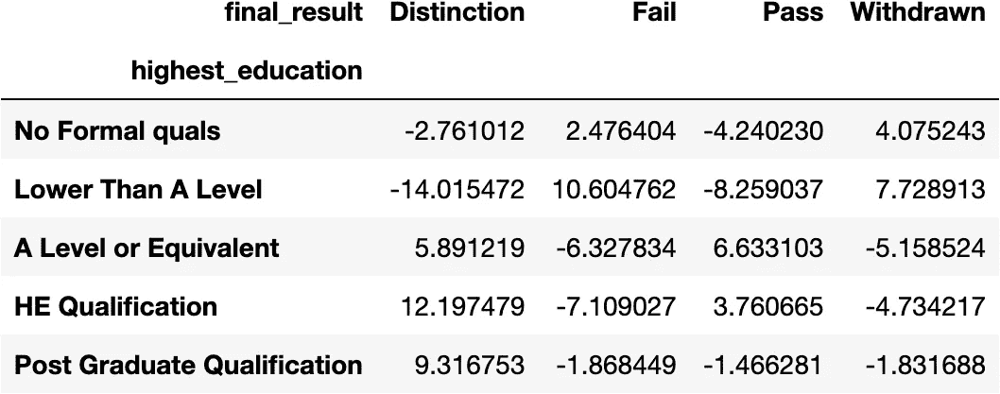
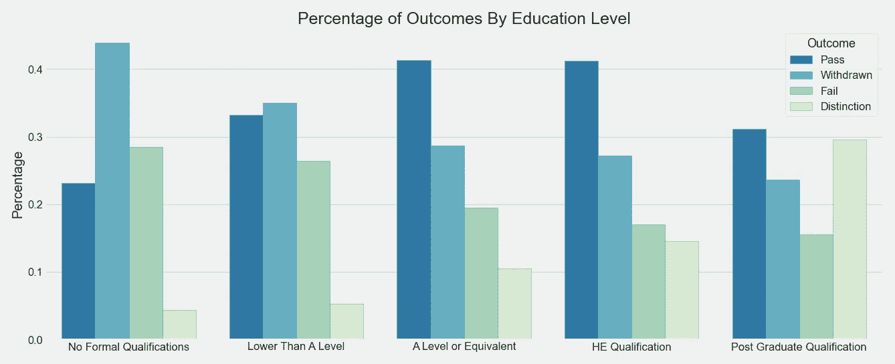
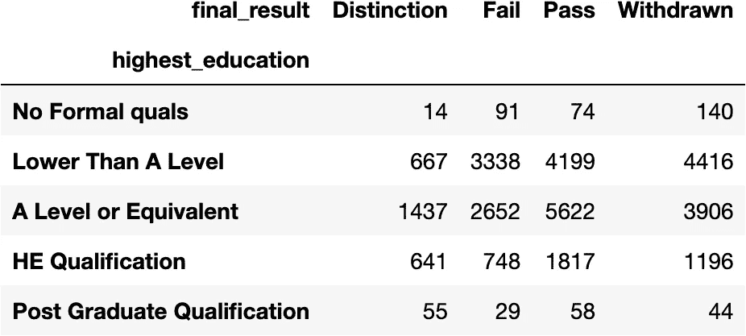
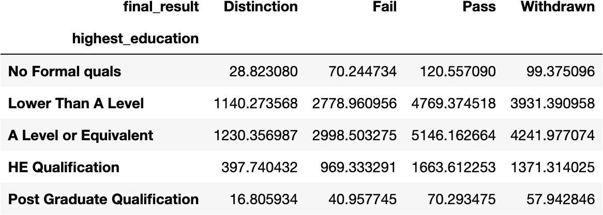

# 列联表、卡方检验和克拉默 V

> 原文：<https://towardsdatascience.com/contingency-tables-chi-squared-and-cramers-v-ada4f93ec3fd?source=collection_archive---------1----------------------->

## **如何轻松检查类别之间的关联**



作者图片

**简介**

在最近的一个项目过程中，我不得不检查一个特性与多个其他特性的关联(缺乏独立性)。为了方便起见，我编写了几个函数来执行并帮助解释这些分类特征之间的关联测试。在这篇文章中，我将演示这一过程，并提供代码示例，读者可以使用自己的数据。

**数据**

本次演示的数据集是开放大学学习分析数据集。数据集由 7 个 csv 文件组成，包含学生人口统计、评估和注册数据；以及表格形式的课程、课程评估和学习环境数据。我们将查看来自studentInfo.csv 文件的两个分类特征， *final_result* 和*higher _ education，*。本演示假设该数据已经加载到数据帧 *df* 中。

**测试的特性**

*final_result* 特征是授予该课程的最终成绩(未通过、退出、通过、优秀)，而 *highest_education* 是学生完成的最高教育水平。这些(英国)教育资格类别的排名如下(从最低到最高):无正式资格，低于 A 级，A 级，he 资格，研究生资格。



作者图片

从图表中可以看出，较低的教育水平与退缩和失败的结果正相关，而较高的教育水平与通过和优秀正相关。我们想测试和量化这些概念，如果可能的话，使用统计方法。

**列联表**

我们将通过使用[**pandas . crosstab**](https://pandas.pydata.org/pandas-docs/version/0.23/generated/pandas.crosstab.html)为我们的数据创建一个[列联表](https://en.wikipedia.org/wiki/Contingency_table)来开始我们的研究，并实例化一个[**stats models . stats . table**](https://www.statsmodels.org/stable/contingency_tables.html)**对象来为我们提供查找和显示任何关联的便利方法。Table 类使用[皮尔森卡方检验](https://en.wikipedia.org/wiki/Pearson%27s_chi-squared_test)来评估任何关联。**

```
# *creating crosstab data frame*tabs = pd.crosstab(df.highest_education, df.final_result)# creating a statsmodels table objecttable = sm.stats.Table(tabs)
```

***table_orig* 方法*将返回一个原始数据的列联表。列联表中的数字单元格表示相应行和列对的观察次数。***

```
table.table_orig
```

****

**作者图片**

***fittedvalues* 方法将从数据的最佳拟合独立分布中返回值的列联表。**

```
table.fittedvalues
```

****

**作者图片**

***resid_pearson* 方法返回残差表，该表将揭示数据中存在的任何关联。如果要素是独立的，正值表示观察值比预期值多，负值表示观察值少。**

```
table.resid_pearson
```

****

**作者图片**

**从列联表中可以看出，一般来说，成绩和及格与教育水平直接相关。学生的受教育程度越高，就越有可能通过或以优异成绩通过。相反，退缩和失败与教育水平成反比。一般来说，学生的教育水平越低，越有可能失败或退学。**

**接下来，我们将执行假设检验来验证我们的结果。**

****假设检验****

**我们将使用[**scipy . stats . chi2 _ contingency**](https://docs.scipy.org/doc/scipy/reference/generated/scipy.stats.chi2_contingency.html)测试独立性。与 Table 类类似，chi2_contingency 使用[皮尔逊卡方检验](https://en.wikipedia.org/wiki/Pearson%27s_chi-squared_test)来评估数据中的任何关联。**

**让我们首先定义测试的无效假设和替代假设，并指定显著性水平。**

**Ho = *最高学历*和*最终成绩*是独立的。**

**Ha = *最高 _ 学历*和*最终 _ 成绩*不是独立的。**

**显著性水平α= 0.05。**

**既然我们已经准备好了，我们就来进行测试。我写了一个小函数，可以很好的打印结果。**

```
def chi_sq_test(cross_tabs):
    """
    Prints the Chi-Squared Statistic, p-value, and degress of freedom from a Chi-Squared test.

    Args:
        cross_tabs: A crosstab dataframe.
    """
    chi2, p, dof, con_table = stats.chi2_contingency(cross_tabs)
    print(f'chi-squared = {chi2}\np value= {p}\ndegrees of freedom = {dof}')
```

**将该函数应用于交叉表数据框会返回:**

```
chi-squared = 962.2117100356752
p value= 2.4827414817328365e-198
degrees of freedom = 12
```

**由于返回的 p 值小于我们的 alpha，我们拒绝零假设，并得出结论*最高学历*和*最终结果*不是独立的，从而证实了我们上面的发现。**

**最后，我们将检查我们的功能的影响大小。**

****效果大小****

**[效果大小](https://en.wikipedia.org/wiki/Effect_size)是对两个特征之间关联强度的度量。我们将使用我编写的函数来测量影响大小，以计算和显示数据的[克莱姆 V](https://en.wikipedia.org/wiki/Cram%C3%A9r%27s_V) 值、克莱姆 V 自由度和影响大小[阈值](https://peterstatistics.com/CrashCourse/3-TwoVarUnpair/NomNom/NomNom-2c-Effect-Size.html)。**

```
def cramers_v(cross_tabs):
    """
    Prints the degrees of freedom, effect size thresholds, and Cramer's V value.

    Args:
        cross_tabs: A crosstab dataframe.
    """

    # *effect size data frame for cramer's v function*
    data = np.array([[1, .1, .3, .5],
       [2, .07, .21, .35],
       [3, .06, .17, .29],
       [4, .05,.15,.25],
       [5, .04, .13, .22]])
    sizes = pd.DataFrame(data, columns=['Degrees of Freedom', 'Small Effect', 'Medium Effect', 'Large Effect']) 

    # *getting the chi sq. stat*
    chi2 = stats.chi2_contingency(cross_tabs)[0] # *calculating the total number of observations*
    n = cross_tabs.sum().sum() # *getting the degrees of freedom*
    dof = min(cross_tabs.shape)-1 # *calculating cramer's v*
    v = np.sqrt(chi2/(n*dof)) # *printing results*
    print(f'V = {v}')
    print(f'Cramer\'s V Degrees of Freedom = {dof}')
    print(f'\nEffect Size Thresholds\n{sizes}\n')
```

**将该函数应用于交叉表数据会返回:**

```
V = 0.10148164448653103
Cramer's V Degrees of Freedom = 3

Effect Size Thresholds
   Degrees of Freedom  Small Effect  Medium Effect  Large Effect
0                 1.0          0.10           0.30          0.50
1                 2.0          0.07           0.21          0.35
2                 3.0          0.06           0.17          0.29
3                 4.0          0.05           0.15          0.25
4                 5.0          0.04           0.13          0.22
```

**根据自由度进行调整后，Cramer 的 V 结果表明*最高教育程度*对*最终结果*有微小的、统计上显著的影响。**

****结论****

**希望这个演示能让我们了解一个简单而强大的例程来检查关联的分类特征。为了您的方便，请随意使用和修改上述功能。特别感谢 Sgr Folge 在我的原始帖子中指出了 Cramer 的 V 代码块中的一个遗漏。**

****来源****

**开放大学学习分析数据集。Sci 数据 4，170171(2017)[https://doi.org/10.1038/sdata.2017.171](https://doi.org/10.1038/sdata.2017.171)。**

**该数据集可以通过 CC-BY 4.0 许可在[https://analyse.kmi.open.ac.uk/open_dataset](https://analyse.kmi.open.ac.uk/open_dataset)免费获得。**