# Python 中的连续和离散均匀分布—统计

> 原文：<https://towardsdatascience.com/continuous-and-discrete-uniform-distribution-in-python-statistics-82b5aa5c20b1?source=collection_archive---------33----------------------->


布莱恩·麦高恩在 [Unsplash](https://unsplash.com/?utm_source=unsplash&utm_medium=referral&utm_content=creditCopyText) 上的照片

# 在本教程中，我们将探索 Python 中的连续和离散均匀分布。

**目录**

*   介绍
*   什么是均匀分布
*   连续均匀分布示例
*   Python 中的连续均匀分布示例
*   离散均匀分布示例
*   Python 中的离散均匀分布示例
*   结论

# 介绍

为了继续学习本教程，我们需要以下 Python 库:scipy、numpy 和 matplotlib。

如果您没有安装它，请打开“命令提示符”(在 Windows 上)并使用以下代码安装它:

```
pip install scipy
pip install numpy
pip install matplotlib
```

# 什么是均匀分布

有两种类型的均匀分布:

1.  连续均匀分布-使用连续值
2.  离散均匀分布-使用离散(有限)值

## 连续均匀分布

连续均匀概率分布是具有恒定概率的分布，这意味着测量被观察的相同概率。

连续均匀分布也称为矩形分布。这是为什么呢？让我们一起探索吧！

这种类型的分布由两个参数定义:

*   *—最小值*
*   ****b*** —最大值*

*并且写成: ***U(a，b)*** 。*

*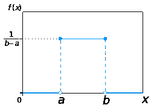*

*[https://en .维基百科. org/wiki/Continuous _ uniform _ distribution](https://en.wikipedia.org/wiki/Continuous_uniform_distribution)*

****b*** 和 ***a*** 的区别是音程长度: ***l=b-a*** 。由于这是一个累积分布，区间长度内的所有区间都是等概率的(假设这些区间具有相同的长度)。*

*连续均匀分布的 PDF(概率密度函数)由下式给出:*

*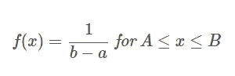*

*作者图片*

*否则为 0。*

*连续均匀分布的 CDF(累积分布函数)由下式给出:*

*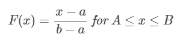*

*作者图片*

*用 0 代表**x<a用 1 代表**x>b。*****

## *离散均匀分布*

*离散均匀概率分布是具有恒定概率的分布，这意味着有限数量的值同样可能被观察到。*

*这种类型的分布由两个参数定义:*

*   **—最小值**
*   *****b*** —最大值**

**并且写成: ***U(a，b)*** 。**

**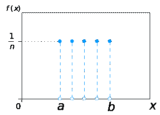**

**[https://en.wikipedia.org/wiki/Discrete_uniform_distribution](https://en.wikipedia.org/wiki/Discrete_uniform_distribution)**

*****b*** 与***a***+1 之差为观测数: ***b*** 与 ***a*** 之差为区间长度: ***n=b-a+1*** 。所有的观察都是同样可能的。**

**对于任一***×x******∈【a，b】***，离散均匀分布的 PMF(概率质量函数)由下式给出:**

**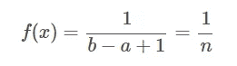**

**作者图片**

**而对于任意一个****∈******【a，b】***，一个离散均匀分布的 CDF(累积分布函数)由下式给出:***

**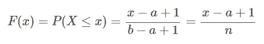**

**作者图片**

# **连续均匀分布示例**

**让我们考虑一个例子:你住在一栋 10 层的公寓楼里，刚刚回家。你进入大厅，准备按电梯按钮。你知道你可能需要 0 到 20 秒的时间来等待电梯，如果电梯在一楼(无等待)需要 0 秒，如果电梯在十楼(最长等待)需要 20 秒。这将是连续均匀分布的一个例子，因为等待时间可以以相同的概率取任何值，并且是连续的，因为电梯可以在建筑物中第一层和第十层之间的任何地方(例如，在第五层和第六层之间)。**

**这里我们有最小值 ***a*** = 0，最大值 ***b*** = 20。**

## **连续均匀分布 PDF**

**知道了 ***a*** 和 ***b*** 的值，我们就可以很容易地计算出连续均匀分布的 PDF:**

**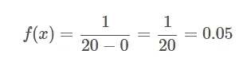**

**作者图片**

**使用 ***f(x)*** 公式和给定参数我们可以创建以下连续均匀 PDF 的可视化:**

**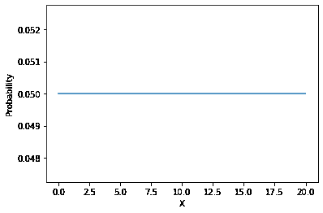**

**作者图片**

**那么在连续均匀分布的情况下，这到底告诉了我们什么呢？让我们在区间[0，20]的任何地方取两个 1 秒的区间。例如从 1 到 2(***i1 =【1，2】***)和从 15 到 16***(I _ 2 =【15，16】***)。重要的是要注意，这两个间隔的长度相同，都等于 1。使用 PMF 结果，我们可以说这些区间以 0.05 的概率同样可能发生。换句话说，电梯在 1 到 2 秒之间到达的可能性与在 15 到 16 秒之间到达的可能性一样大(概率为 0.05)。**

## **连续均匀分布 CDF**

**现在，让我们考虑在本节的示例中添加一个内容。你还在公寓楼里等电梯，但现在你想知道你按下按钮后，电梯 6 秒或更短时间到达的概率是多少。**

**使用本节中的连续分布 CDF 公式，我们可以求解:**

**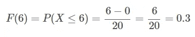**

**作者图片**

**我们观察到电梯在 6 秒或更短时间内(0 到 6 之间)到达的概率是 0.3。**

**使用 ***F(x)*** 公式和给定参数我们可以创建以下连续均匀 CDF 的可视化:**

**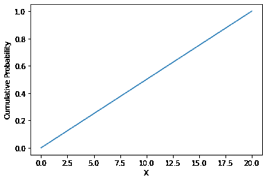**

**并且我们观察到累积概率和随机变量 ***X*** 之间的线性关系，其中函数以 ***f(x)*** 的速率单调递增(在我们的例子中 ***f(x)=0.05*** )。**

# **Python 中的连续均匀分布示例**

**在前面的一节中，我们手工计算了连续均匀分布的概率密度函数。在本节中，我们将使用 Python 再现相同的结果。**

**我们将从导入所需的依赖项开始:**

**接下来，我们将创建一个介于 0 和 20(最小和最大等待时间)之间的连续值数组。从数学上来说，有无限多的值，因此在本例中，我们将创建 4，000 个范围在 0 到 20 之间的值。我们也将打印前三个只是为了看看。**

**您应该得到:**

```
**[0\. 0.00500125 0.0100025 ]**
```

**现在我们必须使用 scipy.stats.uniform 创建一个均匀连续的随机变量:**

**在接下来的章节中，我们将重点介绍使用 Python 计算 PDF 和 CDF。**

## **Python 中的连续均匀分布 PDF**

**为了使用 Python 计算累积均匀分布 PDF，我们将使用**。scipy.stats.uniform 生成器的 pdf()** 方法:**

**您应该得到:**

```
**[0.05 0.05 0.05 ... 0.05 0.05 0.05]**
```

**所以现在我们发现每个值的概率是相同的，等于 0.05，这和我们手工计算的完全一样。**

## **使用 Python 绘制连续均匀分布 PDF**

**使用 **matplotlib** 库，我们可以使用 Python 轻松绘制连续均匀分布 PDF:**

**您应该得到:**

****

## **Python 中连续均匀分布 CDF**

**为了用 Python 计算连续均匀分布的 CDF，我们将使用**。scipy.stats.uniform 生成器的 cdf()** 方法:**

**由于我们将有 4，000 个值，如果我们想要仔细检查我们手工计算的正确性，您将需要找到与等于 6 的值相关联的累积概率。确实在 0.3 左右。**

## **使用 Python 绘制连续均匀分布 CDF**

**使用 **matplotlib** 库，我们可以很容易地用 Python 绘制出连续均匀分布的 CDF:**

**您应该得到:**

****

# **离散均匀分布示例**

**让我们考虑一个例子(这是我们大多数人自己做的):掷骰子。基本上，滚动单个 6 面骰子的可能结果遵循离散的均匀分布。**

**这是为什么呢？这是因为你只能从 6 个可能的结果中选择 1 个结果(你可以选择 1、2、3、4、5 或 6)。可能结果的数量如果是有限的，并且每个结果被观察到的概率是相等的，即 ***1/6*** 。**

## **离散均匀分布 PMF**

**已知所有可能结果的数量 ***n*** ，我们可以很容易地计算出离散均匀分布的 PMF:**

**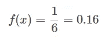**

**作者图片**

**使用 ***f(x)*** 公式和给定参数，我们可以创建以下离散均匀 PMF 的可视化:**

**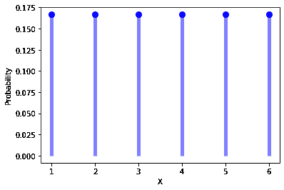**

**在本例中，骰子的每一侧被观察到的机会相等，等于 0.16。**

## **离散均匀分布 CDF**

**现在让我们考虑这个例子的补充。你正在掷出同一个 6 面骰子，现在想知道你观察到的结果等于或小于 2(意味着 1 或 2)的概率。**

**已知所有可能结果的数量 ***n*** ，我们可以很容易地计算出离散均匀分布的 CDF:**

**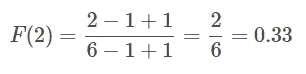**

**作者图片**

**这告诉我们，如果我们掷出一个 6 面骰子，观察到小于或等于 2 的值的概率是 0.33。**

**使用 ***F(x)*** 公式和给定的参数我们可以创建以下可视化的离散均匀 CDF:**

**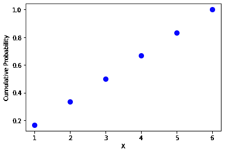**

**作者图片**

**我们观察到一种逐步的关系，因为我们有离散的值作为可能的结果。**

# **Python 中的离散均匀分布示例**

**在前面的一节中，我们手工计算了连续均匀分布的累积分布函数。在本节中，我们将使用 Python 再现相同的结果。**

**我们将从导入所需的依赖项开始:**

**接下来，我们将创建一个 1 到 6 之间的值的数组(最小和最大骰子值)，并打印出来看看。**

**您应该得到:**

```
**[1 2 3 4 5 6]**
```

**现在我们必须使用 scipy.stats.randint 创建一个均匀连续的随机变量:**

**在以下章节中，我们将重点介绍如何使用 Python 计算 PMF 和 CDF。**

## **Python 中的离散均匀分布 PMF**

**为了使用 Python 计算离散均匀分布 PMF，我们将使用**。scipy.stats.randint 生成器的 pmf()** 方法:**

**您应该得到:**

```
**[0.16666667 0.16666667 0.16666667 0.16666667 0.16666667 0.16666667]**
```

**这正是我们手工计算的 0.16。**

## **使用 Python 绘制离散均匀分布 PMF**

**使用 **matplotlib** 库，我们可以使用 Python 轻松绘制离散均匀分布 PMF:**

**您应该得到:**

****

## **Python 中的离散均匀分布 CDF**

**为了用 Python 计算离散均匀分布的 PMF，我们将使用**。scipy.stats.randint 生成器的 cdf()** 方法:**

**您应该得到:**

```
**[0.16666667 0.33333333 0.5 0.66666667 0.83333333 1\. ]**
```

**我们在这里看到，数组中的第二个值是 0.33，这与我们手工计算的值完全相同。**

## **使用 Python 绘制离散均匀分布 CDF**

**使用 **matplotlib** 库，我们可以使用 Python 轻松绘制离散均匀分布 CDF:**

**您应该得到:**

****

# **结论**

**在本文中，我们探讨了累积均匀分布和离散均匀分布，以及如何在 Python 中创建和绘制它们。**

**如果你有任何问题或对一些编辑有建议，请随时在下面留下评论，并查看更多我的[统计](https://pyshark.com/category/statistics/)文章。**

***原载于 2021 年 11 月 29 日 https://pyshark.com*<https://pyshark.com/continuous-and-discrete-uniform-distribution-in-python/>**。****