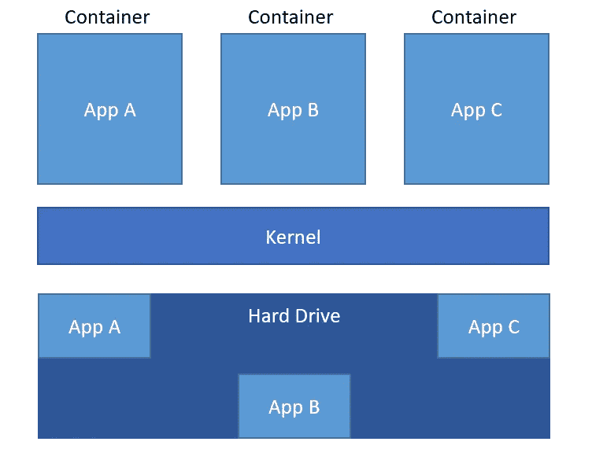

# 使用 Github Actions、Docker 和 AWS 的持续部署管道

> 原文：<https://towardsdatascience.com/continuous-deployment-pipeline-using-github-actions-docker-and-aws-185bb3bf41b?source=collection_archive---------5----------------------->

## 将 Flask ML 应用程序自动部署到 AWS Elastic Beanstalk

马文·迈耶在 [Unsplash](https://unsplash.com?utm_source=medium&utm_medium=referral) 上的照片

# 介绍

公司越来越多地寻找机器学习工程师。但是机器学习工程师和数据科学家有什么区别呢？数据科学家纯粹关心训练机器学习模型。他们处理数据，评估数据，并更详细地探索数据。他们试图从中产生附加值。另一方面，机器学习工程师应该将这个训练好的模型转化为最终可用的应用程序。他们必须将 Jupyter notebook 等环境中的代码转换成可用的应用程序。这个应用程序可以是任何东西，从移动应用程序到复杂的网站或普通的 API。这个应用程序也应该得到维护，最好是不断扩展和改进。它还应该在新的更新后重新部署，以便最终用户始终拥有可用的最佳和最新版本。整个部署过程可以而且应该自动化。这就叫做持续集成和部署。集成部分是第一次测试新代码的部分，以确保一切正常工作。如果是，那么代码可以被交付/部署。

在本文中，我想与您分享一个连续部署管道的示例，其中我首先创建了一个 Docker 容器，该容器运行我的 Birds Classifier Flask 应用程序，然后通过使用 Github 操作将该 Docker 容器自动部署到 AWS Elastic Beanstalk。因此，每当一个新的代码状态被推送到我的主分支时，首先创建 Docker 容器以确保一切正常，然后通过 AWS Elastic Beanstalk 部署这个容器。

如果你想知道我是如何从零开始训练鸟类图像分类器的，我可以推荐[这篇文章](/full-deep-learning-portfolio-project-part-1-78df161214aa)。在这篇文章中，我描述了如何用 Flask 创建 Web API。包括 Dockerfile 和 Github Actions 文件的完整代码可以在我的 Github 库[这里](https://github.com/patrickbrus/Birds_Classifier_API)找到。

在本文的第一部分，我将更详细地解释 Docker、Github Actions 和 AWS Elastic Beanstalk，并展示它们的优势。然后，我将向您展示如何创建 Docker 映像，以及如何在本地创建和测试容器。之后，我将向您展示如何创建一个能够运行 birds 分类器 API 的 AWS Elastic Beanstalk 应用程序。最后，我将解释如何使用 GitHub Actions 在每次新代码被推送到主分支时自动部署 Docker 容器。

# 码头工人

好吧，让我们从 Docker 开始。什么是 Docker，为什么要使用 Docker？我觉得下面这句话你们每个人听起来都很熟悉:你在网上发现了有趣的 Python 代码，想在本地运行。但是首先你需要一个版本正确的 Python 环境。例如，Anaconda 可以用于此目的。现在，如果你有了正确版本的 Python，首先要做的就是创建一个新的环境，希望代码的开发者已经创建了一个 requirements.txt，其中包含了运行程序的所有依赖项。如果没有，在一些错误消息告诉您缺少哪些包之后，必须逐个安装所需的 Python 包。如果一些包不能通过 Conda 或 Pip 安装，情况会变得更糟。然后，必须费很大力气手动安装它们。因此，可能需要几个小时才能最终运行 Python 程序。这就是 Docker 发挥作用的地方。Docker 希望通过为应用程序创建容器来改善这一点。然后，一个容器包含所有的依赖项和正确的 Python 版本，这样最终用户就可以运行这个容器，而不必担心所有的依赖项。如果他不想再在本地拥有这个应用程序，他可以简单地删除容器。

容器可以被看作是一个独立的环境，它自己的资源运行在主机上。图 1 显示了一个具有三个不同容器的示例设置，其中每个容器运行一个应用程序，每个应用程序在硬盘驱动器中有自己的内存区域，其他容器无法访问(除非您告诉容器共享它们的内存)。

图 Docker 是什么的概述，灵感来自[https://www.docker.com/resources/what-container](https://www.docker.com/resources/what-container)(图片由作者提供)。

Docker 可以在 Windows、Linux 和 MacOS 上使用。要在 Windows 上安装和运行 Docker，首先必须安装 Windows 子系统 Linux 2。这是一个在 Windows 上运行 Linux 的轻量级虚拟机。在本页阅读更多关于安装 Docker for Windows 的信息。要在 MacOS 上安装 Docker，可以跟着阅读[这一页](https://hub.docker.com/editions/community/docker-ce-desktop-mac)。

# Github 操作

现在让我们来看看 Github Actions。在介绍中，我说过应用程序的集成和部署应该是自动化的，这样，当执行新的主分支时，应用程序会自动进行测试，然后重新部署。这就是 Github Actions 发挥作用的地方。Github Actions 是一个直接集成到 Github 中的 CI/CD 工具。它允许在检测到 Github 存储库的变化后直接运行测试和预定义的步骤。我真的很喜欢这个直接集成到 Github！这避免了必须处理另一个工具，如 Travis CI。Github Actions 已经有很多例子和库，可以用来快速创建 CI/CD 管道。管道本身被定义为 YAML 文件中的代码。这允许对您的管道进行版本控制，这在您想要恢复到旧版本的情况下是非常重要的。

# AWS 弹性豆茎

图 AWS 弹性豆茎概述(图片由作者提供)。

AWS Elastic Beanstalk 是来自 Amazon Web Services 的一项服务，允许轻松部署用 Java、PHP、Node.js、Python、Docker 等编写的应用程序。代码可以简单地上传到 AWS Elastic Beanstalk，它会自动处理诸如容量供应、负载平衡、自动伸缩和应用程序健康监控之类的事情。AWS Elastic Beanstalk 本身使用 EC2 实例来运行您的应用程序，使用 S3 存储来存储数据，但是作为用户，您不必为这些事情费心。你可以简单地上传你的 Docker 图片，AWS Elastic Beanstalk 会帮你处理剩下的事情。

# 关于如何创建持续部署管道的分步说明

好了，现在你知道了所用环境和工具的基本知识。现在让我们从创建最终的持续部署管道开始。我将经历所有需要的步骤，这样最终你有希望理解所有这些，并且能够将它们应用到你自己的项目中。首先，我将向您展示如何为 Flask 应用程序创建 Docker 映像，以及如何在本地构建和测试容器。然后，我将向您展示如何为 Flask 应用程序创建 AWS 环境。最后，我将指导您创建 Github 动作管道和所有必要的配置，以通过 Github 动作运行持续部署。

## 步骤 1:创建 Docker 映像

作为第一步，我们必须创建 Docker 图像。为此，我们需要创建一个名为“Dockerfile”的文件。该文件定义了如何使用 Docker 映像设置 Docker 容器的所有必需步骤。代码 1 显示了创建的 Dockerfile 的全部内容。

代码 1: Dockerfile，用于为鸟类分类器 Flask 应用程序定义 Docker 图像(由作者编写代码)。

**来自 python:3.9**

这一行定义了应该使用的基本图像。基础图像就像是容器的起点。它定义了一些应该安装的基本安装，比如 Python。

**工作目录/usr/src/app**

这里我们说我们想要使用指定路径上的文件夹作为工作目录。我们现在以后用“T4”时。”，我们总是把这个工作目录称为根目录。

**复制。/requirements.txt。/**

需求文件现在被复制到 Docker 容器的工作目录中。

**运行 pip 安装—升级 pip &运行 pip 安装—no-cache-dir-r requirements . txt**

这几行首先升级 pip，然后安装 requirements.txt 文件中列出的所有依赖项。这确保了 Flask ML 应用程序所需的所有包都安装在 Docker 容器上。

**添加和复制步骤**

在添加步骤中，目录被复制到容器的工作目录中，而 COPY 只复制单个文件，不会保留正确的文件夹结构。application.py 文件包含 Flask ML 应用程序，data 文件夹包含带有所有类名的 csv 文件，model 文件夹包含已训练 Tensorflow 模型，templates 文件夹包含前端 HTML 文件。

**曝光 5000**

EXPOSE 步骤告诉容器他应该监听端口 5000 上的传入连接和数据。这对于在主机上调用网页和与容器通信是很重要的。

**CMD ["python "，" application.py" ]**

这一行定义了 Docker 容器启动时要执行的命令。在这里，我们想执行 Flask ML 应用程序，然后启动网页。

既然已经创建了容器的映像，那么让我们也在本地创建容器，并运行它来尝试是否一切都按预期运行。为此，请遵循以下步骤:

1.  运行**docker build-t<docker _ id>/<应用程序名称>。**在包含 Dockerfile 的目录下的命令行中。使用 **-t** 标志，您可以标记 docker 容器，以便在以后运行该容器时方便地引用它。 **< docker_id > / <应用名称>** 只是 docker 的一个命名约定，但是你可以给你的容器加上任何你想要的名字。在我的例子中，我用 **ga63qes/flask-ml-app** 标记它。还有别忘了“**”。**“结束了！这告诉 Docker 在当前目录中搜索 Docker 文件。
2.  当一切都解决了，运行**docker run-p 5000:5000****<docker _ id>/<应用程序名称>** 之后。这将启动您的 Docker 容器，并将您机器上的端口 5000 映射到 Docker 容器的端口 5000。这很重要，因为 Docker 容器监听该端口上的传入连接(如 Docker 文件中所定义的)。

您应该在终端上看到如图 3 所示的输出。

图 3:启动 Docker 容器后的终端输出(图片由作者提供)。

现在，在浏览器中输入“ [http://127.0.0.1:5000](http://127.0.0.1:5000) ”即可打开网页。

好吧。现在我们必须做最后一步来完成 Docker 部分。我们必须创建一个 docker-compose 文件，因为 AWS Elastic Beanstalk 将使用这个文件来最终创建和运行 docker 容器。Docker-compose 是一个来自 Docker 的 CLI，用于将多个单个 Docker 步骤合并到一个文件中。只需创建一个“docker-compose.yml”文件，并添加代码 2 中的内容。

代码 2: Docker-compose 文件的鸟类分类器烧瓶毫升应用程序(代码由作者)。

这里，作为构建上下文，Dockerfile 被链接，并且作为根目录，当前工作目录被选择。这意味着“docker-compose.yml”文件必须放在与 docker 文件相同的目录中。此外，端口 80 被映射到容器的端口 5000。这是因为网页将被托管在 AWS Elastic Beanstalk 上，默认情况下在端口 80 上监听传入的连接，而创建的容器在端口 5000 上监听。

现在，您还可以通过在包含 docker-compose 文件的目录中运行以下步骤来检查 docker-compose 文件是否正常工作:

1.  运行 **docker-compose build** 来构建 docker 容器。
2.  运行**docker-组合**来运行 Docker 容器。现在，您应该能够通过在浏览器中输入“[http://127 . 0 . 0 . 1:80”](http://127.0.0.1:80)连接到该网页。重要提示:您现在必须使用端口 80 而不是 5000，因为我们将这个端口映射到容器的端口 5000。

呸，太多了！但这是最重要的部分！现在，应用程序可以在每台安装了 Docker 的机器上执行。因此，没有人需要首先手动安装依赖项和设置环境。

## 步骤 2:创建一个 AWS 弹性 Beanstalk 应用程序

第二步，您首先需要创建一个 AWS 帐户。这个账户本身是完全免费的，但是你必须给你的账户添加一张信用卡。创建账户后，你可以进入 [AWS 起始页](https://us-east-2.console.aws.amazon.com/console/home?region=us-east-2#)，在搜索栏中搜索“AWS Elastic Beanstalk”。然后，您可以点击“创建应用程序”。选择您想要创建一个 Web 应用程序，然后您应该会看到如图 4 所示的窗口。您可以添加所需的信息。在我的例子中，我还必须打开“配置更多选项”并选择其他实例类型，因为默认实例类型(t2.micro 和 t2.nano)对我的应用程序来说内存太少。然后我选择了实例类型 c5d.2xlarge 和 c5a.2xlarge。

图 AWS 弹性豆茎应用程序的设置(图片由作者提供)。

当您添加了所有必需的信息并选择了正确的实例类型后，单击“创建应用程序”。您的应用程序应该需要几分钟才能设置好并准备好运行。当您的环境完成后，您应该会看到类似于图 5 的内容，您可以开始使用您的应用程序了。

图 5:已经可以使用的 AWS 弹性 Beanstalk 环境(图片由作者提供)。

然后您可以点击环境，一个新的窗口将会打开(图 6)。此窗口包含到您的网站的链接。部署应用程序后，可以与最终用户共享这些信息。

图 6:在 AWS Elastic Beanstalk 中创建的应用程序的环境窗口(图片由作者提供)。

你也可以在这里直接上传申请。这有助于查看 Docker 容器是否在 AWS 上正常运行。为此，您可以选择文件夹中所有相关的文件夹和文件，并将它们放入 zip 文件夹中。重要的是，在打开文件夹后，Dockerfile 和 docker-compose 文件位于根目录下。

好了，接下来的步骤只需要在你想继续用 Github 动作自动部署应用程序的情况下完成。为此，我们首先必须在 AWS 中创建一个用户，允许他将代码部署到创建的 Elastic Beanstalk 应用程序中。为此，在 AWS 搜索栏中搜索“IAM ”,然后单击“Users”和“Add users”。然后你可以添加一个用户名(在我的例子中是 birds-classifier-api)并选择“访问键-编程访问”。点击“Next: Permissions”并选择如图 7 所示的选项。

图 7:允许将应用程序部署到创建的弹性 Beanstalk 环境的 IAM 用户设置(图片由作者提供)。

然后，您可以一步一步地完成 IAM 用户的设置。创建用户后，您将看到一个“访问密钥 ID”和一个“秘密访问密钥”。您将需要这些用于您的 Github repo，稍后将在那里推送代码。将它们下载为 CSV 文件，以便您以后可以访问它们。然后进入你的 Github repo，点击“设置”，导航到“秘密”。这里您必须添加图 8 中的两个变量。作为值，您可以插入在 AWS 中创建的用户的值。

图 8:自动将新的应用程序代码部署到 AWS Elastic Beanstalk 需要添加的存储库秘密(图片由作者提供)。

**第三步:创建 Github 动作文件**

现在我们终于到了最后一步。我们现在可以创建包含代码的 YAML 文件，告诉 Github Actions 每当执行 master 上的 push 时，它应该自动构建 Docker 容器并将其部署到 AWS Elastic Beanstalk 应用程序。如果你不熟悉 Github 动作，那么我可以向你[推荐这个关于如何使用 Github 动作的 Youtube 教程](https://www.youtube.com/watch?v=R8_veQiYBjI&t=1093s)。代码 3 显示了创建自动部署的完整代码。该文件必须在名为“”的文件夹中创建。github/workflows”被 Github Actions 认可。

代码 3:定义 Github Actions 持续部署管道的 YAML 文件(作者代码)。

在第 16 到 18 行中，定义了 checkout。我还添加了 git lfs checkout，因为我将我的存储库配置为 git lfs repo，以便有效地存储我的大型 Tensorflow 模型。在这里阅读更多关于 git lfs [的内容](https://git-lfs.github.com)。

该管道的不同阶段在结帐后定义。每个新阶段以“ **-** ”和阶段名称开始。关键字“使用”表示加载并使用了另一个用户的库。

**构建 Docker 映像**

在这个阶段，Docker 映像被构建。这是为了确保在将 Docker 容器部署到 AWS Elastic Beanstalk 之前，构建 Docker 容器的一切工作正常。

**生成部署包**

在这个阶段，repo 的内容被压缩，因为 AWS Elastic Beanstalk 需要上传一个包含应用程序和 docker 文件的压缩文件夹。

**获取时间戳**

这里加载了当前时间戳。这随后用于向新部署的应用程序添加版本。

**运行管柱更换**

这个阶段获取时间戳，并应用一些格式将其转换成一种良好的格式。

**部署到 EB**

在最后一个阶段，通过使用之前创建的 AWS 用户凭证和所创建环境的一些必需信息，最终将压缩的应用程序文件夹部署到 AWS Elastic Beanstalk。关于环境的所有必需信息都可以在图 5 中找到。

现在，您可以将这个创建的 YAML 文件推送到 Github，并在浏览器中打开您的 repo。然后，您可以导航到“Actions”选项卡，您应该会看到一个正在进行的构建。构建完成后，您应该会看到类似于图 9 的内容。

图 9:完成的 Github 动作构建管道的示例视图(图片由作者提供)。

因此，现在无论何时在主服务器上执行推送，应用程序都会自动重新部署到 AWS Elastic Beanstalk。这太棒了！机器学习工程师现在不必再为部署而烦恼了。

现在，您可以使用 AWS Elastic Beanstalk 环境中提供的 web 链接导航到创建的网页。你可以看看我的情况:

Gif 1:如何在 AWS 部署的网页上打开的示例(图片由作者提供)。

重要提示:我建议最后删除在 AWS 上创建的应用程序，以避免产生成本。我删除了我的资源，因为我还有更大的实例类型，并且已经为我的应用程序支付了一些费用。因此，当您现在查看我的 Github 操作结果时，您可以看到我的最新构建在部署阶段失败了。

# 未来的工作

目前只使用默认的 Flask 服务器，它应该只在开发期间使用，而不在生产中使用(如图 3 中的命令行输出所示)。所以当你真的想把你的 Flask 应用程序投入生产时，我会推荐你阅读 Flask 的这篇文章。

# 结论

现在您已经看到了这样一个自动化部署管道的样子。你也知道 Docker 的优点，以及如何使用 Github 动作。现在是时候实施您自己的机器学习项目并考虑部署了！

谢谢你把我的文章看完！我希望你喜欢这篇文章和我参与的项目。如果你想在未来阅读更多类似的文章，请关注我，保持更新。

# 接触

[**LinkedIn**](https://www.linkedin.com/in/patrick-brus/)|**[**Github**](https://github.com/patrickbrus)**