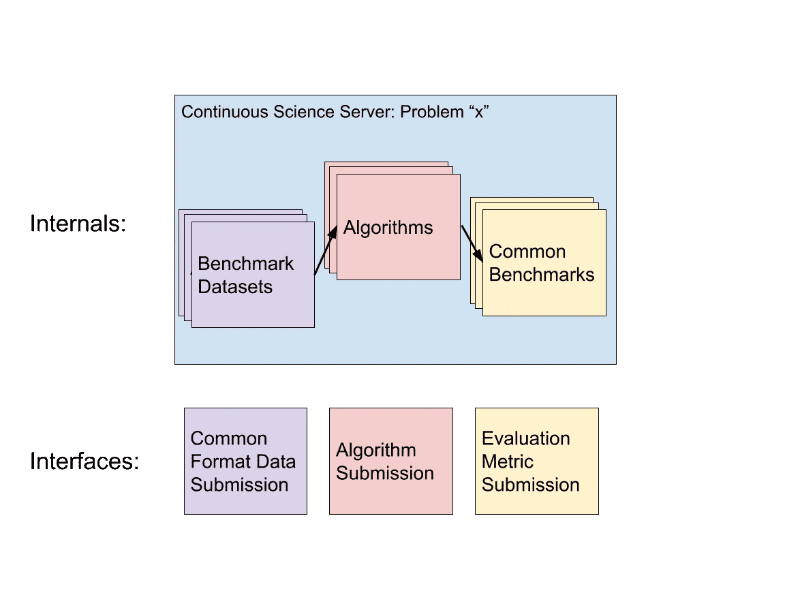

# 连续科学

> 原文：<https://towardsdatascience.com/continuous-science-6b5ed833ab23?source=collection_archive---------41----------------------->

约翰·施诺布里奇在 [Unsplash](https://unsplash.com?utm_source=medium&utm_medium=referral) 上的照片

## [业内笔记](https://towardsdatascience.com/tagged/notes-from-industry)

## 软件工程实践如何解决科学再现性

这篇文章是关于通过实施现代软件工程实践来提高计算生物学的可重复性和生产率。

我写这封信是因为很明显，科学界正变得越来越依赖公共软件解决方案——这些解决方案可以通过在软件工程中大量投资不断发展但令人兴奋的解决方案而得到更好的支持。

## 介绍

计算生物学家花在基准测试和评估代码上的时间比他们写基本功能的时间还多。

幸运的是，我们的软件工程师面临许多类似的问题，并且已经开发了无数的解决方案来确保软件在其生命周期内继续良好运行。

[持续集成和持续交付(CI/CD)](https://continuousdelivery.com/) 是这些解决方案的顶峰，允许敏捷软件开发社区中的软件开发人员比以往更快、更安全地交付解决方案。

CI/CD 是一种文化和实践的集合，可以为科学界提供大量的东西。

在过去的一年里，我作为一名数据科学家，在与经验丰富的行业软件开发人员一起工作的同时，构建生物信息管道并对其进行基准测试。在此期间，我越来越清楚地认识到，在科学计算领域引入 CI/CD 或类似的系统可能有很多好处。

我称之为“持续科学”,它提供了一个机会，通过数据驱动的科学来提高再现性、减少浪费并加速我们的集体理解。

## 科学软件当前面临的挑战

众所周知，现代科学正面临一场再现性危机，科学软件也不例外。

虽然复制一篇已发表的论文通常很困难，但复制计算尤其难以实现。通常，科学家必须检索现有解决方案的所有开放源代码、所有数据输入和所有数据输出，然后才能与他们的新提案进行比较。

检索所有这些资源不仅是一项困难而漫长的任务，而且由于数据的不良记录、有限的代码共享或版本控制以及缺乏以不同编码语言实现的现有解决方案的专业知识，这通常是不可能的。

再现性的挑战严重地影响了个人，因为它减缓了他们的研究，并耗费了他们必须花费在验证软件完整性上的宝贵时间。

然而，公共效应更严重，因为这减缓了领域的进展，阻碍了蛋白质组学等重要科学领域的进展。

不幸的是，所有这一切意味着像我这样编写科学代码的人往往会花更多的时间来尝试实现算法和代码之间的有效比较，而不是构建新的令人兴奋的解决方案。

当我们考虑到全球实验室之间发生了多少重复工作时，这是令人难以置信的浪费。

此外，如果工具构建者很难进行比较，那么很可能几乎不可能相信像生物学家这样的用户能够被恰当地告知他们正在使用的工具。

输入 CI/CD 和连续科学的发展(双关语)。

在 [Unsplash](https://unsplash.com?utm_source=medium&utm_medium=referral) 上[科学高清](https://unsplash.com/@scienceinhd?utm_source=medium&utm_medium=referral)拍摄的照片

## 什么是持续集成/持续交付，为什么我们需要这样的东西？

CI/CD 是一种软件工程文化，围绕着随着新解决方案的交付而自动检查代码的任务而构建。这意味着代码可以随时更新，工程师可以确信，无论代码发生多大的变化，它都会运行良好。

我将用一个类比来解释这一点——我爱我的 Fitbit。

我用它来跟踪对我的健康有意义的指标，比如我每天的步数和我的平均心率。当然，我的 Fitbit 从来不会强迫我锻炼，但当我的好习惯开始消失，我需要更多外出时，它就变得非常明显。

自动跟踪某些东西的状态，如身体的健康状况或代码的健康状况，因为它会发生变化，这使得维护它并保持在您的目标的轨道上变得更加容易。代码健康是真实的，因为随着时间的推移，算法可能会失去与常见输入格式的兼容性，或者在编辑时变得杂乱无章、错误百出。就像身体健康一样，如果没有得到适当的照顾和监控，算法和工具也会随着时间的推移而失去优势。

在 Mass Dynamics，我见过托管服务器应用 CI/CD，详细说明如何在每次更改代码时运行和测试代码。通过这样做，我们能够*自动*获得我们的代码在任何时候都工作的信心。如果检查不是自动的，我们不可能保持它的健康。

相比之下，在科学界，我们看到一个非常不同的场景。

虽然许多科学工具都很棒，但每年构建的新算法/工具的数量不仅通过不断的比较和评估为开发人员社区创造了工作，也为用户区分哪些工具最适合他们的需求创造了工作。

一个复杂因素是，许多工具不能自动运行，另一个复杂因素是，即使对于相同的科学问题，它们也经常采用不同的输入，产生略有不同的输出，这使得比较变得困难。

这意味着对新方法的信心是缓慢的，并且是由构建基准测试脚本的个体社区成员辛苦获得的(这些脚本本身发布的频率低于工具代码本身)。通常，这些脚本的结果是惊人的论文，讲述了一个创新解决方案的故事，但这些努力是重复的(通常它们本身很难比较)。

回到健康类比，科学软件工具可能是健康的，但我们只知道这一点，因为我们支付了偶尔复杂的医疗评估——或更糟——手术！

知道哪些科学工具起作用应该不难。不难知道哪种科学工具更适合给定的用户或问题。

那么我们如何解决这个问题呢？我们如何减少科学开发人员创建和测试新解决方案所需的时间和精力，同时确保该软件的消费者对其使用充满信心？

## 持续科学解决方案

为了更好地阐述我提出的解决方案，我画了一个图形，希望它能传达出持续科学概念的模块化和优雅。

图 1 显示了如何将数据集、算法和评估指标全部模块化，并在单个服务器上运行。这个服务器可以是一个公共的、透明的资源，以显示给定计算挑战的进展。

图 1:作者的原始数据(约瑟夫·布鲁姆)

具体来说，连续科学服务器可以通过共享基础设施和公共数据格式来工作，以允许使用公共数据集和公共基准对算法进行相互比较。数据集、算法和基准都可以独立提交，但被一个共同的问题联系在一起。应该公开列出每个算法在指标和数据集上的性能。

虽然 CI/CD 强调检查代码的健康状况，但 Continuous Science 可以在公共基准和数据集上评估算法性能，这些基准和数据集对社区是透明和可访问的。

如果社区能够走到一起，就解决个别问题(如[蛋白质推理问题](https://academic.oup.com/bib/article/13/5/586/415393))的算法的通用格式和基准达成一致，那么合乎逻辑的下一步将是建立公共服务器，在所有提交的算法和数据集上执行这些基准。

结果可以实时显示在网站上，这些解决方案的用户可以浏览，就像一个科学健康的仪表板。

此外，建立包含数据、算法和评估指标模块的管道的一个好处是，我们可以使解决方案民主化。如果一个新的解决方案在一个新的、合法的、但以前没有预料到的指标或数据集类型上表现良好，那么可以将它们提交给工具，并由所有人来审查结果。

一个类似的令人敬畏的概念的例子是 [Kaggle](https://www.kaggle.com/) ，这是一个数据科学竞赛平台，人们可以提交数据问题，并设置基准以与提交的答案进行比较。数据科学家通过提交不同算法的结果来竞争。

虽然“Kaggle”有一种连续的味道，因为每个上传的结果集都会被自动评估以检查解决方案的质量，但连续科学在众包测试数据集和评估指标方面走得更远。

# 可能的挑战和希望的理由

想法往往在一开始就不切实际。考虑到我最近工作过的一些领域，一些迫在眉睫的挑战跃入脑海。

这些是:

1.  最流行的解决方案必须是开源的，这样社区才会关心比较的结果。
2.  要使运行状况检查自动化，解决方案必须是自动化的。
3.  解决方案必须共享共同的输入和输出，以便进行公平的比较。

最终，为了克服这些技术挑战，我们需要在可扩展解决方案的开发上进行开放和诚实的分享和合作，这与资助系统可能强加给我们的竞争文化相反。

尽管研究人员被迫竞争资金，但科学家们共同努力创造了许多倡议，以提高科学的可及性和透明度。

尤其是，将“[*”*](https://www.oecd.org/sti/inno/open-science.htm)开放科学作为解决可复制性危机的驱动力令人振奋。创建[公平数据](https://www.ands.org.au/working-with-data/fairdata)(可发现、可访问、可互操作和可重复使用)的努力正通过像本文这样的论文进入蛋白质组学这样的高科技领域，它清楚地表明了全球共同的善意和共同的愿望，即减少研究的竞争，加强合作。

一个竞争更少、合作更多的研究社区正是那种可以通过持续的科学来分担维护我们算法健康的责任的社区。

# 总之:

可复制性危机是真实的，我们可以从令人敬畏的软件开发文化中获得灵感来帮助我们解决它。

通过“持续科学”服务器跟踪和比较我们算法的健康状况的公共努力，可以解决科学中软件的可再现性和可访问性，就像我们用健康设备跟踪和维护我们身体的健康，用 CI/CD 服务器跟踪和维护我们的代码一样。

这些公共资源可以加速同行的共识和标准化，就像开源更广泛地影响了技术世界一样。

将 CI/CD 文化引入科学是未来之路。它将为科学开发人员提供一个公共资源，用于维护和比较支持非计算科学家做出有益于所有人的发现的解决方案。

如果你觉得这篇文章有趣，我很乐意与你讨论。你可以在 joseph@massdynamics.com 找到我。

非常感谢我所有了不起的同事和朋友们，他们编辑了这篇文章并给了我反馈！

[国立癌症研究所](https://unsplash.com/@nci?utm_source=medium&utm_medium=referral)在 [Unsplash](https://unsplash.com?utm_source=medium&utm_medium=referral) 上拍摄的照片