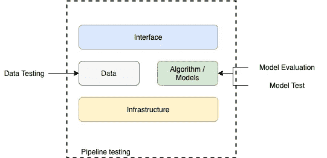
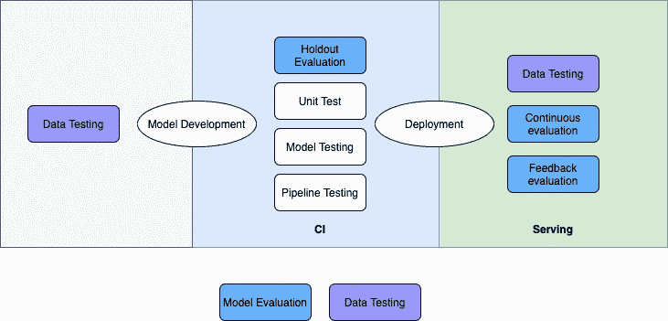

# 机器学习系统的连续测试

> 原文：<https://towardsdatascience.com/continuous-testing-for-machine-learning-systems-a8519eede545?source=collection_archive---------21----------------------->

## 通过 ML 产品生命周期验证机器学习系统的正确性和性能。

托尔加·乌尔坎在 [Unsplash](https://unsplash.com/photos/9k36QqhA0cU) 上拍摄的照片

# 目录

*   [机器学习系统中的测试](#f86f)
*   [ML 测试的范围](#de0d)
*   [我们什么时候进行不同类型的测试？](#3421)
*   [结论](#b342)

# 机器学习系统中的测试

软件行业中的测试是一个经过充分研究的成熟领域。从不计其数的失败项目中吸取的好的实践帮助我们频繁地发布，并且有更少的机会看到产品中的缺陷。像 CI、测试覆盖和 TDD 这样的行业惯例被很好地采用，并为每个项目量身定制。

然而，当我们试图将 SWE 测试哲学借用到机器学习领域时，我们必须解决一些独特的问题。在这篇文章中，我们将讨论 ML 模型(系统)测试中的一些常见问题，并讨论潜在的解决方案。

ML 系统在这里代表一个生成可供用户使用的预测(洞察)的系统(管道)。它可能包括一些机器学习模型。例如，OCR 模型(系统)可以包括一个用于检测文本区域的 ML 模型、一个用于判断当前文本区域类别的 ML 模型(汽车牌照与路标)以及一个用于从图片中识别文本的模型。

# ML 测试的范围

模型由代码(算法、预处理、后处理等)、数据和促进运行时的基础设施组成。

ML 系统测试的范围，图片由作者提供

不同类型的测试涵盖了系统不同组件的质量保证。

**数据测试**:确保新数据满足你的假设。在我们训练模型和进行预测之前，需要进行这种测试。在训练模型之前，X 和 y(标签)

**管道测试**:确保你的管道设置正确。这就像 SWE 中的集成测试。对于 ML 系统，它也可以测量一致性(再现性)。

**模型评估**:评估你的 ML 管道有多好。取决于您使用的指标和数据集，它可能指不同的东西。

*   对维持/交叉验证数据集的评估。
*   部署管线和地面实况的评估([连续评估](https://cloud.google.com/ai-platform/prediction/docs/continuous-evaluation))。
*   基于系统用户反馈的评估(与业务相关的指标，而不是可测量的 ML 代理)

有许多技术可以应用于该过程，如基于切片的评估、MVP(数据的关键子集)组/样本分析、消融研究、基于用户分组的实验(如 Beta 测试和 A/B 测试)。

**模型测试**:包括对我们期望模型遵循的行为的明确检查。这种类型的测试不是为了告诉我们与准确性相关的指标，而是为了防止我们在生产中出现不良行为。常见的测试类型包括但不限于:

*   不变性(扰动)测试:输入*的扰动不影响模型的输出*。
*   方向性期望测试:为了实现我们的*应该*对模型输出有一个*可预测的*效果。例如，如果手术中失血量增加，输血量也应该增加。
*   基准回归:使用预定义的样本和精度门来确保模型版本不会引入疯狂的问题。
*   过度拟合(记忆)测试:尝试用整个数据集的一小部分来过度拟合模型，并确认模型是否能够记忆数据。

# 我们什么时候进行不同类型的测试？

我们什么时候进行测试？作者图片

有些人可能会问，为什么我们需要使用维持评估和持续评估来衡量 CI 和服务时间方面几乎相同的指标。

一个原因是，我们无法通过查看预定义维持数据集的指标来全面评估模型性能，因为数据泄漏有时比看起来更难检测。例如，一些预期在服务时间内存在的特征被证明具有获取的高延迟，因此我们的训练模型不能习惯于看到该特征总是为空。

有时模型评估可能非常昂贵，因此将全周期维持评估集成到 CI 中是不可行的。在这种情况下，我们可以在 CI 中定义一个子集回归评估，并且只在重要的里程碑之前进行完整的评估。

模型测试不是一次性的步骤，相反，它应该是一个与自动化设置持续集成的过程。一些测试用例可以在 CI 过程中执行，所以每次代码提交都会触发它们，我们可以保证 repo 的主要分支中的代码/模型质量。其他的可以在服务环境中进行，所以我们不会对系统的性能视而不见，当我们有问题时，我们可以有相对充足的时间来解决问题。有时，服务环境中正在进行的测试可以被视为监控组件的一部分，我们可以与警报工具集成以结束循环。

# 结论

机器学习系统不容易测试，不仅因为它包括更多要验证的组件(代码+数据)，而且它具有动态性。虽然我们没有改变任何东西，但我们的模型可能会因为数据变化(数据漂移)或事物的本质随着时间的推移而变化(概念漂移)而变得陈旧。

自动化测试是 CI / CD 中的一个重要组成部分，用于以较小的占用空间验证管道的正确性。虽然在我们说一个新的 ML 流水线已经可以生产之前，手工测试和人在回路中的验证仍然是至关重要的步骤。管道投产后，持续的监控和评估可以确保我们不会盲目行动。最后，基于客户反馈的测试(即 A/B 测试)能够告诉我们，我们试图解决的问题是否真的有所改善。

在 ML 系统测试中没有银弹，持续地尝试覆盖边缘情况将帮助我们减少犯错误的机会。希望有一天我们能找出一个简单的度量标准，比如代码覆盖率，来判断我们的系统是否足够好。

# **参考**:

*   [机器学习系统的有效测试。](https://www.jeremyjordan.me/testing-ml/)
*   [使用反模式避免 MLOps 错误](https://arxiv.org/abs/2107.00079)
*   CS 329S:机器学习系统设计